# █ Servlet

# 一. Web基础

## 1. Web 项目的演变

### 1.1. 程序演变的规律

#### 1) 由单机向网络发展

随着技术发展, 企业要求协同办公, 单机程序不能满足需要, 网络程序开始发展.

#### 2) 由 C/S 向 B/S 发展

- **主机 + 终端**

  一台大型主机，终端不提供任何运算和界面，所有的运算和处理都由主机来完成。

  主机强大, 稳定, 但价格高, 扩展难, 一般企业不能承受

- **客户端 + 数据库**

  可移植性差, 不能大型化. 慢慢向三层CS架构转变。

- **客户端 + 应用服务器 + 数据库**

  移植性好, 适合大型应用

  客户端单独安装, 开发复杂, 要自定义通信协议

- **浏览器 + 服务器 + 数据库**

  BS 架构, 即改进版三层 C/S 架构, 通信协议标准化, 开发简单

### 1.2. C/S 和 B/S 的区别

- **Client & Server**

  客户端需要单独开发, 单独安装

- **Browser & Server**

  由浏览器充当客户端, 不需要单独开发及安装


### 1.3. 服务器
服务器应用本质上是一个软件, 如Tomcat, JBoss, WebLogic, WebSphere 等

- WEB 服务器: 支持 HTTP 协议, 为用户提供 web 信息浏览的程序
- Java WEB 服务器: 使用 java 技术的 web 服务器
- Servlet 容器: 符合一定规范, 提供组件运行环境的一个程序

## 2. HTTP 协议

### 2.1. 什么是 HTTP 协议

*HyperText Transfer Protocol*, 超文本传输协议, 是 W3C 制定的应用层协议规范 :

- 浏览器和服务器如何通信
- 通信的数据格式

### 2.2. 如何通信

- **建立连接** : 浏览器根据 IP 地址和端口号与服务器建立连接
- **发送请求** : 向 Web 服务器发送请求数据包
- **接收响应** : Web 服务器接收请求数据包后，发送相应的响应数据包
- **关闭连接** : 浏览器接收响应数据后关闭连接
- 一个请求一次连接, 传输完毕后就断开, 可以降低服务器的压力
- 服务器程序通过 **request** 处理请求数据,通过 **response** 处理响应数据

### 2.3. 通信的数据结构

#### 1) Request

Request 是服务器用来处理请求数据的一个对象, 在浏览器与服务器建立连接的时候创建

- **请求行** 

  请求的基本信息, 如请求方式, 请求资源路径, 协议版本

- **消息头** 

  请求的其他信息 以键值对形式存储数据，主要用于传递给 Web 服务器一些信息. 

  如浏览器版本、接受资源的类型等 

- **实体内容**

  浏览器向服务器发送的业务数据

  与消息头用空行隔开, 大部分情况实体内容为空，只有当请求方式为 **POST** 时，实体内容才有要提交的表单数据

#### 2) Response

Response 是服务器用来发送响应数据的一个对象, 在浏览器与服务器建立连接的时候创建

- **状态行**

  响应的基本信息, 包括协议类型、版本、状态码、状态描述

  此部分数据通常由服务器自动填写, 也可以通过 set 方式手动设置

- **消息头**

  对实体内容的描述

  键值对, 大部分消息头数据都有默认值, 由服务器自动填写, 而页面内容 **ContentType** 未指定, 需要手动设置

- **实体内容**

  服务器向浏览器发送的页面数据

  位于消息头下面的一个空白行之后。浏览器就从这里开始数据的解析。

## 3.处理web请求

一般按照 **接收参数-业务逻辑处理-返回响应** 的流程处理请求. 

```java
// 获取参数之前, 要指定采用的编码方式
req.setCharacterEncoding("utf-8");
// 获取单个参数值, 返回字符串, 实际类型需要自行转换
String val = req.getParameter("参数名");
// 获取多个参数值, 如多选框, 返回字符串数组
String[] valArray = req.getParameterValues("参数名");

// 根据具体业务需要, 处理请求的数据
doSomeThing();

// 设置页面基本类型与编码方式
res.setContentType("text/html;charset=utf-8")
// 获取输出流
PrintWriter w = res.getWriter();
// 输出响应内容, 然后关闭连接
w.println("输出的页面内容");
w.close();
```

## 4.请求方式

### 4.1. 什么是请求方式?

- 浏览器向服务器发送请求时传递数据的方式
- 告知服务器如何处理及解析请求数据

  - get : 请求指定的资源
  - post : 向指定的资源提交需要处理的数据
  - head : 要求响应与相应的 get 一样, 但没有响应体
  - put : 上传指定的资源
  - delete : 删除指定的资源
  - options : 返回服务器针对特定资源所支持的 HTTP 请求方法
  - trace : 回显服务器收到的请求, 主要用于测试或诊断
  - connect : HTTP/1.1 中预留给能够将连接改为管道方式的代理服务器

### 4.2. 常用请求方式

#### 1) get 

- 是默认的方式, 采用路径传参, 把参数直接拼在访问路径之后, 传递给服务器
- 请求过程中, 传递的参数可见, 显示在地址栏上, 隐私性差, 不安全
- 路径的大小有限制, 所有传递的参数大小受限, 通常限制为 2kB
- 重复访问使用 GET 请求的页面, 浏览器会使用缓存加速

#### 2) post

- 在表单 form 的 method 属性中设置, 采用实体内容传参, 请求数据有三部分

- 参数在传递过程中不可见, 隐私性好

- 实体内容专门用来传参, 大小不受限制

  > method = "post"

#### 3) 建议方式

- 需要保证隐私性 或 传递参数内容较多时, 采用 post 方式
- 其他时候采用 get 即可, 即默认方式

# 二. Servlet

## 2. 什么是 Servlet

### 2.1. 静态网页

- 网页内容是固定的html

### 2.2. 动态网页

- 网页内容动态生成

- 服务器将需要的内容拼凑出一个完整的网页,发送给浏览器

- 在 Java 中, 利用 Servlet 实现

### 2.3. Servlet 的特点

Sun 推出的, 用来在服务器端处理 http 协议, 可以动态生成完整的网页的一种组件规范.

#### 1) 扩展 Web 服务器功能

- 早期的 web 服务器, 只能处理静态资源请求, 无法根据请求生成动态内容.
- 在 servlet 前可采用 CGI 技术（Common Gateway Interface通用网关接口）, 
  开发复杂, 采用进程处理请求, 性能较差, 可移植性不好 
- Sun 推出 servlet, 用来在服务器端处理 http 协议, 可以动态地资源( HTML, IMG )拼凑成完整的网页.

#### 2) 是一种组件规范

- Servlet 基于 Java 语言开发的一套组件规范，采用线程处理请求，提升了处理效率。
- 根据 servlet 规范, 可以编写一些特殊的 java 类, 作为 web 程序的组件
- Java 是跨平台的语言，提升了程序可移植性，已成为 B/S 架构中的主流技术。
- 后续的 B/S 架构中的主流框架本质上都是基于 Servlet 来实现的。

## 1. Servlet运行原理

Web服务器 (servlet容器) 收到 HTTP 请求后, 将通信数据封装成两个对象:

- 请求数据 : `HttpServletRequest` 对象
- 响应数据 : `HttpServletResponse` 对象

Servlet从请求对象中获取数据，经过加工后将结果附着在响应对象中发送回客户端。

### 1.1. Servlet 如何处理 HTTP 协议

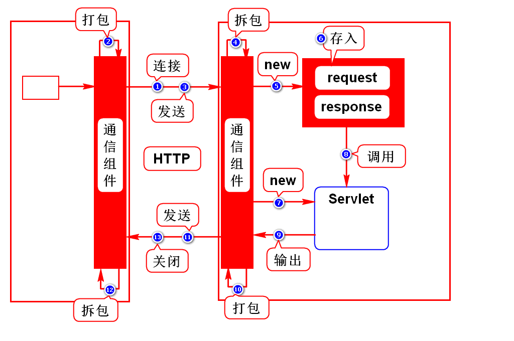

- 浏览器依据IP与服务器建立连接
- 浏览器将请求数据打包, 发送给服务器
- 服务器解析请求数据包, 封装`request`和`response`对象
- 服务器依据请求资源路径, 找到并实例化 `Servlet`
- 调用`service()`方法, 将`request`和`response`对象作为参数传入
- `servlet` 输出处理结果, 服务器将响应数据打包, 发给浏览器
- 浏览器取出结果，生成页面
- 断开浏览器与服务器的连接

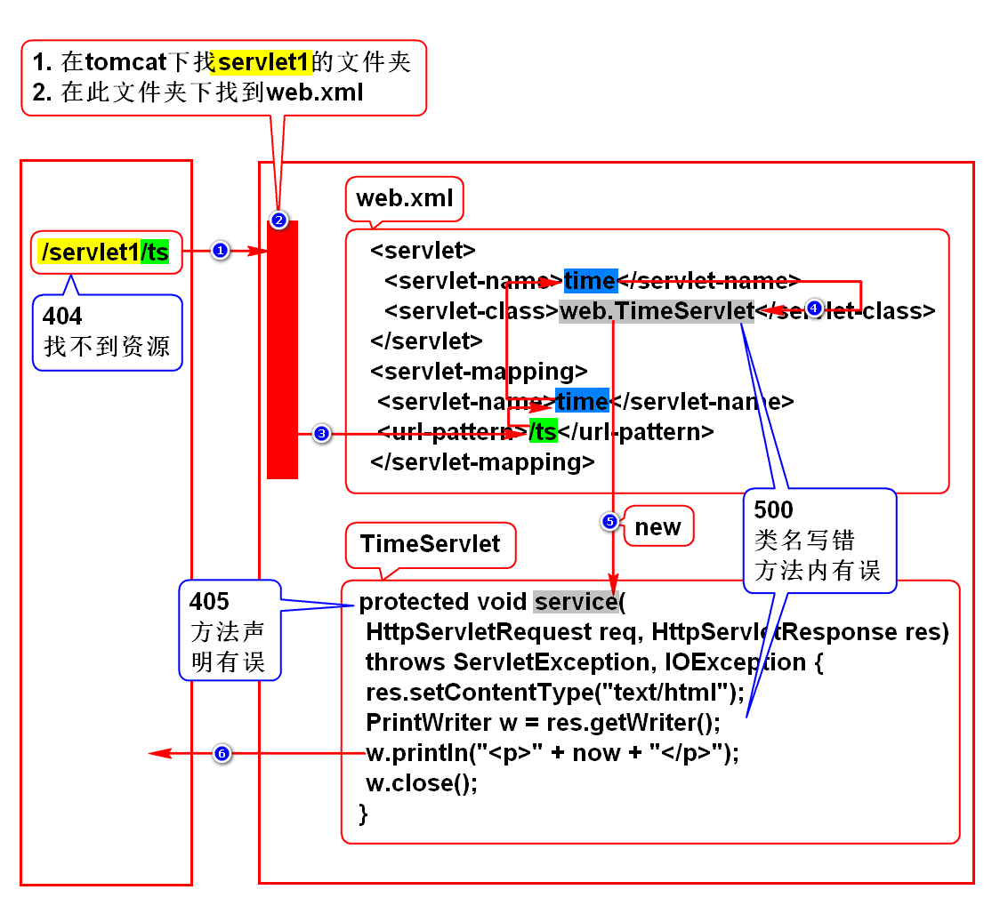

1. 在浏览器中输入访问路径, 包含项目名和 servlet 的访问名
2. 通信组件根据项目名, 找到相应的文件夹
3. 通信组件根据访问名, 在项目对应的 webxml 文件中查找, 找到对应的缩略名
4. 在 web.xml 文件中找到具有相同缩略名的 servlet 类
5. 实例化 servlet 类, 执行业务逻辑
6. 把 servlet 处理结果发送给浏览器.

### 1.2. HttpServletRequst 对象

Requst 对象封装了请求数据, 通过这个对象可以获取请求信息。

#### 1) 获取请求行

```java
// 协议类型
req.getProtocol();
// 请求方式
req.getMethod ();
// 访问路径
req.getRequestURI ();
req.getRequestURL ();
req.getServletPath ();
req.getContextPath();
```

#### 2) 获取消息头

```java
// 消息头按照键值对的方式存储, 如同 Map 一般. 返回的 Enumeration 是一种迭代器
Enumeration<String> e = req.getHeaderNames();
while (e.hasMoreElements()) {
    String key = e.nextElement();
    String value = req.getHeader(key);
    System.out.println(key+" : "+value);
}

// 对消息头中的某个信息, 也可以单独获取
req.getHeader ("信息名")
```

### 1.3. HttpServletResponse 对象

Response 对象封装了要提供给客户端的响应数据, 通过这个对象可以设置响应信息。

1. 设置页面信息
2. 把处理结果绑定到 Response 对象

## 5. Servlet开发步骤

### 5.1. 创建WEB项目

- WEB 项目必须具备标准的目录结构
- /WEB-INF/web.xml (servlet 3.0允许以`javax.servlet.ServletContainerInitializer`的实现类来替代 web.xml)

### 5.2. 导入jar包

#### 1) maven搜索

- 搜 javaee

#### 2) 依赖tomcat包

- 右键项目->properties->target runtimes->勾选 tomcat->apply

### 5.3. 开发Servlet

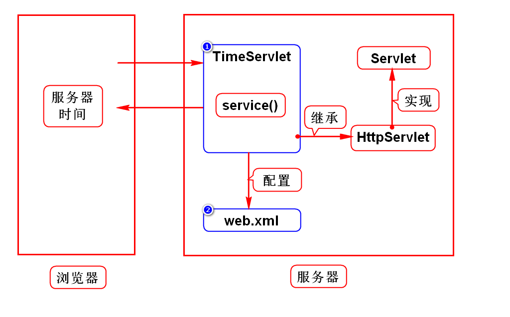

- 创建一个类, 继承于 `javax.servlet.http.HttpServlet`, 间接实现了 `Servlet` 接口
- 重写 `service()` 方法, 在此方法内拼网页

### 5.4. 配置Servlet

`web.xml`配置servlet, 绑定响应路径

```xml
<servlet>
    <servlet-name>缩略名</servlet-name>
    <servlet-class>包名.类名</servlet-class>
</servlet>
<servlet-mapping>
    <servlet-name>缩略名</servlet-name>
    <url-pattern>响应路径</url-pattern>
</servlet-mapping>
```

## 4. 案例: 注册页面

### 4.1. 业务逻辑

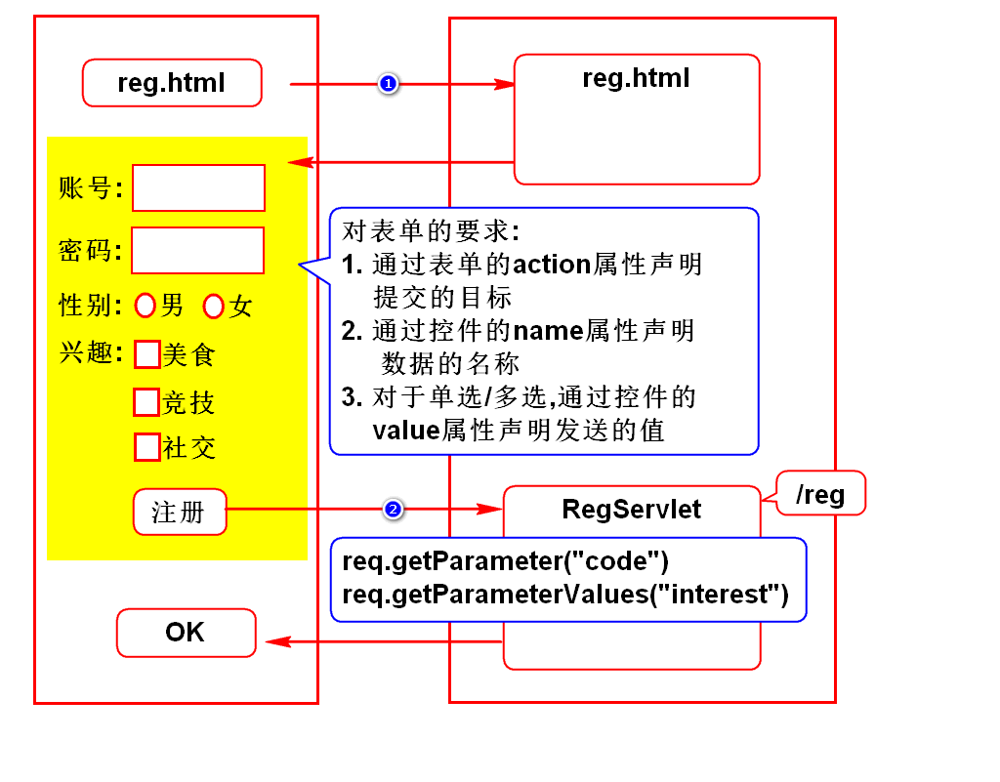

1. 浏览器输入地址, 向服务器请求 reg.html

   服务器响应, 发送静态页面 reg.html 到浏览器

2. 浏览器提交注册数据, 服务器 RegServlet 接收并处理数据

   服务器给浏览器发送响应, 提示注册结果

### 4.2. html页面

```html
<form action="reg" method="post">
    <p>账号：<input type = "text" name="username"/></p>
    <p>密码：<input type = "password" name="password"/></p>
    <p>
        性别：<input type = "radio" name = "sex" value="m"/>男
        <input type = "radio" name = "sex" value="f"/>女		
    </p>
    <p>
        兴趣:<input type = "checkbox" name="interest" value="food"/>美食
        <input type = "checkbox" name="interest" value="game"/>竞技
        <input type = "checkbox" name="interest" value="friend"/>社交
    </p>
    <p><input type = "submit" value="注册"/>	</p>
</form>

```

### 4.3. servlet

```java
public class RegServlet extends HttpServlet {

	@Override
	protected void service(HttpServletRequest req, HttpServletResponse res) 
		throws ServletException, IOException {

		//1.接收参数
		req.setCharacterEncoding("utf-8");
		String name = req.getParameter("username");
		String pwd = req.getParameter("password");
		String sex = req.getParameter("sex");
		String[] interests= req.getParameterValues("interest");

		//2.处理业务
		System.out.println(name, pwd, sex);
		if(interests!=null){
			for(String interest : interests){
				System.out.println(interest);
			}
		}

		//3.发送响应
		res.setContentType("text/html;charset=utf-8");
		PrintWriter w = res.getWriter();
		w.println("<p>ok," + name + "</p>");
		w.close();
	}
}
```

### 4.4. web.xml

```xml
<!-- 1. 声明 Servlet, 并给他取个别名 -->
<servlet>
    <servlet-name>time</servlet-name>
    <servlet-class>day01.RegServlet</servlet-class>
</servlet>

<!-- 2. 通过别名引用 Servlet, 指定要响应的路径 -->
<servlet-mapping>
    <servlet-name>time</servlet-name>
    <url-pattern>/reg</url-pattern>
</servlet-mapping>
```

## 3. 中文乱码问题
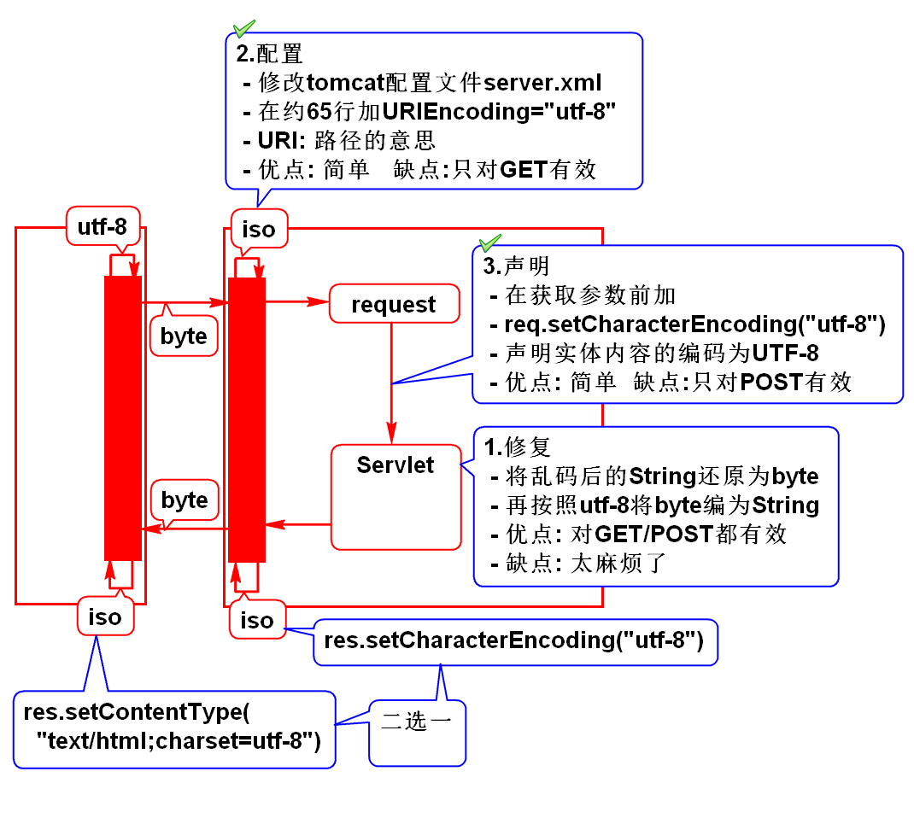

### 3.1. 请求的中文乱码
- 浏览器的通信组件, 将请求信息编码转化为字节数据
- 服务器的通信组件, 将接收到字节数据还原成原始请求信息
- 若浏览器与服务器编码方式不同, 则请求数据中有乱码
- 通常采用修改配置( 针对get ), 并声明编码方式( 针对post )来处理.

#### 1) 重编码
将获取的 String 还原为 byte数组, 再重新按utf-8重新编码
较为麻烦, 但对 post get 方式均有效

```java
byte[] names = name.getBytes("iso8859-1");
name = new String(names,"UTF-8");
```

#### 2) 修改配置
修改 Tomcat 的配置文件 (servers.xml 65行), 设置 `URIEncoding="UTF-8"`, 只对 get 方式有效

```xml
<Connector URIEncoding="UTF-8" connectionTimeout="20000" port="8088" protocol="HTTP/1.1" redirectPort="8443"/>
```

#### 3) 声明
在 servlet 中声明 request 的编码方式, 只对 post 方式有效
> req.setCharacterEncoding("UTF-8");

### 3.2. 响应的中文乱码
- servlet 默认使用 `iso-8859-1` 编码, 并在消息头中声明.
- 浏览器声明的编码方式解码, 但该编码不支持中文, 导致了中文乱码.
- 此时应对 `response` 声明为支持中文的编码方式, 一般采用 UTF-8.

#### 1) 给 res 设置编码方式
setCharacterEncoding 需要与 setContentType 配合才有效果
> res.setCharacterEncoding("utf-8");
> res.setContentType("text/html");

#### 2) 网页头中声明编码方式
> res.setContentType("text/html;charset=utf-8");

# 四. 访问路径

## 1. 什么是访问路径
访问路径, 即请求资源路径, 是指项目代码在服务器上的部署路径

### 1.1. 项目部署的过程


### 1.2. URI, URL, URN
#### 1) URI
*Uniform Resource Identifier* 统一资源标识符

用来指定 Web 资源的字符串, 可以理解为资源的名字. 

同一个资源, 可以有多个 URI, 在 Java Web 项目中, URI 通常指资源在所在容器中的绝对路径

#### 2) URL
若 URI 包含了定位资源的完整信息, 称为统一资源定位符,URL( *Uniform Resource Locator* )

同一个资源, 只有一个URL, 即它在网络中的绝对路径, 可以认为是资源的真名

#### 3) URN
若 URI 中的信息不足以定位资源, 称为统一资源名称, URN( *Uniform Resource Name* )

### 1.3. 如何获取访问路径
请求数据中的请求行, 包含了请求资源路径, 可以获取以下四种不同形式的路径:

#### 1) 获取项目路径
服务器启动时, 会给每个项目 ( web 应用 ) 创建一个 Context 对象( ServletContext )

这个 context 就代表了这个项目, 获取项目名可以用以下方法:

> 项目名 : getContextPath()

#### 2) 获取 Servlet 路径
每个 servlet , 都要在所在项目的 web.xml 中配置访问路径, 即访问名
这个访问路径是该 servlet 在所在项目中的相对位置, 可以通过以下方式获取:
> 访问名 : getServletPath()

#### 3) 获取 URI
可以获取该 servlet 在所在容器中的绝对路径:
> URI : getRequestURI()

#### 4) 获取 URL
可以获取该 servlet 在整个网络中的绝对路径, 即完整路径:
> URL : getRequestURL()

```java
//获取访问路径
req.getContextPath();	// /JSD1702_08_Servlet_JSP
req.getServletPath();	// /hello
req.getRequestURI();	// /JSD1702_08_Servlet_JSP/hello
req.getRequestURL();	// http://localhost:8088/JSD1702_08_Servlet_JSP/hello
```

### 1.4. 如何配置Servlet访问路径?

在项目的 web.xml 文件中, 通过 `<servlet-mapping> `标签配置 servlet 的访问路径, 可以采用以下三种方式

#### 1) 精确匹配
- 为 Servlet 指定一个访问路径, 只有通过该访问路径, 才能访问到Servlet
- 此 Servlet 只能处理该访问路径的这一个请求
```xml
<url-pattern>/访问路径</url-pattern>
```

#### 2) 通配符
- 把 Servlet 访问路径指定为通配符, 则任意路径都可访问到该Servlet
- 此 Servlet 能响应一切请求
```xml
<url-pattern>/*</url-pattern>
```

#### 3) 后缀
- 为 Servlet 指定带后缀名的访问路径, 则含该后缀的路径可以访问到 Servlet, 
- 此 Servlet 响应带此后缀的多个请求
- 注意这种写法不含斜杠 /
```xml
<url-pattern>*.后缀名</url-pattern>
```

### 5.7. 访问Servlet

可通过三种方式访问 servlet  

1. **完整路径** : 在全网中的完整路径, 包括ip和端口

   > http://ip:port/项目名/访问名

2. **绝对路径** : 在服务器中的完整路径

   > /项目名/访问名

3. **相对路径** : 相对于当前页面的路径

   当前 : /servlet2/reg.html
   	目标 : /servlet2/reg  	
   	相对路径是 : reg

### 1.5. 使用一个Servlet处理多个请求

- 通常 Servlet 充当请求分发器的角色, 将不同的请求分发, 调用不同的方法去处理, 只需一个即可完成工作.
- 根据开发规范确定匹配模式, 通常采用后缀匹配
- 在 servlet 中, 根据访问路径调用不同分支处理代码

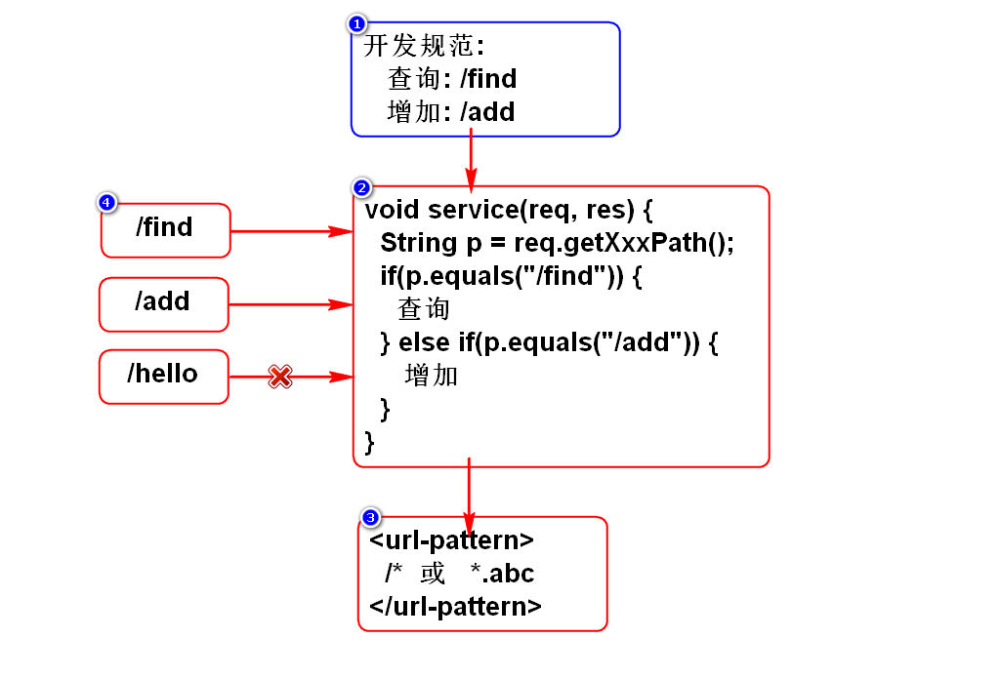

## 2. 重定向

- 服务器向浏览器发送一个 `302` 状态码, 以及一个 `location` 消息头( 重定向地址 ), 浏览器收到后会立即向重定向地址发出请求.
- 通过重定向, 服务器建议浏览器去访问另一个页面

### 1.1. 重定向的作用
#### 1) 解决互联网上2个网站之间的跳转问题
而且在跳转到新网站之前, 可以在自己网站上进行特定的操作, 而超链接则无法执行相关操作
#### 2) 在项目内部使用
解决一个项目内2个独立的组件之间的跳转问题

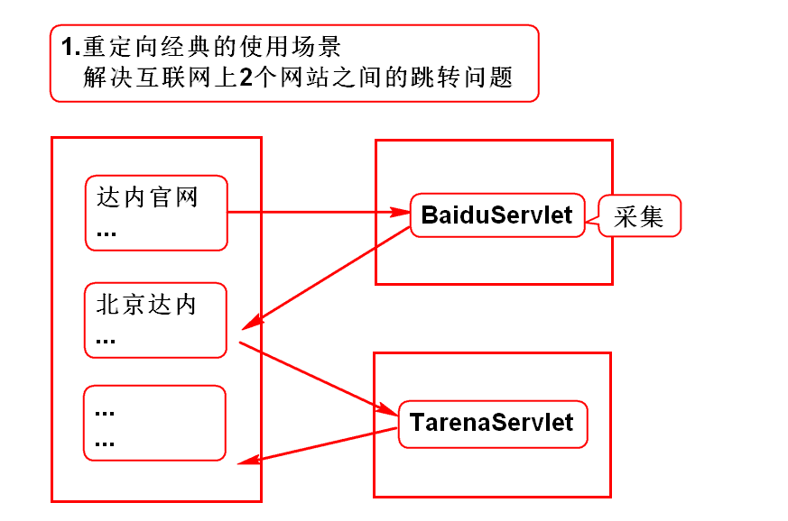

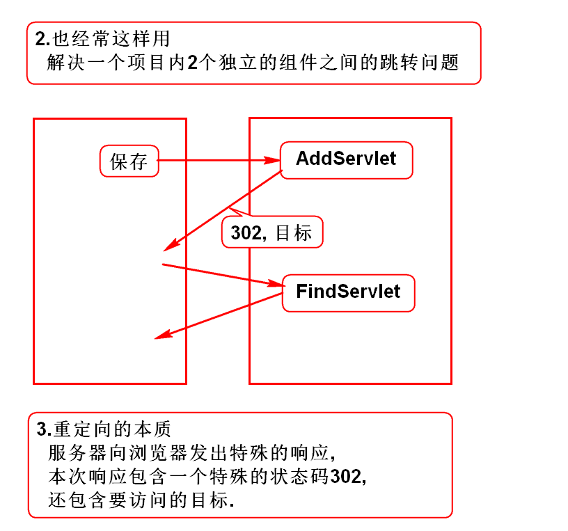


### 2.2. 如何重定向
重定向, 是服务器向浏览器发出的特殊的响应, 由 response对象控制

```java
response.sendRedirect("重定向地址");
```

### 2.3. 重定向的特点
- 重定向的地址可以是任意的地址
- 重定向之后, 浏览器地址栏的地址会发生改变
- 重新建立连接, 涉及到的web组件并不会共享同一个request 和 response 对象

## 3. 案例: 增加员工记录
### 3.1. 案例概述
该案例基于前面的 "查询员工信息" 案例
演示重点: 重定向, Servlet 分发请求

### 3.2. 业务逻辑
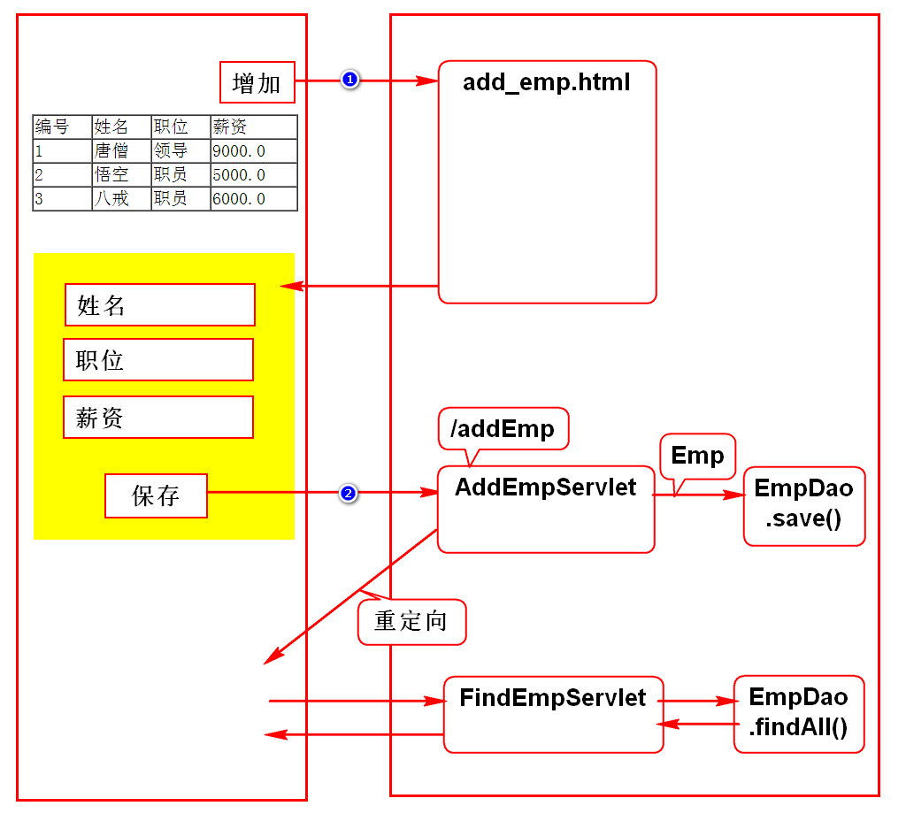

1. 在查询员工信息页面, 点击增加按钮, 访问服务器中的新增员工页面
2. 在新增员工页面填写表单, 并提交
3. AddEmpServlet 接收到数据后, 将员工信息写入数据库
4. AddEmpServlet 给浏览器发送重定向响应
5. 浏览器向 FindEmpServlet 请求数据

### 3.3. 核心代码

service方法分发请求:

```java
protected void service(HttpServletRequest req, HttpServletResponse res)
	throws ServletException, IOException {

	//判断访问路径并处理请求 
	String path = req.getServletPath();
	
	if("/find.emp".equals(path)){
		System.out.println("查找员工");
		findEmp(req,res);
	}else if("/add.emp".equals(path)){
		System.out.println("增加员工");
		addEmp(req,res);
	}else{
		throw new RuntimeException("查无此项");
	}
}
```

新增员工并重定向:

```java
protected void addEmp(HttpServletRequest req, HttpServletResponse res) 
	throws ServletException, IOException {

	//1.接收参数
	req.setCharacterEncoding("utf-8");
	String ename = req.getParameter("ename");
	String job = req.getParameter("job");
	String sal = req.getParameter("sal");

	//2.处理业务-保存员工数据
	EmpDao dao = new EmpDao();
	Emp e = new Emp();
	e.setEmpno(111);
	e.setName(ename);
	e.setJob(job);
	e.setSal(Double.valueOf(sal));
	dao.save(e);

	//3.重定向到查询页面,
	res.sendRedirect("find.emp");		
}
```

查询员工并输出页面:

```java
protected void findEmp(HttpServletRequest req, HttpServletResponse res) 
	throws ServletException, IOException {

	//2.处理业务
	EmpDao dao = new EmpDao();
	List<Emp> list = dao.findAll();
	
	//3.发送响应
	res.setContentType("text/html;charset=utf-8");
	PrintWriter pw = res.getWriter();
	
	pw.println("<a href='emp_add.html' >增加员工</a>");
	
	pw.println("<table border='1' cellspacing='0' width='80%'");
	pw.println("<tr>"
			+ "		<td>编号</td>"
			+ "		<td>姓名</td>"
			+ "		<td>职位</td>"
			+ "		<td>薪资</td>"
			+ "</tr>");
	if(list != null){
		for(Emp e:list){
			pw.println("<tr>"
					+ "		<td>"+e.getEmpno()+"</td>"
					+ "		<td>"+e.getName()+"</td>"
					+ "		<td>"+e.getJob()+"</td>"
					+ "		<td>"+e.getSal()+"</td>"
					+ "</tr>");
		}
	}
	pw.println("</table>");
	pw.close();
}
```


# 五. Servlet 的特性
## 1. 生命周期
### 1.1. 什么是 Servlet 的生命周期
服务器如何创建Servlet对象、如何为Servlet对象分配、准备资源、如何调用对应的方法来处理请求以及如何销毁Servlet对象的整个过程即Servlet的生命周期。

### 1.2. 生命周期的四个阶段

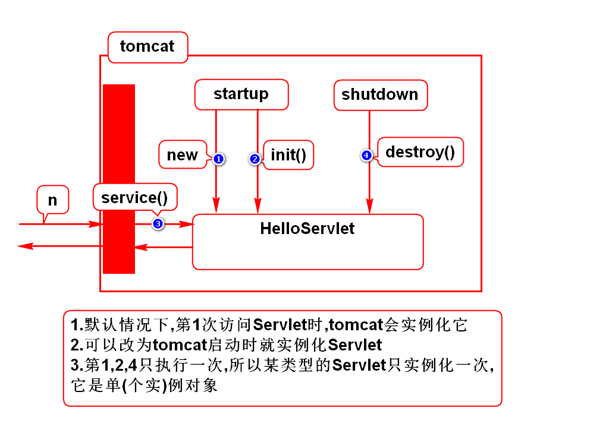

#### 1) 实例化
- 服务器调用Servlet的构造器创建一个具体的Servlet对象

- 可以在请求后创建， 也可以在服务器启动之后立刻创建

- **load-on-startup**用于设置该Servlet的实例化建时机
	- **>=0** : 启动时会实例化
	- **< 0**或未指定 : 被请求时实例化
	- 正数的值越小，优先级越高，应用启动时就越先被创建
	
	```xml
	<servlet>
	    ...
	    <load-on-startup>1</load-on-startup>
	</servlet>
	```

#### 2) 初始化
- Servlet实例化后, 服务器会调用 `init()`方法对其初始化，只会执行一次。

- 方法以一个 ServletConfig 类型的对象作为参数, 该对象的参数通过 web.xml 文件中的 **&lt;init-param>** 配置

  ```xml
  <servlet>
      ...
      <init-param>
          <param-name>参数名</param-name>
          <param-value>参数值</param-valule>
      </init-param>
  </servlet>
  ```

- 读取Servlet配置中初始化参数

- `getServletConfig()`是 Httpservlet 类中定义的方法, 

- 因为继承了 Httpservlet, 即可直接调用本类中的方法

	```java
	ServletConfig config = getServletConfig();
	String 参数名 = config.getInitParameter("参数名");
	```

#### 3) 就绪
- 初始化后, servlet处于能够响应请求的就绪状态.
- 收到请求时, 服务器以请求对象 request 和响应对象 response 为参数, 调用 Servlet 的 service 方法.

#### 4) 销毁
- 服务器调用 destroy 方法来释放资源, 只会执行一次。
- 停止或者重新启动服务器, 都会执行销毁

## 2. ServletConfig

### 2.1. ServletContext
服务器程序( tomcat )启动后，每个 WEB 程序都有一个对应的 ServletContext 对象，代表当前 web 应用
#### 1) 获取方式

```java
GenericeServlet.getServletContext()
HttpServlet.getServletContext()
ServletConfig.getServletContext()
HttpSession.getServletContext()
FilterConfig.getServletContext()
```

#### 2) 作用

- 访问 web 应用的静态资源
	
	```java
	ctx.getRealPath(String path) 
	```
- 在 web 应用范围内共享数据, 可以跨请求、跨用户、跨 Servlet
	
	```java
	ctx.setAttribute()
	ctx.getAttribute()
	ctx.removeAttribute() 
	```

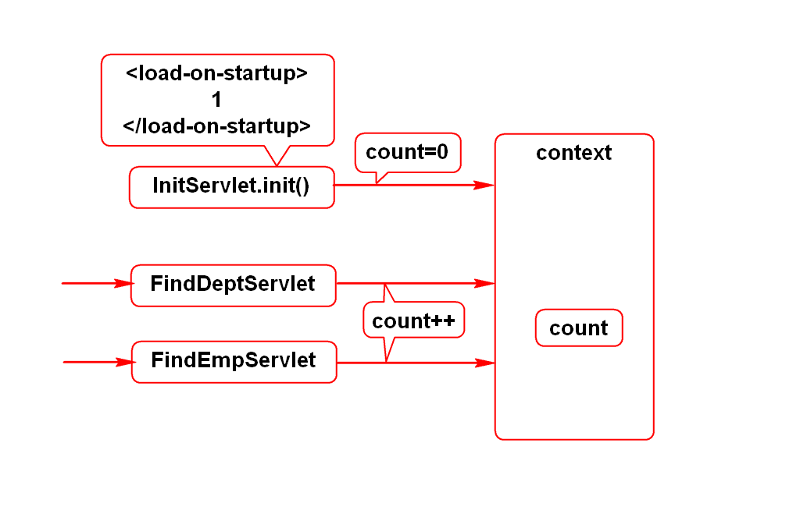

#### 3) 使用场景
- 大部分的查询都具备分页功能
- 分页需要一个参数:每页显示几条数据size
- 该参数一般可配置,由于被众多查询功能复用,使用 context 读取

## 3. ServletContext

### 2.2. ServletConfig

服务器启动后，每个 Servlet 都有一个对应的 ServletConfig对象

#### 1) 获取方式
#### 2) 作用
#### 3) 使用场景
- 假设要开发一个网页游戏,若超过人数上限则要排队
- 开发登录功能LoginServlet
- 人数上限应该是一个可配置的参数maxOnline
- 该参数由LoginServlet使用
- 由于该参数只是LoginServlet使用,由config读取即可

### 2.3. 两者关系
#### 1) 联系
- 都能够读取 web.xml 或 properties 配置文件中预置的参数

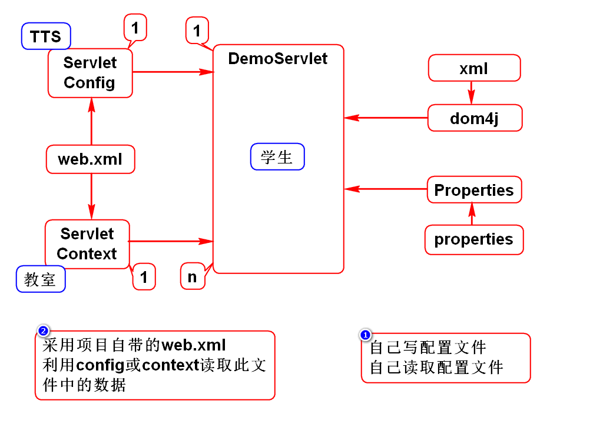

#### 2) 区别

- config 和 Servlet 是 **"1对1"** 的关系, 若数据只给某个Servlet使用, 则用config
- context 和 Servlet 是 **"1对多"** 的关系, 若数据给多个Servlet使用, 则用context

## 4. 线程安全问题

### 4.1. 为什么有线程安全问题

- 默认情况下, 服务器只为每个 `Servlet` 创建一个实例, 服务器收到请求后, 都会启动一个线程来处理业务
- 如果有多个请求( 浏览器 )同时访问同一个 `Servlet`, 则有多线程访问并修改同一个 `Servlet` 实例, 则会发生线程安全问题
- 如果是同一个浏览器的多个窗口, 浏览器本身只跟服务器建立一个连接, 则多页面需要排队, 不会发生线程安全问题

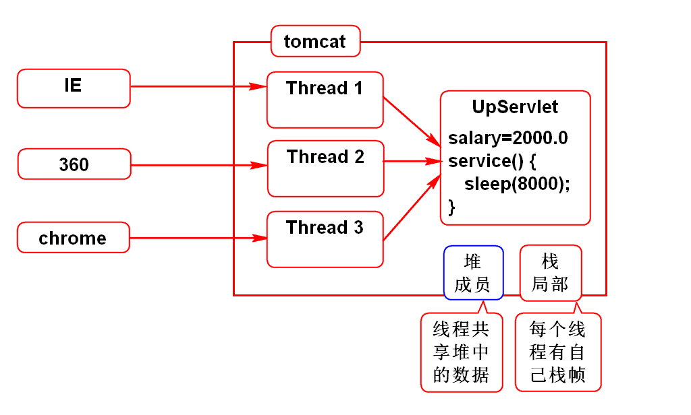

### 3.2. 如何处理线程安全问题
对修改 Servlet 属性的代码, 使用 Synchronized 加锁  

# 七. 异常处理

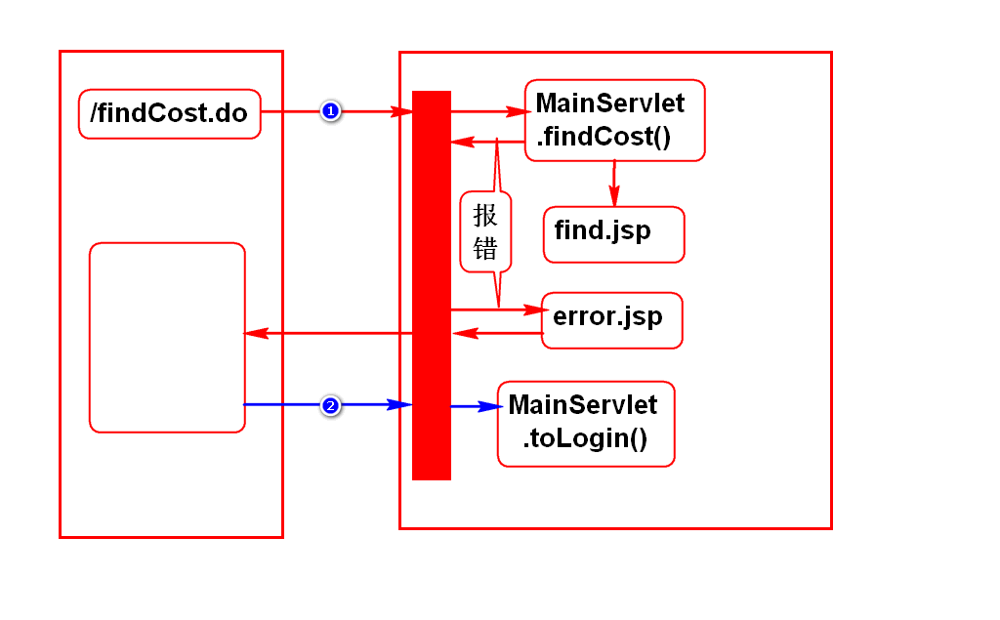

## 1.编程式处理

使用 try-catch 结构

```java
try{
    ...
} catch (Exception e) {
    request.getRequestDispatcher(url).forward(request,response);
}
```
## 2. 容器声明式处理
将异常抛出到容器, 容器会自动将请求转发到指定的错误页面
### 2.1. 状态码
可以通过状态码, 指定在什么状态下跳转到哪一个错误页面

每个状态码都要单独设置一次, 不可共用 `<error-page>` 标签

```xml
<error-page>
    <error-code>500 </error-code>
    <location>/netctoss/WEB-INF/error.jsp </location>
</error-page>
```

### 2.2. 异常类型
只能使用 `HttpServlet` 类中 service 方法指定的异常, 不可超出范围

```xml
<error-page>
    <exception-type>异常类型</exception-type>
    <location>/netctoss/WEB-INF/error.jsp</location>
</error-page>
```

# 八. 状态管理
## 1. 概述
### 1.1. 什么是状态管理
- HTTP 协议是无状态协议，一次请求-响应的交互，结束后连接即断开，服务器并不清楚两个请求之间有何关联或区别。
- 而有时需要服务器能够记录与客户端相关的一些数据，以识别用户, 如账户登录信息的保存.
- 状态管理 : 将客户端与服务器之间多次交互当做一个整体, 并将涉及的数据( 即状态 )保存下来, 以提供给后续的交互.

### 1.2. 状态管理的两种模式

- **客户端状态管理**

  使用 Cookie 存储状态, 存储在客户端

  浏览器发送请求时, 将 Cookie 一并发送

  服务器返回响应时, 返回修改后的 Cookie

- **服务器状态管理**

  使用 Session 存储状态, 存储在服务器

  初次请求时, 在服务器创建 Session 对象, 生成 `JSessionID`, 作为 Cookie 内容返回给浏览器

  以后请求时, 浏览器发送 Cookie(即 JSessionID ), 服务器根据 JSessionID 找到对应的 Session 对象

  若请求了 jsp, 则必定会有 session 对象生成, 因为 session 是 jsp 内建对象, 无需用户手动编写相关代码

## 2. 共享数据
### 2.1. 业务场景
- 登录时要记录账号
- 后续的查询, 增加, 修改等页面上显示此账号
- 需要在多次请求中共享账户数据

### 2.2. 其他可以共享数据的对象

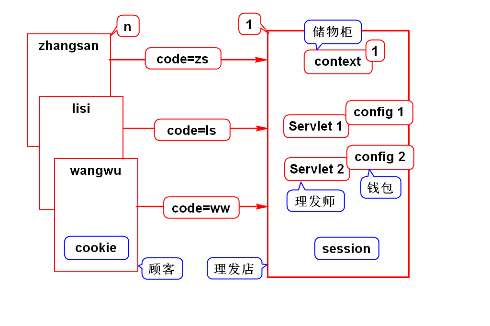

#### 1) request
- 在 Servlet 转发时, 可以通过`request`共享数据
- `request`的生命周期只在一次"请求-响应"的连接过程中, 连接关闭后就不再存在.
- 若需在多次请求中保持数据共享, 无法通过 request 实现

#### 2) config
- `config` 对象与 servlet 是一对一的关系, 无法在多个servlet中共享数据
- 只能存放事先定义的配置常量, 不能存放变量

#### 3) context
- 浏览器和服务器是一对多的关系
- 一个项目中只有一个 context 
- 若将不同的用户数据存入唯一的 context 中, 会存在冲突

### 2.3. Cookie 与 Session 特点
#### 1) 通俗的理解
- 它们都是暂存数据的对象, 用于状态管理等共享数据的问题
- 它们内部的数据可以在多个请求或多个组件之间共用
- 服务器会给每个浏览器创建1组 cookie,1个 session
- 上述规则由tomcat保障

#### 2) 专业的理解
- HTTP 协议是一个无状态协议, 服务器默认不会记住浏览器
- Cookie 与 Session 是 http 协议的一个补丁, 用于让服务器识别浏览器
- 即他们是用来进行状态管理的对象, 用来证明浏览器曾经访问过的证据(数据)

#### 3) 区别
- cookie 存储在浏览器上,服务器压力小,不安全
- session 存储在服务器上,服务器压力大,安全

#### 4) 使用建议
- 重要的数据存入session
- 其他的数据存入cookie

## 3. cookie
### 3.1. 基本用法
#### 1) 创建 cookie

- 一个cookie中只能存一条数据 (一个属性), 且只能存字符串

    > Cookie c = new Cookie("属性名", "属性值")

#### 2) 绑定并发送 cookie

- 将要发送的 cookie 绑定到响应中, 一个res中能够绑定多个 Cookie
- 当服务器发送响应时, 会自动发送 cookie

    > res.addCookie(目标cookie)

#### 3) 从浏览器请求中读取 cookie
- 浏览器访问服务器时, 会发送它之前保存的cookie
- 服务器可以从浏览器发来的 Cookie 读取信息

1. **遍历 cookies 数组**

  - 由于一个客户端可以有多个 Cookie, 获取 Cookie 时应先获取所有 Cookie 的数组, 若请求中不含Cookie则返回 null
    
  - 可以遍历 cookies 数组, 再分别获取其中元素的名称与值, 

    ```java
    Cookie[] cookies = request.getCookies();
    for ( Cookie c : cookies ){
        String name = c.getName();
        String value = c.getValue();
    }
    ```

2. **使用 EL 表达式**

	- 尽管 cookie 不是 JSP 九个隐含对象之一, 仍可使用 EL 取值
	
			> ${cookie.属性名.value }

#### 4) 修改 Cookie 
- 先获取到要修改的 Cookie
- 设置值后重新绑定到 res, 同名 Cookie 会覆盖

	> c.setValue(新值);
	> response.addCookie(c);

### 3.2. cookie 的生存时间
- 默认情况下, 浏览器把 cookie 保存在内存中, 浏览器不关闭, cookie 就一直存在
- 浏览器关闭后, 释放内存, cookie 被清除.
- 若需关闭浏览器后保留 cookie, 则要设置过期时间, 单位为秒

	- n > 0, 保存在硬盘, 超过指定时间就会删除
	- n = 0, 因为时间已到, 替换后直接删除 Cookie
	- n < 0, 保存在内存, 默认值, 关闭浏览器清除

	> cookie.setMaxAge(n)
### 3.3. 有效路径
- Cookie 的默认路径, 等于生成这个 Cookie 的 web 组件路径
- 即 Cookie 只对生成它的页面, 以及平级或下级页面有效
- 访问同服务器的其他页面, 浏览器不会发送 Cookie
- 可以将有效路径设为整个项目范围

> cookie.setPath(req.getContextPath())

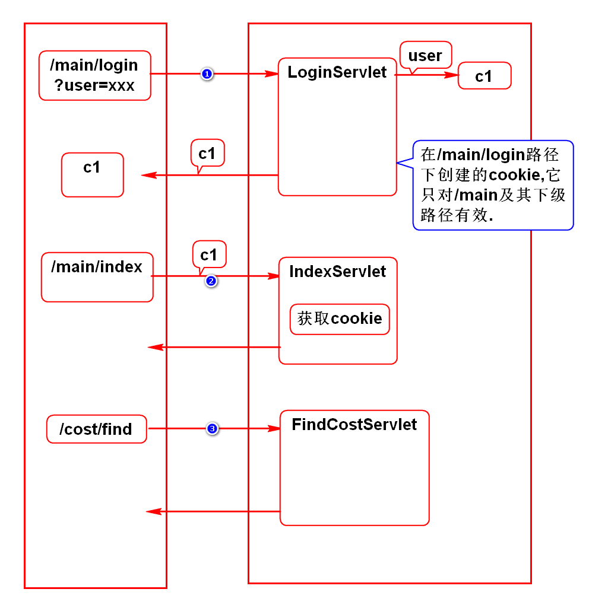

### 3.4. 中文编码
- cookie只支持ASCII编码, 不支持中文
- 存数据时使用 **URLEncoder** 对中文转码
- 取数据时使用 **URLDecoder** 对中文解码

```java
// 中文 -> ASCII
URLEncoder.encode("目标字符串", "编码方式");
// ASCII -> 中文
URLDecoder.decode(value, "编码方式") ;
```

### 3.5. cookie的局限性
- cookie可以被用户禁止
- cookie将状态保存在浏览器端, 不安全
- 对于敏感数据, 需要加密后再使用cookie来保存
- cookie只能保存少量的数据, 大约4kb
- cookie的个数是有限制的
- cookie只能保存字符串


## 4. session
### 4.1. 工作原理
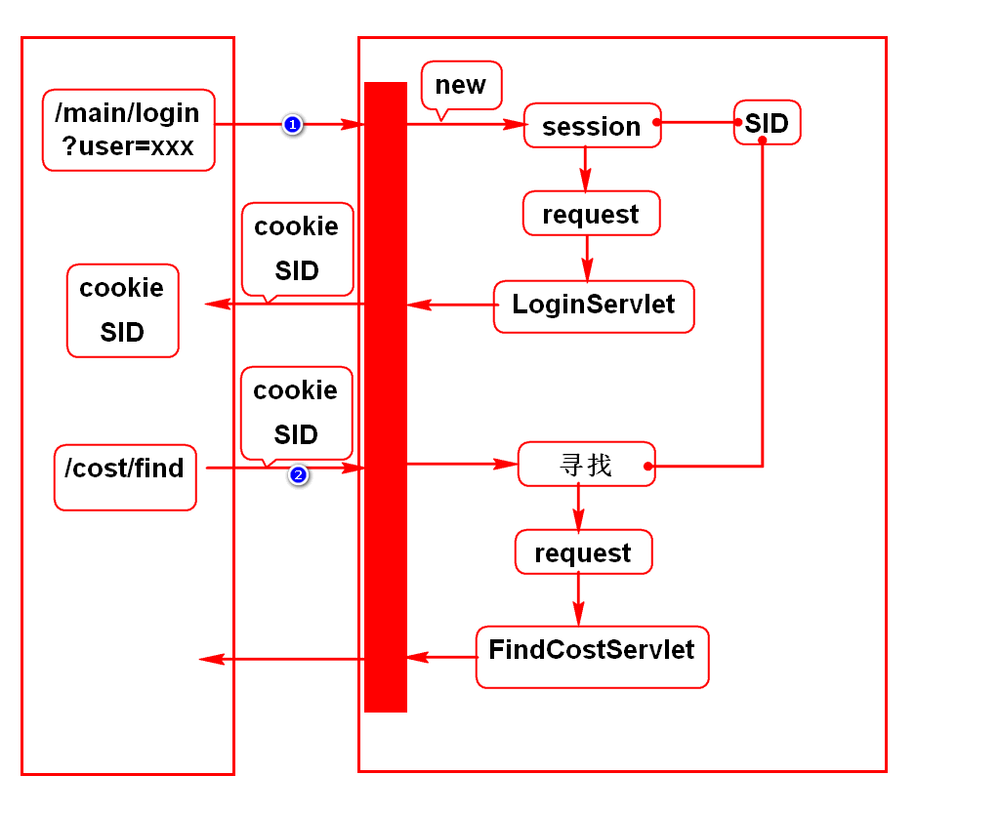

### 4.2. 基本用法

```java
// 获得 : 
session = request.getSession();
// 存/取数据 : 
session.setAttribute();
session.getAttribute();
// 删数据 : 
session.removeAttribute();
// 销毁 : 
session.invalidate();
```

### 4.3. 超时时间
- 默认是30分钟

- 可以在 web.xml 中修改, 单位分钟

    ```xml
    <session-config>
    　<session-timeout>1</session-timeout>
    </session-config>
    ```

- 也可以在代码中设置

    ```java
    session.setMaxInactiveInterval(秒数)
    ```

### 4.4. URL 重写
#### 1) 什么是 URL 重写
- Session 要依赖于 Cookie, 若用户禁用 Cookie, 会影响 Session
- 当用户禁用了 Cookie, 要采用 URL 重写以地址栏传值方式来发送 SessionID

#### 2) 如何实现 URL 重写

- 提交表单的时候, 使用重写后的 URL

    > response.encodeURL(原始路径);

- 重定向的时候, 使用重写后的 URL

    > response.encodeRedirectURL(原始路径);

        res.sendRedirect(res.encodeRedirectURL("../time"));

### 4.5. session 销毁
- 用户登出的时候, 可以将 session 销毁, 以退出会话

    > session.invalidate();

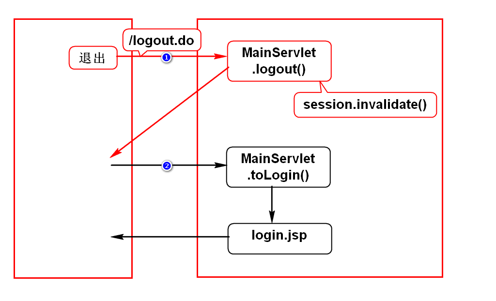


# 十. 过滤器
## 1. 概述
### 1.1. 什么是过滤器
- 过滤器是一种特殊的 Web 组件，可以作为Servlet的辅助性插件存在
- 可以拦截 servlet 容器的请求和响应过程, 以便查看,提取或操作其中的数据, 如记录日志, 敏感词过滤等
- 一个过滤器可以作用于同一应用中的多个 servlet, 处理公共事务
- 过滤器没有直接与 Servlet 发生关系, 耦合度低, 便于维护

### 1.2. 过滤器的作用
- 用来处理项目中公共的业务
- 记录日志, 过滤敏感词, 登录检查
- 公共业务 : 很多请求都需要进行处理的业务

## 2. 使用过滤器
### 2.1. 编写过滤器
1. 创建一个类, 实现 Filter 接口

2. 在 doFilter 方法中实现拦截处理逻辑

    ```java
    //过滤器的销毁方法, 过滤器被销毁时调用
    public void destroy() {}
    
    //公共的业务在此处实现
    public void doFilter(ServletRequest request, ServletResponse response, 
                         FilterChain chain) throws IOException, ServletException {
        // 预处理
        // 执行正常的业务操作
        chain.doFilter(request, response);
        // 后处理
    }
    
    //初始化方法, 过滤器被创建时调用, 可读取初始化参数
    public void init(FilterConfig config) throws ServletException {
        System.out.println("filter1: 初始化");
        Enumeration<String> cfgs = config.getInitParameterNames();
        while(cfgs.hasMoreElements()){
            String cName = cfgs.nextElement();
            String cValue = config.getInitParameter(cName);
            System.out.println(cName + ":" + cValue);
        }
    }
    ```

3. 在 web.xml 中配置此类, 可以指定初始化参数

		```xml
	<filter>
	    <filter-name>过滤器名</filter-name>
	    <filter-class>包名.类名</filter-class>
	    <init-param>
	        <param-name>参数名</param-name>
	        <param-value>参数值</param-value>
	    </init-param>
	</filter>
	<filter-mapping>
	    <filter-name>过滤器名</filter-name>
	    <url-pattern>filter要处理的请求</url-pattern>
	</filter-mapping>
	
	```

### 2.2. 工作原理
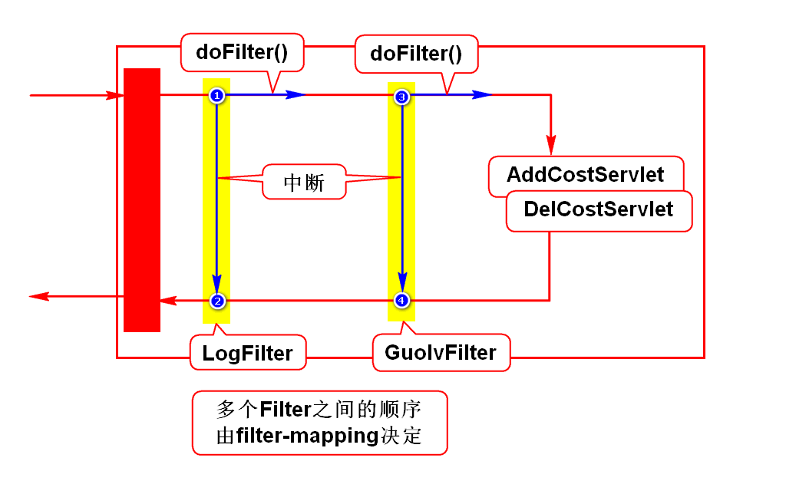

## 3. 案例 : 登录检查


## 5.参数说明
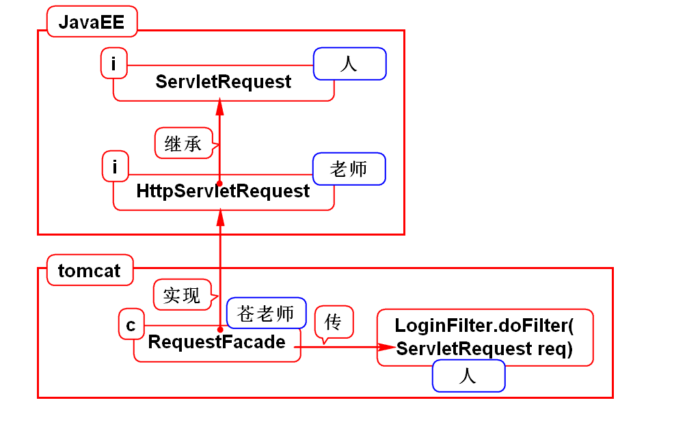

# 十一. 监听器
## 1. 概述
### 1.1. 什么是监听器
- 一类特殊的组件, 用来监听目标发生的事件, 并进行相应的处理
- 监听的目标是某一类对象
- 监听范围是整个应用

### 1.2. 监听器的分类
servlet 监听器可以监听以下三类对象, 每类对象有两类事件
即常用的监听器有以下六种

#### 1) request
- 创建与销毁 : `ServletRequestListener`
- 数据的变化 : `ServletRequestAttributeListener`

#### 2) session
- 创建与销毁 : `HttpSessionListener`
- 数据的变化 : `HttpSessionAttributeListener`

#### 3) context
- 创建与销毁 : `ServletContextListener`
- 数据的变化 : `ServletContextAttributeListener`

## 3. 开发步骤
1. 创建一个类, 实现对应的监听器接口

2. 在 web.xml 中声明这个监听器

    ```xml
    <listener>
        <listener-class> 监听器类名 </listener-class>
    </listener>
    ```

## 4. 案例: 监听器

### 4.1. requestListener

**监听器**

```java
public class Re02_reqLsn implements ServletRequestListener {

    @Override
    public void requestDestroyed(ServletRequestEvent arg0) {
        System.out.println("request被销毁了");
    }

    @Override
    public void requestInitialized(ServletRequestEvent arg0) {
        System.out.println("你的request出生了啦");
    }
}
```

**web.xml 配置**

```xml
<listener>
    <listener-class>day09.Re02_reqLsn</listener-class>
</listener>
```

### 4.2. RequestAttributeListener
**监听器**

```java
public class Re02_reqAttrLsn implements ServletRequestAttributeListener{

    @Override
    public void attributeAdded(ServletRequestAttributeEvent attr) {
        String aName = attr.getName();
        String aValue = (String)attr.getValue();
        System.out.println("你添加了参数 "+aName+":"+aValue);
    }

    @Override
    public void attributeRemoved(ServletRequestAttributeEvent attr) {
        String aName = attr.getName();
        String aValue = (String)attr.getValue();
        System.out.println("你移除了参数 "+aName+":"+aValue);
    }

    @Override
    public void attributeReplaced(ServletRequestAttributeEvent attr) {
        String aName = attr.getName();
        Object aValue = attr.getValue();
        System.out.println("你修改了参数 "+aName+":"+aValue);
    }
}
```

**web.xml 配置**

```xml
<listener>
    <listener-class>day09.Re02_reqAttrLsn</listener-class>
</listener>
```

### 4.3. 测试用 servlet

```java
public class Re02_demo3 extends HttpServlet {
    private static final long serialVersionUID = -2208016200573829591L;

    @Override
    protected void service(HttpServletRequest req, HttpServletResponse res) 
        throws ServletException, IOException {
        
        System.out.println("demo操作2");
        req.setAttribute("参数1", "1");
        req.setAttribute("参数1", "2");
        req.removeAttribute("参数1");
    }
}
```

# █ Java Server Page

# 一. JSP 基本语法

## 1. JSP 由来

### 1.1. 为什么有JSP规范

- 使用 Servlet 生成动态页面时, 为了输出的 HTML 页面完整, 要输出大量的标签. 
- 标签在 Servlet 中是字符串常量, 这种形式增加开发难度，不利于维护。
- 为了简化 Servlet 开发, Sun 推出了 JSP, 将 Servlet 中负责控制显示效果的语句抽取出来。

### 1.2. 什么是JSP

- JSP（Java Server Page） 是一种服务器端动态页面技术的组件规范.
- .jsp 文件以 HTML 静态标记为主体, 用于展现页面基本内容
- 嵌入少量 Java 代码，用于生成动态内容。
- JSP 基于 Servlet, 容器会将 JSP 页面转译为 Servlet  类, 然后再运行.

## 2. JSP 编写规范

### 2.1. JSP 页面中的 HTML 代码

- 像普通 HTML 文件一样编写, 支持 CSS, JavaScript
- 用于控制页面在浏览器中显示的效果
- 转译规则 : 被转换成 Servlet 中 service() 方法中的 **out.write()** 内容, 自动输出

### 2.2. JSP 页面中的 注释

#### 1) HTML 注释

与 HTML 中一样, 但如果注释的内容中包含 Java 代码, 则这部分代码会被执行.
编译执行后输出到 html 页面, 注释内容由浏览器忽略, 可从页面源代码中查看.

> < !-- HTML 注释内容(会执行java代码) --> 

```jsp
以下代码将被编译执行, 并会输出到最终的 html 页面中
<!-- 
    <% System.out.println("HTML注释被编译执行"); %>
    <%="HTML注释被编译执行" %>
-->
```

#### 2) JSP 注释

JSP 特有的注释, 如果注释内容中出现 Java 代码, 会被忽略.
编译时忽略, 不会被编译到servlet.class 中, 由编译器忽略.
只在原始的 jsp 文件中可见, 在浏览器中查看源代码时不可见.

> `<%-- JSP 注释内容(不执行java代码) --%>`

```jsp
以下代码不会被编译执行
<%-- 
    <% System.out.printlnl("jsp注释执行了吗?"); %>
--%>
```

#### 3) java 注释

可以在 jsp 脚本中添加注释, 单行/多行/文档注释均可
与传统 jsp 注释类似, 只在 jsp 文件中可见, html 页面不可见

> `<% // 单行注释 %>`
> `<% /* 多行注释 */ %>`

### 2.3. JSP 页面中的 Java 代码

- 可以在页面的任意位置编写 Java 代码
- 这部分 Java 代码用于控制页面中可变内容的产生

#### 1) JSP 表达式

- JSP 表达式的结果是一个值, 因此其中的内容必须得到一个具体的返回值
- 包括 : 变量, 算式, 有返回值的方法
- 转译规则 : 在 service() 方法中用 **out.print()** 语句输出该表达式的值

> `<%=表达式 %>`

#### 2) JSP 脚本

任何能够写在方法里的 Java 代码片段都可以作为 JSP 脚本内容
转译规则 : 原封不动地成为 service() 方法中的一段代码.

> `<% 脚本内容 %>`

#### 3) JSP 声明

合法内容 : 成员属性或成员方法的声明
转译规则 : 成为 servlet 类中的成员属性或成员方法
缺点, 页面与脚本耦合度太高, 尽量不在 JSP 页面中声明方法

> `<%! 声明方法 %>`

### 2.4. out.write() 与 out.print()

- jsp 中内置的 out 对象的类型是 JspWriter。
- JspWriter 继承了 java.io.Writer 类。

#### 1) out.write()

- Writter 类中定义的方法
- 输出 jsp 文件中的 HTML 部分, 包括 CSS, JavaScript
- 只能输出字符类型数据
- 如果一个对象为null, 则 write 方法会抛出空指针异常

#### 2) out.print()

- JspWriter 类中定义的方法

- 输出 java 相关的内容

- 能将所有内容转换为字符串形式输出

- 如果一个对象为null, 则 print 方法会输出字符串"null"

  ```jsp
  <%
      String s = null;
      //write会抛空指针异常
      //out.write(s);
      //print输出"null"字符串
      out.print(s);
  %>
  ```

## 3. JSP 指令

> `<%@ 指令名 属性 = 值 %>`

### 3.1. page 指令

作用 : 用于导包, 设置页面属性

#### 1) 导入依赖的 jar 包

> `<%@ page **import**="包名1, 包名2" %>`

#### 2) 设置contentType

> `<%@ page **contentType**="页面类型" %>`

#### 3) 设置容器读取该文件时的编码方式

> `<%@ page **pageEncoding**="UTF-8" %>`

### 3.2. include 指令

#### 1) 基本用法

在 JSP 页面转换成 Servlet 时,能够将其他文件包含进来
可以包含 JSP 文件, 也可以包含静态的 HTML 文件
通过该语句能方便地在每个 JSP 页面中包含导航栏, 版权声明, logo等

> `<%@ include file="文件路径" %>`


### 3.3. taglib 指令

用于导入 JSTL 标签库文件, 详见 JSTL 章节的介绍

## 4. 案例 : include页面

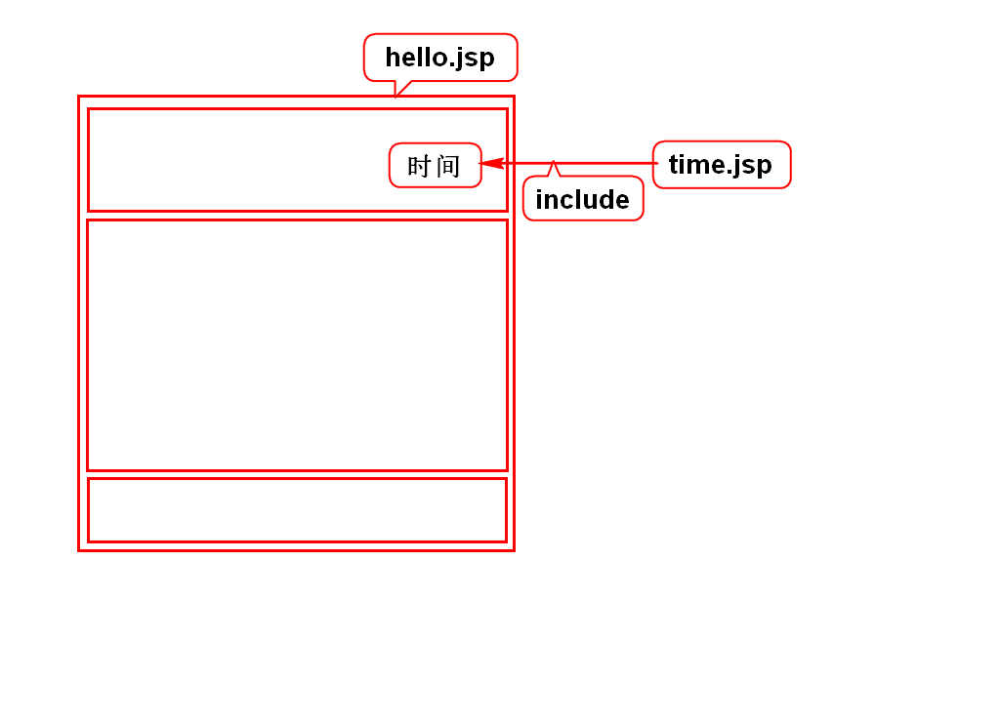

## 5. 案例 : include中的相对路径

- NetCT OSS include中的相对路径

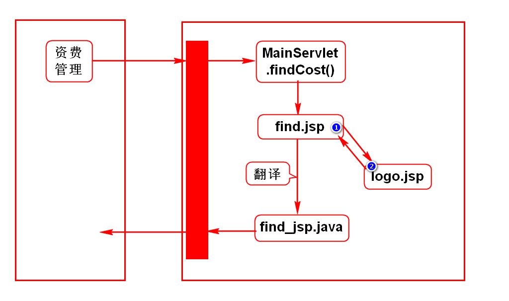

# 二. JSP 原理

## 1. JSP 处理请求的过程

- JSP 基于 Servlet, 其本质还是 Servlet.
- 服务器接受到请求后, 找到相应的 JSP 文件, 将其转译成 Servlet 类, 然后再执行.
- 在转译的过程中, 需要指定 JSP 页面的编码方式, 用 **pageEncoding** 声明.
- 动态生成的 HTML 文件中, 也需要指定编码方式, 用 **contentType** 声明.

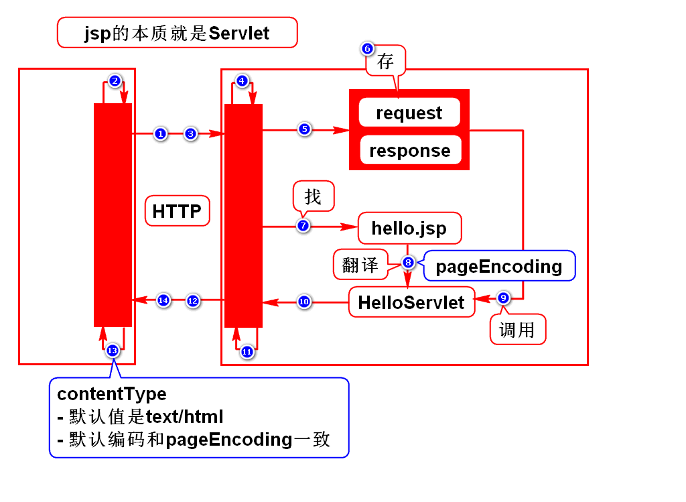

## 2. JSP 翻译的详细过程

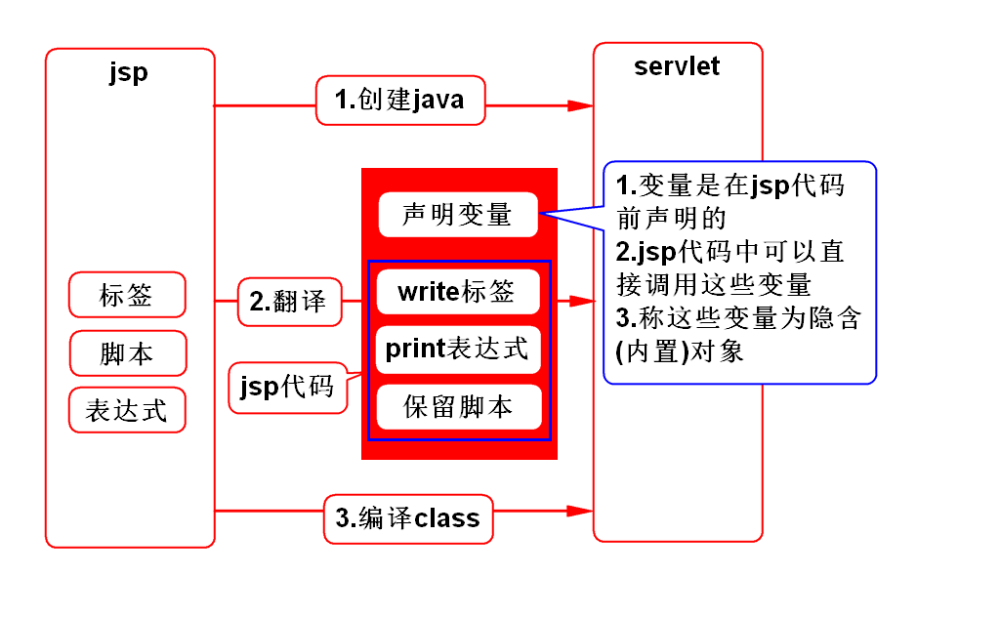

# 三. JSP 隐含/内置对象(笔试题)

## 1. JSP 隐含对象

容器自动创建, 在JSP文件中可以直接使用的对象

JSP 的这些预定义的隐含对象, 可以简化对 HTTP 请求或相应信息的访问

| 变量            | 类型                | 描述                                                       |
| --------------- | ------------------- | ---------------------------------------------------------- |
| **request**     | HttpServletRequest  | 封装请求信息                                               |
| **response**    | HttpServletResponse | 封装响应信息                                               |
| **out**         | JspWriter           | 输出的数据流, 继承自 java.io.Writer                        |
| **config**      | ServletConfig       | Servlet的配置对象                                          |
| **application** | ServletContext      | 全局的上下文对象, 即所在的项目应用                         |
| **exception**   | Throwable           | 捕获的网页异常                                             |
| **session**     | HttpSession         | 与浏览器通讯的会话                                         |
| **page**        | Object              | 就是this, 指代jsp生成的那个 Servlet                        |
| **pageContext** | PageContext         | JSP 页面上下文, 是一个管理者,通过它可以获得其他8个隐含对象 |

## 2. 如何使用隐含对象?

```jsp
<% String user = request.getParameter("user"); %>
<%=request.getMethod() %>
```

# 四. 转发

## 1. 网页应用开发模式

### 1.1. Model 1

用一个组件, 既处理请求, 又输出响应, 该组件内部代码耦合度太高, 不便于维护

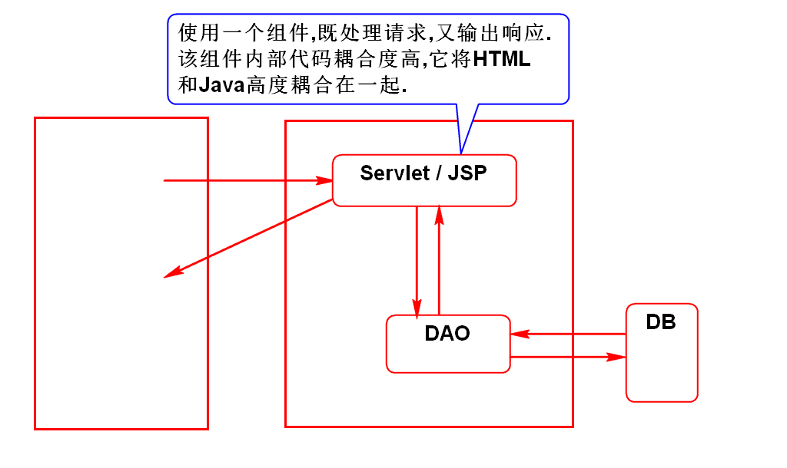

### 1.2. Model 2

即 MVC 模式, Model View Controller

是一个经典的设计模式, 体现软件的分层思想.

采用多个组件, 对原来的一个组件进行解耦合 ( 拆分 ), 便于团队开发及维护

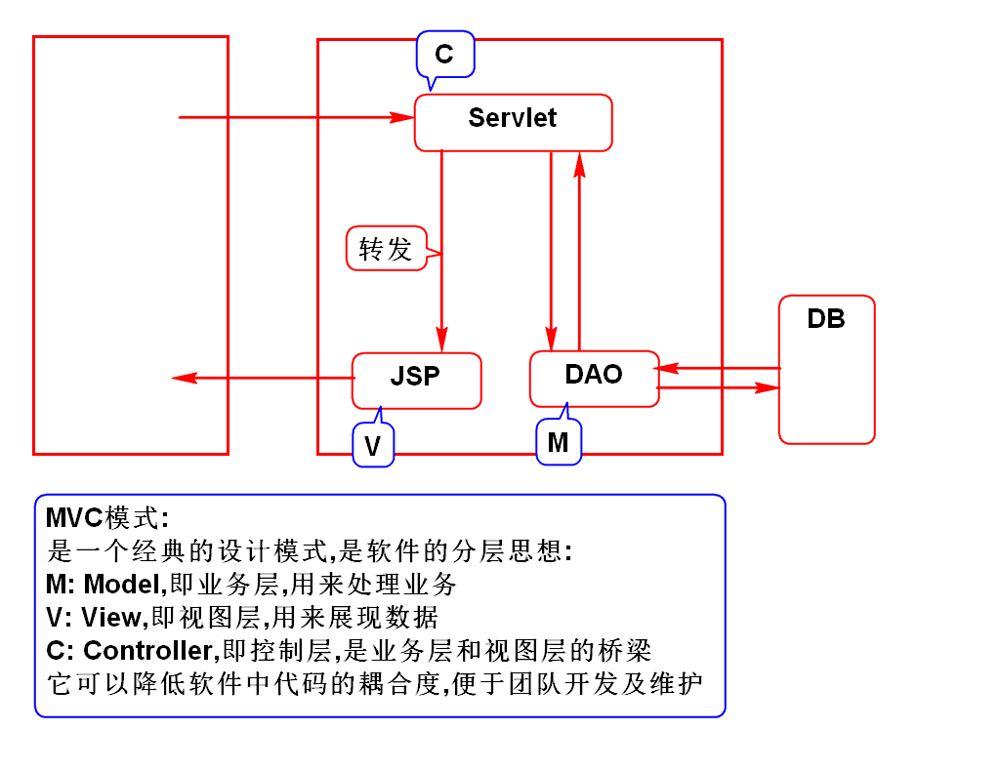

## 2. 什么是转发

### 2.1. 转发的定义

- 一个 Web 组件（Servlet/JSP）将未完成的处理通过容器转交给另外一个 Web 组件继续完成.
- 通常 Servlet 负责获取数据，然后将数据转交给 JSP 输出页面到浏览器.

### 2.2. 转发 与 重定向

#### 1) 联系

- 都是解决2个WEB组件之间的跳转问题

#### 2) 区别

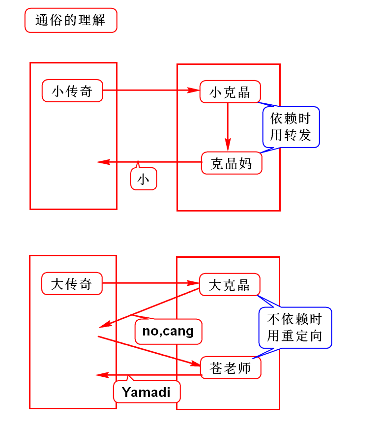

- 转发

  - **依赖时转发** : 如果第一个组件没有完成工作, 需要将某些数据转交给下一个组件继续处理, 则采用转发
  - 只有一次请求 / 响应, 只有一个 request / response, 共享数据
  - 转发过程对浏览器不可见, 地址栏不发生改变
  - 只能在项目内的组件之间转发

- 重定向

  - **独立重定向** : 如果第一个组件已经完成了工作, 没有数据需要提交给下一个组件处理, 则采用重定向
  - 两次请求 / 响应, 创建两次 request / reponse, 数据不互通
  - 重定向过程对浏览器可见, 地址栏发生变化
  - 可以重定向到项目以外的页面

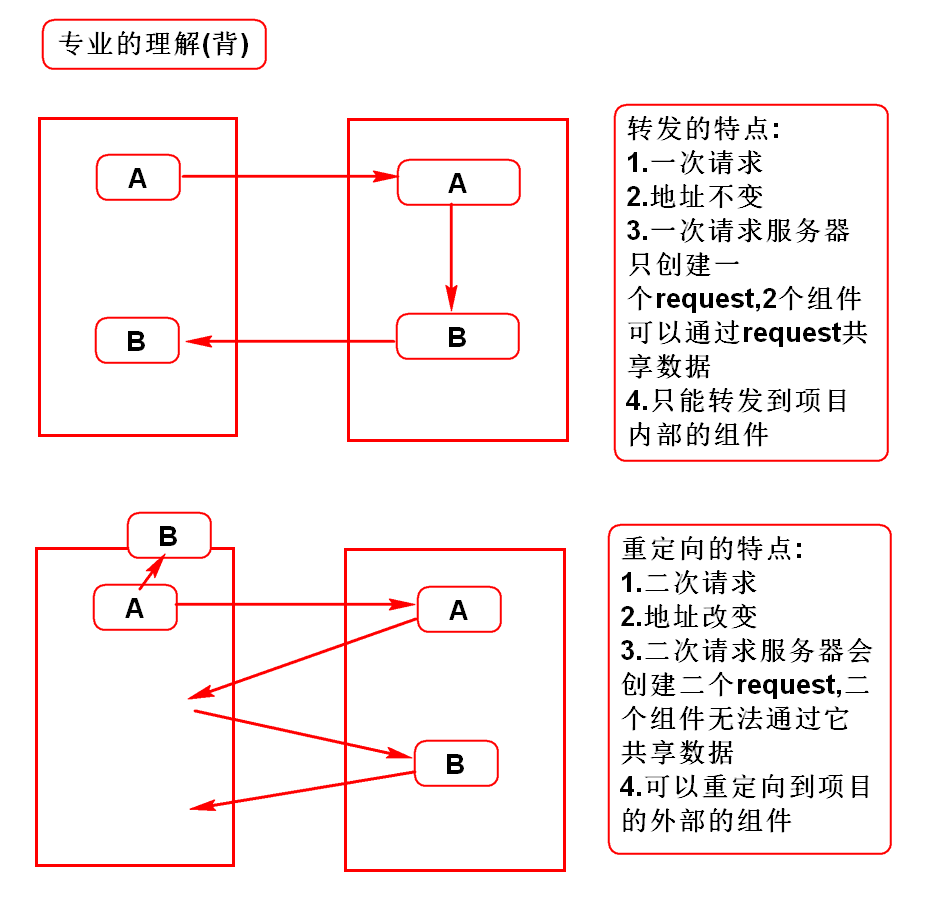

### 2.3. 建议

- 查询时用转发
- 增加, 修改, 删除后重定向到查询

## 3. 如何实现转发

### 3.1. 把对象绑定到request

第一个 servlet 可以将需要传递的数据绑定到 request 中 :

> req.setAttribute( name, value );

第二个组件可以从中获取需要的数据, 若名称错误, 则得到 null

> req.getAttribute( name )

还可将绑定的数据对象移除

> req.removeAttribute( name )

### 3.2. 获得转发器

使用如下代码可以获取到转发器，用于说明转交的下一个组件的路径:

转发只能在项目之内进行, 则目标路径也只能是项目内路径, 若采用绝对路径, 必须省略项目名

> RequestDispatcher rd = request.getRequestDispatcher( 目标路径 );

### 3.3. 转发

转发时两个组件共享 request / response, 要将本次的请求和响应对象作为参数传给下一个Web组件。

在 forward 之后的其他语句还会继续执行.

> rd.forward(request,response);

### 3.4. 合并写法

通常将以上两步合并为一步

> req.getRequestDispatcher( 目标路径 ).forward( req, res );

## 4. 案例: 查询信息并转发

### 4.1. servlet 查询信息

```java
public class FindEmpServ4jsp extends HttpServlet {

	private static final long serialVersionUID = 7374687992251431100L;

	@Override
	protected void service(HttpServletRequest req, HttpServletResponse res)
        throws ServletException, IOException {

		//1.查询所有员工
		EmpDao dao = new EmpDao();
		List<Emp> list = dao.findAll();

		//将数据绑定到  request 上
		req.setAttribute("emps", list);
		
		//2.把请求转发给emp_list.jsp
		req.getRequestDispatcher("jfroms.jsp").forward(req, res);
		
	}
}
```

### 4.2. jsp 展示结果

```jsp
<head>
    ...
   <style>
		table{
			border: 1px solid red;
			border-collapse: collapse;
		}
		td{
			border: 1px solid red;
		}
	</style>
</head>

<body>
	<table>
		<tr>
			<td>编号</td>
			<td>姓名</td>
			<td>职位</td>
			<td>薪资</td>
		</tr>
		<%
			List<Emp> list = (List<Emp>)request.getAttribute("emps");
			for(Emp e : list){
		%>
				<tr>
					<td><%=e.getEmpno() %></td>
					<td><%=e.getName() %></td>
					<td><%=e.getJob() %></td>
					<td><%=e.getSal() %></td>
				</tr>
		<%
			}
		%>
	</table>
</body>
```

# 五. EL 表达式

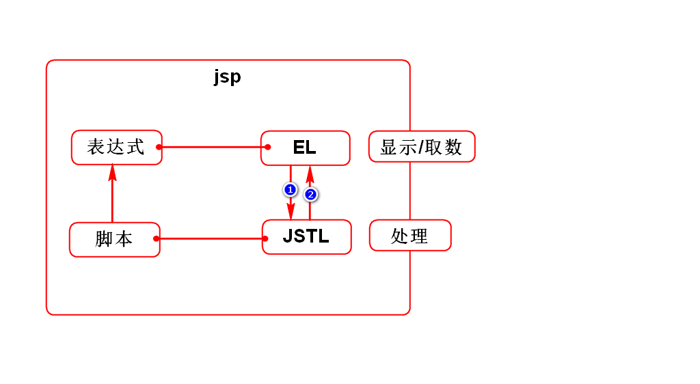

## 1. 概述

### 1.1. JSTL 与 EL表达式

#### 1) JSP 标签与 JSTL

尽管 JSP 化简了 Servlet 对于 HTML 标签的输出工作, 但页面中的 Java 代码仍增加了页面复杂度, 可读性不好, 不便于代码维护。

为此 Sun 公司制定了 JSP 标签(格式类似于 HTML 标签), 用来代替 Java 代码. 

Apache 将其 JSP 标签进一步开发, 并被 Sun 整合成标准标签库, 即 JSTL (JSP Standard Tag Library)

#### 2) EL 表达式

- EL（Expression Language）, EL 表达式是一套简单的运算规则，用于给 JSTL 标签的属性赋值，
- 也可以脱离标签单独使用, 直接用来输出 

### 1.2. EL 表达式的作用

- EL 借鉴了 JavaScript 多类型转换无关性的特点。
- 在使用 EL 从 scope 中得到参数时可以自动转换类型
- request 请求参数以 String 类型来发送，应用时要先进行强制类型转换, 而 EL 允许用户直接使用 EL 表达式取得的值，而不用关心类型。

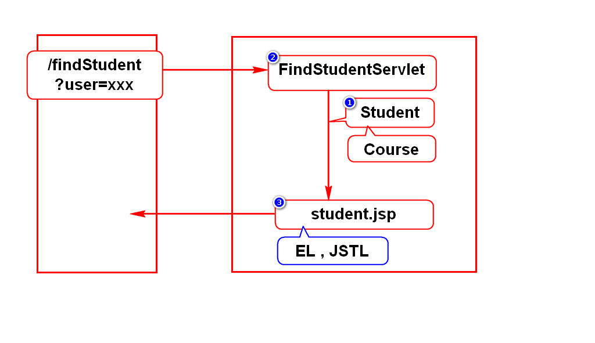

## 2. 使用 EL 表达式

### 2.1. 使用 EL 表达式访问 JavaBean 属性

- 在 JSP 页面中使用 EL 表达式, 可以简便获取对象的属性

- 执行时依次从 pageContext、request、session、application 中查找, 找到后调用 get 方法，将返回值输出。

- Bean：指一个实现序列化接口的类, 通常具有默认无参构造器, 并按照固定的方式提供属性的 get/set 访问方式。

  > ${ 对象名.属性名 }
  > ${ 对象名['属性名'] }
  > ${ 对象名[数组下标] }

  	${user.name}
  	${user['name']}
  	    等价于
  	<%
  	   User u = (User)session.getAttribute(“user”);
  	   out.print(u.getName());
  	%>

### 2.2. 对象查找范围

#### 1) 默认查找范围

为简化表达式, 可以不指定对象来源, EL 表达式依次从各隐含对象中查找指定对象(从小到大)

> pageContext -> request -> session -> application

#### 2)　指定隐含对象取值

如果不同的隐含对象中可能存在同名的对象, 可以指定对象查找的范围

> ${ 隐含对象名Scope.绑定对象名.bean属性 }

	性别: ${requestScope.stu.gender}

#### 3) 从 Cookie 中取值

除了4个默认对象, EL 表达式还可以从 Cookie 中取值
从 Cookie 取值的语法稍有不同, 需指定 cookie 并添加 value 

> ${ cookie.属性名.value }

### 2.3. 使用 EL 表达式进行运算

EL 表达式支持直接进行运算

#### 1) 算术运算

直接在表达式上进行运算

	年龄+3 : ${stu.age+3 }

#### 2) 逻辑运算

进行 **与或非** 等逻辑运算, 返回值为布尔值

	年龄范围: ${stu.age>=20 && stu.age<30 }

#### 3) 判空运算

判断一项属性是否为空, 在该值之前加 empty 关键字, 返回值为布尔值

	是否为空: ${empty stu.interests }

### 2.4. 使用 EL 表达式获取请求参数

#### 1) 获取参数

> ${param.参数名}

#### 2) 获取参数value

> ${paramValues.参数名}

# 六. JSTL 标签

## 1. JSTL概述

### 1.1. 什么是 JSTL

JSP Standard Tag Library, JSP 标准标签库

Apache 组织基于 JSP 标签定义的标签库, 后重新转回 Sun 公司, 是 JavaEE 5.0 的核心

### 1.2. 如何使用 JSTL

1. 将 JSTL 标签对应的 jar 文件拷贝到 WEB-INF/lib 目录下, 或使用 Maven 导入 `jstl-jstl-1.2`

2. 使用 **taglib** 指令导入要使用的 JSP 标签, 命名空间以及前缀, 可参照库文件 **META-INF/c.tld**

  `<%@ taglib uri="JSP标签的命名空间" prefix="命名空间前缀" %>`

  	前缀: <short-name>c</short-name>
  	
  		uri: <uri>http://java.sun.com/jsp/jstl/core</uri>

## 2. 使用 JSTL 核心标签

### 2.1. if 标签

双标签, 支持 EL 表达式, 没有 else 分支, 通常用相反条件作为else使用

> < c : if test="条件"> 成立时执行 < /c:if>

### 2.2. choose 标签

双标签, 表示一个处理分支, 可以有多个分支
when 相当于 if / else if
otherwise 相当于 else

> < c:choose>
> 　　< c:when test="条件"> 成立时执行 < /c:when>
> 　　< c:otherwise> 不成立时执行 < /c:otherwise>
> < /c:choose>

### 2.3. forEach 标签

> < c:forEach items="需要遍历的集合" var="变量名">
> 　循环体, 可以使用 EL 表达式
> < /c:forEach>

### 2.4. 自定义标签

1. 编写 Java 类, 继承SimpleTagSupport类, tld文件放在 WEB-INF 目录之下
2. 在 doTag 方法中添加处理逻辑
3. 配置标签说明文件

例子:

```xml
<?xml version="1.0" encoding="UTF-8" ?>

<taglib xmlns="http://java.sun.com/xml/ns/javaee"
    xmlns:xsi="http://www.w3.org/2001/XMLSchema-instance"
    xsi:schemaLocation="http://java.sun.com/xml/ns/javaee
		http://java.sun.com/xml/ns/javaee/web-jsptaglibrary_2_1.xsd"
    version="2.1">
    
  <description>这是我自己的标签库</description>
  <display-name>My Tag</display-name>
  <tlib-version>3.1</tlib-version>
  <short-name>s</short-name>
  <uri>/lhh-tags</uri>   
  
  <tag>
  	 <description>用来输出服务器的时间</description>
  	 <name>sysdate</name>
  	 <tag-class>day05.SysdateTag</tag-class>
  	 <!-- 声明该标签可以包含哪些内容 -->
  	 <body-content>empty</body-content>
  	 <attribute>
  	 	<description>用来设置时间的格式</description>
  	 	<name>format</name>
  	 	<!-- 是否必须给这个属性赋值 -->
  	 	<required>false</required>
  	 	<!-- 是否可以用EL给此属性赋值 -->
  	 	<rtexprvalue>true</rtexprvalue>
  	 </attribute>
  </tag> 
    
</taglib>  
```

## 3. 标签运行原理

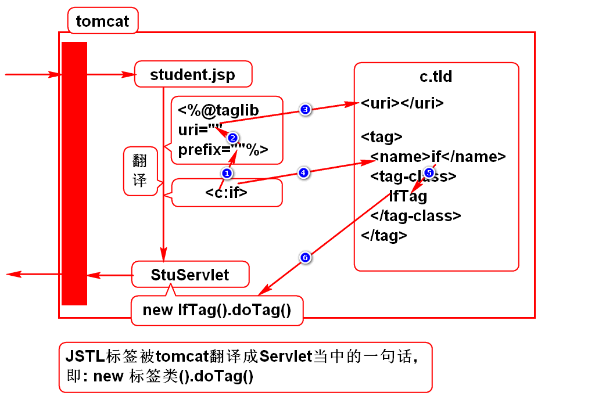

