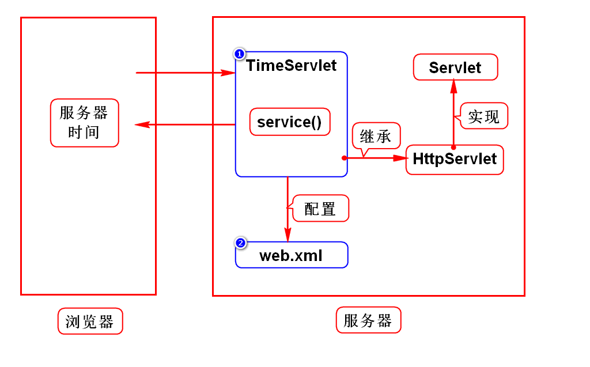
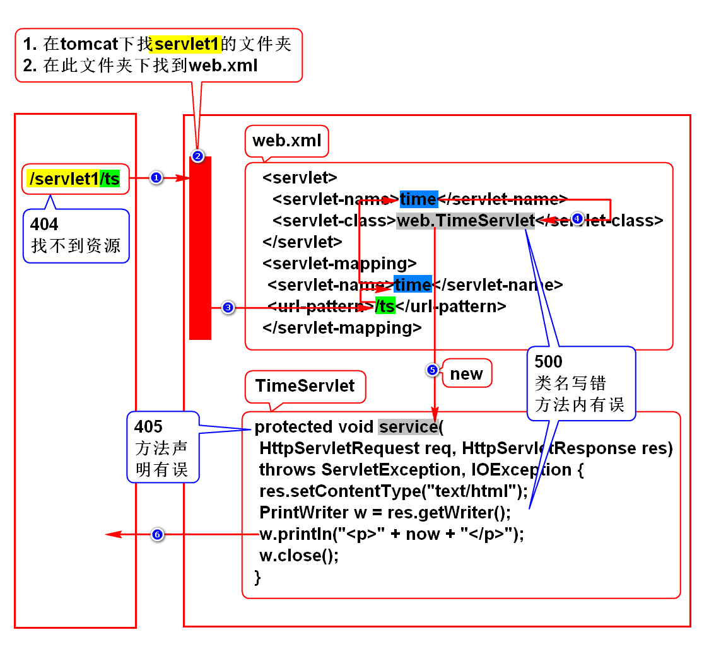

# 一.WEB项目的演变
## 1.演变的规律
- 由单机向网络发展
- 由CS向BS发展

## 2.CS和BS的区别
### CS
- Client Server
- 客户端需要单独开发单独安装

### BS
- Browser Server
- 由浏览器充当客户端,不需要单独开发及安装

# 二.服务器如何给浏览器返回一个网页?
## 1.静态网页
- 开发手册网页,百科,小说,新闻
- 无论谁看结果都一样
- 服务器直接保存一份HTML,并向浏览器发送此HTML

## 2.动态网页
- 淘宝,微博
- 每个人看的结果有差异
- 服务器保存一个对象,由它动态拼一个网页,发送给浏览器
> 在Java中该对象是Servlet

## 3.Servlet的特征
- 是满足规范(sun)的对象,也叫组件
- 存储在服务器上
- 可以动态的拼资源(HTML,IMG). 术语:处理HTTP协议

## 4.什么是Servlet?
- 是sun推出的用来在服务器端处理HTTP协议的组件

# 三.服务器
## 1.名词解释
- Java服务器
- WEB服务器
- Java WEB服务器
- Servlet容器

## 2.本质
- 是一个软件
- 可以运行Java项目的软件

## 3.举例
- Tomcat(Apache)
- JBoss
- WebLogic
- WebSphere

# 四.Tomcat使用方式
## 1.单独使用(软件上线时)
### 1)配置Java环境变量
- 学生机已经配置好了

### 2)下载及安装
- 去Apache官网
- /doc.tedu.cn/tomcat
- 绿色版软件,解压缩即可用

### 3)启动Tomcat
#### Linux
- 打开/tomcat/bin,右键打开终端
- 加权限: 输入chmod +x *sh
- 启动:   输入./startup.sh

#### Windows
- 打开/tomcat/bin,双击startup.bat

### 4)访问Tomcat
- 打开浏览器
- 输入地址: http://localhost:8080
- 回车后看到一只猫则代表成功

### 5)关闭Tomcat
#### Linux
- 打开/tomcat/bin,右键打开终端
- 关闭:   输入./shutdown.sh

#### Windows
- 打开/tomcat/bin,双击shutdown.bat

## 2.通过Eclipse管理(开发时*)
### 1)如何在Eclipse中配置Tomcat
- 看/doc.tedu.cn/tomcat

### 2)重新配置Tomcat的前提
- 点window->preferences->server->runtime,remove tomcat
- 在Eclipse左侧选择Servers项目,右键将其删除

# 五.Servlet开发步骤(*)
## 1.创建WEB项目
- WEB项目必须具备标准的目录结构
- /WEB-INF/web.xml

## 2.导入jar包
### 1)maven搜索
- 搜javaee

### 2)依赖tomcat包
- 右键项目->properties->target runtimes->勾选tomcat->apply

## 3.开发Servlet
- 创建一个类,继承于HttpServlet,间接实现了Servlet接口
- 重写service(),在此方法内拼网页

## 4.配置Servlet
- 在web.xml中,通过2步配置好这个类

## 5.部署项目
- 打开Servers视图,选择Tomcat
- 右键点击Tomcat,选择Add and Remove
- 在弹出框内将要部署的项目从左侧移动到右侧
> 部署:拷贝的术语

## 6.访问Servlet
- http://localhost:8080/servlet1/ts

## 7.重新部署项目
- 当修改项目代码后需要重新部署
- 打开Servers视图,右键点击tomcat,选择publish
> 建议先关闭tomcat,再重新部署,再重启tomcat

## 8.程序执行过程及错误解决方案

# 补充1:tomcat常见问题
## 1.问题的现象
- 有时启动tomcat时会报错,信息如下:
- address already in use 8080

## 2.原因及解决办法
### 1)没有关闭tomcat
- 之前没有关闭tomcat,再次启动时产生了冲突
- 打开/tomcat/bin目录,输入命令./shutdown.sh

### 2)其他软件占用此端口
- oracle会占用8080端口
- 修改tomcat端口:
- 打开Servers项目下面的server.xml,约65行,修改port="8080"
- 建议改为8088,8089
> 关闭tomcat再改端口,改完后要启动
