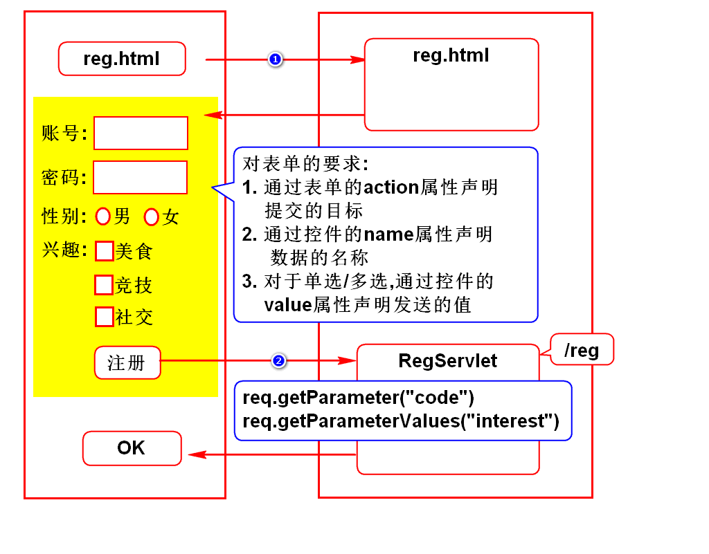
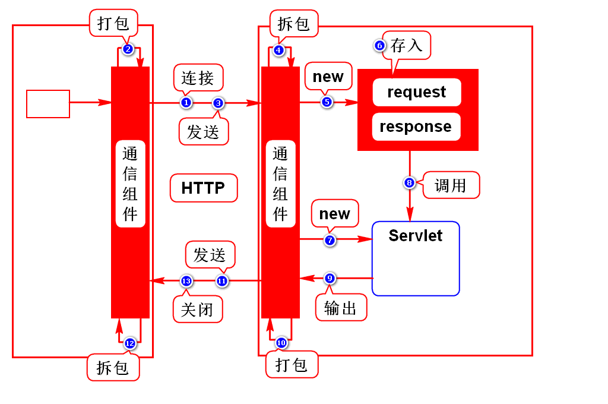
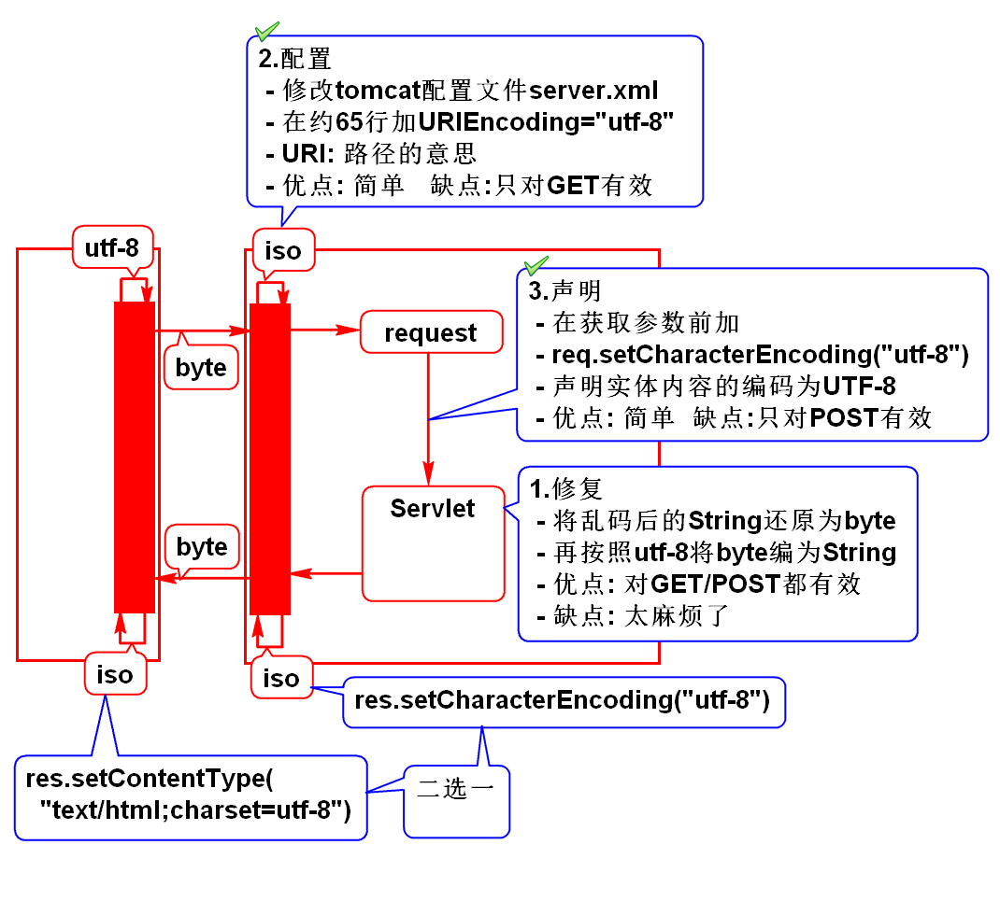
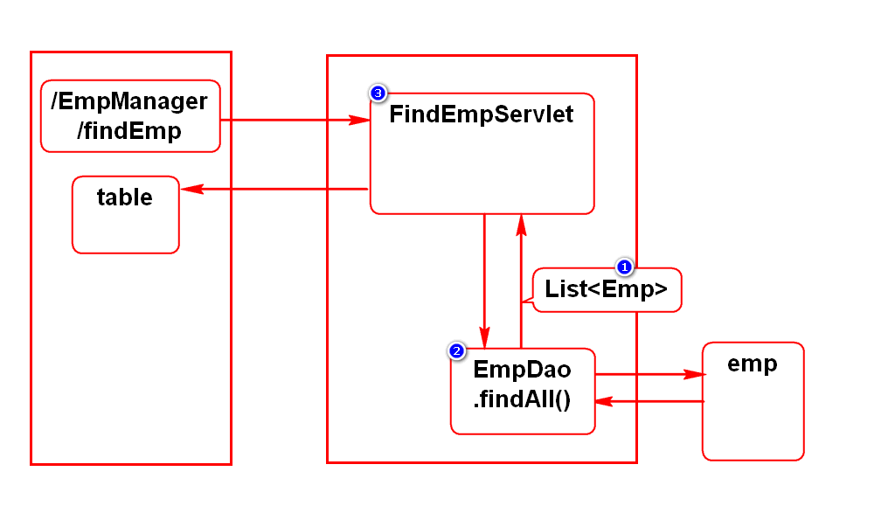

# 一.HTTP协议
## 1.什么是HTTP协议?
- 就是W3C制定的一个规范
- 规定了浏览器和服务器如何通信、通信的数据格式

## 2.如何通信
- 建立连接
- 发送请求
- 接收响应
- 关闭连接
> 一个请求一次连接,尽量降低服务器的压力

## 3.请求数据结构
- 请求行: 请求的基本信息
- 消息头: 对实体内容的描述
- 实体内容: 浏览器向服务器发送的业务数据

## 4.响应数据结构
- 状态行: 响应的基本信息
- 消息头: 对实体内容的描述
- 实体内容: 服务器向浏览器发送的业务数据

# 5.注意
## 1)很多事情不需要我们处理
- 通信的步骤由浏览器和服务器自动实现
- 请求数据中的请求行,消息头由浏览器自动填写
- 响应数据中的状态行,消息头通常由服务器自动填写

## 2.少量事情需要我们处理
- 请求数据中的实体内容由我们提供
- 响应数据中的实体内容由我们提供
> 通过request处理请求数据,通过response处理响应数据

# 二.注册案例

# 三.请求方式
## 1.什么是请求方式?
- 就是浏览器向服务器发送请求时传递数据的方式

## 2.常用请求方式
- GET
- POST

## 3.GET和POST的区别(面试题)
### 1)GET
- 采用路径传参
- 参数在传递过程中可见,隐私性差
- 路径大小有限制,所有传递的参数大小受限
> 所有的请求默认都是GET请求

### 2)POST
- 采用实体内容传参
- 参数在传递过程中不可见,隐私性好
- 实体内容专门用来传参,大小不受限制
> 在表单上加method="post"

### 3)建议
- 参数需要保密时用POST
- 参数较多时用POST

# 四.Servlet运行原理

# 五.乱码解决方案

# 六.查询员工案例

