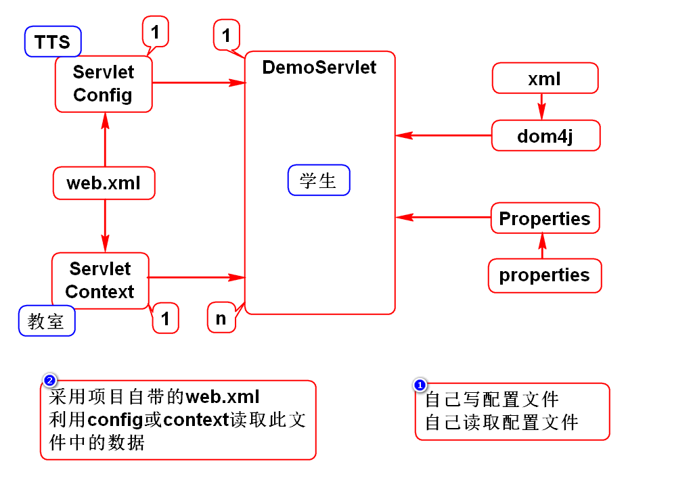

# 一.增加员工

# 二.重定向

# 三.访问路径
## 1.项目部署的过程

## 2.如何获取访问路径
- 项目名: getContextPath()
- Servlet访问路径: getServletPath()
- URI: getRequestURI()
- URL: getRequestURL()

## 3.URI和URL的区别
### 1)狭义的理解(Java WEB 项目)
- URI: 绝对路径
- URL: 完整路径

### 2)广义的理解(任意 WEB 项目) *
- URI: 资源的名字
- URL: 资源的真名
> URI包含URL

## 4.如何配置Servlet访问路径?
### 1)精确匹配
- /hello
- 必须通过"/hello"才能访问此Servlet
- 此Servlet只能处理"/hello"这一个请求

### 2)通配符
- /*
- 通过任何路径都能访问此Servlet
- 此Servlet能处理一切请求

### 3)后缀
- *.abc
- 以".abc"为后缀的请求都能访问此Servlet
- 此Servlet能够处理多个请求

## 5.如何使用一个Servlet处理多个请求?

# 四.Servlet生命周期

# 五.ServletConfig和ServletContext
## 1.它们的作用
- 都能够读取web.xml中为Servlet预置的参数

## 2.它们的区别
- config和Servlet是1对1的关系
- context和Servlet是1对多的关系
- 若数据只给某个Servlet使用,则用config
- 若数据给多个Servlet使用,则用context
> 它们的关系由服务器来保障

## 3.config使用场景
- 假设要开发一个网页游戏,若超过人数上限则要排队
- 开发登录功能LoginServlet
- 人数上限应该是一个可配置的参数maxOnline
- 该参数由LoginServlet使用
> 由于该参数只是LoginServlet使用,由config读取即可