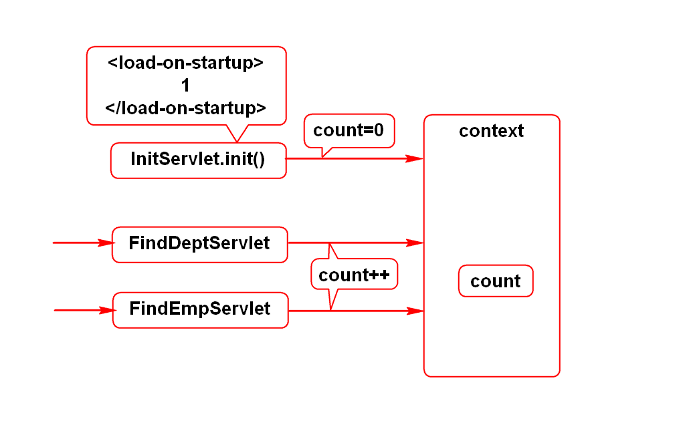
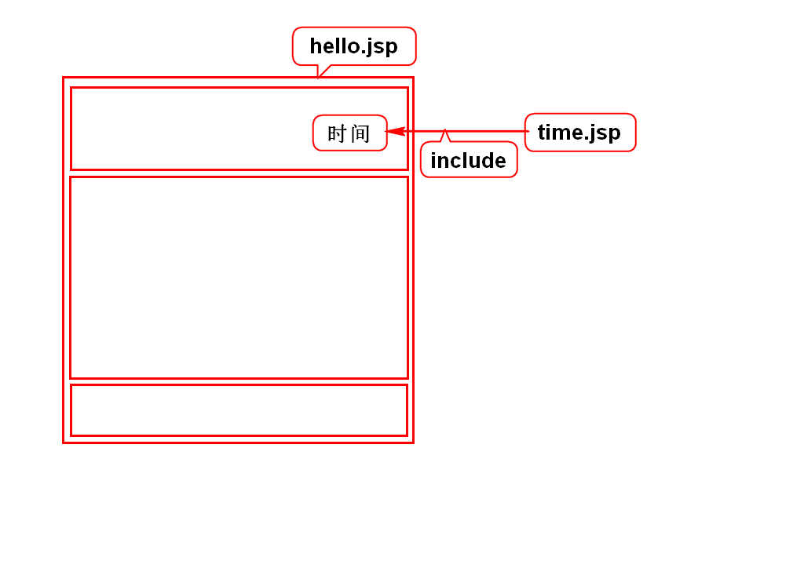
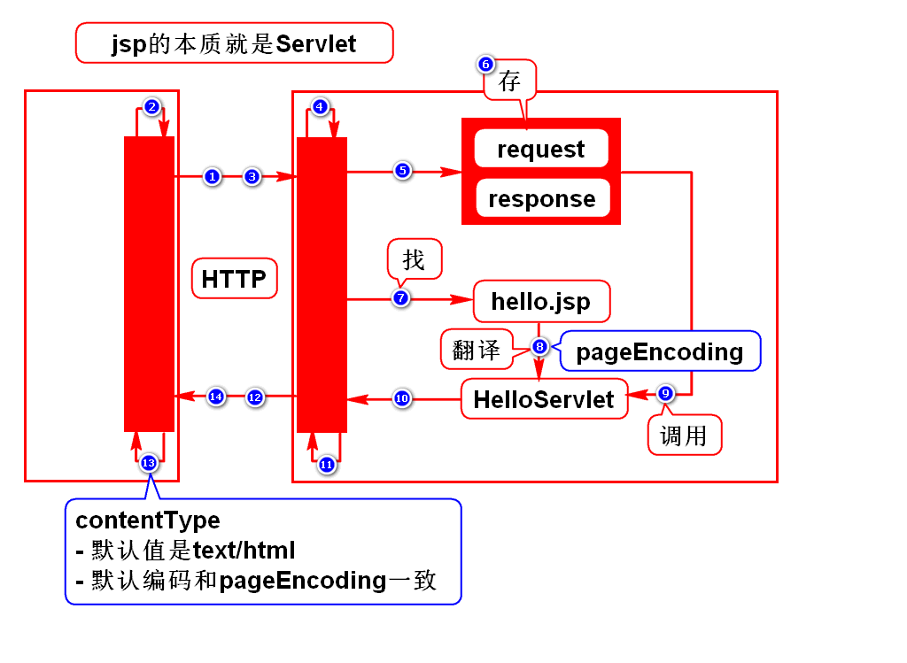
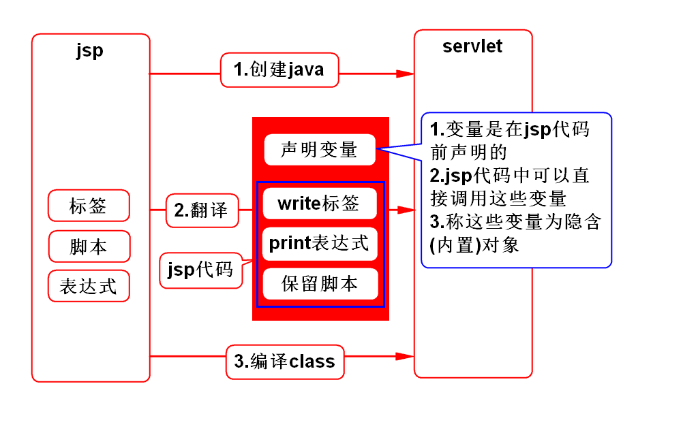
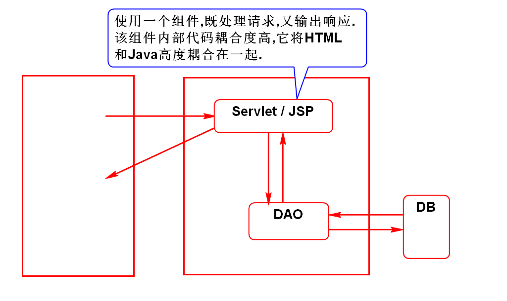
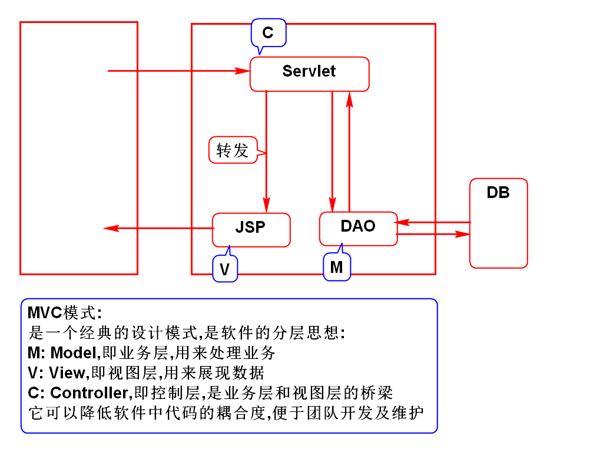

# 一.ServletConfig和ServletContext
## 1.context使用场景
- 大部分的查询都具备分页功能
- 分页需要一个参数:每页显示几条数据size
- 该参数一般可配置,由于被众多查询功能复用,使用context读取

## 2.context可以存取变量

# 二.Servlet线程安全问题

# 三.include

# 四.jsp原理
## 1.jsp处理请求的过程

## 2.jsp翻译的详细过程

# 五.jsp隐含/内置对象(笔试题)
## 1.request(*)
- HttpServletRequest

## 2.response
- HttpServletResponse

## 3.out
- JSPWriter
- 和PrintWriter一样

## 4.config
- ServletConfig

## 5.application
- ServletContext

## 6.exception
- Throwable

## 7.session(*)
- HttpSession
- 后面讲

## 8.page
- Object
- 就是this,指代jsp生成的那个Servlet

## 9.pageContext(*)
- PageContext
- 是一个管理者,通过它可以获得其他8个隐含对象

## 如何使用隐含对象?
- <%String user = request.getParameter("user");%>
- <%=request.getMethod()%>

# 六.开发模式
## 1.Model 1

## 2.Model 2
