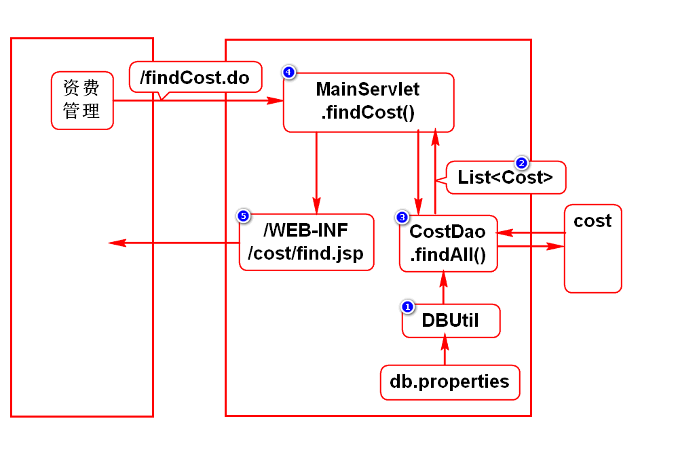
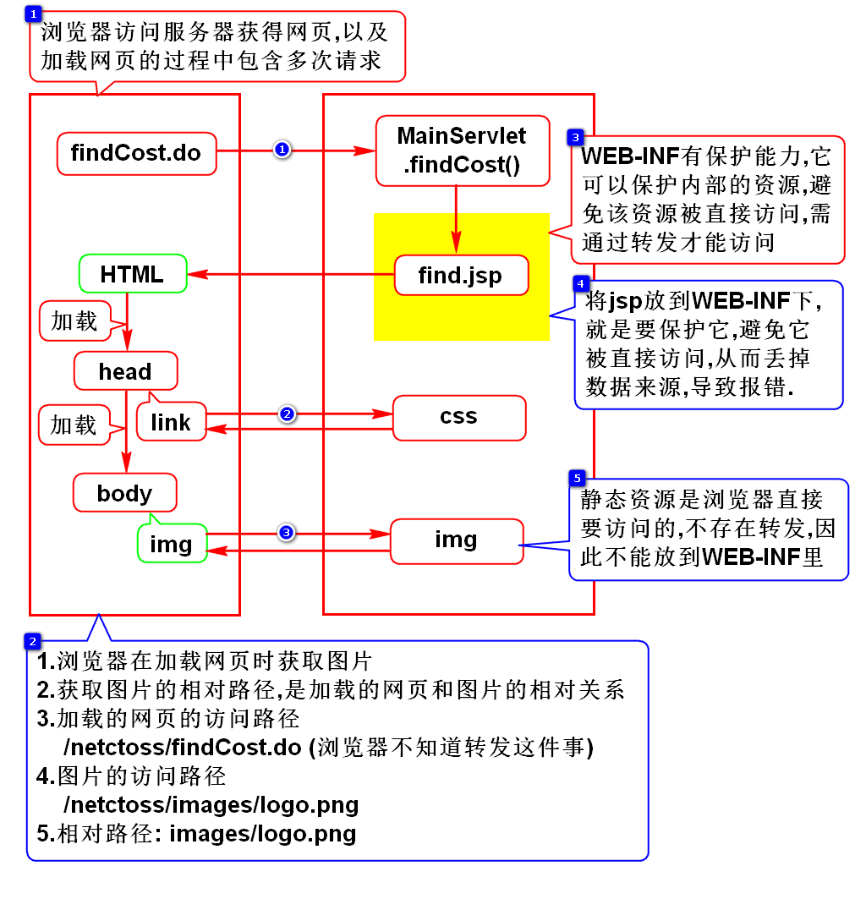
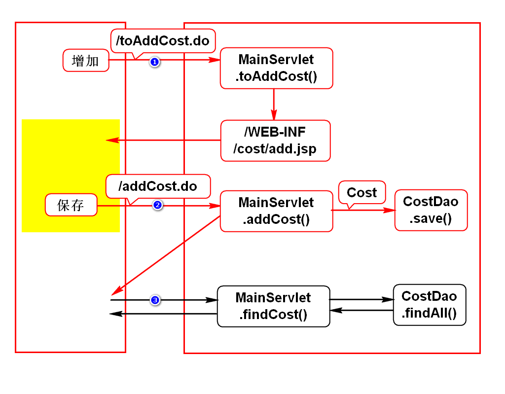

# 一.开发思路
## 1.需求
- 和需求人员沟通需求,明确需求

## 2.设计(图文)
- 先将功能拆分成若干请求
- 每个请求画出程序执行的过程图
> 根据操作推导出本功能所包含的请求

## 3.开发
- 逐个请求逐个组件开发

# 二.资费查询

# 三.问题
## 1.如何格式化jsp上显示的时间?
- fmt.tld
- formatDate

## 2.路径相关问题
- 在jsp上引用样式文件和图片为什么没写../
- 为什么要将jsp放在WEB-INF下
- 为什么要将静态资源放在webapp下

## 3.编码问题
- 为什么jsp上有2处声明了编码
- pageEncoding是给服务器翻译jsp时用的
- meta中的编码是给浏览器加载HTML时用的

# 四.增加资费

