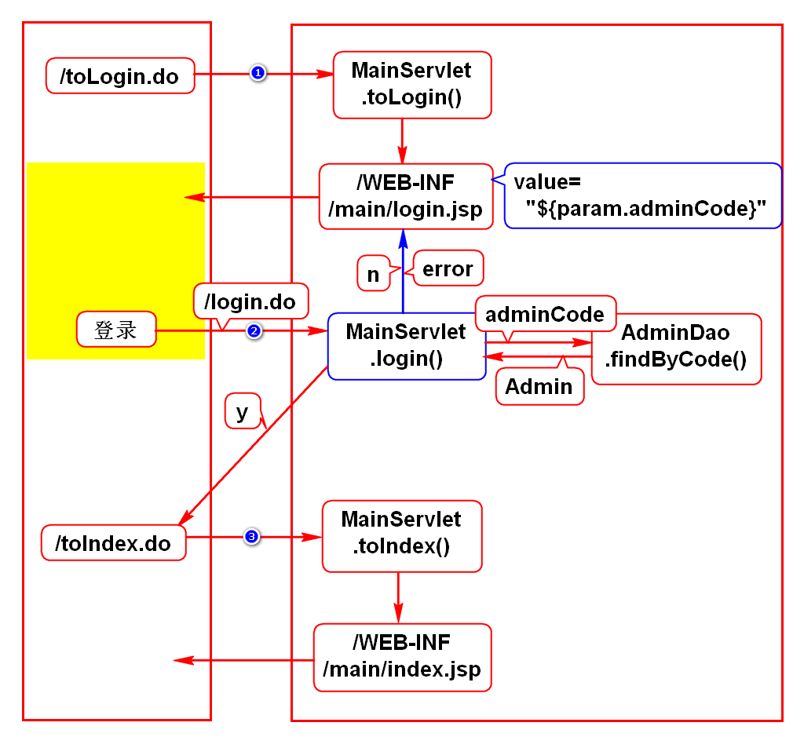
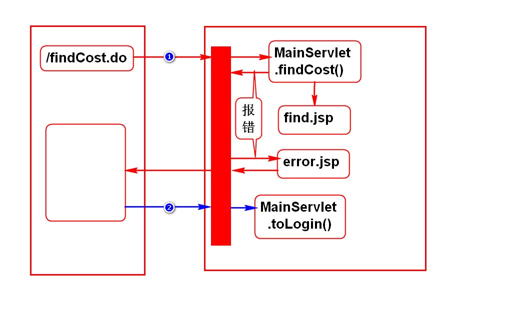
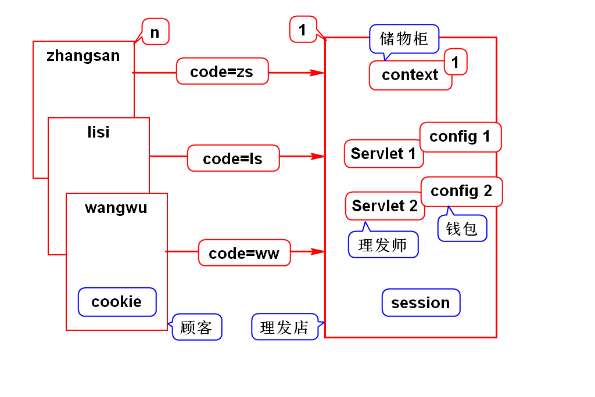
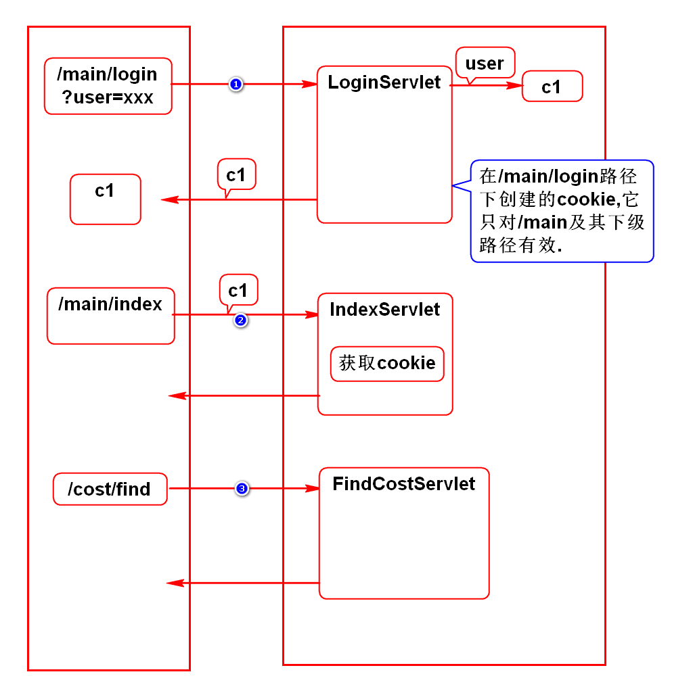
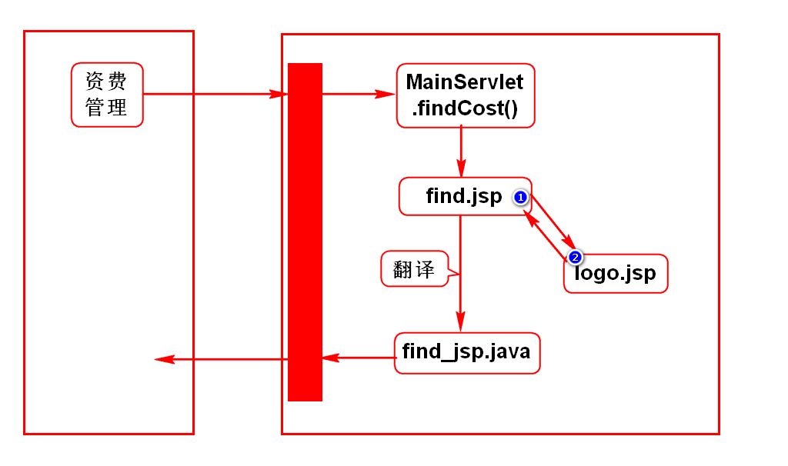
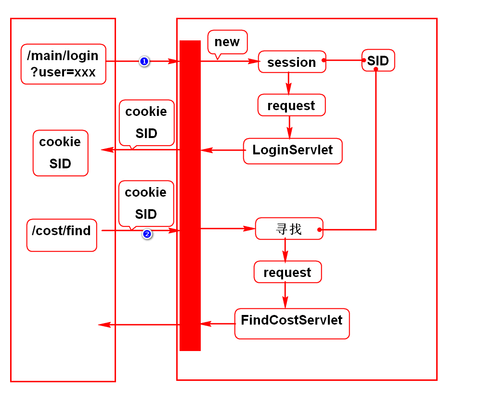

# 一.完善登录功能

# 二.错误页面上的路径问题

# 三.cookie和session
## 1.业务场景
- 登录时要记录账号
- 后续的查询,增加,修改等页面上显示此账号

## 2.错误的解决方案
### 1) request
- 登录是一个请求,查询是另外一个请求
- 2个请求服务器创建2个request,所以无法通过request共享这样的数据

### 2) config
- 可能使用LoginServlet处理登录请求
- 可能使用FindServlet处理查询请求
- 2个Servlet使用2个不同的config,所以无法通过config共享这样的数据
> 事实上config只能读取常量,无法存取变量

### 3) context
- 浏览器和服务器是1对多的关系
- 每个用户登录时传入的数据都是code=xxx
- 若将这样的数据存入唯一的context是有冲突的

## 3.cookie和session专门解决此类问题
- 它们内部的数据可以在多个请求之间共用
- 它们内部的数据可以在多个Servlet之间共用
- 服务器会给每个浏览器创建1组cookie,1个session
> 上述规则由tomcat保障

## 4.cookie和session的区别(面试题)
- cookie存储在浏览器上,服务器压力小,不安全
- session存储在服务器上,服务器压力大,安全

## 5.使用建议
- 重要的数据存入session
- 其他的数据存入cookie

# 四.cookie使用方式
## 1.基本用法
- 创建cookie
- 发送cookie
- 获取cookie

## 2.生存时间
- 修改cookie的生存时间: setMaxAge(n)

## 3.如何存中文
- 存数据时使用URLEncoder对中文转码
- 取数据时使用URLDecoder对中文解码

## 4.有效路径
- setPath("")

# 五.include中的相对路径

# 六.session
