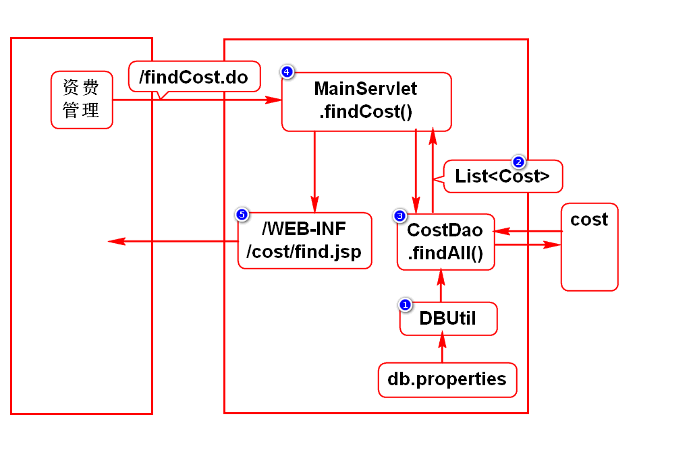
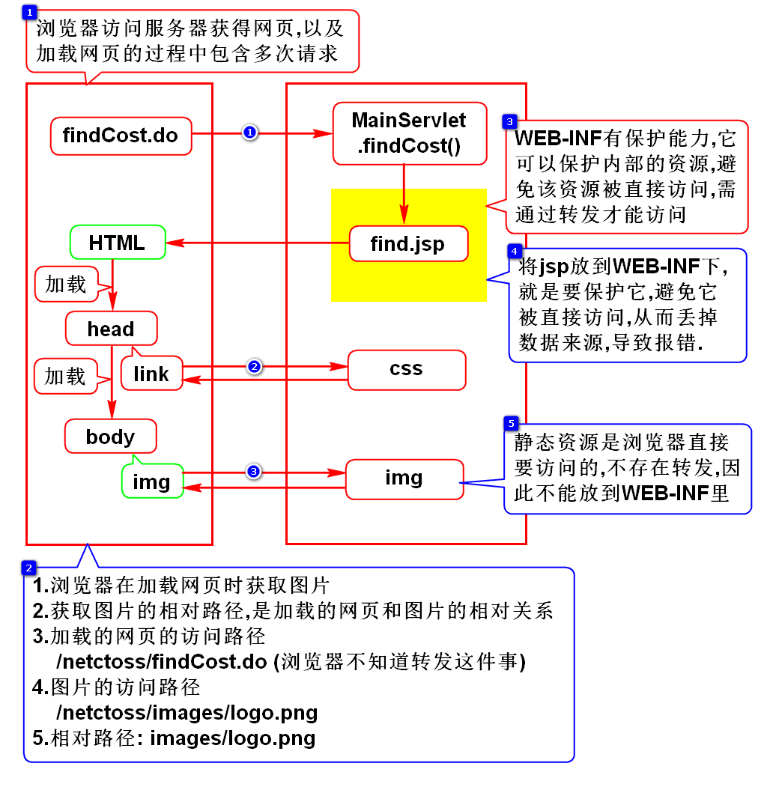
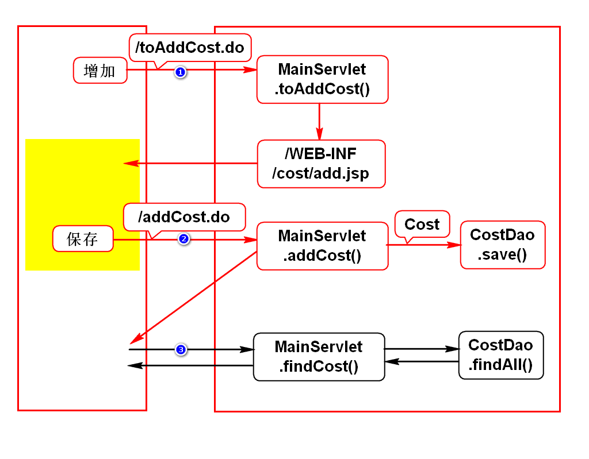
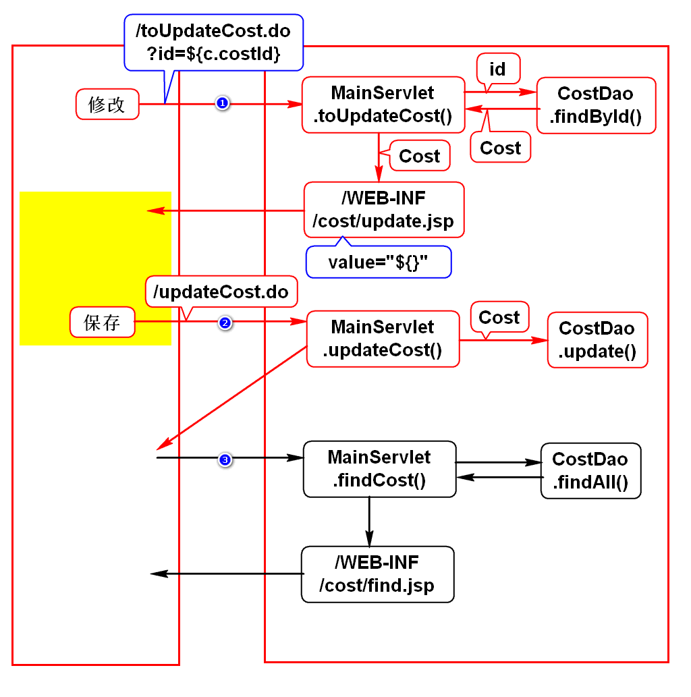
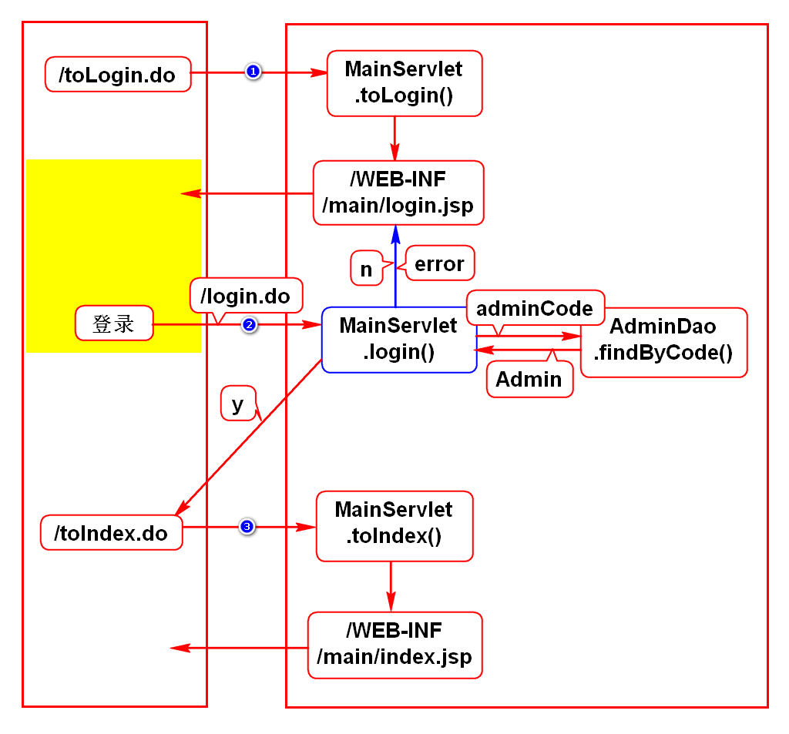
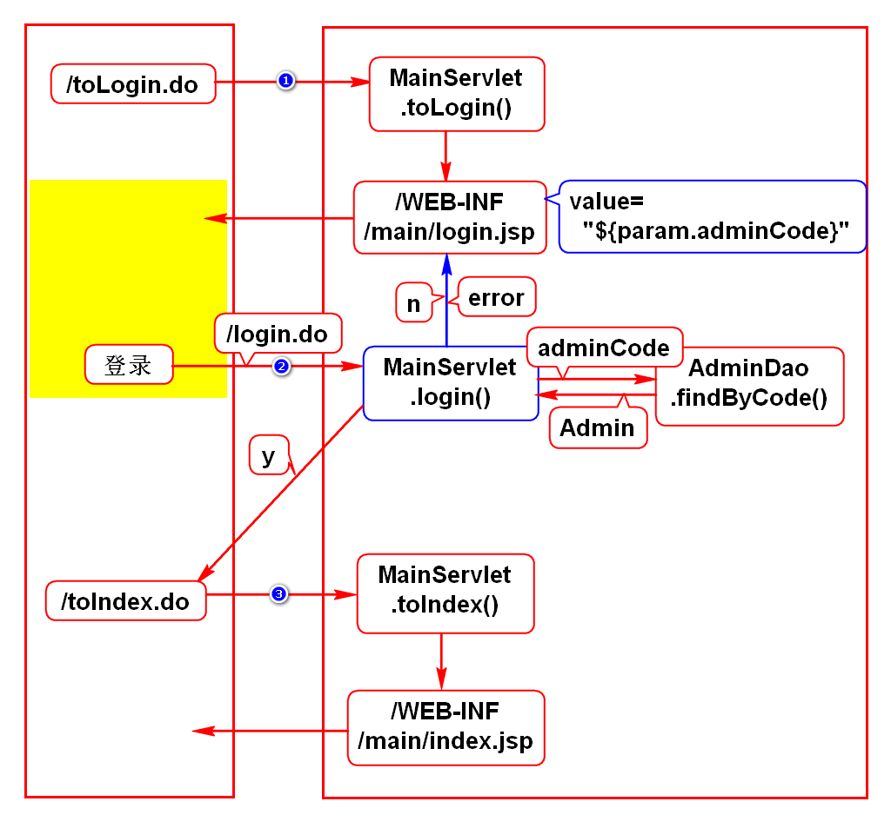
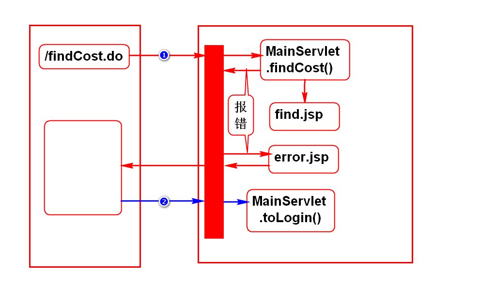
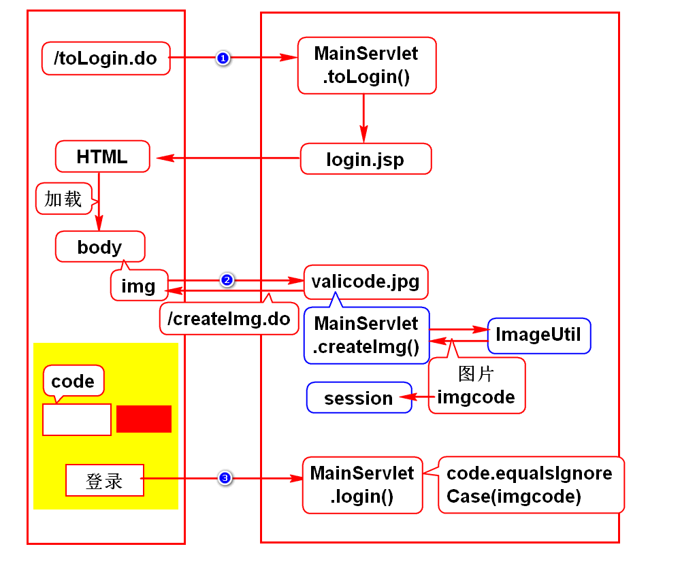
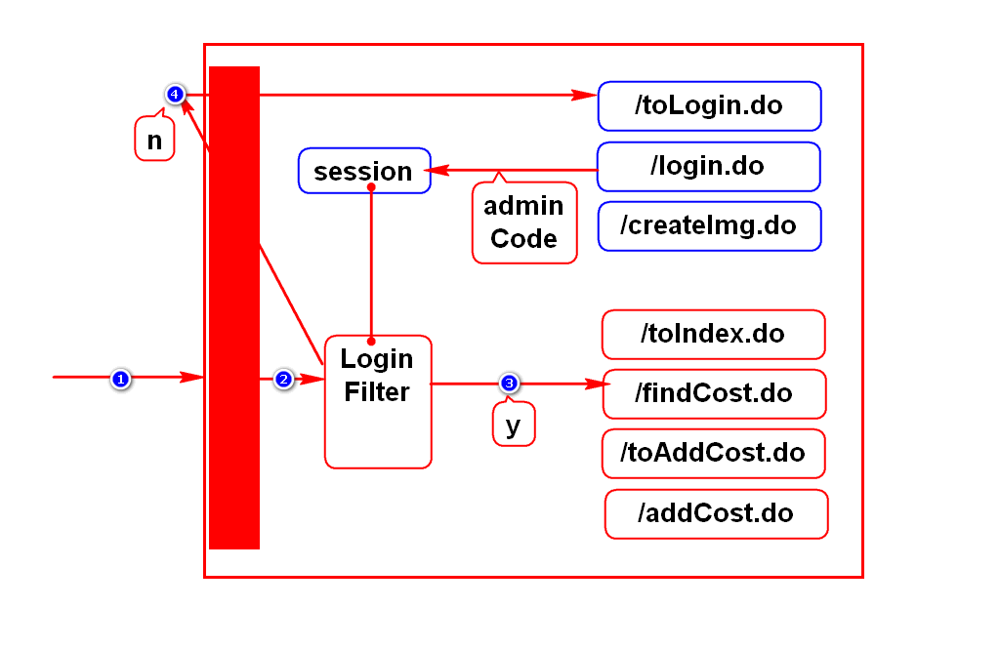

# NetCT OSS 项目文件

# 一. 名词解释
- Net 网络
- C China
- T Telecom
- O Operation
- S Support
- S System

中国电信运营支持系统-网络版

# 二. 导 jar 包
1. JSTL
2. JDBC
3. DBCP 

# 三. 开发思路
## 1. 需求
- 和需求人员沟通需求, 明确需求

## 2. 设计(图文)
- 用例图, 流程图, 类图
- 先将功能拆分成若干请求
- 每个请求画出程序执行的过程图
- 根据操作

## 3. 开发

# 四. 问题
## 1. 如何格式化 JSP 上显示的时间
- fmt.tld
- formatDate

## 2. 路径相关的问题
- 在 JSP 上引用样式文件和图片为什么不写 ../
- 为什么要将 JSP 放在 WEB-INF 下
- 为什么将静态资源放在 webapp 下

## 3. 编码问题
&lt;%@ page pageEncoding="utf-8"%> 和 head-meta 里的编码有什么区别

# 一.开发思路
## 1.需求
- 和需求人员沟通需求,明确需求

## 2.设计(图文)
- 先将功能拆分成若干请求
- 每个请求画出程序执行的过程图
> 根据操作推导出本功能所包含的请求

## 3.开发
- 逐个请求逐个组件开发

# 二.资费查询

# 三.问题
## 1.如何格式化jsp上显示的时间?
- fmt.tld
- formatDate

## 2.路径相关问题
- 在jsp上引用样式文件和图片为什么没写../
- 为什么要将jsp放在WEB-INF下
- 为什么要将静态资源放在webapp下

## 3.编码问题
- 为什么jsp上有2处声明了编码
- pageEncoding是给服务器翻译jsp时用的
- meta中的编码是给浏览器加载HTML时用的

# 四.增加资费

# 一.修改资费

# 二.登录

# 一.完善登录功能

# 二.错误页面上的路径问题

## 3. 验证码

## 4. 登录检查
