# █ SSM 框架

## 1. 讲师介绍
- 程祖红
- chengzh@tedu.cn

## 2. 课程简介
- 时长: 十天左右
- Spring + Spring MVC + MyBatis, + Ajax
- 2200多个类
- 现阶段会用就行, 底层涉及多种设计模式
- 后续提高再研究底层代码

## 3. 时间安排
1. **基础学习** : 划分模块, 掌握模块的基础知识 掌握典型案例 10天
2. **整合应用** : 模块结合在一起, 做项目 12天

# █ 第一部分 Spring

# 一. Spring 简介
## 1. 什么是 Spring
- Spring 是一个开源的, 轻量级的, 用来简化企业级应用开发的应用开发框架. Spring 为系统提供了一个整体的解决方案, 开发者可以利用它本身提供的功能, 也可以与第三方框架和技术整合应用.
- Spring 提供了 IOC 和 AOP 功能, 能降低项目组件间的耦合度, 便于日后维护与升级. 其本质是管理软件中的对象, 即创建对象并维护对象之间的关系

### 1.1. 简化开发
- Spring 对常用 API 做了封装, 可以大大简化 API 的使用
- 如常用的 JDBC 访问数据库, 使用 Spring 可以不考虑如何获取或管理连接

### 1.2. 降低耦合
- Spring 帮我们管理对象之间的依赖关系, 对象之间的耦合度会大大降低, 代码的可维护性大大提高
- **高内聚, 低耦合**: 类的职责单一, 一个方法只干一件事

### 1.3. 框架集成
- Spring 可以将其他的一些框架集成进来, 方便调用各种框架
- 如用于定时任务处理的 Quartz 等

## 2. Spring 容器
### 2.1. 什么是 Spring 容器
- **Spring 容器**, 是 Spring 框架中的一个核心模块, 专门用于管理 Bean 对象.
- 在 Spring 中, 任何的 Java 类和 JavaBean 都被当成了 Bean 处理, 由 Spring 容器来管理和使用.
- Spring 容器实现了 IOC 和 AOP 机制, 这些机制可以简化 Bean 对象的创建, 以及 Bean 对象之间的解耦

### 2.2 Spring 容器的实例化

- Spring 的容器有两种类型 BeanFactory, ApplicationContext, 而 ApplicationContext 继承了 BeanFactory, 提供了更多的企业级方法, 推荐使用

#### 1) ApplicationContext
- ApplicationContext 是一个容器的接口 
- **ClassPathXmlApplicationContext** 是接口的一个实现类
- 该实现类的构造方法会依据文件路径去查找 Spring 配置文件, 根据配置文件实例化容器:

> String config = "配置文件的路径";
> ApplicationContext ac = new ClassPathXmlApplicationContext(config);

#### 2) 编程步骤
1. 创建 Maven 项目, 选择 war 包
2. 导入 spring-webmvc 包:

		org.springframework : spring-webmvc : 3.2.8.RELEASE

3. 添加 Spring 配置文件, 通常放在 src/main/resources 之下
4. 启动容器( 即实例化容器 )

## 3. 容器对 Bean 的管理
### 3.1. 工厂模式
- 工厂模式 : 采用工厂方法去获取对象, 而不使用常规的 new
- 工厂方法 : 一类特殊的方法, 可以根据要求返回一个对象
	
	- 静态工厂方法 : 由 static 修饰, 调用时不需创建所在类的对象
	- 实例工厂方法 : 需要先创建所在类的一个对象, 再由对象去调用方法
	
- Spring 采用了工厂模式. 从本质上讲, Spring 的容器( BF, AC )仅仅是一个维护 Bean 定义以及相互依赖关系的高级工厂接口, 通过指定 beanID, 并给定相应的类型, BF 或 AC 可以访问 Bean 定义, 获取 bean 对象.

### 3.2. 创建对象
1. 首先在容器配置文件中添加 Bean 定义

    > < bean id="BeanID" class="包名.类名" />

2. 在创建容器实例后, 调用 getBean() 方法获取 Bean 的实例.
    > ac.getBean("beanID", 类名.class)

    如果一个类只有一个对应的 BeanId, 则 BeanId 可以省略, 即
    > ac.getBean(类名.class)

	- **类名.class** : 反射, 获取方法区中的 class 对象, 用于指定获取对象的类型
3. Spring 可以通过以下三种方式配置并获取 Bean 对象

#### 1) 无参构造器

- 通过 BeanID 找到指定的类, 调用该类的无参构造器, 创建对象并返回

1. 为 Bean 类添加无参构造器, 或者使用默认的无参构造器
2. 在配置文件中, 添加 bean 元素的配置

  > < bean id="beanID" class="包名.类名" />

3. 创建容器对象, 调用容器的 getBean 方法获取对象

- 类比于工厂: 

	- bean 类是 spring 公司的生产车间, 无参构造器是一条生产线
	- 通过这条生产线生产了一个对象

#### 2) 静态工厂方法 (了解)

- 通过 BeanID 找到指定的类, 调用该类的静态工厂方法, 创建对象并返回

1. 为 Bean 类添加静态的工厂方法
2. 在配置文件中, 添加 bean 配置, 指明要调用的工厂方法

    > < bean id="beanID" class="包名.类名" **factory-method="静态工厂方法"** />

3. 创建容器对象, 调用容器的 getBean 方法获取指定类型的对象 

- 类比于工厂: 

	- 这些 bean 类是 spring 公司的外协厂家
	- 通过外协厂家的生产线生产了一个对象( 外包加工 )

#### 3) 实例工厂方法 (了解)
- 先获取指定类型的一个实例, 再通过这个实例去调用它的实例工厂方法
1. 为 Bean 类添加实例工厂方法
2. 在配置文件中, 添加 bean 配置, 指明需要的实例类型, 以及要调用的工厂方法
> < bean id="beanID" **class="实例的BeanID" factory-method="实例工厂方法"** />

3. 创建容器对象, 调用容器的 getBean 方法获取指定类型的对象 

- 类比于工厂: 

	- 这些 bean 类是 spring 公司的子公司
	- 先投资建设子公司的生产线, 再由子公司的生产线生产一个对象

#### 4) 案例: 创建容器, 获取Bean对象
配置文件:

	<!-- 1.使用无参构造方法创建 Bean 对象 -->
	<bean id="stu1" class="day01.Demo2_Student" />
	<bean id="date" class="java.util.Date" />	
	 
	<!-- 2.使用静态工厂方法创建 Bean 对象 -->
	<bean id="cal1" class="java.util.Calendar" factory-method="getInstance" />
	
	<!-- 3.使用实例工厂方法创建 Bean 对象 -->
	<bean id="time1" factory-bean="cal1" factory-method="getTime" />

执行类:

	//创建并启动容器
	String config = "applicationContext.xml";
	ApplicationContext ac = new ClassPathXmlApplicationContext(config);
	System.out.println(ac);
	
	//采用无参构造的 bean, 实际调用的是 new Date()
	Date d = ac.getBean("date", Date.class);
	System.out.println(d);
	
	//采用静态工厂方法的 bean, 实际调用的是 Calendar.getInstance()
	Calendar c = ac.getBean("cal1", Calendar.class);
	System.out.println(c);
	
	//采用实例工厂方法的 bean, 实际调用的是 cal1.getTime()
	Date t = ac.getBean("time1", Date.class);
	System.out.println(t);

### 3.3. Bean 的命名
#### 1) BeanID
在 Spring 容器中, 每个 Bean 都有自己的名字( 即 ID, 唯一的标识符 )
该名字可以用 bean 元素的 id(常用) 或 name 属性指定

> < bean **id="beanID"** class="包名.类名" />

#### 2) Bean 别名
在给 bean 定义好 ID 后, 可以通过 < alias> 元素指定别名
可以通过别名访问到同一个 bean

> < **alias** name="原beanID" **alias="bean别名"**>

#### 3) 命名空间 NameSpace
为了区分同名的元素, 而添加的限定前缀, 称为命名空间
命名空间也有可能冲突, 要尽量保证唯一性, 通常会使用域名作为项目 Bean 的命名空间

在学习 JSP 标签时, 也要求指定命名空间加以限定
uri : 是命名空间, 通常使用域名, 但完整域名太长, 在项目中可以指定缩写前缀代替
prefix : 是命名空间前缀, 也可以认为是别名, 为了替代以域名形式表示的命名空间

### 3.4. 作用域 (单例模式)
- 容器默认采用单例模式创建对象, 可以通过 bean 元素的 scope 属性指定作用域
    > < bean id="bean名" class="包名.类名" **scope="singleton | prototype"** />

	- **singleton** : 单例模式, 无论执行 getBean 多少次, 都返回同一个对象
	- **prototype** : 原型模式, 每执行一次 getBean, 就创建一个 bean 对象
	- request : 在一次HTTP请求中, 一个bean定义对应一个实例, 仅限于WEB环境
	- session : 在一个HTTP Session中,一个bean定义对应一个实例, 仅限于WEB环境
	- global Session : 在全局的 HTTP Session中, 一个bean对应一个实例, 仅在基于portlet的WEB应用中

- 单例模式的具体说明
    - 一个类对应一个 BeanID, 则无论调用几次 getBean, 只有一个实例
    - 一个类拥有多个 BeanID, 则该类每个 BeanId 可以拥有一个实例
    - 一个类拥有一个 BeanID, 并通过 alias 获取别名, 共用一个实例

### 3.5. 延迟加载 (懒汉/饿汉模式)
- 默认情况下, 容器启动之后, 会将作用域为 singleton 的 bean 对象创建好 (饿汉模式)
- 延迟加载时, 容器启动之后, 不会自动创建 bean 对象, 调用 getBean 方法才会创建 (懒汉模式)

	> < bean id="bean名" class="包名.类名" **lazy-init="true"** />

### 3.6. 生命周期回调
Spring 容器会管理对象的生命周期, 包括对象的创建, 初始化, 销毁等过程
#### 1) 初始化方法

- 容器创建好 bean 的实例后, 会立即调用初始化方法
- 支持单例与多例的 bean, 每创建一个对象, 就会调用一次

	> < bean id="bean名" class="包名.类名" **init-method="方法名"** />

#### 2) 销毁方法

- 容器关闭的时候, 要销毁对象, 在此之前还要先执行销毁方法
- 只能作用于单例模式的 bean, 否则失效

    > < bean id="bean名" class="包名.类名" **destroy-method="方法名"** />

- ApplicationContext 接口未提供关闭的方法, 由其子类 AbstractApplicationContext 提供

    > **AbstractApplicationContext** aac = (**AbstractApplicationContext**) ac;
    > aac.close();
	
#### 3) 默认方法
- 在顶级的 < beans> 元素中, 可以通过 default-init-method 属性, 或 default-destroy-method 属性对容器中所有 bean 指定初始化回调方法和销毁回调方法

	> < beans **default-init-method="初始化方法"**　**default-destroy-method="销毁方法"** >
	> 　　< bean id="bean名" class="包名.类名"/>
	> < /beans>

# 二. Spring IOC
## 1. IOC 与 DI
### 1.1. IOC 
- Inversion of Control 控制反转
- IOC 是一种思想, 指程序中获取对象的方式发生反转, 不是传统的new. 
    而是由第三方框架创建, 由容器注入成员 Bean, 外部注入依赖关系( DI ), 以降低耦合度
- Spring 采用 DI 方式实现 IOC, IOC 是 Spring 框架的基础和核心.
- IOC 是目标, DI 是手段.


### 1.2. DI
- Dependency Injection  依赖注入
- 将成员 Bean 对象, 以构造/方法参数方式, 注入主对象, 建立依赖关系
- 容器的工作就是创建 bean 时注入这些依赖关系
- DI 是实现 IOC 的主要技术途径, 有两种注入方式 :

1. Setter 注入
2. 构造器注入


## 2. 注入 bean 对象 
### 2.1. Setter 注入
- 容器通过无参构造或无参静态方法创建了主 Bean, 再执行相应的 setter 方法注入成员 Bean

    1. 给主 Bean 类添加 Setter 方法
    2. 在配置文件中添加 Bean 配置, 在主 bean 元素的子元素 property 里配置成员 bean, 建立依赖关系
    	
    	> < bean id="主beanID" class="主bean类名">
    	> 　　**< property name="bean属性" ref="成员beanID" />**
    	> < /bean>
    	
### 2.2. 构造器注入
- 在调用含参构造方法创建主 bean 的时候, 把成员 bean 作为参数注入
- 构造器注入, 可以强制给 bean 注入某些参数, 比 setter 注入更严格 ?

    1. 给主 Bean 类添加含参构造器
    2. 配置文件中, 在主 Bean 元素的子元素 constructor-arg 里, 根据**参数下标**配置成员的 BeanID, 参数下标从0开始

    	> < bean id="主BeanID" class="主Bean类名" >
    	> 　　**< constructor-arg index="构造参数下标" ref="成员BeanID"/>**
    	> < /bean>

3. 配置文件中, 在主 Bean 元素的子元素 constructor-arg 里, 根据**参数名**配置成员的 BeanID, 建立依赖关系

    	> < bean id="主BeanID" class="主Bean类名" >
        	> 　　**< constructor-arg name="构造参数名" ref="成员BeanID"/>**
        	> < /bean>

### 2.3. 自动装配

- Spring IOC 容器可以自动装配 bean 之间的关联关系, 减少 xml 注入配置工作
- 自动装配要通过主 bean 元素的 autowire 属性进行设置, 默认不会自动装配
- 使用自动装配时, 建议采用 byName 方式, 避免冲突
- **autowire** : 表示让容器自动建立对象之间的依赖关系
> < bean id="beanID" class="包名.类名" **autowire="自动装配方式"** />

	- **no** : 默认值, 不进行自动装配
	- **byName** : 通过成员变量的变量名, 查找 BeanID, 没找到则为null
	- **byType** : 通过成员变量的类型, 查找相应的 Bean, 没找到则为null, 多个则报错
	- **constructor** : 通过构造器参数类型, 查找 Bean
	- **autodetect** : 自动选择 byType 或 constructor 方式, 有无参构造则采用 ByType

## 3. 注入基本类型值
### 3.1. value元素注入
- value 元素可以通过字符串, 指定属性或构造器参数的值
- 容器将字符串从 String 类型转换为实际类型后注入

	> < bean id="beanID" class="包名.类型" >
	> 　　< property name="成员变量">
	> 　　　　< value>"基本类型值" < /value>
	> 　　< /property>
	> < /bean>

### 3.2. value属性注入
- 也可以通过value属性指定基本值
	
	> < bean id="beanID" class="包名.类型" >
	> 　　< property name="成员变量" value="基本类型值" />
	> < /bean>

## 4. 注入集合类型的值
通过 < list/>, < set/>, < map/>, < props/>, 可以定义或设置与 Java 中对应的 list, set, map, Properties 类型的属性值.
### 4.1. 注入集合的元素直接量
- 以多个元素直接量的方式, 给 bean 注入一个集合
- 支持注入的集合类型有: List, Set, Map, Properties

	> < Bean id="beanID" class="包名.类型" >
	> 　　< property name="成员变量名">
	> 　　　　集合的具体元素列表
	> 　　< /property>
	> < /bean>

	- 最外层 bean 元素是主 Bean 定义, 指定主 BeanID 和 类型
	- 第二层 property 元素是主 Bean 对象的各个成员属性, 用 property 指定成员变量名
	- 最内层是具体的集合具体数据, 其格式根据集合类型决定

#### 1) List 和 Set
- List 和 Set 类型如同数组, 由下标指定元素
- 在 spring 中, 用 value 元素指定具体的值

	**List 类型**
	
	> < list>
	> 　　**< value> List 元素 < /value>**
	> < /list>
	
	
	**Set 类型**
	
	> < set>
	> 　　**< value> Set 元素 < /value>**
	> < /set>

#### 2) Map 和 Properties
- Map 和 Properties 中存储的是键值对
- Map 使用 entry 元素的 key 属性指定键, 用 value 属性指定值
- Properties 使用 prop 元素的 key 属性指定键, 由标签的内容指定值 

	**Map 类型**
	
	> < map>
	> 　　**< entry key="键" value="值" />**
	> < /map>
	
	**Properties 类型**
	
	> < props>
	> 　　**< prop key="键"> value值 < /prop>**
	> < /props>

#### 3) 案例: 注入集合的元素直接量

	<bean id="vb" class="day02.D7_zValueBean" >
		<property name="interest">
			<list>
				<value>唱歌</value>
				<value>跳舞</value>
				<value>撩妹子</value>
			</list>
		</property>
		<property name="city">
			<set>
				<value>北京</value>
				<value>南京</value>
				<value>南京</value>
			</set>
		</property>
		<property name="score">
			<map>
				<entry key="英语" value="90" />
				<entry key="数学" value="85" />
			</map>
		</property>
		<property name="db">
			<props>
				<prop key="username">luojbin</prop>
				<prop key="password">lucky</prop>
			</props>
		</property>
	</bean>

### 4.2. 注入集合的引用
除了以元素直接量的方式将集合注入, 也可以先将集合封装成 Bean, 再将 Bean 的引用注入
注: 封装集合 Bean 时, 其外层标签要加上 **util:** 命名空间前缀
#### 1) ListBean 和 SetBean
- list 和 set 采用 value 标签指定集合元素的值

	**定义 ListBean**
	>	< util:list id="ListBean">
	>	　　**< value> 元素 < /value>**
	>	< /util:list>
	
	**定义 SetBean**
	>	< util:set id="SetBean">
	>	　　**< value> 元素 < /value>**
	>	< /util:set>

#### 2)  mapBean 和 propsBean
- Map 使用 entry 元素的 key 属性指定键, 用 value 属性指定值
- Properties 使用 prop 元素的 key 属性指定键, 由标签的内容指定值 
	**定义 mapBean**
	> < util:map id="mapBean">
	> 　　**< entry key="键" value="值" />**
	> < /util:map>

	**定义 propsBean**
	> < util:properties id="propsBean">
	> 　　**< prop key="键"> 值 < /prop>**
	> < /util:properies>

#### 3) 引用方式注入集合bean
定义了集合 Bean 后, 使用主 Bean 的 property 标签将集合 bean 的引用注入.
其中的 ref 属性用来指定要注入的集合的 BeanID

> < bean id="主beanID" class="包名.类型" >
> 　　< property name="成员变量名" **ref="集合BeanID"** />
> < /bean>

#### 4) 案例: 注入集合的引用

1. 先定义集合 Bean

    ```xml
    <util:list id="interestBean">
        <value>吃酒</value>
        <value>喝烟</value>
    </util:list>
    <util:set id="cityBean">
        <value>北京</value>
        <value>南京</value>
        <value>南京</value>
    </util:set>
    <util:map id="scoreBean">
        <entry key="English" value="90" />
        <entry key="Math" value="85" />
    </util:map>
    <util:properties id="dbBean">
        <prop key="username">luojbin</prop>
        <prop key="password">lucky</prop>
    </util:properties>
    ```

2. 注入集合Bean的引用

    ```xml
    <bean id="zvb" class="day02.D7_zValueBean" >
        <property name="interest" ref="interestBean" />
        <property name="city" ref="cityBean" />
        <property name="score" ref="scoreBean" />
        <property name="db" ref="dbBean" />
    </bean>
    ```

### 4.3. 注入 properties 文件内容
#### 1) 什么是 properties 文件

- properties 文件是一个纯文本文件, 里面以键值对形式存储项目参数
使用 properties 文件可以避免把参数都在代码中写死, 以便在后期修改项目参数
- properties 格式要求:

    1. 以键值对形式编写, 每行一个键值对, 用**等号**隔开
    2. 不随意空格, 行首, 等号两侧, 结尾, 均不能添加空格
    3. key, value 都不用加引号
    4. 使用 # 开头的行是注释行

#### 2) 配置 properties bean
- 使用 < util:properties> 标签配置, location:指定属性文件的位置
- 注：classpath, 表示让容器依据类路径去查找属性文件。
容器会读取指定位置的文件的内容并且将这些内容存放到 Properties 对象里面

    > < util:properties location="classpath:文件路径" />

        <util:properties id="config" 
            location="classpath:day03/config.properties"/>

## 5. Spring 表达式
Spring 提供了 Spring 表达式, 类似于 EL 表达式, 可以方便地获取一个 Bean 对象中封装的数据.
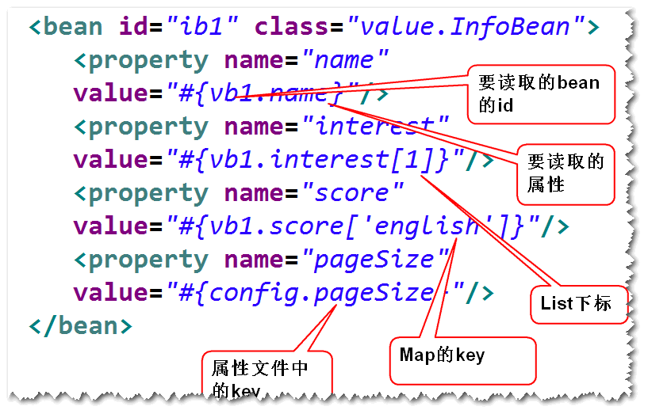

#### 1) 获取属性的值
当要读取的数据, 是 Bean 对象的属性值时( 包括基本类型和引用类型 ), 使用以下方式读取
> ＃{ BeanID.属性名 }

#### 2) 获取集合的一个元素
当要获取的数据, 是集合中的一个元素时, 通过集合下标指定要获取的值
> ＃{ BeanID.集合属性名[下标] }

#### 3) 获取映射的值
当要获取的数据, 是映射中的一个键值对的值时, 通过键指定要获取的值
> ＃{ BeanID.映射属性名[键] }

#### 4) Properties 
当要获取的数据, 是 Properties 配置文件中的一个键值对的值时, 通过键指定要获取的值
> ＃{ PropsID.键 }

## 6. 注入 null 或空字符串
### 6.1. null
如果需要注入 null, 要采用 < null /> 元素
> < property name="键"> **< null />** < /property>

### 6.2. 空字符串
Spring 将属性的空参数当做空字符串
> < property name="键" **value=""** />

# 三. 基于注解的组件扫描
## 1. 组件扫描
### 1.1. 什么是组件扫描
指定一个包路径, Spring 启动以后, 就会扫描指定的包及其子包中的所有组件类, 如果组件类有特定的注解, 如 @Component, 就会将该组件类作为一个 bean 纳入容器中管理.
组件扫描相当于在配置文件中批量定义 bean 元素

### 1.2. 配置组件扫描
使用组件扫描, 首先要在 xml 配置中指定要扫描的包名.

> < context:component-scan base-package="要扫描的包名" />

## 2. 组件类的注解
指定了扫描类路径后, 并不是该路径下的所有组件类都被视为 Bean 纳入到 Spring 容器中统一管理, 还要在组件类上添加特定的注解.
支持 Component, Controller, Repository, Service, 其效果都一样, 为了提高程序可读性而设置多个.
通过组件类的注解, 可以对 bean 进行设置, 等价于在 xml 配置文件中设置.
### 2.1. BeanID
组件扫描时, 默认的 beanID 为将首字母小写后的类名, 也可以在该类的注解后指定 BeanID.
Component, Controller, Repository, Service注解都可以这样设置.

> @Component
> @Component("beanID")

### 2.2. 作用域
Spring 的默认作用域是 singleton, 如果需要其他作用域,  可以通过 @Scope 注解设置

> @Scope("singleton")
> @Scope("prototype")

### 2.3. 延迟加载
通过 @Lazy 注解, 可以设置是否采用延迟加载

> @Lazy(true)

### 2.4. 初始化方法与销毁方法
可以在类的方法前添加注解, 将其作为初始化方法或销毁方法.
初始化方法与销毁方法的注解由 JavaEE 提供, 需要导入相关的包.
如果是 web 项目, 可以依赖容器 tomcat 的包

#### 1) 初始化方法

> @PostConstruct

#### 2) 销毁方法

> @PreDestroy

## 3. 通过注解注入依赖
可以通过注解给 bean 注入依赖关系
具有依赖关系的 Bean 对象, 可以利用一下三种注解实现依赖注入:
### 3.1. @Autowired + @Qualifier
- 支持 构造器注入, setter 注入, 通常只用在构造器
- Autowired 写在构造器或set方法前, 声明需要为其注入Bean
- Qualifier 写在参数前面, 声明要被注入的 BeanID, 被注入的对象为单例时可省略.

#### 1) 在构造器注入
可以在构造器前添加注解

> **@Autowired**
> public 类名( **@Qualifier("注入的beanID")** 参数类型 参数名 )

#### 2) 在 Setter 方法注入
可以在 Setter 方法前添加注解

> **@Autowired**
> public void set方法( **@Qualifier("注入的beanID")** 参数类型 参数名 ){...}

#### 3) 在成员属性声明处注入
也可以在声明成员变量时添加注解, 相当于在声明时赋值, 只执行 `this.属性 = bean` 这一句

> **@Autowired**
> **@Qualifier("注入的beanID")**
> private 属性类型 属性名;

### 3.2. @Inject + @Named
Spring 3.0 开始增加的对 JSR-330标准的支持, 使用前要添加 JSR-330 的包 javax.inject-1.jar
和 @Autowired + @Qualifier 用法一致, 但需要额外导包, 仅作了解

### 3.3. @Resource
Resource 注解只支持 Setter 方式, 实际上大多数情况都是采用 setter 方式注入, 这种方式应用广泛, 重点掌握.
如果要注入的对象是单例, 可以省略 name="注入的beanID"

#### 1) 在 setter 方法注入
> **@Resource(name="注入的beanID")**
> public void set方法( 参数类型 参数名 ){...}

#### 2) 在成员属性声明处注入
也可以在声明成员变量时添加注解, 相当于在声明时赋值, 只执行 `this.属性 = bean` 这一句
> **@Resource(name="注入的beanID")**
> private 属性类型 属性名;

## 4. 通过注解注入基本类型

### 4.1. value
- 使用 Value 注解, 给 bean 对象注入基本类型的属性值, 也可以注入 Spring 表达式的值.
> **@Value("基本类型值") 或 @Value("#{ Spring表达式 }")**
> private 属性类型 属性名;

- Value 注解可以用在 set 方法之前.
> **@Value("基本类型值") 或 @Value("#{ Spring表达式 }")**
> public void set方法( 参数类型 参数名 ){...}

# █ 第二部分 Spring MVC

# 一. Spring MVC 简介
## 1. 系统分层
### 1.1. 为什么要分层?（了解)
为了系统好维护，系统的设计应该要做到“高内聚，低耦合”。
“高内聚”：指的是类的职责要单一，这样，一个类就可以会拆分成多个类（比如AccountService拆分成了AccountService和AccountDAO）,这样，就形成了分层的概念。
“低耦合”：指的是类与类之间不要直接依赖。（AccountService要调用AccountDAO，应该使用依赖注入）。

### 1.2. 如何分层

1. 表示层：也叫视图层, 是数据展现和操作的界面，以及请求分发。
2. 业务层：封装了业务逻辑。  
3. 持久层: 封装了数据访问逻辑。
注：
表示层调用业务层，业务层调用持久层。
上一层通过接口来调用下一层提供的服务
下一层的具体实现发生了改变，不影响上一层

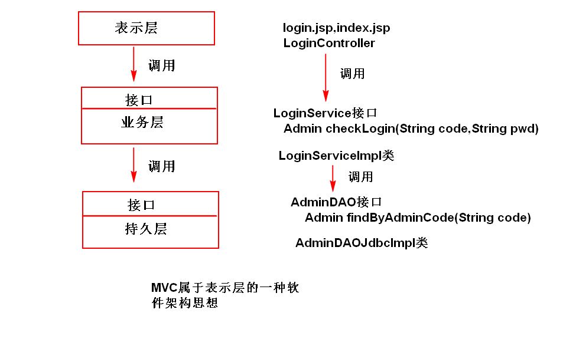
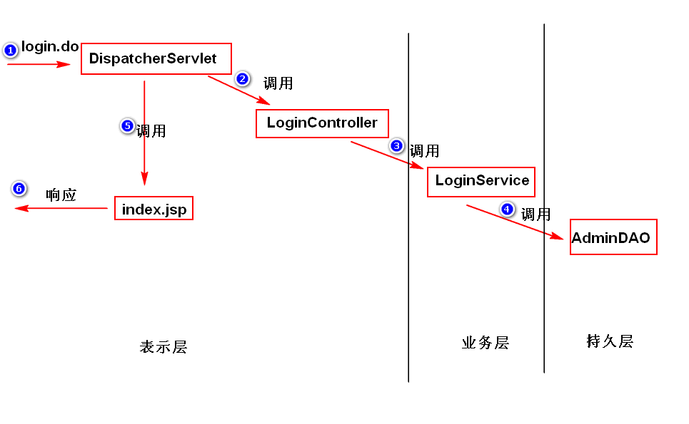

## 2. MVC 模式简介
MVC 属于表示层的一种软件架构思想.
### 2.1. M-MODEL
模型的职责是负责业务逻辑, 包括两层:
业务数据, 以及业务处理逻辑.
比如实体类, DAO, Service 都属于模型层.

### 2.2. V-View
视图的职责是负责显示界面和用户交互, 收集用户信息
视图层主要是不包含业务逻辑和控制逻辑的 JSP

### 2.3. C-Controller
控制器是模型层和视图层之间的桥梁, 用于控制流程
比如在 Servlet 项目中的单一控制器 ActionServlet

## 3. Spring MVC
### 3.1. 什么是 Spring MVC?
用来简化基于MVC架构的web应用程序开发的框架。
注：SpringMVC是spring中的一个模块。

### 3.2. Spring MVC 五大组件

#### 1) DispatcherServlet 前端控制器
org.springframework.web.servlet.**DispatcherServlet**
将浏览器发来的请求进行分发, 控制调用各个处理器或组件来响应不同的请求
在 **web.xml** 项目配置文件中配置

#### 2) HandlerMapping  映射处理器
org.springframework.web.servlet.handler.**SimpleUrlHandlerMapping**
前端控制器分发请求的依据, 规定了哪些请求应该由哪个处理器来处理
在 **spring.xml** 配置文件中配置, 使用 **@RequestMapping** 注解则不需在配置文件中配置.

#### 3) Controller	处理器
org.springframework.web.servlet.mvc.**Controller**
处理具体的业务逻辑, 将处理结果封装成 ModelAndView 对象传回
新编写的 controller 应实现这一接口, 使用 **@Controller** 注解的话, 则不需要实现接口.

#### 4) ModelAndView 模型与视图名
org.springframework.web.servlet.**ModelAndView**
用于封装处理器处理后的数据, 并包含用于定位下一个视图的视图名

#### 5) ViewResolver 视图解析器
org.springframework.web.servlet.view.**InternalResourceViewResolver**
处理器返回视图名字符串, 视图解析器根据处理器返回的视图名, 解析出真正要使用的视图对象的路径
在 **spring.xml**配置文件中配置

### 3.3. Spring MVC 工作原理
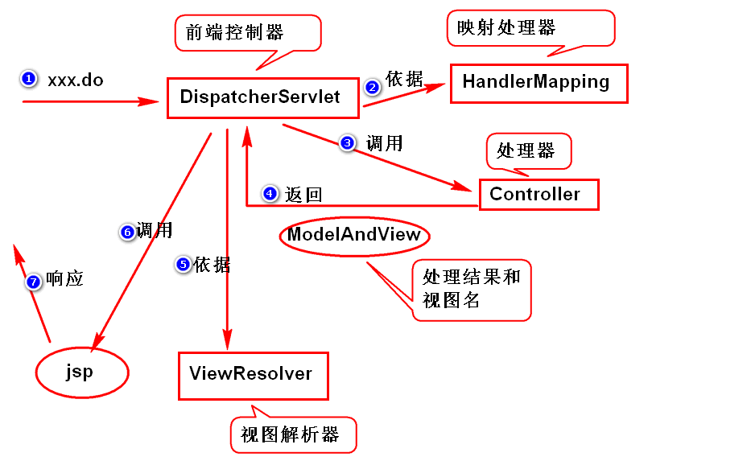

1. 服务器收到请求后, 将请求发送给 DispatcherServlet, 准备进行分发;
2. DispatcherServlet 获取 HandlerMapping 的配置;
3. 根据配置信息, 调用对应的 Controller 来处理请求;
4. Controller 将处理结果封装成 ModelAndView，返回给 DispatcherServlet.
5. DispatcherServlet 依据 ViewResolver, 解析出要使用的视图对象;
6. 调用对应的视图对象（比如jsp）来生成相应的页面;
7. 服务器将生成的响应页面发送给浏览器.
注：视图部分可以使用 jsp, 也可以使用其它的视图技术，比如freemarker, velocity等。

# 二. Spring MVC 的应用
## 1. 基于 XML 的 Spring MVC 应用
### 1.1. 编程步骤

1. 导包 spring-webmvc
2. 添加配置文件 **spring-mvc.xml**。
3. 在项目的 **web.xml** 配置 DispatcherServlet。
4. 写 Controller, 必须实现 `org.springframework.web.servlet.mvc.Controller` 接口。
5. 写 jsp。
6. 在配置文件 **spring-mvc.xml** 当中，添加 HandlerMapping, ViewResolver 的配置。

### 1.2. 案例. Hello请求
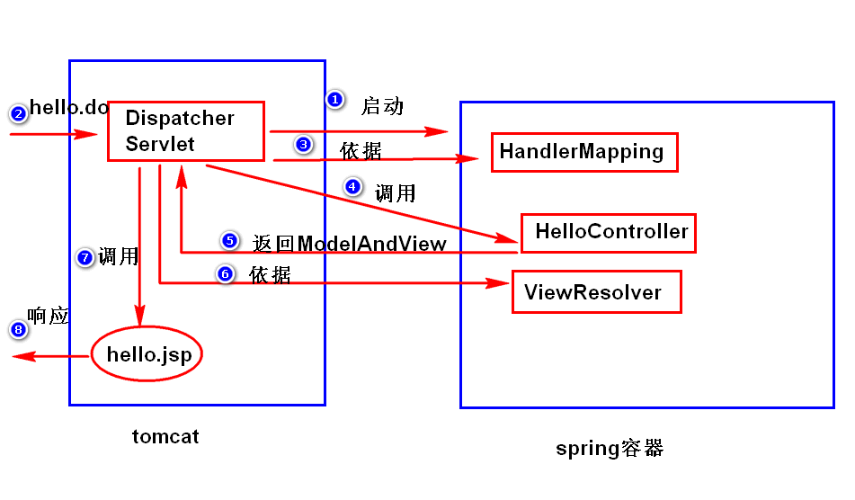

#### 1) web.xml

    <servlet>
        <description></description>
        <display-name>DispatcherServlet</display-name>
        <servlet-name>DispatcherServlet</servlet-name>
        <servlet-class>org.springframework.web.servlet.DispatcherServlet</servlet-class>
        <init-param>
            <description></description>
            <param-name>contextConfigLocation</param-name>
            <param-value>classpath:*.xml</param-value>
        </init-param>
        <load-on-startup>1</load-on-startup>
    </servlet>
    <servlet-mapping>
        <servlet-name>DispatcherServlet</servlet-name>
        <url-pattern>*.do</url-pattern>
    </servlet-mapping>


#### 2) controller

    ...
    import org.springframework.web.servlet.mvc.Controller;    
    
    public class HelloController implements Controller{
    
        @Override
        public ModelAndView handleRequest(HttpServletRequest arg0, HttpServletResponse arg1) 
                throws Exception {
    
            System.out.println("handleRequest()");
            /*
             * ModelAndView有两个常用构造器:
             * ModelAndView(String viewName)
             * ModelAndView(String viewName, Map data)
             * 注：
             *  viewName: 视图名
             *  data: 处理结果
             */
            return new ModelAndView("hello");
        }
    }

#### 3) hello.jsp

    <h1>hello spring mvc</h1>

#### 4) spring-mvc.xml

    <!-- 配置 HandlerMapping -->
    <bean class="org.springframework.web.servlet.handler.SimpleUrlHandlerMapping">
        <property name="mappings">
            <props>
                <!-- 指定访问名和与之对应的controllerBean -->
                <prop key="/hello.do">helloController</prop>
            </props>
        </property>
    </bean>
    
    <!-- 配置 Controller -->
    <bean id="helloController" class="controller.HelloController"/>
    
    <!-- 配置视图解析器 -->
    <bean class="org.springframework.web.servlet.view.InternalResourceViewResolver">
        <!-- 指定视图名对应的前缀 -->
        <property name="prefix" value="/WEB-INF/"/>
        <!-- 指定视图名对应的后缀 -->
        <property name="suffix" value=".jsp"/>
    </bean>

## 2. 基于注解的 Spring MVC 应用
### 2.1. 编程步骤

1. 导包 spring-webmvc
2. 添加配置文件。
3. 配置 DispatcherServlet。
4. 写 Controller。
5. 写 jsp。
6. 在配置文件当中，添加 ViewResolver 的配置, 组件扫描, 添加 mvc 注解扫描。
		

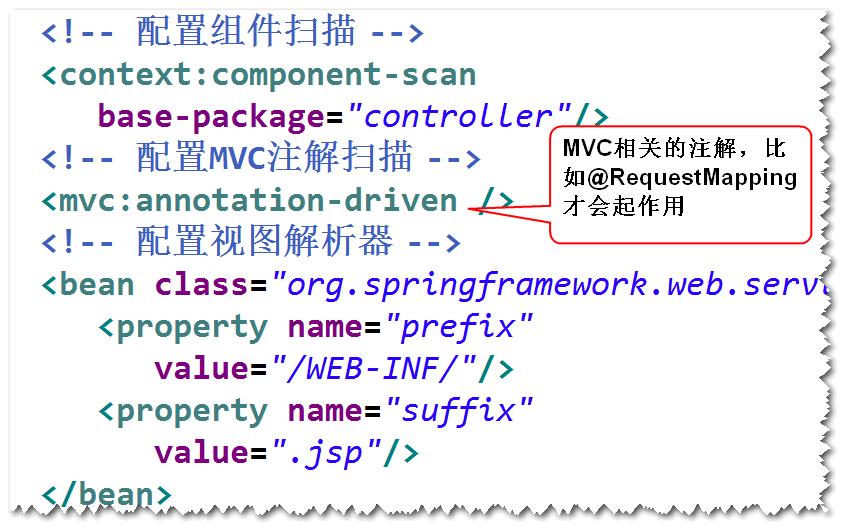

### 2.2. 使用注解编辑 Controller

处理器类

1. 不需要实现 Controller 接口
2. 可以添加多个方法, 处理多种请求
3. 返回值可以是 ModelAndView, 也可以是 String, 返回的 String 就是视图名
4. 使用 @Controller 注解, 则可使用组件扫描添加控制器
5. 方法名不作要求, 可以在方法前或类前添加 @RequestMapping 注解,
	相当于在xml 中配置 HandlerMapping
	类前的注解相当于模块名, 方法前的注解作为具体页面的访问路径

### 2.3. 案例: 注解 hello.do
#### 1) web.xml

    配置 dispatcherServlet, 同上, 略

#### 2) spring.xml

    <!-- 配置组件扫描, 启用 @Controller 注解, 不需在 xml 中配置 bean -->
    <context:component-scan base-package="controller" />
    
    <!-- 配置 MVC 注解扫描, 启用 @RequestMapping, 不需在 xml 中配置 HandlerMapping -->
    <mvc:annotation-driven />
    
    <!-- 配置视图解析器 -->
    <bean class="org.springframework.web.servlet.view.InternalResourceViewResolver">
        <property name="prefix" value="/WEB-INF/"/>
        <property name="suffix" value=".jsp"/>
    </bean>

#### 3) HelloController

    @Controller
    public class HelloController2{
        
        @RequestMapping("/hello.do")
        public String hello2(){
            System.out.println("这是我重新写的一个 hello.do");
            return "hello";
        }
    }

#### 4) hello.jsp

    <h1>hello spring mvc</h1>

# 三. 接收与发送数据
## 1. 接收请求参数
### 1.1. 传入请求对象 Request
DispatcherServlet调用处理器的方法之前, 会根据 Java 反射机制, 分析方法的结构.
如果方法规定了参数以及返回值, 则Spring 会自动注入相关参数. 
Spring 可以直接将 HttpServletRequest 对象作为参数注入到处理器类中, 
优点: 直接, 与传统方式操作类似
缺点: 从 request 对象获取参数后, 需要自行进行类型转换

	@RequestMapping("/login.do")
	public String login(HttpServletRequest request) {
		String adminCode = request.getParameter("adminCode");
		System.out.println("adminCode:" + adminCode);
		return "index";
	}

### 1.2. 传入请求参数 RequestParam
DispatcherServlet调用处理器的方法之前, 会根据 Java 反射机制, 分析方法的结构.
如果方法中定义了参数, 且与 requuest 对象传回的参数同名, 
Spring 会自动调用request对象的方法, 先获得其中的参数值, 然后赋给方法对应的形参。
如果方法参数与请求属性的名称不一致，要使用**@RequestParam** 注解, 以映射不一样的名称。
优点: 参数类型自动转换
缺点: 可能会出现类型转换异常
	如果参数太多, 则方法变得特别复杂, 实际中很少使用

> @RequestParam("请求参数名")

	@RequestMapping("/login2.do")
	public String login2(String adminCode, @RequestParam("pwd") String password) {
		System.out.println("login2()");
		System.out.println("adminCode:" + adminCode + " pwd:" + password);
		return "index";
	}

### 1.3. 封装成对象后传入
定义一个实体类 Bean, 用于封装参数值, Spring 自动将请求参数封装成对象
再将该类对象作为方法参数传入, 建议采用这种方式
**名称一致** : 该类中的成员属性, 要与网页的请求参数名一致
**自动转换** : 容器会自动将请求参数的字符串值转换为对应的类型, 可能会转换异常
**读写方法** : 该类要提供getter setter方法

	@RequestMapping("/login3.do")
	public String login3(AdminParam ap) {
		System.out.println("login3()");
		String adminCode = ap.getAdminCode();
		System.out.println("adminCode:" + adminCode);
		return "index";
	}

## 2. 向页面传值
当controller 组件处理请求后, 需要向 JSP 传递数据时, 可以采用以下方式
在满足需求的情况下, 应尽量选择生命周期短的, 以节约服务器资源

### 2.1. 使用 HttpServletRequest
默认情况下, DispatcherServlet 会使用转发进行页面的跳转, 地址不变, 
并将 request 对象传递给下一个页面, 下一个页面可以从中获取数据

	@RequestMapping("/login4.do")
	public String login4(AdminParam ap, HttpServletRequest req){
		System.out.println("访问login4, 参数绑定request后写出");
		String adminCode = ap.getAdminCode();
		req.setAttribute("admin", adminCode);
		return "index";
	}

### 2.2. 使用 ModelAndView 对象
在 Controller 处理方法完成后, 将模型数据封装到一个 Map 里,
再将模型数据 Map 与视图名一同打包, 返回一个 ModelAndView 对象 

	@RequestMapping("/login5.do")
	public ModelAndView login5(AdminParam ap) {
		System.out.println("login5()");
		String adminCode = ap.getAdminCode();
		
		// step1.将数据添加到Map对象里面
		Map<String, Object> data = new HashMap<String, Object>();
		
		// 相当于执行了request.setAttribute
		data.put("admin", adminCode);
		
		// step2. 将Map对象添加到ModelAndView
		ModelAndView mav = new ModelAndView("index", data);
		return mav;
	}

### 2.3. 使用 ModelMap 对象
在 Controller 处理方法中声明一个 ModelMap 参数, 容器会将该对象传入
可以给该 ModelMap 对象添加键值对数据, 从而传递给下一个页面

	@RequestMapping("/login6.do")
	public String login6(AdminParam ap, ModelMap mm) {
		System.out.println("login6()");
		String adminCode = ap.getAdminCode();
		// 相当于执行了request.setAttribute
		mm.addAttribute("adminCode", adminCode);
		return "index";
	}

### 2.4. 使用 HttpSession 对象
session 与 request 类似, 但存活时间更长.
可以在session 对象上绑定数据, 向页面传值

	@RequestMapping("/login7.do")
	public String login7(AdminParam ap, HttpSession session){
		System.out.println("login7, 使用 Session 传值");
		String adminCode = ap.getAdminCode();
		session.setAttribute("adminCode", adminCode);
		return "index";
	}

### 2.5. 使用 @ModelAttribute 注解
#### 1) 在传入参数前使用
如果在传入参数面前使用 @ModelAttribute 标注, 则该参数会被传递到下一个页面
但要求传入参数的页面, 与传出参数的页面, 两个页面对该参数的命名一致, 此条件不一定满足, 因而较少用

    @RequestMapping("/login11.do")
    public String login11(
                @ModelAttribute("adminCode") String admin,
                @RequestParam("pwd") String password){
            System.out.println("访问login6");
            System.out.println(admin +":"+ password);
            return "index";
    }

#### 2) 在 controller 的 bean 属性方法前使用
也可以在 controller 类中, 将bean 属性作为 modelAttribute 传递到下一个页面

    private String testMA= "test ModelAttribute";
    
    @ModelAttribute("testMA")
    public String getTestMA() {
        return testMA;
    }

### 2.6. 案例: BMI 指数计算
#### 1) 要求:
计算一个人的 BMI 指数
BMI = 体重(kg) / 身高(m) / 身高(m)
BMI < 19, 过轻; BMI > 24 过重; 否则正常
#### 2) 输入页面.jsp

	<body style="font-size:30px;">
		<form action="bmi.do" method="post">
			身高(m):<input type="text" name="height" /><br />
			体重(kg)):<input type="text" name="weight" /><br />
			<input type="submit" value="计算"/>
		</form>
	</body>

#### 3) Controller 代码

	@Controller
	public class BmiController {
		
		@RequestMapping("tobmi.do")
		public String tobmi(){
			System.out.println("访问 tobmi.do");
			return "bmi";
		}
		
		@RequestMapping("bmi.do")
		public String calbmi(BmiParam bp, ModelMap mm){
			double bmi = bp.getWeight()/bp.getHeight()/bp.getHeight();
			String status="正常";
			if(bmi<19){
				status="过轻";
			}
			if(bmi>24){
				status="过重";
			}
			mm.addAttribute("status", status);
			mm.addAttribute("bmi",bmi);
			return "view";
		}
	}

#### 4) 响应页面.jsp

	<body>
		<h2>result</h2>
		<p>你的BMI指数的是,${bmi} ,属于:${status }</p>
	</body>

## 3. 重定向视图
### 3.1. 使用 String 重定向
返回值是字符串时, 视图解析器默认会根据这个字符串解析要以**转发方式**访问的页面. 
若想以**重定向**的方式跳转, 则要返回特殊的字符串:

> return "redirect:重定向地址"

### 3.2. 使用 ModelAndView 重定向
若处理器方法的返回值是 ModelAndView, 需要先创建一个 RedirectView 类的对象, 
再根据这个对象创建新的 ModelAndView, 从而实现重定向.
这种方法比较麻烦, 实际中较少使用.

> RedirectView rv = new RedirectView('重定向地址');
> return new ModelAndView(rv);

## 4. 中文乱码问题
### 4.1. 乱码原因
- 在表单提交时, 对于中文等非 ASCII 字符, 浏览器会根据当前页面的编码方式, 对表单数据进行编码
- 而服务器默认采用 ISO-8859-1 进行解码, 若不进行编码方式声明, 则会出现乱码

### 4.2. 解决方式
- 此前解决中文乱码时, 在servlet中添加了 request 的编码方式声明.
  而在 Spring 框架中, request 已由容器采用默认编码方式声明, 用户不易自行修改
- Springmvc 提供了一个过滤器(CharacterEncodingFilter), 只需要配置该过滤器即可解决表单中文乱码。

	1. 表单数据以 post 方式提交
	2. 在 web.xml 中配置 CharacterEncodingFilter 过滤器
	3. 过滤器的编码方式, 要与表单页面编码保持一致 

			<filter>
				<filter-name> encodingFilter </filter-name>
				<filter-class>
					org.springframework.web.filter.CharacterEncodingFilter
				</filter-class>
				<!-- 配置采用的编码方式 -->
				<init-param>
					<param-name> encoding </param-name>
					<param-value> UTF-8 </param-value>
				</init-param>
			</filter>
			<!-- 配置要过滤的页面请求 -->
			<filter-mapping>
				<filter-name> encodingFilter </ filter-name>
				<url-pattern> /* </url-pattern>
			</filter-mapping>

# 四. 高级应用
## 1. 异常处理

### 1.1. Spring 处理异常
默认情况下, Spring 框架会将异常输出放到浏览器, 直接抛给最终用户
#### 1) 配置简单异常处理器
org.springframework.web.servlet.handler.**SimpleMappingExceptionResolver**
Spring 捕获到了指定的异常, 就跳转到指定的页面
直接跳转到新页面, 不能执行复杂的操作, 只适合简单的异常处理
在 Spring-mvc.xml文件中配置简单异常处理器

	<bean class="包名.SimpleMappingExceptionResolver">
		<property name="异常映射名">
			<props>
				<prop key="异常类型">视图名</prop>
			</props>
		</property>
	</bean>

#### 2) 自定义异常处理方法
定义一个方法, 添加 @ExceptionHandler 注解
在方法内定义异常处理逻辑
该方法只处理所在类抛出的异常, 不处理其他类的异常

	@ExceptionHandler
	//这是一个异常处理方法, 参数 e 是处理器方法所抛出的异常
	public String HandleEx(Exception e, HttpServletRequest request){
		System.out.println("这是一个异常处理方法");
		if(e instanceof NumberFormatException){
			e.printStackTrace();
			System.out.println("哟, 数字格式化异常啊");
			request.setAttribute("msg", "亲, 请输入正确的数字");
			System.out.println("想干什么干什么");
			return "error3";
		}
		if (e instanceof StringIndexOutOfBoundsException){
			e.printStackTrace();
			System.out.println("哟, 下标越界异常啊");
			request.setAttribute("msg", "亲, 你的下标越界了哟");
			System.out.println("想干什么干什么");
			return "error3";
		}
		return "error";
	}

### 1.2. 扩展, 异常处理原则
1. 记录日志, 通常保存到日志文件
2. 看异常能否恢复, 如果能够恢复, 则立刻恢复
如果不能恢复, 如数据库服务暂停, 网络中断,
这样的异常一般称为系统异常, 提示用户稍后重试

底层的异常不可抛出给最终用户

1. 用户体验不好
2. 异常信息会给黑客提供分析漏洞的材料, 带来安全风险

### 1.3. 扩展, 自定义异常类
通常使用 RumtimeException 作为父类
创建两个构造器, 一个无参构造, 一个字符串参数构造

## 2. 拦截器
### 2.1. 什么是拦截器
DispatcherServlet 收到请求之后，如果有拦截器，会先调用拦截器，然后再调用 Controller。
Spring 的 HandlerMapping 处理器支持拦截器应用.
过滤器是 servlet 规范, 拦截器是 Spring 框架的组件.


### 2.2. 拦截器接口
拦截器必须实现 HandlerInterceptor 接口, 实现三个方法;
如果只使用其中一个方法, 可以继承 HandlerInterceptorAdaptor 类;
#### 1) preHandle()
- 前处理, 执行处理器之前被调用
- DispatcherServlet 收到请求后, 如果有拦截器, 会先调用拦截器, 满足条件后再放行, 继续调用Control 处理器. 否则流程中止, 不再执行后续操作.
- DispatcherServlet, 拦截器, controller 会共享request 和response

	- 返回 true 表示会继续调用其他拦截器和处理器	
	- 返回 false 表示中断流程, 不再执行后续拦截器和处理器

案例:

	public boolean preHandle(HttpServletRequest request, 
	        HttpServletResponse response, Object handler)
	        throws Exception {
	    System.out.println("前处理方法");
	    return true;
	}

#### 2) postHandle()
- 处理器执行后, 视图处理前调用
- controller 处理器已执行完, 正准备将 ModelAndView 返回给 DispatcherServlet 时调用
- 此时可以通过 ModelAndView 对象, 对模型数据或视图进行处理

    public void postHandle(HttpServletRequest request, HttpServletResponse response, Object handler,
			ModelAndView modelAndView) throws Exception {
		System.out.println("后处理方法");
	}

#### 3) afterCompletion()
整个请求处理完毕后调用, 如性能监控等
只有在 preHandle 方法返回 true 时才会执行

	public void afterCompletion(HttpServletRequest request, HttpServletResponse response, Object handler, Exception ex)
			throws Exception {
		System.out.println("最后的方法");
	}

### 2.3. 拦截器的使用
1. 写一个java类, 实现 HandlerInterceptor 接口
2. 在接口方法里, 实现拦截处理逻辑
3. 配置拦截器
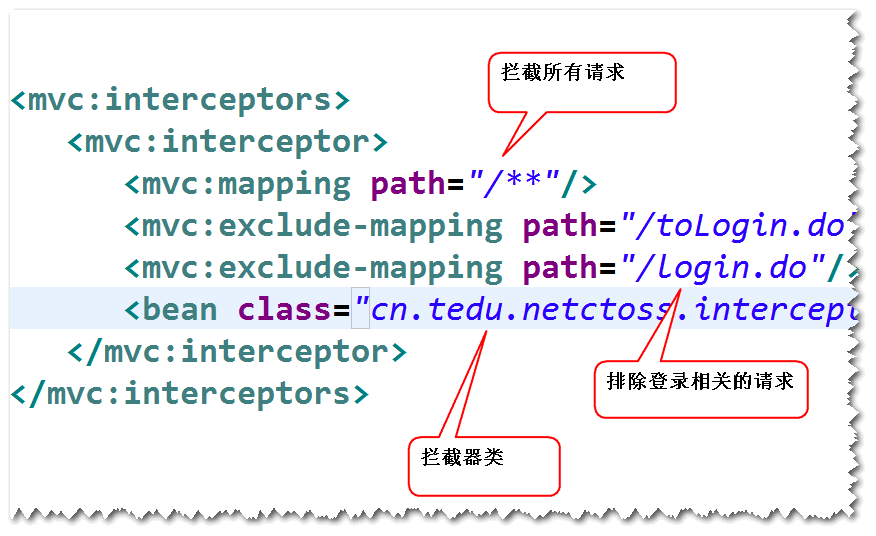

## 3. Spring JDBC ?
### 3.1. SpringJdbc

Spring 框架对 jdbc 的封装。

### 3.2. 基本应用

1. 导包
	
		spring-webmvc, spring-jdbc, ojdbc, dbcp, junit。

2. 添加 spring 配置文件, 配置连接池, 组件扫描。

        <!-- 读取db.properties文件 -->
        <util:properties id="db" location="classpath:db.properties"/>
        
        <!-- 配置连接池 -->
        <bean id="ds" class="org.apache.commons.dbcp.BasicDataSource"       
               destroy-method="close">       
        	  <property name="driverClassName" value="#{db.driver}" />      
        	  <property name="url"  value="#{db.url}" />      
        	  <property name="username" value="#{db.user}" />      
        	  <property name="password" value="#{db.pwd}" />      
        </bean> 
        
        <!-- 配置组件扫描 -->
        <context:component-scan base-package="dao" />

3. 配置 JdbcTemplate。

    	<!-- 配置JDBC_Template -->
        	<bean id="jt" class="org.springframework.jdbc.core.JdbcTemplate" >
        		<property name="dataSource" ref="ds" />
        	</bean>


	注：JdbcTemplate把一些重复性的代码（比如获取连接，关闭连接，异常处理等等都写好了），我们只需要调用该对象的方法就可以很方便的访问数据库。
	
	

4. 调用 JdbcTemplate 的方法来访问数据库。
	注：通常将JdbcTemplate注入到DAO。

    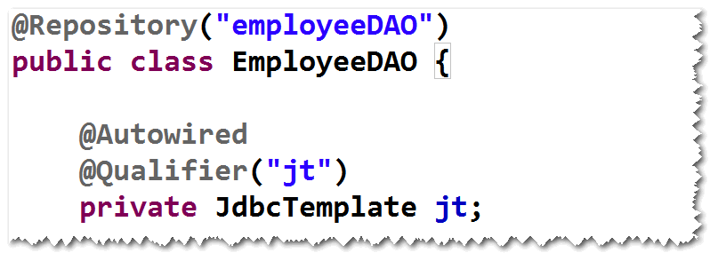


### 3.3. 案例: 查询员工表
#### 1) 创建数据表

	create table t_emp(
		id number(8) primary key,
		name varchar2(20),
		age number(3)
	);
	create sequence t_emp_seq;
	
	create table tt_dept(
	  id number(8) primary key,
	  deptname varchar2(20),
	  addr varchar2(50)
	);
	create sequence t_dept_seq;

#### 2) 创建 DAO 类

    @Repository("employeeDao")
    public class EmployeeDao {
    	//可以用自动装配
    	//@Autowired
    	//@Qualifier("jt")
    	
    	//也可以用Resource 
    	//来自 JavaEE, 可以手动导入 javax.annotation-api 包
    	@Resource(name="jt")
    	private JdbcTemplate jt;
    	
    	public void save(Employee e){
    		String sql= "insert into t_emp values(t_emp_seq.nextval,?,?)";
    		Object[] args ={e.getName(),e.getAge()};
    		jt.update(sql,args);
    	}
    	
    	public List<Employee> findAll(){
    		String sql = "select * from t_emp";
    		return jt.query(sql, new EmpRowMapper());
    	}
    	
    	public Employee findById(int id){
    		String sql = "select * from t_emp where id=?";
    		Object[] args = {id};
    		Employee emp = null;
    		try{
    			emp = jt.queryForObject(sql, args,new EmpRowMapper());
    		}catch (EmptyResultDataAccessException e){
    			return null;
    		}
    		return emp;
    	}
    	
    	public void modify(Employee e){
    		String sql = "update t_emp set name=?,age=? where id=?";
    		Object[] args = {e.getName(),e.getAge(),e.getId()};
    		jt.update(sql,args);
    	}
    	
    	public void delete(int id){
    		String sql = "delete from t_emp where id=?";
    		Object[] args = {id};
    		jt.update(sql,args);
    	}
    	
    	//封装了对ResultSet的处理
    	class EmpRowMapper implements RowMapper<Employee> {
    		/*
    		 * 告jdbcTemplate, 如何将一条记录转换成一个实体对象
    		 * index: 正在被处理的记录的下标
    		 */
    		public Employee mapRow(ResultSet rs, int rowNum) throws SQLException {
    			Employee e = new Employee();
    			e.setId(rs.getInt("id"));
    			e.setName(rs.getString("name"));
    			e.setAge(rs.getInt("age"));
    			return e;
    		}
    	}
    }
#### 3) 创建实体类

    public class Employee implements Serializable{
    
    	private static final long serialVersionUID = 5272466894454999383L;
    
        // getter, setter, toString 此处省略
    }

#### 4) 创建测试类

    @SuppressWarnings("resource")
    public class TestCase {
    	private EmployeeDao dao;
    	
    	@Before 
    	//运行@test测试方法前, 会先执行@Before的方法, 完成准备工作
    	public void init(){
    		String config = "spring-JDBC.xml";
    		ApplicationContext ac = new ClassPathXmlApplicationContext(config);
    		dao = ac.getBean("employeeDao",EmployeeDao.class);
    	}
    	
    	@Test	// 新增记录
    	public void test1(){
    		Employee e = new Employee();
    		e.setName("巢皮");
    		e.setAge(30);
    		dao.save(e);
    	}
    	
    	@Test // 查询所有
    	public void test2(){
    		List<Employee> emps = dao.findAll();
    		System.out.println(emps);
    	}
    	
    	@Test // 查询一个
    	public void test3(){
    		Employee emp = dao.findById(10);
    		System.out.println(emp);
    	}
    	
    	@Test // 修改记录
    	public void test4(){
    		Employee emp = dao.findById(1);
    		System.out.println(emp);
    		emp.setName("熊坡");
    		emp.setAge(25);
    		dao.modify(emp);
    		emp = dao.findById(1);
    		System.out.println(emp);
    	}
    	
    	@Test // 删除一个
    	public void test5(){
    		Employee emp = dao.findById(1);
    		System.out.println(emp);
    		dao.delete(1);
    		emp = dao.findById(1);
    		System.out.println(emp);
    	}
    }

ps.导包失败后, 在pom.xml将相关信息删除, 并在以下目录删除该包, 再重新导包
C:\Users\Administrator\.m2\repository

# █ 第三部分 MyBatis

# 一. MyBatis 简介
## 1. 数据库访问框架
### 1.1. JDBC
- 优点: 性能高, 易掌握
- 缺点: sql语句编写复杂

### 1.2. Hibernate
- 优点:

	- 当年 Giving King 在工作中为了简化 sql 的编写工作而开发的框架, 
	- 在业务简单场合能大大提高效率, 代码简洁

- 缺点:

	- 比 jdbc 难学, 不容易掌握
	- 性能不好, 它是对jdbc的封装, 间接地访问数据库
	- 当业务复杂时, 框架生成的 sql 语句特别冗长, 效率很低

### 1.3. Mybatis
- 优点: 代码简洁, 容易掌握, 效率不低
- 缺点: 要手动写sql, 性能一般

## 2. Mybatis 简介

### 2.1. 概述
- Apache 的 iBatis -> Google 的 MyBatis -> Github 维护
- 开源的持久层框架, 底层仍然是 jdbc, 支持普通 SQL 查询, 存储过程和高级映射
- 封装了几乎所有的 JDBC 代码和参数的手工设置, 以及结果集的检索
- 使用简单的 xml 或注解来配置和定义映射关系
- 将 Java 的POJOs( Plain Old Java Objects )映射成数据库中的记录

### 2.2. 编程步骤
1. **导依赖的包**: MyBatis 3.2.8, ojdbc14 10.2.0.4, junit 4.1.2
2. **写配置文件**: 指定连接池的配置和映射文件的位置, 一般放 resource 目录下
3. **编写实体类**: 实体类的属性名与表的字段名要一致, 忽略大小写
4. **写映射文件**: 指定 ID, 类名, sql语句
5. **访问数据库**: 调用 SqlSession 对象提供的方法来访问数据库

## 3. MyBatis体系结构
### 3.1. 加载配置
可以采用 xml 配置文件, 或是 Java 代码的注解
MyBatis 将 SQL 的配置信息加载成 MappedStatement 对象
包括传入参数映射配置, 执行的 SQL 语句, 结果映射配置, 并将其存储在内存中

### 3.2. SQL 解析

### 3.3. SQL 执行
### 3.4. 结果映射
### 3.5. 工作原理

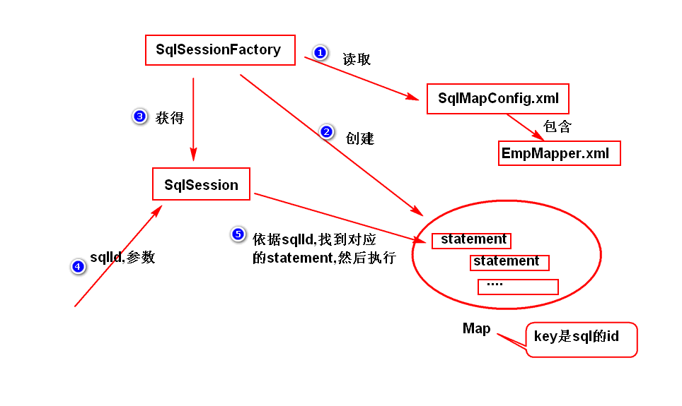	

1. 先创建 SqlSessionFactory , 读取配置文件与映射文件中的参数信息
2. 创建预编译 Sql 语句的 PreparedStatement, 并存入 Map 中, 其中以 ID 为 key  
3. 创建 SqlSession, 准备执行 sql 语句
4. 获取 sql 语句的 ID 和参数
5. 依据 ID 找到对应的 PS, 然后执行 

## 4. MyBatis配置文件
### 4.1. 主配置文件
- SqlMapConfig.xml
- 主要的配置文件, 用于指定数据连接参数和框架参数
- 通常存放在 /项目名/src/main/resources/SqlMapConfig.xml
- 主要内容有两部分: 数据库连接参数, 映射文件
	
#### 1) 配置连接池参数
- 主要配置连接池等数据库连接参数

    >　　< environments default="environment">
    >　　　　< environment id="environment">
    >　　　　　　< transactionManager type="JDBC" />
    >　　　　　　　　**< dataSource type="POOLED">**
    >　　　　　　　　　　< property name="driver" value="**数据库驱动**" />
    >　　　　　　　　　　< property name="url" value="**连接路径**" />
    >　　　　　　　　　　< property name="username" value="**用户名**" />
    >　　　　　　　　　　< property name="password" value="**密码**" />
    >　　　　　　　　**< /dataSource>**
    >　　　　< /environment>
    >　　< /environments>

#### 2) 实体映射文件
- 告诉系统, 实体映射文件的路径

    > **< mappers>**
    > 　　　　< mapper resource="**包名/映射配置文件1.xml**" />
    > 　　　　< mapper resource="**包名/映射配置文件2.xml**" />
    > **< /mappers>**

### 4.2. 映射文件 ( SQL )
#### 1) 预编译的 Statement
- 映射文件中, 根据 SQL 语句配置预编译的 Statement

	> < mapper namespace="命名空间?" >	
	> 　　具体的sql映射
	> < /mapper＞
  
#### 2) 使用 Mybatis 表达式
- 在 mapper 标签之下, 是各种类型的具体映射, 
- 指定参数类型为实体类时, 需要调用实体类的 get 方法获取具体参数值, 此时 MyBatis 表达式要与实体类属性同名, 并与数据库字段名相同

	> ＃{ 实体类属性名 }

- 指定参数类型为基本类型时, 参数直接从方法获取, MyBatis 表达式中不要求与实体类属性同名

	> ＃{ 任意参数名 }

    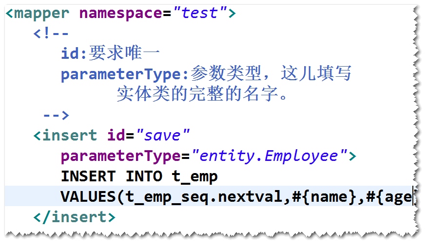

#### 3) 使用具体 sql 语句

- 插入

	> < **insert** id="ID名" parameterType="包名.类名>
	> 　　INSERT 语句　
	> < /insert>

- 修改

	> < **update** id="ID名" parameterType="包名.类名>
	> 　　UPDATE 语句　
	> < /update>

- 查询全部

	> < **select** id="findAll" resultType="结果集实体类型">
	> 　　SELECT 语句
	> < /select>

- 条件查询

	> < **select** id="findById" parameterType="int" resultType="entity.Employee">
	> 　　SELECT 语句
	> < /select>

- 删除记录

	> < **delete** id="delete" parameterType="int">
	> 　　DELETE 语句
	> < /delete>


## 5. 执行方法
### 1) 先创建 SqlSession
String config = "SqlMapConfig.xml";
		SqlSessionFactoryBuilder ssfb = new SqlSessionFactoryBuilder();
		SqlSessionFactory ssf = ssfb.build(TestDAO.class.getClassLoader().getResourceAsStream(config));
		session = ssf.openSession();

### 2) 执行 session 提供的方法

- 查询
> session.selectList("")
> session.selectOne("",args)

- 添加
> session.insert()

- 修改
> session.update()

- 删除
> session.delete()

### 3) 提交事务并归还连接

>    session.commit();
>    session.close();

## 6. 返回 Map 类型结果集
Mabatis 可以将一条记录中的数据存放到一个 Map 对象里, 
以字段名为 key, 以字段值为 value
然后再从 map 中取数据, 封装到对应的实体对象里去


优点: 不用编写实体类, 对于字段数量太多的表较为方便
缺点: 要调用 Map 提供的 get 方法获取值

## 7. 解决字段名与实体类的属性名不一致
### 7.1. 方式一  使用别名。(就是让别名与属性名一样)。
### 7.2. 方式二  使用resultMap解决。

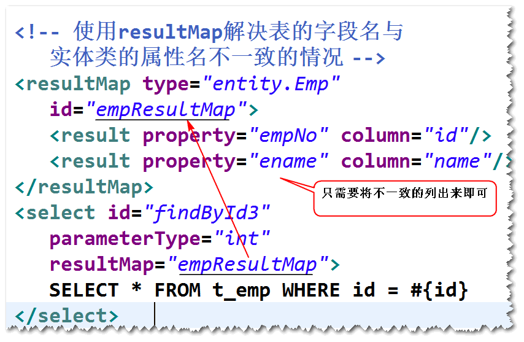	

# 二. 使用 Mapper 映射器

## 1. 什么是 Mapper 映射器
映射器, 就是一个符合映射文件的要求的接口.
获取该映射器的实例后, 根据其方法找到对应的映射关系, 从而执行 sql 操作

- 接口名通常被用作映射文件的命名空间
- 其中的抽象方法, 根据映射文件的具体关系决定:

	- 方法名 = 映射ID, 
	- 方法参数 = 映射参数 parameterType
	- 方法返回值 = 映射返回值 resultType

## 2. 使用方法
1. 创建一个接口, 作为 Mapper 映射器
2. 创建映射文件( xml ), 命名空间为 Mapper 映射器的名字
3. 在映射文件中建立映射关系, 指定id, 参数类型, 返回值类型
4. 在 Mapper 映射器接口中, 添加与映射文件对应的抽象方法
5. 在业务层, 从 SQLSession 中获取映射器的实例

  > sqlsession.getMapper(映射器.class)

6. 通过映射器实例, 调用方法实现 sql 操作

## 3. 案例.

### 3.1. Mapper 映射文件

	<mapper namespace="dao.EmployeeDAO">
		
		<insert id="save" parameterType="entity.Employee">
			INSERT INTO t_emp VALUES(t_emp_seq.nextval,#{name},#{age})
		</insert>
		
		<select id="findAll" resultType="entity.Employee">
			SELECT * FROM t_emp
		</select>
		
		<select id="findById" parameterType="int" resultType="entity.Employee">
			SELECT * FROM t_emp where id=#{id1}
		</select>
		
		<update id="modify" parameterType="entity.Employee">
			UPDATE t_emp SET name=#{name}, age=#{age} where id=#{id}
		</update>
		
		<delete id="delete" parameterType="int">
			DELETE FROM T_EMP WHERE ID=#{sd}
		</delete>
		
		<select id="findById2" parameterType="int" resultType="map">
			SELECT * FROM t_emp where id=#{id}
		</select>
		
		<resultMap type="entity.Emp" id="empResultMap">
			<result property="empNo" column="id"/>
			<result property="ename" column="name"/>
		</resultMap>
		
		<select id="findById3" parameterType="int" resultMap="empResultMap">
			SELECT * FROM t_emp WHERE id=#{id}
		</select>
	</mapper>

### 3.2. Mapper 映射器接口

	public interface EmployeeDAO {
		public void save(Employee e);
		public List<Employee> findAll();
		public Employee findById(int id);
		public void modify(Employee e);
		public void delete(int id);
		public Map findById2(int id);
		public Emp findById3(int id);
	}

### 3.3. 业务层测试类

	public class TestDAO {
		
		private SqlSession session;
		private EmployeeDAO dao;
		
		@Before
		public void init(){
			String config = "SqlMapConfig.xml";
			SqlSessionFactoryBuilder ssfb = new SqlSessionFactoryBuilder();
			SqlSessionFactory ssf = ssfb.build(TestDAO.class.getClassLoader().getResourceAsStream(config));
			session = ssf.openSession();
			//MyBatis 会返回一个符合Mapper 映射器要求的对象
			dao = session.getMapper(EmployeeDAO.class);
		}
		
		@Test	//添加
		public void test1(){
			Employee e = new Employee();
			e.setName("王自如");
			e.setAge(30);
			dao.save(e);
			session.commit();
			session.close();
		}
		
		@Test	//查询全部
		public void test2(){
			List<Employee> emps = dao.findAll();
			System.out.println(emps);
			session.close();
		}
		
		@Test	//根据id查询
		public void test3(){
			Employee e = dao.findById(21);
			System.out.println(e);
			session.close();
		}
		
		@Test	//修改
		public void test4(){
			Employee e = dao.findById(21);
			System.out.println(e);
			e.setName("王自健");
			dao.modify(e);
			e = dao.findById(21);
			System.out.println(e);
			session.close();
		}
		
		@Test	//删除
		public void test5(){
			Employee e = dao.findById(21);
			System.out.println(e);
			dao.delete(21);
			e = dao.findById(21);
			System.out.println(e);
			session.close();
		}
		
		@Test	//根据id查询, 返回Map
		public void test6(){
			Map e = dao.findById2(21);
			System.out.println(e);
			session.close();
		}
		
		@Test	//根据id查询, 利用别名
		public void test7(){
			Emp e = dao.findById3(21);
			System.out.println(e);
			session.close();
		}
	}

# 三. Spring 集成 MyBatis
## 1. 方式一, 使用 MapperScannerConfigurer
### 1.1. 编程步骤

1. 导入依赖包 
	
		spring-webmvc,mybatis,mybatis-spring,
		dbcp,ojdbc,spring-jdbc,junit。

    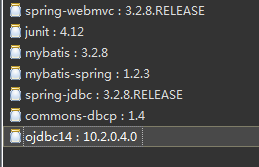

2. 添加 spring 配置文件。
    **注**：不再需要 MyBatis 的配置文件,可以在 spring 的配置文件里面添加 SqlSessionFactoryBean 来代替。

    	<!-- 读取db.properties文件 -->
    	<util:properties id="db" location="classpath:db.properties"/>
    	
    	<!-- 配置连接池 -->
    	<bean id="ds" class="org.apache.commons.dbcp.BasicDataSource" destroy-method="close">
    	    <property name="driverClassName" value="#{db.driver}" />      
    	    <property name="url" value="#{db.url}" />      
    	    <property name="username" value="#{db.user}" />      
    	    <property name="password" value="#{db.pwd}" />      
    	</bean>
		
    	<!-- 配置 SqlSessionFactoryBean, 替代 MyBatis 配置文件, 提供连接池等参数 -->
    	<bean id="ssfb" class="org.mybatis.spring.SqlSessionFactoryBean" >
    	    <!-- 指定连接资源 -->
    	    <property name="dataSource" ref="ds" />
    	    <!-- 指定映射文件 -->
    	    <property name="mapperLocations" value="classpath:entity/*.xml"></property>
    	</bean>
    
3. 实体类, 用来封装数据库查询结果
4. 实体映射文件, xml 文件, 指定了 SQL Id 以及对应的 SQL 语句, **其命名空间为 Mapper 映射器的"包名.类名"**
5. Mapper 映射器, 即接口, 提供了与映射文件对应的抽象方法, **其命名要与实体映射文件的命名空间一致**
6. 配置 MapperScannerConfigurer
    **注**：该 bean 会扫描指定包及其子包下的所有 Mapper 映射器(即接口), 然后调用 getMapper 方法获得映射器的实现
    比如, 调用 EmployeeDAO dao = SqlSession.getMapper(EmployeeDAO.class)
    并且, 将这些对象添加到 Spring 容器里面(默认的 id 是首字母小写之后的接口名，可以使用 @Repository 重命名)。

        <!-- 配置mapperScannerConfigure -->
        <bean class="org.mybatis.spring.mapper.MapperScannerConfigurer">
            <!-- 注入映射器所在的包名 -->
            <property name="basePackage" value="dao" />
        </bean>

### 1.2. 只扫描特定的接口。
1. 开发一个注解。

	> public @interface 自定义注解{}

2. 将该注解添加到需要扫描的接口之上。
	
	> @Repository
	> @自定义注解
	> public interface Mapper映射器接口{}

3. 修改MapperScannerConfigurer的配置, 增加 **annotationClass** 属性
    只扫描带有指定注解的接口  
    如果有该项属性, 则只扫描包内带特定注解的接口
    如果没有该属性, 则扫描并注册包内的所有接口;

	> 	< !-- Mapper接口组件扫描 -->
	> 	< bean class="org.mybatis.spring.mapper.MapperScannerConfigurer">
	> 	　　< property name="basePackage" value="cn.tedu.note.dao"/>
	> 	　　**< property name="annotationClass" value="annotations.自定义注解"/>**
	> 	< /bean>

## 2. 方式二, 使用 SqlSessionTemplate (了解)

### 2.1. 集成步骤
其中前3步与方式一完全一样

1. 导包。

        spring-webmvc,mybatis,mybatis-spring,
        dbcp,ojdbc,spring-jdbc,junit。

2. 添加spring配置文件。
    注：不再需要 MyBatis 的配置文件,可以在 spring 的配置文件里面添加 SqlSessionFactoryBean 来代替。

3. 实体类, 用来封装数据库查询结果
4. 映射文件, xml 文件, 指定了 SQL ID 以及对应的 SQL 语句
	注：namespace不再要求等于接口名, 但仍需指定一个唯一的命名空间
    因为在 Mapper 映射器的实现类中, 调用 sst 的方法时指定了对应 sql 语句的路径(命名空间.ID)
5. Mapper 映射器, 即接口, 提供了与映射文件对应的抽象方法
	注：接口方法没有特定要求
6. 写一个 Mapper 映射器的实现类
	注：可以注入SqlSessionTemplate。
    调用方法时, 需要指定 sql 语句的路径(命名空间.ID)    

    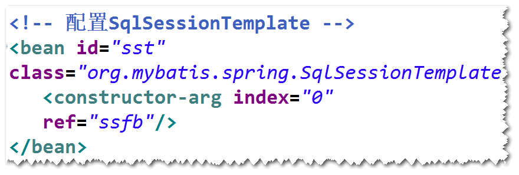	
    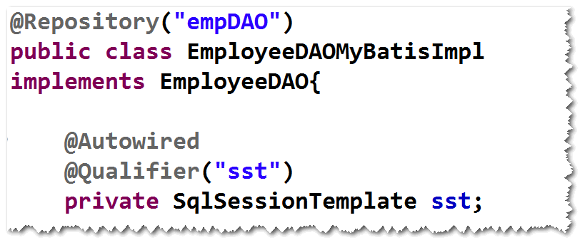

## 3. 案例: 使用 Spring 集成 MyBatis 的方式重写 AdminDAO
	step1. 导包
		需要添加 mybatis,mybatis-spring,spring-jdbc
	step2. 在配置文件当中，添加
		SqlSessionFactoryBean
	step3. 实体类Admin 
		要注意属性与表的字段名不一样，建议用别名解决
	step4. 映射文件
		AdminMapper.xml
			namespace="cn.tedu.netctoss.dao.AdminDAO"
		<select id="findByAdminCode" 
			parameterType="java.lang.String"
			resultType="cn.tedu.netctoss.entity.Admin">
			SELECT ...
		</select>
	step5. Mapper映射器 (AdminDAO)
		不用写了 
	step6. 配置MapperScannerConfigurer 
	step7. 测试 AdminDAO	
