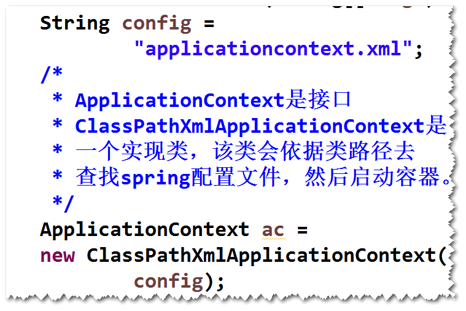
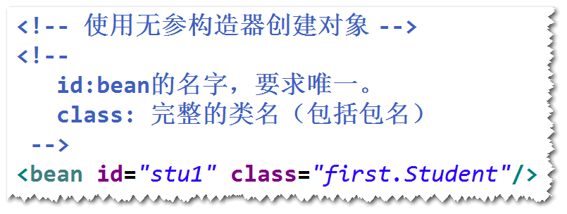
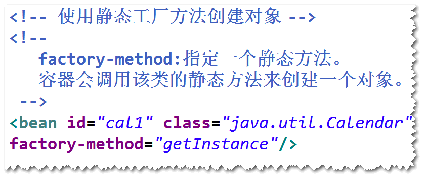
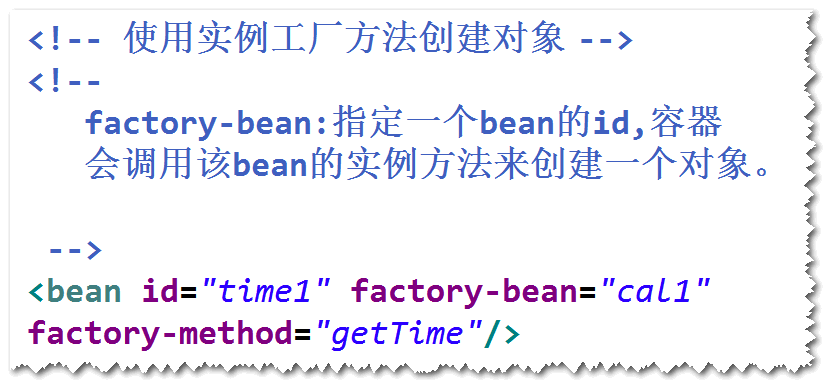
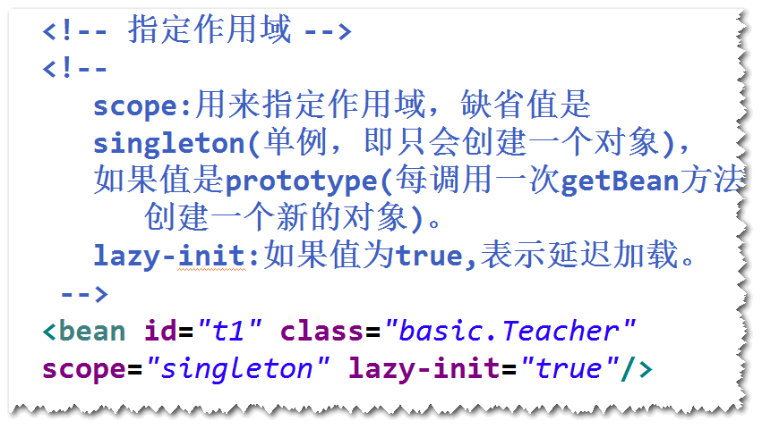
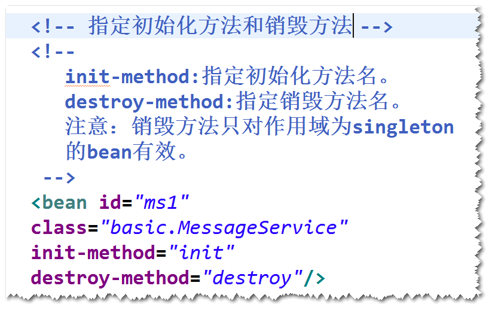

# 1. Spring是什么?
	开源的，用来简化企业级应用开发的应用开发框架。
## (1)简化开发
	Spring对常用的api（比如jdbc）	做了封装，这样，可以大大简化
	这些api的使用。（比如使用springjdbc访问数据库，就不用考虑如何
	获取连接和关闭连接了）。
## (2)解耦
	Spring帮我们建立对象之间的依赖关系，这样，对象之间的耦合度
	会大大降低，代码的维护性会大大提高。
## (3)集成其它框架
	Spring可以将其它的一些框架集成进来(比如用于定时任务处理的Quartz  等),方便这些框架的使用。

# 2.Spring容器
## (1)什么是Spring容器?
	Spring框架中的一个核心模块，用于管理对象。
## (2)启动Spring容器
	step1.导包。
	spring-webmvc
	step2. 添加spring配置文件。
	step3. 启动容器。

## (3)创建对象
	1)方式一  无参构造器
		step1. 为类添加无参构造器（或者缺省构造器）
		step2. 在配置文件里面，添加bean元素。
			注：bean就是容器所创建的对象。
		step3. 启动容器，调用容器的getBean方法。

	2）方式二  静态工厂方法 (了解)

	3) 方式三  实例工厂方法（了解）	

## (4)作用域
	1）默认情况下，容器对于每个bean元素，只会创建一个实例。
	2) 如果将作用域设置为"prototype"，则每调用一次getBean方法，
	就会创建一个新的实例。

## (5)延迟加载 (了解)
	1)默认情况下，容器启动之后，会将作用域为"singleton"的bean
	创建好。
	2)延迟加载指的是，容器启动之后，对作用域为"singleton"的bean
	不再创建，直到调用了getBean方法才会创建。

## (6)生命周期
	1)初始化方法
	 容器创建好bean的实例之后，会立即调用初始化方法。
	2)销毁方法
	容器关闭之前，会调用销毁方法。

			
			
	  
		

	
		
	
