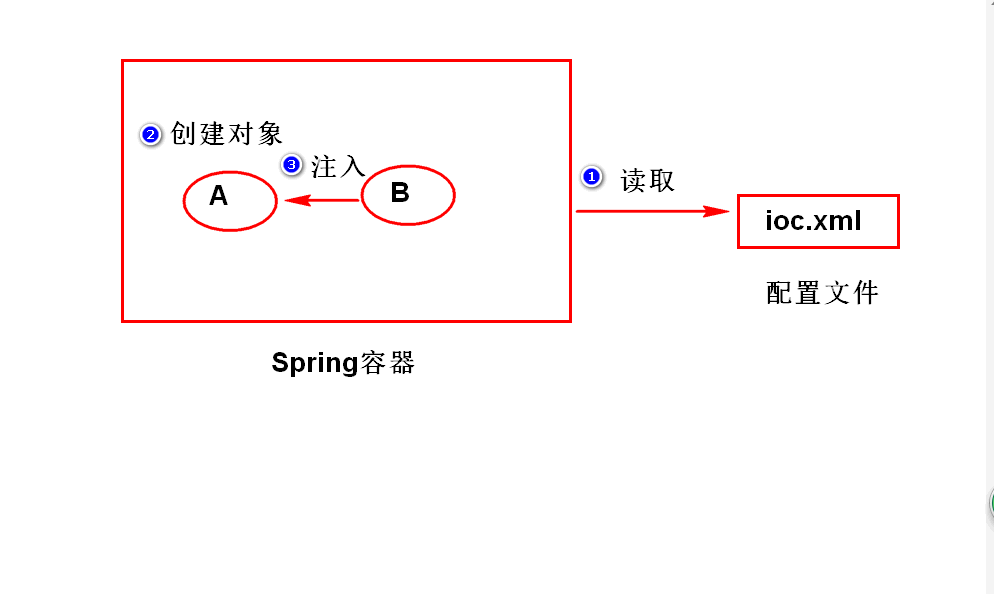
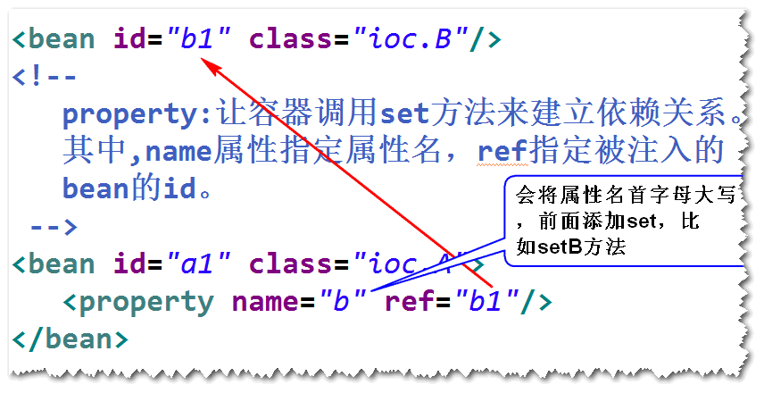
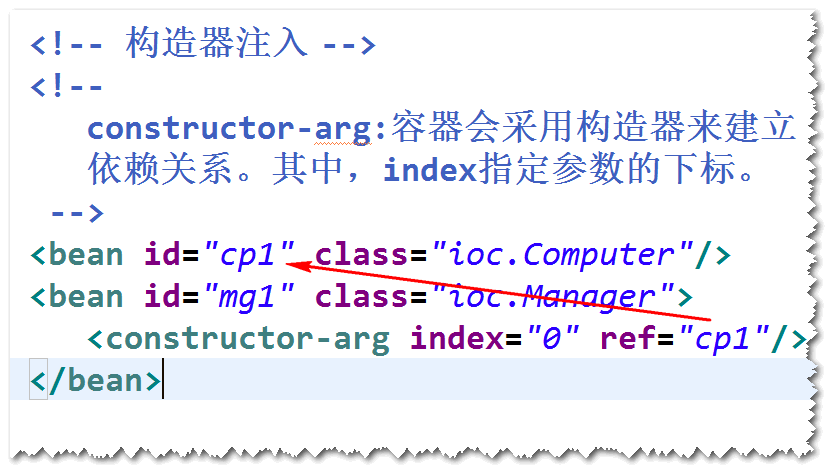
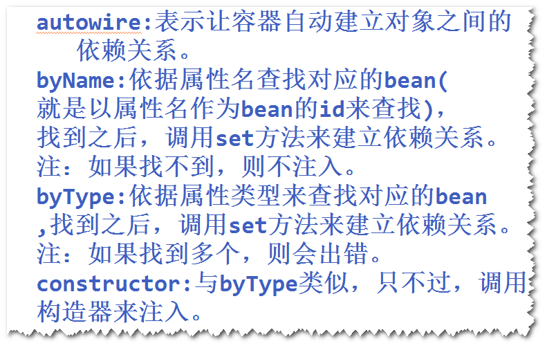
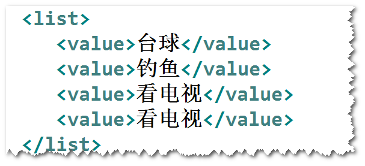
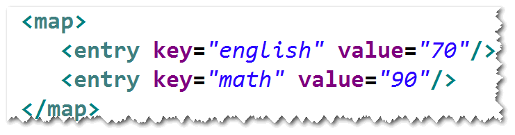
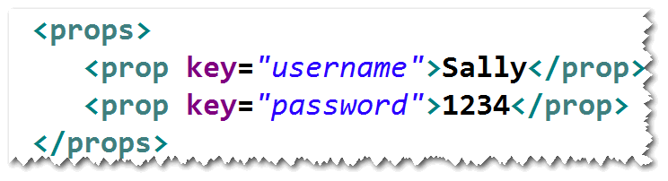
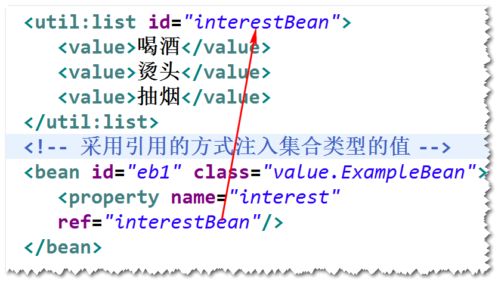

# 1. IOC/DI
## (1)什么是IOC(Inversion Of Controll 控制反转) 
	对象之间的依赖关系由容器来建立。
## (2)什么是DI(Dependency Injection 依赖注入
	容器可以通过调用set方法或者构造器来建立对象之间的依赖关系。
	注：
		IOC是目标，DI是手段。

## (3)依赖注入的两种方式
	1)方式一  set方法注入
	step1. 添加set方法
	step2. 在配置文件中，使用<property>元素来配置。

	2)方式二 构造器注入
	step1. 添加构造器
	step2. 在配置文件当中，使用<constructor-arg>元素来配置。

## (4)自动装配 (了解)
	注：自动装配，指的是容器依据某些规则，自动建立对象之间的依赖关系。
	1)默认情况下，容器不会自动装配。
	2)设置autowire属性

## (5) 注入基本类型的值
	使用value属性来注入，spring容器会帮我们做一些类型的转换工作，
	比如将字符串转换成数字。

## (6) 注入集合类型的值 (List,Set,Map,Properties)
	方式一 直接注入
	
	
	
	

	方式二 引用的方式注入
	step1. 将集合类型的值先配置成一个bean。
	step2. 再将这个bean注入到对应的bean里面。

	