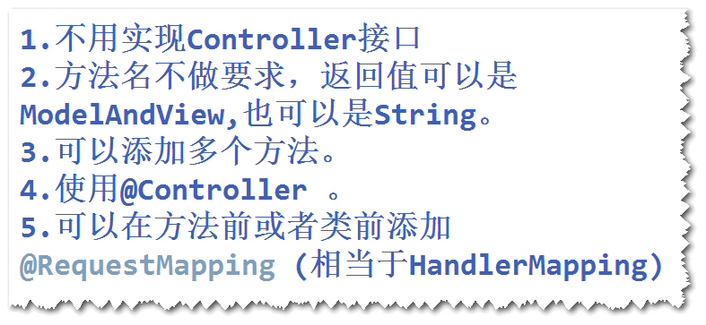
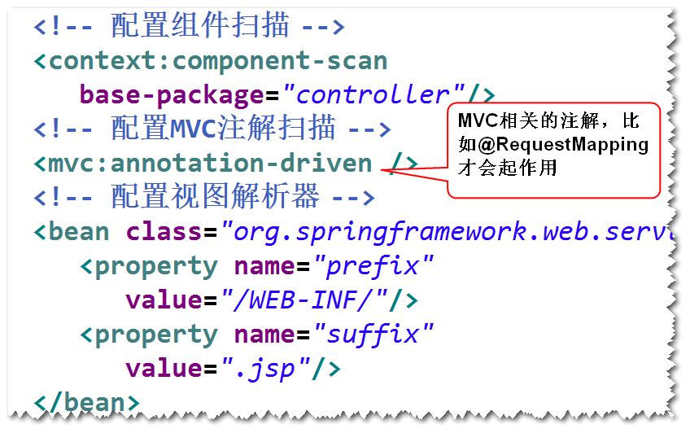
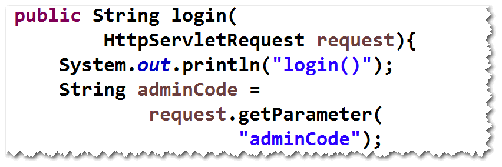
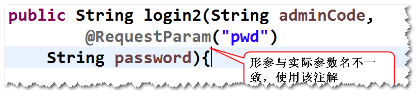
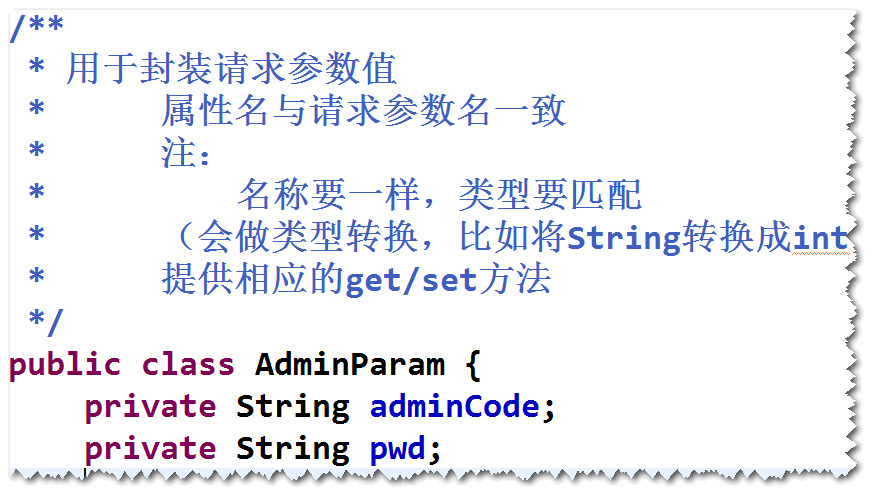
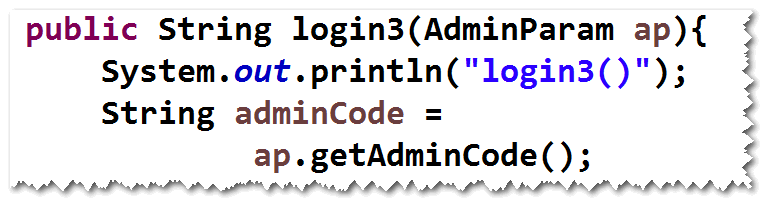
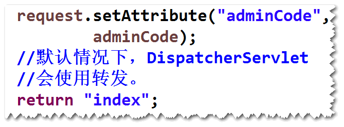
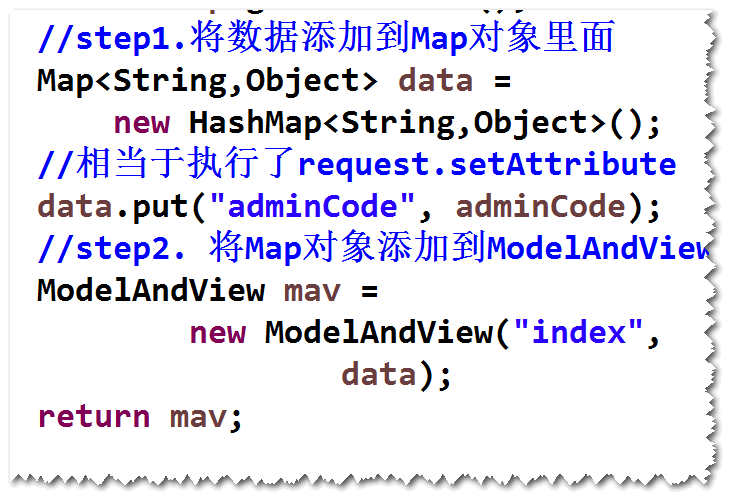
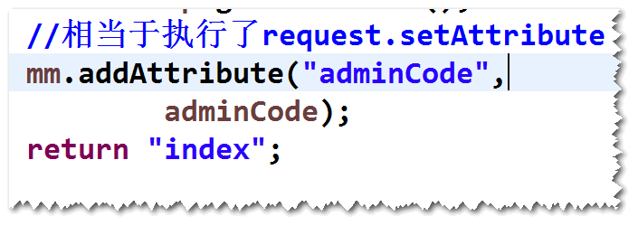

# 1. 基于注解的SpringMVC应用
## (1)编程步骤
	step1.导包。
	spring-webmvc
	step2.添加spring配置文件。
	step3.配置DispatcherServlet。
	step4.写Controller

	step5.写jsp
	step6.在配置文件当中，添加ViewResolver配置，
		添加组件扫描，添加MVC注解扫描。	
	

## (2).读取请求参数值
###  1）方式一  通过request提供的方法
	

### 2) 方式二  通过@RequestParam注解
	

### 3) 方式三  通过javabean
	step1. 先写一个java类
	

	step2. 将该类作为方法参数
	

## (3)向页面传值
### 1)方式一  将数据绑订到request
	

### 2)方式二  返回ModelAndView 
	

### 3)方式三  将数据添加到ModelMap
	

### 4)方式四  将数据绑订到session

## (4)重定向
### 1)方法的返回值是String
	比如  return "redirect:toIndex.do";
### 2)方法的返回值是ModelAndView
	比如
		RedirectView rv = new RedirectView("toIndex.do");
		ModelAndView mav = new ModelAndView(rv);