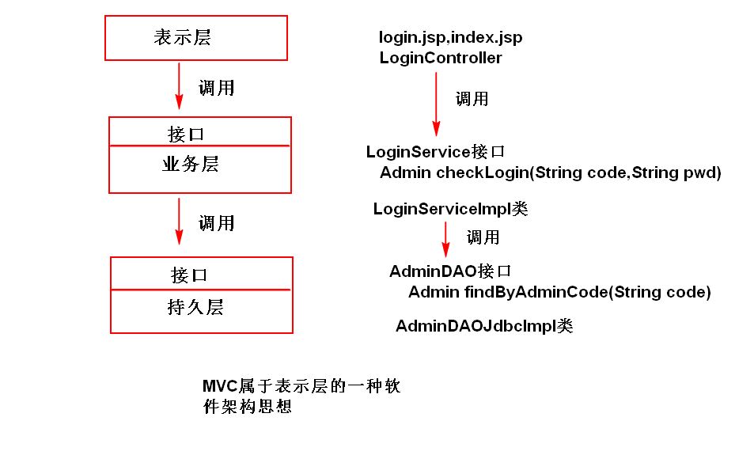
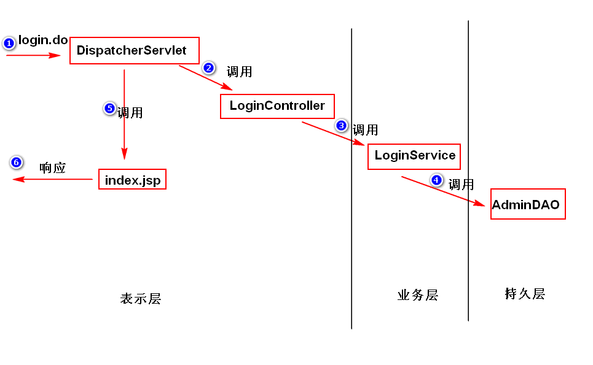

# 1. 系统分层 （扩展）
## (1)为什么要分层?（了解)
	为了系统好维护，系统的设计应该要做到“高内聚，低耦合”。
	“高内聚”：指的是类的职责要单一，这样，一个类就可以会拆分
	成多个类（比如AccountService拆分成了AccountService和
	AccountDAO）,这样，就形成了分层的概念。
	“低耦合”：指的是类与类之间不要直接依赖。（AccountService
	要调用AccountDAO，应该使用依赖注入）。
## (2)如何分层?
	表示层：数据展现和操作界面，以及请求分发。
	业务层：封装了业务逻辑。  
	持久层: 封装了数据访问逻辑。
	注：
		表示层调用业务层，业务层调用持久层。
		上一层通过接口来调用下一层提供的服务（这样，下一层的
		实现发生了改变，不影响上一层）。

		