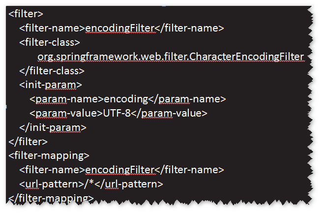
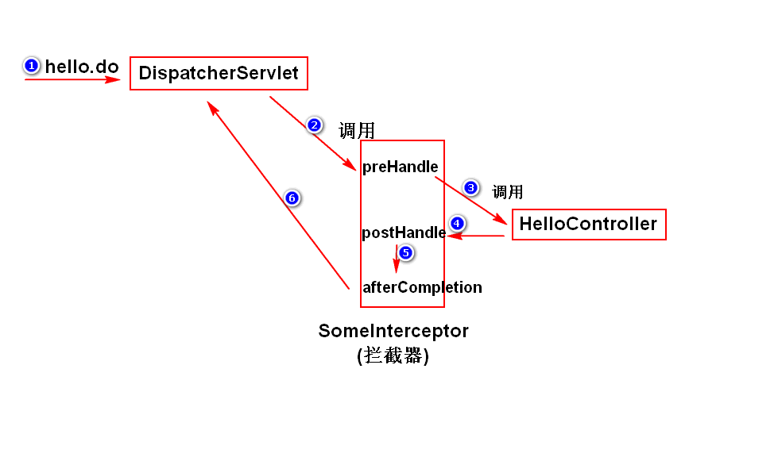
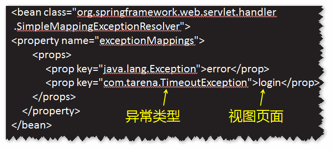
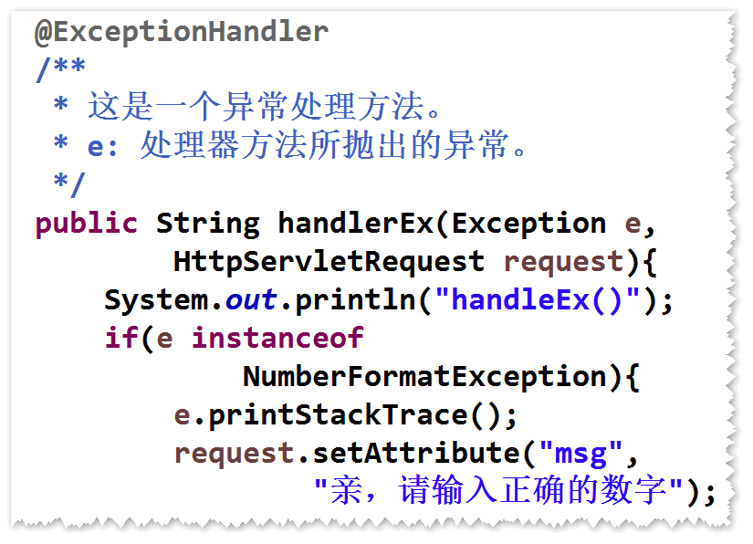

# 1. 表单包含有中文参数值，如何读取?
	springmvc提供了一个过滤器(CharacterEncodingFilter),
	只需要配置该过滤器即可。
	注意：
	a. 表单的提交方式必须是"post"。
	b. 编码与浏览器端的一致。

# 2. 拦截器
## (1)什么是拦截器?
	DispatcherServlet收到请求之后，如果有拦截器，会先调用
	拦截器，然后再调用Controller。
	注：
		过滤器属于servlet规范，而拦截器属于spring框架。	

## (2)如何写一个拦截器?
	step1. 写一个java类，实现HandlerInterceptor接口。
	step2. 在接口方法里面，实现拦截处理逻辑。
	step3. 配置拦截器。
	

# 3. 让spring框架帮我们处理异常
	注：即将异常抛给spring框架，让spring框架来处理。
	默认情况下，spring框架会将异常直接抛给最终的用户。
## (1)方式一 配置简单异常处理器。
	step1.在spring配置文件当中，配置简单异常处理器。

	step2.添加相应的异常处理页面。
	注：简单异常处理器，不能够对异常做复杂的处理。		
## (2)方式二 @ExceptionHandler。	
	step1. 在处理器当中添加一个异常处理方法。该方法
		前面需要添加@ExceptionHandler注解。
	step2. 在异常处理方法里面，依据异常类型做不同的处理。
	 
	
	