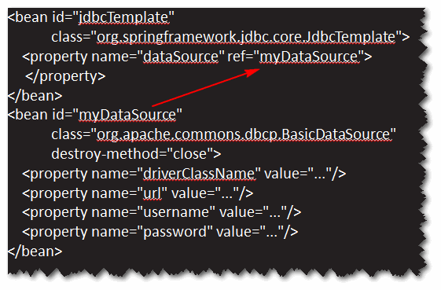
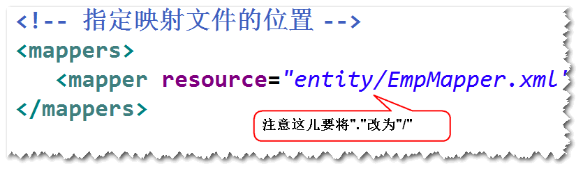
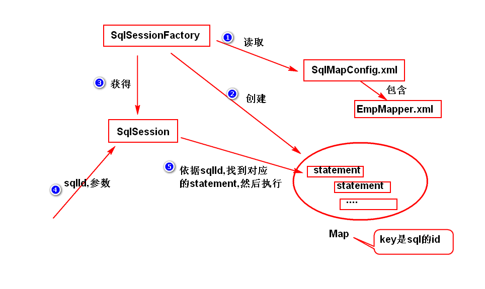

# 1. SpringJdbc
## (1)SpringJdbc是什么?
	Spring框架对jdbc的封装。
## (2)编程步骤
	step1.导包
		spring-webmvc,spring-jdbc,
		ojdbc,dbcp,junit。
	step2.添加spring配置文件。
	step3.配置JdbcTemplate。	
		注：JdbcTemplate把一些重复性的代码（比如获取连接，关闭）		连接，异常处理等等都写好了），我们只需要调用该对象的
			方法就可以很方便的访问数据库。

	step4.调用JdbcTemplate的方法来访问数据库。
		注：通常将JdbcTemplate注入到DAO。

	create table t_emp(
		id number(8) primary key,
		name varchar2(20),
		age number(3)
	);
	create sequence t_emp_seq;

	
# 2. MyBatis
## (1)MyBatis是什么?
	开源的持久层框架。
	注：MyBatis底层仍然是jdbc。
## (2)编程步骤
	step1. 导包。
		mybatis,ojdbc,junit	
	step2. 添加配置文件。
		注：主要是连接池的配置和映射文件的位置。

	step3. 写实体类。	
		注：实体类的属性名与表的字段名要一样（大小写可以忽略）。
	step4. 添加映射文件。	
		注：里面主要是sql语句。

	step5. 调用SqlSession对象提供的方法来访问数据库。
## (3)工作原理 (了解)
	
			
 

	
	
	