	练习：
	使用MyBatis完成对部门表的增删改查操作。
		a.添加部门信息。
		b.查询出所有部门信息
		c.依据id查询某个部门信息
		d.修改某个部门信息
		e.删除某个部门。
	create table t_dept(
		id number(8) primary key,
		deptName varchar2(20),
		addr varchar2(50)
	);
	create sequence t_dept_seq;

# 1. 返回Map类型的结果
## (1) MyBatis会将记录中的数据先放到一个Map对象里面
	（以字段名作为key,以字段值作为value,一条记录对应一个Map对象），
	然后	再将Map中的数据放到对应的实体对象里面。
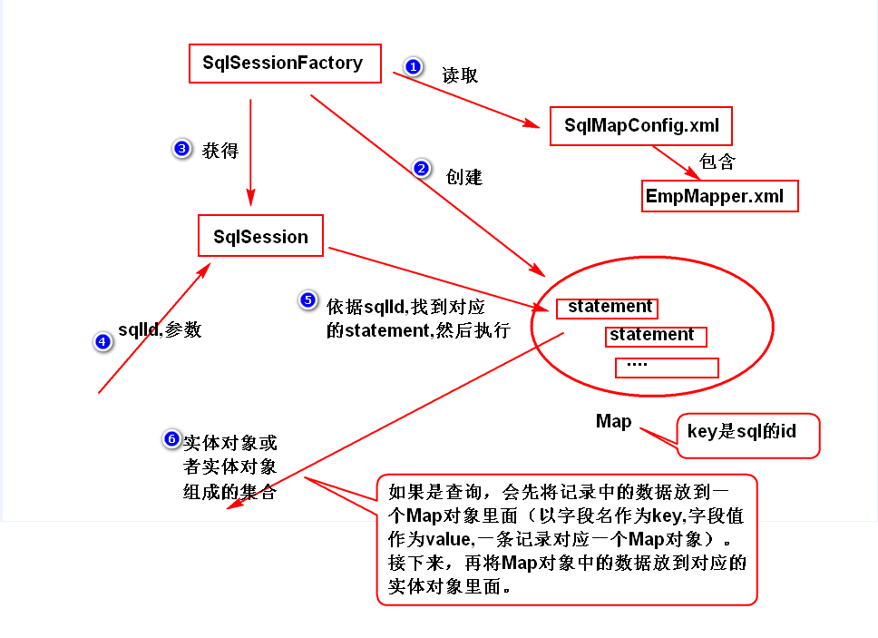

## (2)返回Map类型的结果，好处是不用实体类了，但是不方便
	（因为要获得字段值，还需要调用Map对象提供的get方法,
	注意，oracle数据库中，字段名统一都是大写）。

# 2.解决字段名与实体类的属性名不一致
## (1)方式一  使用别名。(就是让别名与属性名一样)。
## (2)方式二  使用resultMap解决。
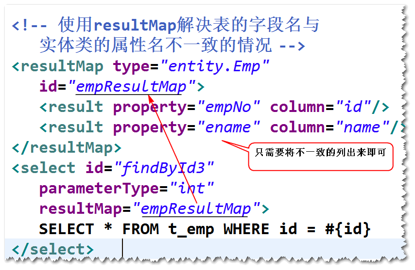	

# 3.Mapper映射器  
## (1)什么是Mapper映射器?
	符合映射文件要求的接口。
	注：MyBatis会生成符合该接口要求的对象。
## (2)具体要求
	a.方法名要与sql的id一致。
	b.方法的参数类型要与parameterType一致。
	c.方法的返回类型要与resultType一致。
	d.映射文件的namespace要等于接口的完整的名字。
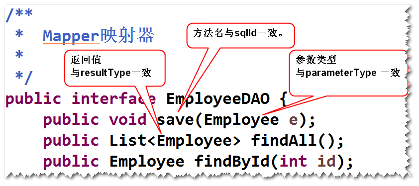
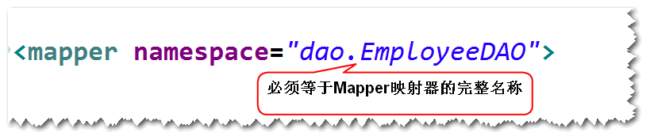

## (3)如何使用Mapper映射器
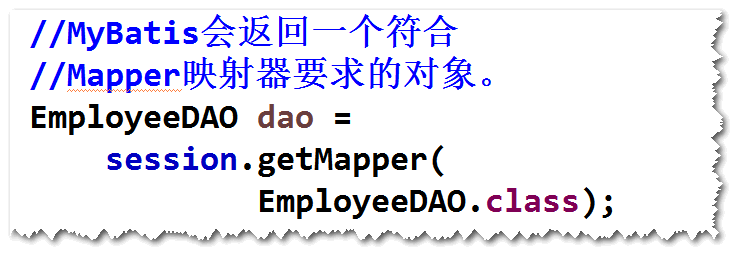	

# 4. Spring集成MyBatis （方式一 使用Mapper映射器）
## (1)集成步骤
	step1.导包。
	spring-webmvc,mybatis,mybatis-spring,
	dbcp,ojdbc,spring-jdbc,junit。
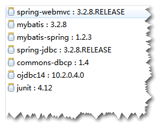

	step2.添加spring配置文件。
	注：不再需要MyBatis的配置文件,可以在spring的配置文件里面
	添加SqlSessionFactoryBean来代替。
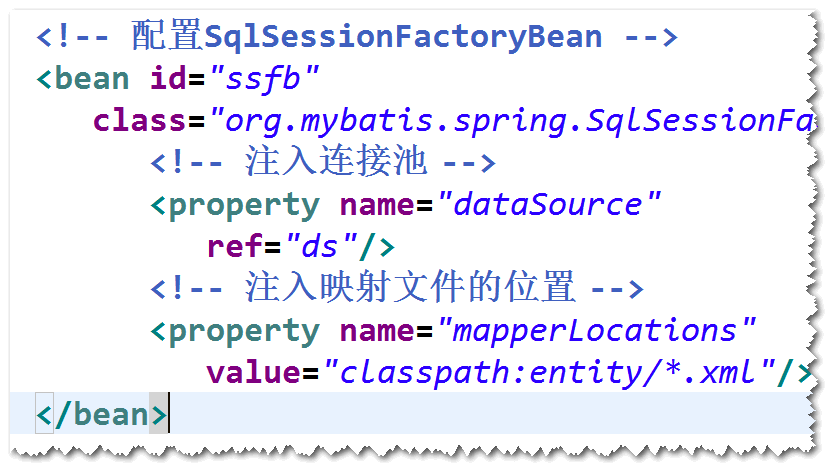
	
	step3.实体类
	step4.映射文件
	step5.Mapper映射器
	step6.配置MapperScannerConfigurer
	注：该bean会扫描指定包及其子包下面的所有的Mapper映射器
	(即接口),然后调用getMapper方法获得映射器的实现（比如,
	调用 EmployeeDAO dao = SqlSession.getMapper(EmployeeDAO.class))。并且，将这些对象添加到Spring容器里面
	(默认的id是首字母小写之后的接口名，可以使用@Repository重命名)。
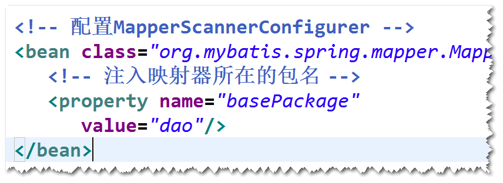

## (2)只扫描特定的接口。
	step1. 开发一个注解。
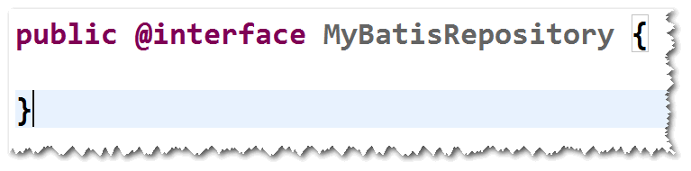

	step2. 将该注解添加到需要扫描的接口之上。

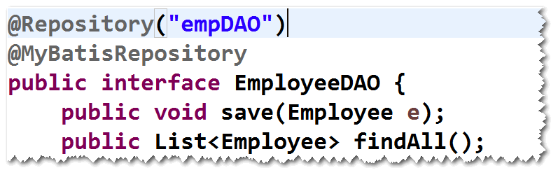

	step3. 修改MapperScannerConfigurer的配置。
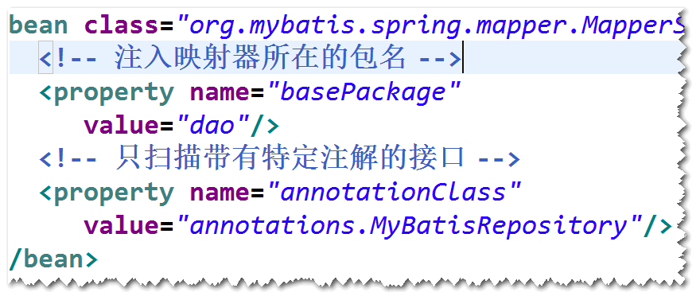
						
	
