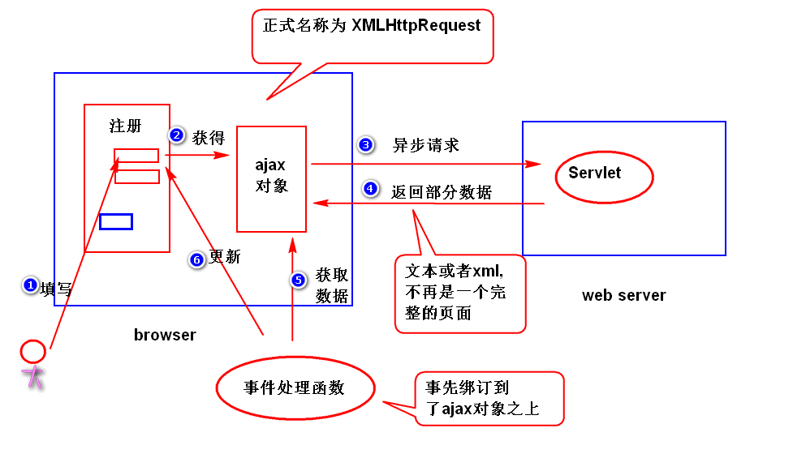
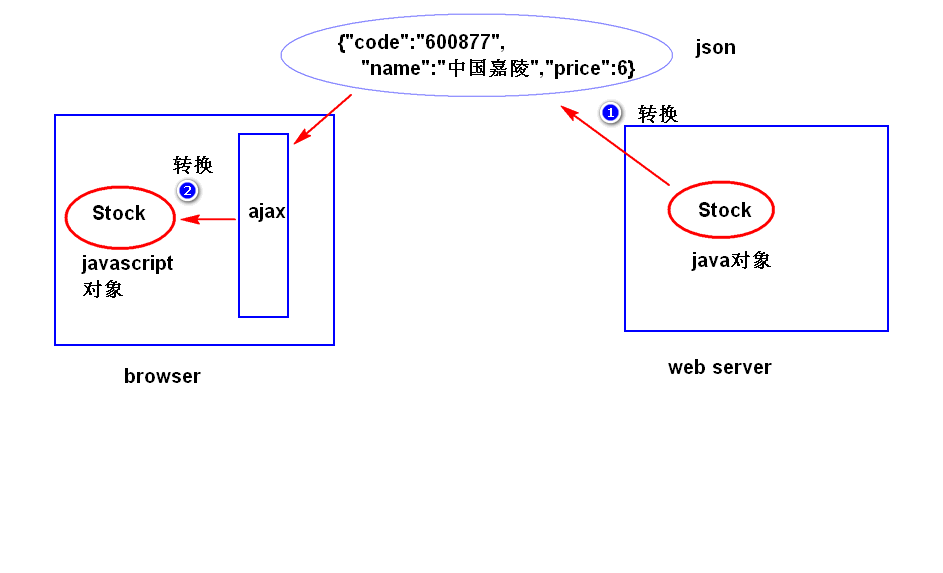

# Ajax

# 一. Ajax
## 1. Ajax 原理
### 1.1. 什么是 Ajax
Asynchronous JavaScript and XML, 异步的 JavaScript 和 xml
是一种通过页面的局部更新, 来改善用户体验的技术. 
本质上, 是使用 XMLHttpRequest 对象, 异步地向服务器发送请求, 服务器返回部分数据
浏览器根据返回数据, 更新页面中的局部内容, 整体页面不刷新, 不影响用户其他操作
如注册时动态检验用户名是否冲突, 验证码是否正确等等



### 1.2. Ajax 工作原理

### 1.3. 如何获取 XMLHttpRequest 对象
对于非 IE 浏览器, 直接 new 一个 XMLHttpRequest 对象
对于 IE 浏览器, 需要 new 一个 ActiveXObject 对象

```js
function getXhr(){
    var xhr = null;
    if(window.XMLHttpRequest){
        //非ie浏览器
        xhr=new XMLHttpRequest();
    }else{
        xhr=new ActiveXObject('Microsoft.XMLHttp');
    }
    return xhr;
}
```

## 2. Ajax 对象属性方法
### 2.1. 属性
1. **readyState**
表示 ajax 对象与服务器通信的状态, 共有5个值( 0 ~ 4 )
其中, ４表示已接收服务器返回的所有的数据, 可以执行后续操作

	- 0：尚未初始化
	- 1：正在发送请求
	- 2：请求成功
	- 3：请求成功，正在接收数据
	- 4：数据接收成功

2. **onreadystatechange**
绑定一个事件处理函数， 用来处理readystatechange事件。
注: 当 ajax 对象的 readystate 属性值发生了任何改变 （比如从０变成了１），就会产生 readystatechange 事件。

3. **responseText**
服务器返回的文本数据。

4. **responseXML**
服务器返回的 xml 数据。

5. **status**
从服务器获取的状态码

	- 200：表示请求成功
	- 202：请求被接受但处理为完成
	- 400：错误请求
	- 404：资源未找到
	- 500：内部服务器错误。

### 2.2. 方法
1. 取消请求
	
> xhr.abort()
	
2. 获取所有响应的 Http 头
	
> xhr.getAllResponseHeaders()
	
3. 获取指定的 Http 头
	
	> xhr.getResponseHeader()
	
4. **创建请求**
	指定请求方式与路径, 第三个参数指定是否使用异步请求

	- true: 异步( 浏览器不会销毁当前页面, 用户仍可以对当前页面进行操作 )
	- false: 同步( 浏览器不会销毁当前页面, 但是会锁定页面等待服务器, 用户无法操作 )
	
	> xhr.open( 请求方式, 请求url, 是否异步 )
	
5. 发送请求
	> xhr.send( 参数 ) 
	
	采用 get 方式时, 参数为 null 
	采用 post 方式时, 参数为 ?
6. **setRequestHeader()** : 指定请求的 Http 头

## 3. 使用 Ajax 发送异步请求
### 3.1. get 方式的编程步骤
1. 获取 ajax 对象

    ```javascript
    var xhr = getXhr();
    ```

2. 调用 ajax 对象的方法, 发送请求

    ```javascript
    xhr.open('get', 'xx.do', true);
    xhr.onreadystatechange = func();
    xhr.send(null);
    ```

3. 编写服务器端的程序, 返回部分数据

4. 编写事件处理函数 func(), 处理服务器返回的数据

     ```javascript
     if( xhr.readyState == 4 && xhr.state == 200 ){
         // 检查是否获取了完整数据, 服务器是否处理正确
         var txt = xhr.responseText;
         // 页面更新...
     }
     ```

     

     

### 3.2. post 方式的编程步骤
1. 获得ajax对象
    
```javascript
    var xhr = getXhr();
    ```
    
2. 调用ajax对象的方法，发送请求

   ```javascript
   xhr.open('post','check.do',true);
   xhr.setRequestHeader('content-type','application/x-www-form-urlencoded');
   xhr.onreadystatechange = f1;    
   xhr.send('adminCode=king');
   ```

   注(了解)：

   按照 http 协议要求，如果发送的是 post 请求，应该包含有 content-type 消息头, 但 ajax 默认不带这个消息头, 需要调用 setRequestHeader 方法来添加这个消息头。

3. 编写服务器端的程序，返回部分数据。

4. 编写事件处理函数

   ```javascript
   if(xhr.readyState == 4 && xhr.status == 200){
       // ajax对象已经获得了服务器返回的所有数据, 而且服务器处理正确。
       var txt = xhr.responseText;
       // 页面更新...
   }
   ```

# 二. 编码问题

## 1. get 请求时的乱码问题
### 1.1. 乱码原因
浏览器发送 get 请求时, ajax 对象会对中文参数值进行编码,
IE 使用 GBK, 其他浏览器使用 UTF-8. 
服务器默认使用 ISO-8859-1 来编码, 服务器和浏览器编码方式不一致导致乱码

### 1.2. 解决方式
1. 服务器端, 修改配置文件, 指定服务器采用的编码方式为 UTF-8
   tomcat 的 server.xml 中, 在 Connector 元素中增加属性:

	> < Connector **URIEncoding = "utf-8"**>

2. 客户端, 使用 encoderURI 对请求地址进行编码
	> var uri = 请求路径;
	> xhr.open('get', encoderURI(uri), true);

## 2. post 请求时的乱码问题
### 2.1. 乱码原因
所有浏览器提供的 ajax 对象发送 post 请求时, 对参数都是用UTF-8 进行编码
而服务器默认使用 iso-8859-1 去解码, 编码方式不同就会产生乱码

### 2.2. 解决方式

- 在 servlet 中声明编码方式为 UTF-8

	> request.setCharacterEncoding("UTF-8");

# 三. 缓存问题
## 什么是缓存问题
某些浏览器发送 get 请求时, 会检查请求地址是否访问过,
如果访问过, 则不再发送新的请求, 而是将第一次的访问结果显示出来,
即浏览器第一次请求后, 将服务器返回的结果缓存下来, 再次访问时缓存中获取数据

## 如何解决
添加随机数参数, 以生成新的请求路径
> 请求路径?xxx=Math.random();

# 三. JSON
## 1. JSON 简介
是一种轻量级的数据交换格式, 借鉴了 JavaScript 的部分语法
是一种轻量级的数据交换格式。
注：json借鉴了javascript的部分语法    
注：
    数据交换:指的是将要交换的数据转换成一种与平台无关的
        数据格式（比如xml）,然后发送给接收方来处理。
    轻量级：json相对于xml而言，文档更小，解析速度更快。

## 2. JSON 语法
JSON 对象主要分两种形式: 

- "键值对"的集合, 在不同语言中, 被解释为对象, 记录, 结构, 字典,哈希表等
- 值的有序列表, 在大部分语言中解释为数组

### 2.1. 表示一个对象
- 使用键值对的形式存储对象的数据, 多个键值对有逗号隔开
- 属性名必须使用双引号括起来, 若属性值是字符串, 也要用双引号括起来
- 属性值可以是 string number, boolean, null, objec	

	> { "属性1": 值1 , "属性2": 值2 } 
	> { "属性1": 值1 , "属性2": **{ "属性":值 }** } t.

### 2.2. 表示一个数组
- 将值有序排列, 用方括号括起来, 组成数组 
- 数组的值可以是简单数据类型, 也可以是 object 或数组类型

	> [ 值1, 值2, 值3 ]
	> [ { 对象1 }, { 对象2 } ]

# 四. 使用 JSON 实现数据交换
## 1. 使用步骤
1. 导入包

	1. com.jackson.core : jackson-annotations : 2.2.3
	2. com.fasterxml.jackson.core : jackson-core : 2.2.3
	3. com.fasterxml.jackson.core : jackson-databind : 2.2.3

2. 写实体类

## 1. 数据交换
数据交换: 


1. java 对象如何转换成 json 字符串?
    使用 jackson 提供的 api(ObjectMapper)

    > String JsonStr = om.writeValueAsString(Java 对象)

        ObjectMapper om = new ObjectMapper();
	    String jsonStr = om.writeValueAsString(stocks);
	    System.out.println(jsonStr);
	    out.println(jsonStr);

2. 将json字符串转换成javascript对象?
    使用 javascript 内置对象 JSON 提供的 parse() 函数。

    > var JsonObj = JSON.parse(字符串);

# 五. jQuery 对 ajax 编程的支持
## 1. $.ajax方法

### 1.1. 用法:
> $.ajax({...});

注：{...}是一个 Json 对象，其属性用来控制 ajax 对象如何向服务器发送请求，常见的属性如下。

- url: 请求地址
- type: 请求类型
- data: 请求参数

    - 可以是请求字符串形式，比如 "adminCode=king&age=22",
 	- 还可以是对象形式，比如{"adminCode":"king","age":22})

- dataType: 服务器返回的数据类型,有如下类型：

    - "json" —— json字符串
    - "text" —— 文本
    - "html" —— html文档
    - "xml" —— xml文档
    - "script" —— javascript脚本
    
- success: 绑订事件处理函数(服务器已经返回了所有数据，并且没有出错)。
- error: 绑订事件处理函数（服务器出错了）

		$.ajax({
			"url":"check.do",
			"type":"get",
			"data": "adminCode=king",
			"dataType":"text",
			"success": function(obj){
						 // obj就是服务器端返回的数据。此处处理服务器返回的数据
						 // 如果返回的是 json 字符串，会自动转换成 javascript 对象。	
					   }，
			"error": function(){...}			
		});
	
## 2. load 方法
	1)该方法会向服务器发送异步请求，并且将服务器返回的数据直接添加到符合要求的节点之上。
	2)用法
		$obj.load(url,[data]);
		url : 是请求地址。
		data: 是请求参数。有两种写法（请求字符串和对象的形式）
		注: $obj,是jQuery对象
