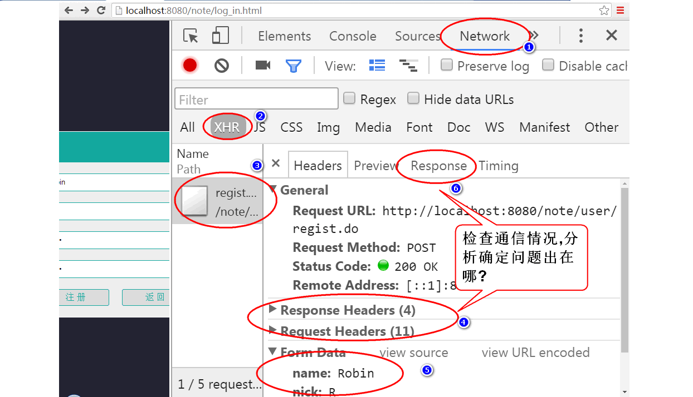
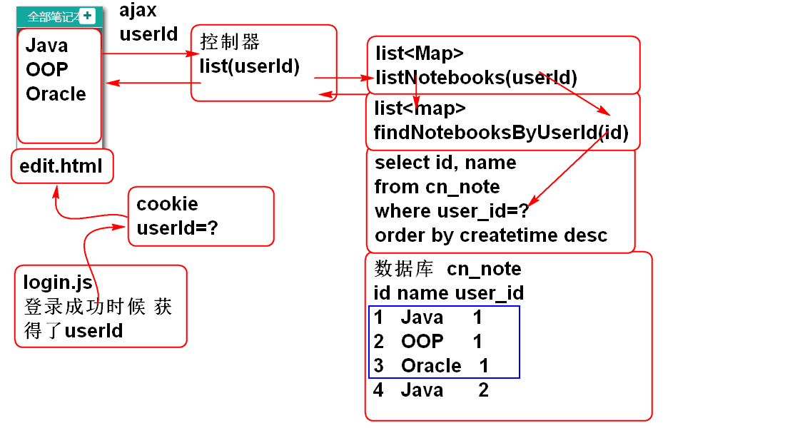

# 云笔记

# 一. 项目简述
## 1. 分析流程

1. **业务需求**: 搞清楚业务需求.
2. **数据结构**: 考虑数据如何存储.
3. **数据操作**: 如何操作数据才能达到业务目的: 设计 SQL
4. **编程实现**: 将业务功能和数据操作整合起来, 如何编程才能执行 SQL 操作数据

> 软件 = 数据结构 + 算法

hub
## 2. 设计数据的存储

1. 内存:  数据计算时的临时存储场所, 关闭电源后数据就消失, 称为瞬态的
	- 运行内存
	- 分配的是对象
123
2. 外存: (SSD固体硬盘, HDD机械硬盘, SD, 闪存, U盘), 关闭电源不消失, 称为持久状态
	- 存储容量  
	- 保存的是文件 单机(单线程)程序可以使用文件存储数据
	- 数据库(文件) 数据库管理系统,提供了并发访问管理! 适合多线程访问

> 云笔记采用数据库存储数据!

### 2.1. 设计数据的存储

ER 图:

## 3. 编程实现套路
### 3.1. 持久层
dao 接口, mapper 映射文件, 实体类

### 3.2. 业务层
service 接口, service 实现类, 异常类, 异常处理

### 3.3. 控制器
controller 类, 

### 3.4. 表现层
html 页面, js 脚本, ajax 异步请求

## 4. 云笔记项目环境搭建

1. 创建项目

	- 创建Maven项目
	- 生成web.xml
	- 导入目标运行环境:Tomcat运行环境
	
2. 导入要的包
		
		com.fasterxml.jackson.core: jackson-annotations: 2.2.3
		com.fasterxml.jackson.core: jackson-core: 2.2.3
		com.fasterxml.jackson.core: jackson-databind: 2.2.3
		org.mybatis: mybatis: 3.2.8
		org.mybatis: mybatis-spring: 1.2.3
		org.springframework: spring-webmvc: 3.2.8.RELEASE
		org.springframework: spring-jdbc: 3.2.8.RELEASE
		commons-dbcp: commons-dbcp: 1.4
		junit: junit: 4.12
		mysql: mysql-connector-java: 5.1.6

3. 配置 Spring MVC 主控制器: web.xml

		<servlet>
			<description></description>
			<display-name>DispatcherServlet</display-name>
			<servlet-name>DispatcherServlet</servlet-name>
			<servlet-class>org.springframework.web.servlet.DispatcherServlet</servlet-class>
			<init-param>
				<description></description>
				<param-name>contextConfigLocation</param-name>
				<param-value>classpath:conf/spring-*.xml</param-value>
			</init-param>
			<load-on-startup>1</load-on-startup>
		</servlet>

		<servlet-mapping>
			<servlet-name>DispatcherServlet</servlet-name>
			<url-pattern>*.do</url-pattern>
		</servlet-mapping>

4. 添加 Spring-MVC 配置文件: conf/spring-mvc.xml

		<!-- 配置组件扫描 -->
		<context:component-scan base-package="cn.tedu.note.controller"/>
		<!-- 配置MVC注解扫描 -->
		<mvc:annotation-driven />

5. 添加数据库连接参数文件: conf/jdbc.properties:

		driver=com.mysql.jdbc.Driver
		url=jdbc:mysql://localhost:3306/cloud_note
		user=root
		password=mysql
		maxActive=20 

6. 配置MyBatis: conf/spring-mybatis.xml
	
		<!-- 配置 spring-mybatis.xml -->
		<!-- 读取配置文件 -->
		<util:properties id="jdbc" location="classpath:conf/jdbc.properties"/> 
		
		<!-- 配置数据库连接池 -->
		<bean id="dataSource" 
		class="org.apache.commons.dbcp.BasicDataSource" destroy-method="close"> 
			<property name="driverClassName" value="#{jdbc.driver}"/>
			<property name="url" value="#{jdbc.url}"/>
			<property name="username" value="#{jdbc.user}"/>
			<property name="password" value="#{jdbc.password}"/>
			<property name="maxActive" value="#{jdbc.maxActive}"></property>
		</bean>
		
		<!-- 配置MyBatis的 SessionFactory -->
		<bean id="sqlSessionFactory" class="org.mybatis.spring.SqlSessionFactoryBean">
			<property name="dataSource" ref="dataSource"/>
			<property name="mapperLocations" value="classpath:mapper/*.xml"/>
		</bean>

		<!-- Mapper接口组件扫描 -->
		<bean class="org.mybatis.spring.mapper.MapperScannerConfigurer">
			<property name="basePackage" value="cn.tedu.note.dao"/>
		</bean>

# 二. 功能模块实现
## 1. 登录功能

### 1.1. 原理

### 1.2. 持久层

1. 添加UserDao接口:

		public interface UserDao {
			User findUserByName(String name);
		}
			
2. 添加实体类 User

		public class User implements Serializable{
			private static final long serialVersionUID = -288301177049569372L;
			
			private String id;
			private String name;
			private String password;
			private String token;
			private String nick;
			
			// 无参构造, 有参构造 略
			// get, set, toString, equals, hashcode方法 略
		}
		
		
3. 添加SQL: mapper/UserMapper.xml:

		<mapper namespace="cn.tedu.note.dao.UserDao">
	
			<select id="findUserByName" 
				parameterType="string"
				resultType="cn.tedu.note.entity.User">

				select 
					cn_user_id as id,
					cn_user_name as name,
					cn_user_password as password,
					cn_user_token as token,
					cn_user_nick as nick
				from cn_user		
				where cn_user_name = #{name}
			</select>
			
		</mapper>

4. 测试 UserDaoTest:

		public class UserDaoTest {
			
			ClassPathXmlApplicationContext ctx;
			@Before 
			public void initCtx(){
				ctx = new ClassPathXmlApplicationContext(
						"conf/spring-mvc.xml",
						"conf/spring-mybatis.xml");
			}
		
			@After
			public void closeCtx(){
				ctx.close();
			}
			
			@Test
			public void testFindUserByName(){
				String name = "demo";
				UserDao dao = ctx.getBean( "userDao", UserDao.class);
				User user = dao.findUserByName(name);
				System.out.println(user); 
			}
		}

### 1.3. 业务层

1. 创建业务层接口

		public interface UserService {
			/**
			 * 登录功能, 登录成功返回用户信息, 登录失败
			 * 则抛出异常.
			 * @param name 用户名 
			 * @param password 密码
			 * @return 如果登录成功就返回登录用户信息
			 * @throws UserNotFoundException 用户不存在
			 * @throws PasswordException 密码错误
			 */
			User login(String name, String password) throws UserNotFoundException, PasswordException;
		}

2. 创建业务异常类

		public class UserNotFoundException extends RuntimeException {...}
		public class PasswordException extends RuntimeException {...}

3. 实现业务层方法 

		@Service("userService")
		public class UserServiceImpl implements UserService {
			
			@Resource
			private UserDao userDao;
			
			public User login(String name, String password) 
                    throws UserNotFoundException, PasswordException {
				if(password==null || password.trim().isEmpty()){
					throw new PasswordException("密码空");
				}
				if(name==null || name.trim().isEmpty()){
					throw new UserNotFoundException("用户名空");
				}
				User user = userDao.findUserByName(name.trim());
				if(user==null){
					throw new UserNotFoundException("name错误");
				}
				if(password.trim().equals(user.getPassword())){
					return user;
				}
				throw new PasswordException("密码错误");
			}
		}

4. 配置Spring, 扫描业务层组件的注解 conf/spring-service.xml:

		<context:component-scan  base-package="cn.tedu.note.service"/>

5. 测试	
	- 定义测试基类, 封装Spring容器初始化功能:

			public abstract class BaseTest {
			
				protected ClassPathXmlApplicationContext ctx;
			
				@Before
				public void initCtx() {
					ctx = new ClassPathXmlApplicationContext(
							"conf/spring-mvc.xml",
							"conf/spring-mybatis.xml",
							"conf/spring-service.xml");
				}
			
				@After
				public void close() {
					ctx.close();
				}
			
			}

	- 测试登录方法
	
			public class UserServiceTest {
				@Test
				public void testLogin(){
					String name = "demo";
					String password = "123456";
					UserService service = ctx.getBean("userService", UserService.class);
					User user = service.login(name, password);
					System.out.println(user); 
				}
			}

6. 为了测试, 需要更新数据库
	
    	use cloud_note;
    	update cn_user set cn_user_password='123456' where cn_user_name='demo';
    	select cn_user_password from cn_user where cn_user_name='demo';

### 1.4. 密码的加密处理

#### 1) MD5 摘要算法
- 通过 MD5 摘要算法, 可以计算出数据的指纹, 原数据有细小的改变, 都会造成计算后的 MD5 值有明显区别.
- 特点: 

	- 原文 一样, 摘要一样
	- 摘要一样, 通常认为原文一样, 但不绝对, 有碰撞的可能.
	
- 利用消息摘要技术加密用户密码, 避免保存密码明文, 可以有效的提供系统的安全性. 
- 用户登录时, 按照相同的算法计算出用户密码对应的密文, 与数据库中的密文对比验证.

#### 2) 加盐摘要加密

- MD5 算法是摘要算法, 由 MD5 密文不可逆推得到完整的原始数据, 但网上存在常用字符串的反查网站, 存储了常见字符串( 通常用作密码 )的 MD5 值, 通过反查网站可以找到对应的原文.
- 为了避免通过反查网站破解密码原文, 可以采取"加盐"操作, 对密码进行预处理后再计算 MD5 值.
- **加盐摘要**: 在密码原文的基础上, 加上前缀或后缀字符串, 组成一个较长的字符串后再计算摘要 MD5 值, 由于每个公司每个网站使用的"盐"都不一样, 同样的密码原文加盐后生成的 MD5 值都不相同, 这样不法分子就无法通过网上的 MD5 反查网站获取用户密码原文, 从而保障了用户密码安全性.

#### 3) 加密算法测试:

	public class Md5Test {
		
		@Test
		public void testMd5(){
			String str = "123456";
			String md5 = DigestUtils.md5Hex(str);
			System.out.println(md5); //e10adc3949ba59abbe56e057f20f883e
			String salt = "今天你吃了吗?";
			md5 = DigestUtils.md5Hex(salt+str); //加盐摘要
			System.out.println(md5); //8bbf37d0962bf915a780f410ec1a4741
		}
	}

实现密码加密验证功能:

1. 导入消息摘要工具类: 
		
		commons-codec: commons-codec: 1.10
				
2. 重构登录逻辑 验证摘要密码: UserServiceImpl

		public User login(String name, String password) 
				throws UserNotFoundException, PasswordException {
			if(password==null || password.trim().isEmpty()){
				throw new PasswordException("密码空");
			}
			if(name==null || name.trim().isEmpty()){
				throw new UserNotFoundException("用户名空");
			}
			User user = userDao.findUserByName(name.trim());
			if(user==null){
				throw new UserNotFoundException("name错误");
			}
			String salt="今天你吃了吗?";
			String pwd = DigestUtils.md5Hex(salt+password.trim());
			if(pwd.equals(user.getPassword())){
				return user;
			}
			throw new PasswordException("密码错误");
		}

3. 更新数据库, 将测试用户的密码更新为加密的 123456
		
		update cn_user
		set cn_user_password='8bbf37d0962bf915a780f410ec1a4741'
		where cn_user_name='demo';

4. 测试:

		@Test
		public void testLogin(){
			String name = "demo";
			String password = "123456";
			UserService service = ctx.getBean("userService", UserService.class);
			User user = service.login(name, password);
			System.out.println(user); 
		}

### 1.5. 控制器

1. 编写 JsonResult 封装JSON返回值:

		public class JsonResult implements Serializable{
			
			public static final int SUCCESS = 0;
			public static final int ERROR = 1;
			
			private int state;		//返回状态码, 0为正常, 1为异常
			private String message;	//返回异常时的错误信息
			private Object data;	//返回操作正确时的数据
		
			public JsonResult() {
			}
			
			public JsonResult(Object data){
				state = SUCCESS;
				this.data = data;
			}
			
			public JsonResult(Throwable e) {
				state = ERROR;
				message = e.getMessage();
			}
			
			//get, set, toString方法略
			
		}

2. 实现控制器: UserController
其中 @ExceptionHandler 注解用于本类异常处理
> @ExceptionHandler(异常类型.class)

		@Controller
		@RequestMapping("/user")
		public class UserController {
		
			@Resource
			private UserService userService;
			
			@RequestMapping("/login.do")
			@ResponseBody
			public Object login(String name, String password){
				User user = userService.login(name, password);
				return new JsonResult(user);
			}
			
			// 在其他控制器方法执行出现异常时候, 执行异常处理方法 handleException
			@ExceptionHandler(Exception.class)
			@ResponseBody
			public Object handleException(Exception e){
				e.printStackTrace();
				return new JsonResult(e);
			}
		}

3. 测试: 全面测试正常和异常情况.
 
		// 正常 http://localhost:8080/note/user/login.do?name=demo&password=123456
		// 空白 http://localhost:8080/note/user/login.do
		// 错误 http://localhost:8080/note/user/login.do?name=demo&password=123

### 1.6. 表现层

#### 1) 正确提交请求

1. 将 html 页面复制到 webapp 文件夹:
2. 更新 log_in.html 添加脚本:

		<meta charset="utf-8"> 
		<link rel="stylesheet" href="styles/login.css"/>
		
		

    并在用户名和密码输入框后添加两个span, 以显示前端检查的信息

        用户名:<input type="text" name="" id="count" tabindex='1'/>
        密码:<input type="password" name="" id="password" tabindex='2'/>

3. 创建 scripts/login.js 文件
4. 在 login.js 文件添加事绑定脚本:
		
		$(function(){
			$('#login').click(loginAction);      // 登录操作
			$('#count').blur(checkName);         // ajax 检查用户名合法性
			$('#password').blur(checkPassword);  // ajax 检查密码合法性
		});

5. 添加用户名和密码检查方法:

		function checkName(){
			var name = $('#count').val();
			var rule = /^\w{4,10}$/;
			if(! rule.test(name)){
				$('#count').next().html('4~10个字符');
				return false;
			}
			$('#count').next().empty();
			return true;
		}
		
		function checkPassword(){
			var password = $('#password').val();
			var rule = /^\w{4,10}$/;
			if(! rule.test(password)){
				$('#password').next().html('4~10个字符');
				return false;
			}
			$('#password').next().empty();
			return true;
		}

6. 添加登录按钮事件处理方法:

		function loginAction(){
			//获取用户输入的用户名和密码
			var name = $('#count').val();
			var password = $('#password').val();
			
			//检查用户名和密码合法性
			var n=checkName()+checkPassword();
			if(n!=2){
				return;
			}
			
			//data 对象中的属性名要与服务器控制器的参数名一致! login(name, password)
			var data = {"name":name, "password":password};
			$.ajax({
				url:'user/login.do',
				data:data,
				type:'post',
				dataType:'json',
				success: function(result){
					console.log(result);
					if(result.state==0){
						//登录成功!
						var user = result.data;
						console.log(user);
						//跳转到 edit.html
						location.href='edit.html';
					}else{
						var msg = result.message;
						$('#count').next().html(msg);
					}
				},
				error: function(e){
					alert("通信失败!");
				}
			});
		}

#### 2) 显示错误信息

1. 原理

2. 重构控制器增加异常处理方法 UserController

		@ExceptionHandler(UserNotFoundException.class)
		@ResponseBody
		public JsonResult handleUserNotFound(UserNotFoundException e){
			e.printStackTrace();
			return new JsonResult(2,e);
		}

		@ExceptionHandler(PasswordException.class)
		@ResponseBody
		public JsonResult handlePassword(PasswordException e){
			e.printStackTrace();
			return new JsonResult(3,e);
		}

3. 重构 JsonResult, 添加构造器
	
		public JsonResult(int state, Throwable e) {
			this.state = state;
			this.message = e.getMessage();
		}

4. 重构 login.js 的 loginAction 方法, 显示错误信息

		var msg = result.message;
		if(result.state==2){
			$('#count').next().html(msg);
		}else if(result.state==3){
			$('#password').next().html(msg);
		}else{
			alert(msg);
		}

## 2. 注册功能

### 2.1. 原理

### 2.2. 持久层

1. 声明持久层方法: UserDao

		int addUser(User user);

2. 声明 SQL: UserMappeer.xml

		<insert id="addUser" parameterType="cn.tedu.note.entity.User">
			insert into cn_user (字段名) values (#{实体属性})
		</insert>
	
### 2.3. 业务层

1. 声明业务层方法 UserService

		User regist(String name,String nick,String password,String confirm)
			throws UserNameException, PasswordException;

2. 声明业务层异常 UserNameException
		
		public class UserNameException extends RuntimeException {...}

3. 重构 jdbc.properties 和 UserServiceImpl, 将 salt 存储到配置文件, 利用 Spring 注入到属性中:
	
- jdbc.properties

			salt=\u4ECA\u5929\u4F60\u5403\u4E86\u5417?   // properties 只支持英文

- UserServiceImpl
	
			@Value("#{jdbc.salt}")
			private String salt;

4. 实现业务层方法: UserServiceImpl

		public User regist(String name, String nick, String password, String confirm)
			throws UserNameException, PasswordException {...}

5. 测试 UserServiceTest

		UserService service;
		@Before
		public void initService(){
			service = ctx.getBean("userService", UserService.class);
		}
		@Test
		public void testRegist(){
			User user = service.regist("Andy","Andy","123456","123456");
			System.out.println(user); 
		}
		
### 2.4. 控制器 

1. 添加控制器方法 UserController

		@RequestMapping("/regist.do")
		@ResponseBody
		public JsonResult regist(String name,String nick, String password,String confirm){
			User user = userService.regist( name, nick, password, confirm);
			return new JsonResult(user);
		}

2. 测试

		http://localhost:8080/note/user/regist.do?name=Jerry&nick=AN&password=12345&confirm=12345

### 2.5. 表现层

1. 更新 log_in.html, 取消页面检查 js 脚本, 准备自己写:

		window.onload=function(){
			var t =setTimeout("get('zc').style.visibility='visible'",800);
			// get('final_password').onblur=function(){...}
			// get('regist_password').onblur=function(){...}
			// get('regist_password').onfocus=function(){...}
			// get('final_password').onfocus=function(){...}
		}

2. 添加注册对话框事件脚本 login.js 

		$('#regist_button').click(registAction);          // 注册操作
		$('#regist_username').blur(checkRegistName);      // 检查用户名是否占用
		$('#regist_password').blur(checkRegistPassword);  // 检查密码合法性
		$('#final_password').blur(checkConfirm);          // 检查两次密码一致性

3. 添加注册对话框数据检验方法:login.js 
		
		function checkConfirm(){
			var pwd2 = $('#final_password').val();
			var pwd = $('#regist_password').val();
			if(pwd && pwd==pwd2){
				$('#final_password').next().hide();
				return true;
			}
			$('#final_password').next().show().find('span').html('确认密码不一致');
			return false;
		}
		
		function checkRegistPassword(){
			var pwd = $('#regist_password').val().trim();
			var rule = /^\w{4,10}$/;
			if(rule.test(pwd)){
				$('#regist_password').next().hide();
				return true;
			}
			$('#regist_password').next().show().find('span').html('4~10个字符');
			return false;
		}
		
		function checkRegistName(){
			var name = $('#regist_username').val().trim();
			var rule = /^\w{4,10}$/;
			if(rule.test(name)){
				$('#regist_username').next().hide();
				return true;
			}
			$('#regist_username').next().show().find('span').html('4~10字符');
			return false;
		}

4. 添加注册对话框注册按钮事件方法 login.js 

		function registAction(){
			console.log('registAction');
			//检验界面参数
			var n = checkRegistName() + checkRegistPassword() + checkConfirm();
			if(n!=3){
				return ;
			}

			//获取界面中表单数据
			var name = $('#regist_username').val().trim();
			var nick = $('#nickname').val();
			var password = $('#regist_password').val();
			var confirm = $('#final_password').val();

			//发起AJAX请求
			var url = 'user/regist.do';
			var data = {name:name, 
                        nick:nick, 
                        password:password, 
                        confirm:confirm};
			// $.post 是 $.ajax的简化版
			$.post(url, data, function(result){
				console.log(result);
				if(result.state==0){
					//退回登录界面, 自动填写用户名, 并将光标定位在密码输入框
					$('#back').click();
					var name = result.data.name;
					$('#count').val(name);
					$('#password').focus();
					//清空注册表单
					$('#regist_username').val('');
					$('#nickname').val('');
					$('#regist_password').val('');
					$('#final_password').val('');
				}else if(result.state==4){
					$('#regist_username').next().show().find('span').html(result.message);
				}else if(result.state==3){
					$('#regist_password').next().show().find('span').html(result.message);
				}else{
					alert(result.message);
				}
			});
		}
			
5. 重构控制器UserController 增加事件处理方法:

		@ExceptionHandler(UserNameException.class)
		@ResponseBody
		public JsonResult handleUserName(UserNameException e){
			e.printStackTrace();
			return new JsonResult(4,e);
		}

6. 浏览器调试工具:

## 3. 笔记本列表功能

### 3.1. 原理

- 使用 List<Map> 封装查询结果:

    

### 3.2. 持久层

1. 添加持久层接口 NotebookDao:

		public interface NotebookDao {	
			List<Map<String, Object>> findNotebooksByUserId(String userId);
		}

2. 添加Mapper文件: NotebookMapper.xml

		<mapper namespace="cn.tedu.note.dao.NotebookDao">
			<select id="findNotebooksByUserId" parameterType="string" resultType="map">
				select cn_notebook_id as id, cn_notebook_name as name
				from cn_notebook
				where cn_user_id = #{userId}
				order by cn_notebook_createtime desc
			</select>
		</mapper>

3. 测试

		public class NotebookDaoTest extends BaseTest{
			NotebookDao dao;
			@Before
			public void initDao(){
				dao = ctx.getBean("notebookDao", NotebookDao.class);
			}
			
			@Test
			public void testFindNotebooksByUserId(){
				String userId="52f9b276-38ee-447f-a3aa-0d54e7a736e4";
				List<Map<String, Object>> list = dao.findNotebooksByUserId(userId);
				for (Map<String, Object> map : list) {
					System.out.println(map); 
				}
			}
		}

### 3.3. 业务层

1. 声明业务接口NotebookService

		public interface NotebookService {
			List<Map<String, Object>> listNotebooks(String userId)throws UserNotFoundException;
		}

2. 实现业务接口 NotebookServiceImpl

		@Service("notebookService")
		public class NotebookServiceImpl implements NotebookService {
			
			@Resource
			private NotebookDao notebookDao;
			@Resource 
			private UserDao userDao;
			
			public List<Map<String, Object>> 
				listNotebooks(String userId) 
				throws UserNotFoundException {
				if(userId==null || userId.trim().isEmpty()){
					throw new UserNotFoundException("ID不能空");
				}
				User user = userDao.findUserById(userId);
				if(user==null){
					throw new UserNotFoundException("用户不存在");
				}
				return notebookDao.findNotebooksByUserId(userId);
			}
		}
		
3. 添加查询方法 UserDao

		User findUserById(String userId);

4. 添加SQL UserMapper

		<select id="findUserById" parameterType="string" resultType="cn.tedu.note.entity.User">
			select 
				cn_user_id as id,
				cn_user_name as name,
				cn_user_password as password,
				cn_user_token as token,
				cn_user_nick as nick
			from cn_user		
			where cn_user_id = #{userId}
		</select>
		
5. 测试:

		public class NotebookServiceTest extends BaseTest {
			NotebookService service;
			@Before
			public void initService(){
				service = ctx.getBean("notebookService",
						NotebookService.class);
			}
			
			@Test
			public void testListNotebooks(){
				String userId="52f9b276-38ee-447f-a3aa-0d54e7a736e4";
				List<Map<String, Object>> list= service.listNotebooks(userId);
				for (Map<String, Object> map : list) {
					System.out.println(map); 
				}
			}
		}

### 3.4. 控制器

1. 添加控制器父类 AbstractController, 封装公共的异常处理方法:
并重构 UserController, 使其继承于 AbstractController

		public abstract class AbstractController {
			@ExceptionHandler(Exception.class)
			@ResponseBody
			public Object handleException( Exception e){
				e.printStackTrace();
				return new JsonResult(e);
			}
		}

2. 创建控制器类 NotebookController:

		@RequestMapping("/notebook")
		@Controller
		public class NotebookController extends AbstractController {
			
			@Resource
			private NotebookService notebookService;
			
			@RequestMapping("/list.do")
			@ResponseBody
			public JsonResult list(String userId){
				List<Map<String, Object>> list= notebookService.listNotebooks(userId);
				return new JsonResult(list);
			}
		}

3. 测试
测试结果体现了控制器能够利用父类的异常处理方法处理异常情况.

		http://localhost:8080/note/notebook/list.do?userId=52f9b276-38ee-447f-a3aa-0d54e7a736e4
		http://localhost:8080/note/notebook/list.do?userId=abc
		http://localhost:8080/note/notebook/list.do

### 3.5. 表现层
1. 更新 log_in.html 引入cookie操作 API:

		

2. 更新 login.js 的 loginAction 方法, 在登录成功时候将 userId 保存到 cookie 中:

		...
		//登录成功以后将userId保存到cookie中
		addCookie("userId", user.id); 
		...
	
3. 在 edit.html 添加JS脚本:
    为了提高页面的用户体验, 减少页面加载延迟, 将脚本在页面后部加载.

		 
		

4. 添加 scripts/note.js 文件, 编码为 utf-8 

		var SUCCESS = 0;
		var ERROR = 1;
		
		$(function(){
			var userId = getCookie('userId');
			console.log(userId);
		});

5. 测试: 登录以后可以在 edit.html 的控制台上能够看到 userId, 可以通过浏览器的控制台检查 cookie 保存情况:

    

6. 在 ready 函数中调用方法 loadNotebooks(), 在页面加载后立即加载笔记本列表数据
7. 添加方法 loadNotebooks, 利用 ajax 加载笔记本列表数据:
    提示: 为了保存代码的简洁, 将显示笔记本列表的算法封装到 showNotebooks 方法中. 

		function loadNotebooks(){
			var url = 'notebook/list.do';
			var data = {userId:getCookie('userId'), name:'demo'};

			$.getJSON(url, data, function(result){
				console.log(result);
				if(result.state==SUCCESS){
					var notebooks = result.data;
					showNotebooks(notebooks);
				}else{
					alert(result.message);
				}
			});
		}

8. 声明 showNotebooks 方法, 显示在 notebook-list 区域的 ul 中显示笔记本列表信息:
    提示: notebookTemplate 变量定义了显示笔记本的 li 元素模板. 来自 edit.html 页面中.

		function showNotebooks(notebooks){
			// 遍历 notebooks 数组, 将为每个对象创建一个li 元素, 添加到 ul元素中.
			var ul = $('#notebook-list ul');
			ul.empty();
			for(var i=0; i<notebooks.length; i++){
				var notebook = notebooks[i];
				var li = notebookTemplate.replace('[name]', notebook.name);
				li = $(li);
				ul.append(li);
			}
		}
		var notebookTemplate = 
			'<li class="online">'+
			'<a><i class="fa fa-book" title="online" '+
			'rel="tooltip-bottom"></i> [name]</a>'+
			'</li>';

## 4. 笔记列表功能

### 4.1. 原理

### 4.2. 持久层

1. 声明持久层查询方法 NoteDao
		
		public interface NoteDao {
			List<Map<String,Object>> findNotesByNotebookId(String notebookId);
		}

2. 声明 SQL NoteMapper.xml

		<mapper namespace="cn.tedu.note.dao.NoteDao">
			<select id="findNotesByNotebookId" parameterType="string" resultType="map">
				select cn_note_id as id, cn_note_title as title 
				from cn_note
				where cn_notebook_id = #{notebookId}
				order by cn_note_last_modify_time desc
			</select>
		</mapper>
		
3. 测试

		public class NoteDaoTest  extends BaseTest{
			NoteDao dao;
			@Before
			public void initDao(){
				dao = ctx.getBean("noteDao", NoteDao.class);
			}
			@Test
			public void testFindNotesByNotebookId(){
				String id="fa8d3d9d-2de5-4cfe-845f-951041bcc461";
				List<Map<String, Object>> list= dao.findNotesByNotebookId(id);
				for (Map<String, Object> map : list) {
					System.out.println(map); 
		}}}

### 4.3. 业务层

1. 声明业务层方法 NoteService

		public interface NoteService {
			List<Map<String, Object>> listNotes( String notebookId)
				throws NotebookNoteFoundExcepotion;
		}

2. 声明业务异常:NotebookNoteFoundExcepotion

3. 实现业务层方法 NoteServiceImpl

		@Service("noteService")
		public class NoteServiceImpl implements NoteService{
			@Resource
			private NoteDao noteDao;
			@Resource
			private NotebookDao notebookDao;
			public List<Map<String, Object>> listNotes( String notebookId) 
					throws NotebookNoteFoundExcepotion {
				if(notebookId==null || notebookId.trim().isEmpty()){
					throw new NotebookNoteFoundExcepotion("ID为空");
				}
				// Notebook notebook = notebookDao.findNotebookById(notebookId);
				// if(notebook==null){...}
				int n = notebookDao.countNotebookById(notebookId);
				if(n!=1){
					throw new NotebookNoteFoundExcepotion("没有笔记本");
				}
				return noteDao.findNotesByNotebookId(notebookId);
		}}

4. 重构 NotebookDao, 添加统计方法 countNotebookById

		int countNotebookById(String notebookId);

5. 添加 sql NotebookMapper.xml
	
		<select id="countNotebookById" parameterType="string" resultType="int">
			select count(*) as cnt from cn_notebook where cn_notebook_id = #{notebookId}
		</select>
		
6. 测试 NoteServiceTest:

		public class NoteServiceTest  extends BaseTest{
			NoteService service;
			@Before
			public void initService(){
				service = ctx.getBean("noteService", NoteService.class);
			}
			@Test
			public void testListNotes(){
				String id="fa8d3d9d-2de5-4cfe-845f-951041bcc461";
				List<Map<String, Object>> list= service.listNotes(id);
				for (Map<String, Object> map : list) {
					System.out.println(map); 
		}}}
			
### 4.4. 控制器

1. 添加控制器 NoteController

		@Controller
		@RequestMapping("/note")
		public class NoteController extends AbstractController{
			 @Resource 
			 private NoteService noteService;
			 @RequestMapping("/list.do")
			 @ResponseBody
			 public JsonResult list(String notebookId){
				 List<Map<String, Object>> list= noteService.listNotes(notebookId);
				 return new JsonResult(list);
		}}

2. 测试:

		http://localhost:8080/note/note/list.do?notebookId=d0b0727f-a233-4a1f-8600-f49fc1f25bc9

### 4.5. 表现层

1. 重构 edit.html, 设置笔记本列表 ID = notebook-list

		

2. 在 note.js 的 ready 方法中绑定笔记本列表点击事件:

		$('#notebook-list').on('click','.notebook', loadNotes);

	> 提示: 这里利用事件冒泡, 在父元素上绑定点击事件, jQuery 提供的 on 方法可以非常方便区别发生事件的事件源. 
	> 重构: 重构 notebookTemplate, 为 li 元素添加 notebook 类:

		var notebookTemplate = 
			'<li class="online notebook">'+
			'<a><i class="fa fa-book" title="online" '+
			'rel="tooltip-bottom"></i> [name]</a>'+
			'</li>';

3. 重构 showNotebooks 方法, 将 notebookId 绑定 li 元素上

		...
		for(var i=0; i<notebooks.length; i++){
			var notebook = notebooks[i];
			var li = notebookTemplate.replace('[name]', notebook.name);
			li = $(li);
			//将 notebook.id 绑定到 li
			li.data('notebookId', notebook.id);
			ul.append(li);
		}

4. 添加事件处理方法 loadNotes: 

		function loadNotes(){
			var li = $(this);                                // 当前被点击的对象li
			li.parent().find('a').removeClass('checked');    // 清除选定效果
			li.find('a').addClass('checked');                // 为当前 li 增加选定效果
			var url = 'note/list.do';
			var data={notebookId:li.data('notebookId')};     // li.data('notebookId')获取绑定的 id
			console.log(data);
			$.getJSON(url, data, function(result){
				if(result.state==SUCCESS){
					var notes = result.data;
					showNotes(notes);
				}else{
					alert(result.message);
				}
			});
		}

5. 添加 showNotes 方法显示笔记到笔记列表区域:

		function showNotes(notes){
			console.log(notes); 
			var ul = $('#note-list ul');
			ul.empty();
			for(var i=0; i<notes.length; i++){
				var note = notes[i];
				var li = noteTemplate.replace('[title]', note.title);
				li = $(li);
				ul.append(li);
			}
		}
		
		var noteTemplate = '<li class="online">'+
			'<a><i class="fa fa-file-text-o" title="online" rel="tooltip-bottom"></i> [title]<button type="button" class="btn btn-default btn-xs btn_position btn_slide_down"><i class="fa fa-chevron-down"></i></button>'+
			'</a>
<dl>'+
				'<dt><button type="button" class="btn btn-default btn-xs btn_move" title="移动至..."><i class="fa fa-random"></i></button></dt>'+
				'<dt><button type="button" class="btn btn-default btn-xs btn_share" title="分享"><i class="fa fa-sitemap"></i></button></dt>'+
				'<dt><button type="button" class="btn btn-default btn-xs btn_delete" title="删除"><i class="fa fa-times"></i></button></dt>'+
			'</dl>
</li>';
		

	> 重构: edit.html, 设置笔记列表ID note-list

		

##　5. 显示笔记功能

### 5.1. 原理: 

### 5.2. 持久层

1. 声明持久层方法 NoteDao
	
		Note findNoteById(String noteId);
	 
2. 声明实体类 Note

		public class Note implements Serializable{
			private static final long serialVersionUID = -8176239102696538864L;
		
			private String id;
			private String notebookId;
			private String userId;
			private String statusId;
			private String typeId;
			private String title;
			private String body;
			private Long createTime;
			private Long lastModifyTime;
			
			//无参构造, 有参构造 略
			//get, set, toString, equals, hashcode方法 略
		}

3. 声明 SQL, NoteMapper.xml

		<select id="findNoteById" parameterType="string" resultType="cn.tedu.note.entity.Note">
			select
				cn_note_id as id,
				cn_notebook_id as notebookId,
				cn_user_id as userId,
				cn_note_status_id as statusId,
				cn_note_type_id as typeId,
				cn_note_title as title,
				cn_note_body as body,
				cn_note_create_time as createTime,
				cn_note_last_modify_time as lastModifyTime
			from cn_note 
			where cn_note_id=#{noteId}
		</select>

4. 测试 NoteDaoTest
	
		@Test
		public void testFindNoteById(){
			String noteId = "019cd9e1-b629-4d8d-afd7-2aa9e2d6afe0";
			Note note = dao.findNoteById(noteId);
			System.out.println(note);
		}

### 5.3. 业务层

1. 声明业务层方法 NoteService

		Note getNote(String noteId) throws NoteNotFoundException;

2. 声明业务异常 NoteNotFoundException

3. 实现方法 NoteServiceImpl
	
		public Note getNote(String noteId) throws NoteNotFoundException {
			if(noteId==null||noteId.trim().isEmpty()){
				throw new NoteNotFoundException("ID空");
			}
			Note note = noteDao.findNoteById(noteId);
			if(note==null){
				throw new NoteNotFoundException("id错误");
			}
			return note;
		}

4. 测试 NoteServiceTest
	
		@Test
		public void testGetNote(){
			String noteId = "019cd9e1-b629-4d8d-afd7-2aa9e2d6afe0";
			Note note = service.getNote(noteId);
			System.out.println(note);
		}

### 5.4. 控制器

1. 添加控制器方法 NoteController

		@RequestMapping("/load.do")
		@ResponseBody
		public JsonResult load(String noteId) {
			Note note = noteService.getNote(noteId);
			return new JsonResult(note);
		}

2. 测试

    	http://localhost:8080/note/note/load.do?noteId=019cd9e1-b629-4d8d-afd7-2aa9e2d6afe0
    	http://localhost:8080/note/note/load.do

### 5.5. 表现层

1. 重构 showNotes 方法, 在显示时候将笔记的 ID 绑定到 li 元素:

		li.data('noteId', note.id);

2. 重构笔记列表 li 模板, 在 li 元素上增加 note 类:

		var noteTemplate = '<li class="online note">'+
			'<a><i class="fa fa-file-text-o" title="online" rel="tooltip-bottom"></i>'+
                '[title]<button type="button" class="btn btn-default btn-xs btn_position btn_slide_down"><i class="fa fa-chevron-down"></i></button>'+
			'</a>
<dl>'+
				'<dt><button type="button" class="btn btn-default btn-xs btn_move" title="移动至..."><i class="fa fa-random"></i></button></dt>'+
				'<dt><button type="button" class="btn btn-default btn-xs btn_share" title="分享"><i class="fa fa-sitemap"></i></button></dt>'+
				'<dt><button type="button" class="btn btn-default btn-xs btn_delete" title="删除"><i class="fa fa-times"></i></button></dt>'+
			'</dl>
</li>';

3. 在 ready 方法中添加事件监听笔记列表的点击事件:

		$('#note-list').on( 'click','.note', loadNote);

4. 添加笔记点击加载笔记的事件处理方法 loadNote

		function loadNote(){
			var li = $(this);
			var id = li.data('noteId');
			li.parent().find('a').removeClass('checked');
			li.find('a').addClass('checked');
			var url = 'note/load.do';
			var data= {noteId: id };
			$.getJSON(url, data, function(result){
				if(result.state==SUCCESS){
					var note = result.data;
					showNote(note);
				}else{
					alert(result.message);
				}
			});
		}

5. 添加显示笔记信息方法 showNote

		function showNote(note){
			$('#input_note_title').val(note.title);
			um.setContent(note.body);
		}

## 6. 新建笔记功能

### 6.1. 原理

### 6.2. 持久层

1. 声明持久层方法 NoteDao

		int addNote(Note note);

2. 声明SQL, NoteMapper.xml:
	
		<insert id="addNote" parameterType="cn.tedu.note.entity.Note">
			insert into cn_note (各字段名) values (#{各字段值})
		</insert>

### 6.3. 业务层

1. NoteService 添加业务方法 addNote, 方法的三个参数是根据对业务过程分析来确定的.

		public Note addNote(String userId, String notebookId, String title)
				throws UserNotFoundException, NotebookNotFoundException;

2. 实现业务方法 NoteServiceImpl:

		public Note addNote(String userId, String notebookId, String title)
				throws UserNotFoundException, NotebookNotFoundException {
			if(userId==null||userId.trim().isEmpty()){
				throw new UserNotFoundException("ID空");
			}
			User user=userDao.findUserById(userId);
			if(user==null){
				throw new UserNotFoundException("木有人");
			}
			if(notebookId==null||notebookId.trim().isEmpty()){
				throw new NotebookNotFoundException("ID空");
			}
			int n=notebookDao.countNotebookById(notebookId);
			if(n!=1){
				throw new NotebookNotFoundException("没有笔记本");
			}
			if(title==null || title.trim().isEmpty()){
				title="葵花宝典";
			}
			String id = UUID.randomUUID().toString();
			String statusId = "0";
			String typeId = "0";
			String body = "";
			long time=System.currentTimeMillis();
			Note note = new Note(id, notebookId, userId, statusId, typeId, title, body, time, time);
			n = noteDao.addNote(note);
			if(n!=1){
				throw new NoteNotFoundException("保存失败");
			}
			return note;
		}

### 6.4. 控制器

1. 添加控制器方法 NoteController

		@RequestMapping("/add.do")
		@ResponseBody
		public JsonResult add(String userId, String notebookId, String title) {
			Note note = noteService.addNote(userId, notebookId, title);
			return new JsonResult(note);
		}

2. 测试:
		
		http://localhost:8080/note/note/add.do?title=Hello&userId=48595f52-b22c-4485-9244-f4004255b972&notebookId=c8d81ee5-f8cd-49e8-b2e6-ab174a926d95

### 6.5. JQuery 的 load 方法

JQuery 提供了异步组件加载方法 load, 其语法为:

> JQuery.load(url, data, function)

- 一般在一个 JQuery 对象使用, 最常见在 div 对象调用 load 方法
- url 引用一个页面组件, 不是一个完整网页(没有html元素)
- data 是发起请求的参数.
- function 是页面组件加载后执行的方法.

    

- load 方法是异步工作的:

    

- 如果需要页面加载以后执行的代码一定放到 function 中!

    	$('#can').load('alert/alert_note.html', function(){
            console.log("加载完成");
        }); 
    	console.log('正在加载');

- 类比案例:

    

    	$('#can').load('购买饮料', function(){
            console.log("买回来了!");
        }); 
    	console.log('去买饮料了!');

### 6.6. 表现层

1. 原理: 添加笔记时候 **笔记本ID** 是如何传递的:
    
    

2. 在 ready 方法中绑定事件打开笔记对话框:

        $('#note-list').on('click', '#add_note', showAddNoteDialog);

    重构 loadNotes 方法, 在点击笔记本时候将笔记本 ID 保存起来

        $(document).data('notebookId', li.data('notebookId'));

    添加显示对话框方法:

		function showAddNoteDialog(){
			var id = $(document).data('notebookId');
			if(id){
				$('#can').load('alert/alert_note.html', function(){
					$('#input_note').focus();
				});
				$('.opacity_bg').show();
				return;
			}
			alert('必须选择笔记本!');
		}

3. 在 ready 方法中绑定事件关闭笔记对话框:

        $('#can').on('click','.close,.cancel',closeDialog)

    添加关闭事件处理方法:

		function closeDialog(){
			$('.opacity_bg').hide();
			$('#can').empty();
		}		

4. 在 ready 方法中监听对话框中的关闭和取消按钮

		// 监听对话框中的关闭和取消按钮
		$('#can').on('click','.close,.cancel',closeDialog)
	
    添加关闭事件方法:
		
		function closeDialog(){
			$('.opacity_bg').hide();
			$('#can').empty();
		}

5. 在 ready 方法中监听新建笔记对话框中的创建笔记按钮

		// 监听新建笔记对话框中的创建笔记按钮
		$('#can').on('click','.create-note',addNote);
	
    重构: alert/alert_note.html 为 创建笔记按钮添加类 create-note
	
        <button type="button" class="btn btn-primary sure create-note">创 建</button>
							
    添加创建笔记事件方法

		function addNote(){
			var url = 'note/add.do';
			var notebookId=$(document).data('notebookId');
			var title = $('#can #input_note').val();
		 
			var data = {userId:getCookie('userId'),
				notebookId:notebookId,
				title:title};
			
			$.post(url, data, function(result){
				if(result.state==SUCCESS){
					var note=result.data;
					showNote(note);
					// 找到显示笔记列表的ul对象
					var ul = $('#note-list ul');
					// 创建新新的笔记列表项目 li 
					var li = noteTemplate.replace('[title]', note.title);
					li = $(li);
					//设置选定效果
					ul.find('a').removeClass('checked');
					li.find('a').addClass('checked');
					//插入到笔记列表的第一个位置
					ul.prepend(li);
					//关闭添加对话框
					closeDialog();   
				}else{
					alert(result.message);
			}});
		}

## 7. 保存笔记功能

### 7.1. 原理

### 7.2. 持久层

1. 定义保存方法 NoteDao

		int updateNote(Note note);
	
2. 添加SQL NoteMapper.xml
> MyBatis 的 if 标签可以动态生成 SQL, 这里可以实现部分属性更新功能

		<update id="updateNote" parameterType="cn.tedu.note.entity.Note">
			update cn_note set
				<if test="notebookId!=null">
					cn_notebook_id=#{notebookId},
				</if>
				<if test="userId!=null">
					cn_user_id=#{userId},
				</if>
				<if test="statusId!=null">
					cn_note_status_id=#{statusId},
				</if>
				<if test="typeId!=null">
					cn_note_type_id=#{typeId},
				</if>
				<if test="title!=null">
					cn_note_title=#{title},
				</if>
				<if test="body!=null">
					cn_note_body=#{body},
				</if>
				cn_note_last_modify_time=#{lastModifyTime}
			where cn_note_id=#{id} 
		</update>
	
3. 测试: NoteDaoTest

		@Test
		public void testUpdateNote(){
			Note note = new Note();
			String noteId = "019cd9e1-b629-4d8d-afd7-2aa9e2d6afe0";
			note.setId(noteId);
			note.setTitle("Test");
			note.setBody("Test123");
			note.setLastModifyTime(System.currentTimeMillis());
			dao.updateNote(note);
			note = dao.findNoteById(noteId);
			System.out.println(note); 
		}
	
### 7.3. 业务层

1. 业务层方法 NoteService

		boolean update(String noteId, String title, String body)
			throws NoteNotFoundException;

2. 实现业务方法 NoteServiceImpl
	
		public boolean update(String noteId, String title, 
				String body) throws NoteNotFoundException {
			if(noteId==null || noteId.trim().isEmpty()){
				throw new NoteNotFoundException("ID不能空");
			}
			Note note = noteDao.findNoteById(noteId);
			if(note==null){
				throw new NoteNotFoundException("没有对应的笔记");
			} 
			Note data = new Note();
			if(title!=null && !title.equals(note.getTitle())){
				data.setTitle(title);
			}
			if(body!=null && !body.equals(note.getBody())){
				data.setBody(body);
			}
			data.setId(noteId);
			data.setLastModifyTime(System.currentTimeMillis());
			System.out.println(data); 
			int n = noteDao.updateNote(data);
			return n==1;
		}

3. 测试: NoteServiceTest

		@Test
		public void testUpdate(){
			String id = "019cd9e1-b629-4d8d-afd7-2aa9e2d6afe0";
			String title = "Test";
			String body = "今天天气不错";
			boolean b = service.update(id, title, body);
			Note note = service.getNote(id);
			System.out.println(b);
			System.out.println(note);
		}

### 7.4. 控制器

1. NoteController
	
		@RequestMapping("/update.do")
		@ResponseBody
		public JsonResult update(String noteId, String title, String body) {
			boolean success = noteService.update(noteId, title, body);
			return new JsonResult(success);
		}

### 7.5. 表现层

1. 重构 showNote 方法
	
		function showNote(note){
			$('#input_note_title').val(note.title);  // 显示标题
			um.setContent(note.body);                // 显示内容
			$(document).data('note', note);          // 绑定笔记信息
		}

2. 在 ready 方法中绑定 保存 事件

		$('#save_note').on('click', updateNote);

3. 添加事件处理方法

		function updateNote(){
			var url = 'note/update.do';
			var note = $(document).data('note');
			var data = {noteId:note.id};
			var modified = false;    // 标记是否修改, 若无修改就不提交修改请求
			var title = $('#input_note_title').val();
			if(title && title!=note.title){
				data.title = title;
				modified = true;
			}
			var body = um.getContent();
			if(body && body != note.body ){
				data.body = body;
				modified = true;
			}
			if(modified){            // 有修改才向服务器提交修改请求
				$.post(url, data, function(result){
					if(result.state == 0){
						//内存中的 note 改成新的数据
						note.title = title;
						note.body = body;
						var l = $('#note-list .checked').parent();
						$('#note-list .checked').remove()
						var li = noteTemplate.replace( '[title]', title);
						var a = $(li).find('a');
						a.addClass('checked');
						l.prepend(a);
					}else{
						alert(result.mesage);
				}});
		}}

## 8. 弹出笔记子菜单
### 8.1. 原理

利用事件冒泡在 note-list 上绑定事件弹出笔记子菜单

### 8.2. 表现层

1. 重构笔记列表模板, 为笔记子菜单触发按钮添加类 btn-note-menu

		var noteTemplate = '<li class="online note">'+
			'<a><i class="fa fa-file-text-o" title="online" rel="tooltip-bottom"></i> [title]<button type="button" class="btn btn-default btn-xs btn_position btn_slide_down btn-note-menu"><i class="fa fa-chevron-down"></i></button>'+
			'</a>
<dl>'+
				'<dt><button type="button" class="btn btn-default btn-xs btn_move" title="移动至..."><i class="fa fa-random"></i></button></dt>'+
				'<dt><button type="button" class="btn btn-default btn-xs btn_share" title="分享"><i class="fa fa-sitemap"></i></button></dt>'+
				'<dt><button type="button" class="btn btn-default btn-xs btn_delete" title="删除"><i class="fa fa-times"></i></button></dt>'+
			'</dl>
</li>';

2. 在 ready 方法中绑定触发事件

		$('#note-list').on('click', '.btn-note-menu', showNoteMenu);

3. 添加事件处理方法

		function showNoteMenu(){
			var btn = $(this);   // 找到菜单对象, 调用show() 方法
			btn.parent('.checked').next().toggle();  
            // 如果当前是被选定的 笔记项目就弹出子菜单
			// btn.parent('.checked') 获取当前按钮的父元素
			// 这个元素必须符合选择器'.checked', 如果不符合就返回空的JQuery元素. 	
			return false;    // 阻止点击事件的继续传播!避免传播到document对象时候, 触发关闭菜单事件
		}

4. ready方法中绑定document的点击事件, 利用事件冒泡关闭子菜单
	
		//监听整体的文档区域, 任何位置点击都要关闭笔记子菜单
		$(document).click(hideNoteMenu);

5. 添加事件处理方法关闭子菜单
	
		function hideNoteMenu(){
			$('.note_menu').hide();
		}

## 9. 移动笔记功能

### 9.1. 原理

### 9.2. 持久层
重用 NoteDao.updateNote 方法

### 9.3. 业务层

1. 业务层方法 NoteService

		boolean moveNote(String noteId, String notebookId)
				throws NoteNotFoundException, NotebookNotFoundException;

2. 实现业务层方法: NoteServiceImpl

		public boolean moveNote(String noteId, String notebookId)
				throws NoteNotFoundException, NotebookNotFoundException {
			if(noteId==null || noteId.trim().isEmpty()){
				throw new NoteNotFoundException("ID不能空");
			}
			Note note = noteDao.findNoteById(noteId);
			if(note==null){
				throw new NoteNotFoundException("没有对应的笔记");
			} 
			if(notebookId==null||notebookId.trim().isEmpty()){
				throw new NotebookNotFoundException("ID空");
			}
			int n=notebookDao.countNotebookById(notebookId);
			if(n!=1){
				throw new NotebookNotFoundException("没有笔记本");
			}
			
			Note data = new Note();
			data.setId(noteId);
			data.setNotebookId(notebookId);
			data.setLastModifyTime(System.currentTimeMillis());
			n = noteDao.updateNote(data);
			return n==1;
		}

### 9.4. 控制器, 略
### 9.5. 表现层

1. 在 ready 方法中监听移动按钮点击事件打开对话框

		$('#note-list').on('click', '.btn_move', showMoveNoteDialog);

2. 添加事件处理方法, 打开对话框, 打开对话框以后加载笔记本下拉列表

		function showMoveNoteDialog(){
			var id = $(document).data('note').id;
			if(id){
				$('#can').load('alert/alert_move.html', loadNotebookOptions);
				$('.opacity_bg').show();
				return;
			}
			alert('必须选择笔记!');
		} 

3. 添加加载笔记本列表事件方法

		function loadNotebookOptions(){
			var url = 'notebook/list.do';
			var data={userId:getCookie('userId')};
			$.getJSON(url, data, function(result){
				if(result.state==SUCCESS){
					var notebooks = result.data;
					$('#moveSelect').empty();
					var id=$(document).data('notebookId');
					for(var i=0; i<notebooks.length; i++){
						var notebook = notebooks[i];
						var opt=$('<option></option>').val(notebook.id).html(notebook.name);
						if(notebook.id==id){
							opt.attr('selected','selected');
						}
						$('#moveSelect').append(opt);
					}
				}else{
					alert(result.message);
				}
			});
		}

4. 重构 alert_move.html, 在确定按钮上增加类 move-note

		<button type="button" class="btn btn-primary sure move-note">确 定</button>

    在 ready 方法中监听移动笔记对话框中的确定按钮

		$('#can').on('click', '.move-note', moveNote);

5. 添加移动笔记对话框确认事件:

		function moveNote(){
			var url = 'note/move.do';
			var id = $(document).data('note').id;
			var bookId=$('#moveSelect').val();
			// 笔记本ID没有变化, 就不移动了!
			if(bookId==$(document).data('notebookId')){
				return;
			}
			var data = {noteId:id, notebookId:bookId};
			$.post(url, data, function(result){
				if(result.state==SUCCESS){
					// 移动成功, 在当前笔记列表中删除移动的笔记
					// 将笔记列表中的第一个设置为当前笔记, 否则清空边编辑区域
					var li = $('#note-list .checked').parent();
					var lis = li.siblings();
					if(lis.size()>0){
						lis.eq(0).click();
					}else{
						$('#input_note_title').val("");
						um.setContent("");
					}
					li.remove();
					closeDialog();//关闭对话框!
				}else{
					alert(result.message);
				}
			});
		}

## 10. 删除笔记功能

### 10.1. 持久层

1. 重用 NoteDao.updateNote 方法, 略
2. 重构 SQL, 笔记本列表中只显示没有删除的笔记: NoteMapper.xml
    注意：　增加了查询条件 cn_note_status_id = '1', 表示正常笔记

		<select id="findNotesByNotebookId" parameterType="string" resultType="map">
			select cn_note_id as id, cn_note_title as title 
			from  cn_note
			where cn_notebook_id = #{notebookId} and  cn_note_status_id = '1'
			order by cn_note_last_modify_time desc
		</select>
	

### 10.2. 业务层

1. 添加业务层方法 NoteService

		boolean deleteNote(String noteId) throws NoteNotFoundException;

2. 实现业务层方法 NoteServiceImpl

		public boolean deleteNote(String noteId) throws NoteNotFoundException {
			if(noteId==null || noteId.trim().isEmpty()){
				throw new NoteNotFoundException("ID不能空");
			}
			Note note = noteDao.findNoteById(noteId);
			if(note==null){
				throw new NoteNotFoundException("没有对应的笔记");
			} 
			
			Note data = new Note();
			data.setId(noteId);
			data.setStatusId("0");
			data.setLastModifyTime(System.currentTimeMillis());
			int n = noteDao.updateNote(data);
			return n==1;
		}

### 10.3. 控制器, 略
### 10.4. 表现层

1. 在 ready 方法中监听笔记子菜单中的删除按钮:

		$('#note-list').on('click', '.btn_delete', showDeleteNoteDialog);
	
    添加事件处理方法

		function showDeleteNoteDialog(){
			var id = $(document).data('note').id;
			if(id){
				$('#can').load('alert/alert_delete_note.html', loadNotebookOptions);
				$('.opacity_bg').show();
				return;
			}
			alert('必须选择笔记!');
		}

2. 在 ready 中监听删除笔记对话框中的确定按钮事件

    	$('#can').on('click', '.delete-note', deleteNote);

    重构 alert_detete_note.html 在确定按钮上增加 类 delete-note

		<button type="button" class="btn btn-primary sure delete-note">删 除</button>
	
    事件监听方法
	
		function deleteNote(){
			var url = 'note/delete.do';
			var id = $(document).data('note').id;
			var data = {noteId:id};
			$.post(url, data, function(result){
				if(result.state==SUCCESS){
					//删除成功, 在当前笔记列表中删除笔记
					//将笔记列表中的第一个设置为当前笔记, 否则清空边编辑区域
					var li = $('#note-list .checked').parent();
					var lis = li.siblings();
					if(lis.size()>0){
						lis.eq(0).click();
					}else{
						$('#input_note_title').val("");
						um.setContent("");
					}
					li.remove();
					closeDialog();//关闭对话框!
				}else{
					alert(result.message);
			}});
		}

### 10.5. 重构 addNote 功能

1. 重构 note.js, 增加 li.data('noteId', note.id) 否则无法再次点击笔记

		function addNote(){
			var url = 'note/add.do';
			var notebookId=$(document).data('notebookId');
			var title = $('#input_note').val();
			var data = {userId:getCookie('userId'),
				notebookId:notebookId,
				title:title};
			$.post(url, data, function(result){
				if(result.state==SUCCESS){
					var note=result.data;
					showNote(note);
					var ul = $('#note-list ul');
					var li = noteTemplate.replace('[title]', note.title);
					li = $(li);
					
					// 绑定笔记 ID 到 li
					li.data('noteId', note.id)
		
					ul.find('a').removeClass('checked');
					li.find('a').addClass('checked');
					ul.prepend(li);
					closeDialog();   
				}else{
					alert(result.message);
			}});
		}

2. 更正 NoteServiceImpl, addNote 方法中 String statusId = "1" 否则笔记是删除状态
	
		public Note addNote(String userId, String notebookId, String title)
				throws UserNotFoundException, NotebookNotFoundException {
		
			if(userId==null||userId.trim().isEmpty()){
				throw new UserNotFoundException("ID空");
			}
			User user=userDao.findUserById(userId);
			if(user==null){
				throw new UserNotFoundException("木有人");
			}
			if(notebookId==null||notebookId.trim().isEmpty()){
				throw new NotebookNotFoundException("ID空");
			}
			int n=notebookDao.countNotebookById(notebookId);
			if(n!=1){
				throw new NotebookNotFoundException("没有笔记本");
			}
			if(title==null || title.trim().isEmpty()){
				title="葵花宝典";
			}
			String id = UUID.randomUUID().toString();

            // 设置笔记状态为1
			String statusId = "1";      
			String typeId = "1";
			String body = "";
			long time=System.currentTimeMillis();

			Note note = new Note(id, notebookId, userId, statusId, typeId, title, body, time, time);
			n = noteDao.addNote(note);
			if(n!=1){
				throw new NoteNotFoundException("保存失败");
			}
			return note;
		}

## 11. 显示回收站

### 11.1. 原理

### 11.2. 持久层

1. 添加数据访问方法 NoteDao

		List<Map<String, Object>> findDeleteNotesByUserId(String userId);

2. 添加 SQL NoteMapper.xml, 限制条件为 cn_note_status_id = '0'

		<select id="findDeleteNotesByUserId" parameterType="string" resultType="map">
			select cn_note_id as id, cn_note_title as title 
			from cn_note
			where cn_user_id = #{userId} and cn_note_status_id = '0'
			order by cn_note_last_modify_time desc
		</select>

### 11.3. 业务层

1. 添加业务层方法 NoteService

    	List<Map<String, Object>> listNotesInTrashBin(String userId)
    			throws UserNotFoundException;

1. 实现业务层方法 NoteServiceImpl

		public List<Map<String, Object>> listNotesInTrashBin(
				String userId) throws UserNotFoundException {
			if(userId==null||userId.trim().isEmpty()){
				throw new UserNotFoundException("ID空");
			}
			User user=userDao.findUserById(userId);
			if(user==null){
				throw new UserNotFoundException("木有人");
			}
			return noteDao.findDeleteNotesByUserId(userId);
		}
### 11.4. 控制器, 略
### 11.5. 表现层
1. 在 ready 方法中绑定按钮事件, 监听回收站按钮被点击

		$('#trash_button').click(showTrashBin);

2. 添加 showTrashBin 方法, 在显示回收站 div 后加载已删除笔记列表

		function showTrashBin(){
			$('#trash-bin').show() ;
			$('#note-list').hide() ;
			loadTrashBin();// 加载已删除笔记列表

    重构 edit.html 为回收站和回收站按钮设置ID

        ...
		

        ...
		

        <i class='fa fa-trash-o' style='font-size:20px;line-height:31px;'></i>

3. 添加 loadTrashBin 方法利用 Ajax 加载回收站笔记列表: 
		
		function loadTrashBin(){
			var url = 'note/trash.do';
			var data = {userId: getCookie('userId')};
			$.getJSON(url, data, function(result){
				if(result.state==SUCCESS){
					showNotesInTrashBin(result.data);
				}else{
					alert(result.message);
				}
			});
		}

4. 添加 showNotesInTrashBin 方法, 显示回收站笔记列表

		function showNotesInTrashBin(notes){
			var ul = $('#trash-bin ul');
			ul.empty();
			for(var i=0; i<notes.length; i++){
				var note = notes[i];
				var li = trashBinItem.replace('[title]', note.title);
				li = $(li);
				li.data('noteId', note.id);
				ul.append(li);
			}
		}
		
		var trashBinItem = <li class="disable"><a>'+
                '<i class="fa fa-file-text-o" title="online" rel="tooltip-bottom"></i>'+
				    ' [title]'+
				'<button type="button" class="btn btn-default btn-xs btn_position btn_delete">'+
					'<i class="fa fa-times"></i></button>'+
				'<button type="button" class="btn btn-default btn-xs btn_position_2 btn_replay">'+
					'<i class="fa fa-reply"></i></button></a>'+
			'</li>';

		}

## 12. 恢复删除项目

### 12.1. 持久层
重用 NoteDao updateNote 方法, 略

### 12.2. 业务层

1. 声明业务方法 NoteService

		boolean replayNote(String noteId, String notebookId)
				throws NoteNotFoundException, NotebookNotFoundException;
	
2. 实现业务方法 NoteServiceImpl
	
		public boolean replayNote(String noteId, String notebookId)
				throws NoteNotFoundException, NotebookNotFoundException {
			if(noteId==null || noteId.trim().isEmpty()){
				throw new NoteNotFoundException("ID不能空");
			}
			Note note = noteDao.findNoteById(noteId);
			if(note==null){
				throw new NoteNotFoundException("没有对应的笔记");
			} 
			if(notebookId==null||notebookId.trim().isEmpty()){
				throw new NotebookNotFoundException("ID空");
			}
			int n=notebookDao.countNotebookById(notebookId);
			if(n!=1){
				throw new NotebookNotFoundException("没有笔记本");
			}

			Note data = new Note();
			data.setId(noteId);
			data.setStatusId("1");
			data.setNotebookId(notebookId);
			data.setLastModifyTime(System.currentTimeMillis());
			n = noteDao.updateNote(data);
			return n==1;
		}

### 12.3. 控制器, 略
### 12.4. 表现层

1. 在 ready 方法中添加事件监听方法, 打开恢复对话框:

		$('#trash-bin').on('click', '.btn_replay', showReplayDialog);
	
    添加事件方法, 需要在事件中保存 li 到 document 中, 恢复时需利用这个 li 获取笔记 ID

		function showReplayDialog(){
			var li = $(this).parent().parent()
			var id = li.data('noteId');

			$(document).data('replayItem', li);
			if(id){
				$('#can').load('alert/alert_replay.html', loadReplayOptions);
				$('.opacity_bg').show();
				return;
			}
			alert('必须选择笔记!');
		}

2. 添加方法 loadReplayOptions, 在显示窗口以后加载笔记本列表到恢复对话框中:

		function loadReplayOptions(){
			var url = 'notebook/list.do';
			var data={userId:getCookie('userId')};
			$.getJSON(url, data, function(result){
				if(result.state==SUCCESS){
					var notebooks = result.data;
					// 清除笔记本下拉列表选项, 添加新的笔记本列表选项
					$('#replaySelect').empty();
					var id=$(document).data('notebookId');
					for(var i=0; i<notebooks.length; i++){
						var notebook = notebooks[i];
						var opt=$('<option></option>').val(notebook.id).html(notebook.name);
						if(notebook.id==id){  // 默认选定当时笔记的笔记本ID
							opt.attr('selected','selected');
						}
						$('#replaySelect').append(opt);
					}
				}else{
					alert(result.message);
			    }
            });
		}

3. 监听恢复对话框中的确定方法:

		$('#can').on('click', '.btn-replay', replayNote);

    添加事件处理方法

    - 提示: li 对象为显示对话框事件中保存到 document 对象的 li.
    - 提示: li.slideUp 方法可以为删除 li 时候添加动画效果, 这样增加视觉效果可以提高用户的体验.

    		function replayNote(){
    			var li = $(document).data('replayItem');
    			var id = li.data('noteId');
    			var url = 'note/replay.do';
    			var nid = $('#replaySelect').val();
    			var data = {noteId: id, notebookId:nid};
    			$.post(url, data, function(result){
    				if(result.state==SUCCESS){
    					closeDialog();
    					li.slideUp(200, function(){$(this).remove()});
    				}else{
    					alert(result.message);
    			    }
                });
    		}

# 三. 其他问题
## 1. 数据库乱码问题

- 在数据写入 (浏览器-服务器-DBMS-DBfile), 以及数据读取 (DBfile-DBMS-服务器-浏览器) 的过程中,
- 经历了多次的编码转换处理, 如果某一个环节上编码解码时采用的编码方式不一致, 则可能会导致乱码.
- 建议在所有环节中均指定采用统一的编码, 如 UTF-8

## 2. eclipse debug

## 3. JS 面向对象编程

### 3.1. 创建JS对象

1. JSON 语法声明对象(直接量声明对象)
> var obj = {};

2. 使用 Object 创建对象
> var obj = new Object();

3. 对象特点

- new Object() 和 JSON 语法创建的对象没有差别! JSON 语法简洁方便, 更加容易使用
- JS 对象没有封装性可言! 因为不能完整支持面向对象 3 大特性, 所有 JS 不是面向对象的编程语言!

4. 案例

    	var obj = {};
    	obj.name = "Tom";
    	
    	var obj2 = new Object();
    	obj2.name = "Jerry";

### 3.2. JS 对象的属性

1. 可以随时添加对象的属性

    > 对象.属性 = 值

2. 可以随时删除对象的属性

    > delete 对象.属性;

3. 不存在的属性, 值是 undefined, 相当于 false, 利用这个特点可以用于检测属性是否存在

    	if(! obj.age){
    		console.log('没有age属性');
    	}
    
    	if(obj.age){
    		console.log('年龄:'+obj.age);	
    	}
	
4. JS Object 的底层本质是一个散列表!

	- 为对象添加属性, 本质是添加了 key:value, key 是属性名, value 是属性值.
	- 访问对象属性, 本质是 get(key)

### 3.3. JS 对象的方法

1. js 对象的方法, 本质是一个属性, 是一个值为"函数对象"的属性!
	
    	var obj = {};
    	obj.name = "Tom";
    	obj.who = function(){
    		console.log(this.name);
    	}; 

2. 调用方法与访问属性
    
    	obj.who(); // 调用方法
    	obj.who;   // 访问属性的值, 函数对象

3. 可以像删除属性一样删除方法

        delete obj.who

4. 可以像修改属性一样修改方法(重新赋值)
	
    	obj.who=function(){
    		console.log(this.name);
    	};
    	obj.who=function(){
    		console.log('Hello World!');
    	};
    	// who方法引用最后一个函数对象

5. JS 方法没有重载!!
    
    	obj.add = function(a, b){
    		return a+b;
    	}
    	obj.add = function(a, b, c){
    		return a+b+c;
    	}
    	// 最后只保留最后的方法: add = a+b+c
    	obj.add(1,2) //返回未定义
    	obj.add(1,2,3) //返回6

### 3.4. 使用JSON直接声明属性和方法

	var obj = {
		name:'Tom', 
		age:18, 
		who:function(){
			console.log(this.name);
		}
	};
	// 后期扩展属性
	obj.price=25;

### 3.5. 默认的变量和函数

- 在网页中直接声明的变量和函数, 是 window 对象的属性和方法
- 也可以利用重新赋值, 修改 window 提供的属性和方法:

    	// 重写JS原生alert函数
    	window.alert=function(e){
    		$('#can').load('./alert/alert_error.html',function(){
    			$('#error_info').text(' '+e);
    			$('.opacity_bg').show();
    		});
    	}

# 四. SSM 高级应用

## 1. 权限检验

### 1.1. 原理

### 1.2. 使用 Servlet Filter 检查 html 文件的访问权限

1. 重构登录控制器, 登录以后将用户信息保存到 Session, UserController

		@RequestMapping("/login.do")
		@ResponseBody
		public Object login(String name, String password, HttpSession session){
			User user = userService.login(name, password);
			//登录成功时候, 将 user 信息保存到 session 用于在过滤器中检查登录情况
			session.setAttribute("loginUser", user); 
			return new JsonResult(user);
		}

2. 添加权限检查过滤器:
	
		public class AccessFilter implements Filter {
		
			public void destroy() {}
			private String login = "/log_in.html";
			
			public void doFilter(ServletRequest request, ServletResponse response, FilterChain chain) throws IOException, ServletException {
				HttpServletRequest req = (HttpServletRequest)request;
				HttpServletResponse res = (HttpServletResponse)response;
				HttpSession session = req.getSession();
				//放过 log_in.html
				String path = req.getRequestURI();
				System.out.println("access:"+path);
				if(path.endsWith(login)){
					chain.doFilter(request, response);
					return;
				}
				//放过  alert_error.html
				if(path.endsWith("alert_error.html")){
					chain.doFilter(request, response);
					return;
				}
				
				//检查用户是否登录
				User user = (User)session.getAttribute("loginUser");
				//如果没有登录就重定向到 登录页
				if(user==null){//没有登录
					//重定向到登录页
					res.sendRedirect(req.getContextPath()+login);
					return;
				}
				//如果登录就放过
				chain.doFilter(request, response);
			}
			public void init(FilterConfig fConfig) throws ServletException {
			}
		}
 	
	> 在web.xml 中配置过滤器:

		<filter>
			<display-name>AccessFilter</display-name>
			<filter-name>AccessFilter</filter-name>
			<filter-class>cn.tedu.note.web.AccessFilter</filter-class>
		</filter>
		<filter-mapping>
			<filter-name>AccessFilter</filter-name>
			<url-pattern>*.html</url-pattern>
		</filter-mapping>

### 1.3. 使用 Spring MVC 拦截器检查 Ajax 请求是否登录

1. 添加拦截器Bean

		
		@Component
		public class AccessInterceptor implements 
			HandlerInterceptor {
			public boolean preHandle(
					HttpServletRequest req,
					HttpServletResponse res, 
					Object handle) throws Exception {
				String path=req.getRequestURI();
				System.out.println("Interceptor:"+path);
				HttpSession session = req.getSession();
				User user = (User)session.getAttribute("loginUser");
				//如果没有登录就返回错误的JSON消息
				if(user==null){
					JsonResult result = new JsonResult("需要重新登录!");
					//利用response 对象反馈结果
					res.setContentType("application/json;charset=UTF-8");
					res.setCharacterEncoding("UTF-8");
					ObjectMapper mapper = new ObjectMapper();
					String json=mapper.writeValueAsString(result);
					res.getWriter().println(json);
					res.flushBuffer();
					return false;
				}
				//如果登录了就放过请求
				return true;//放过请求
			}
			
			public void postHandle(HttpServletRequest arg0, HttpServletResponse arg1, Object arg2, ModelAndView arg3)
					throws Exception {
			}
			
			public void afterCompletion(HttpServletRequest arg0, HttpServletResponse arg1, Object arg2, Exception arg3)
					throws Exception {
			}
		}

2. 配置拦截器 spring-mvc.xml

		<!-- 扫描拦截器组件 -->
		<context:component-scan base-package="cn.tedu.note.web"/>
		<!-- 拦截器bean的ID是accessInterceptor -->
		<!-- 配置拦截器 -->
		<mvc:interceptors>
			<mvc:interceptor>
				<mvc:mapping path="/note/*"/>
				<mvc:mapping path="/notebook/*"/>
				<ref bean="accessInterceptor"/> 
			</mvc:interceptor>
		</mvc:interceptors>

### 1.4. 利用心跳检查, 保持 session 的活跃

1. 在 ready 中添加心跳检查方法:

		startHeartbeat();

2. 实现心跳检查方法:

		function startHeartbeat(){
			var url = "user/heartbeat.do";
			setTimeout(function(){
				$.getJSON(url, function(result){
					console.log(result.data);
				});
			}, 5000);
		}

3. 添加控制器处理心跳检查 UserController
	
		@RequestMapping("/heartbeat.do")
		@ResponseBody
		public JsonResult heartbeat(){
			Object ok = "ok";
			return new JsonResult(ok);
		}

## 2. AOP 面向切面编程

切面(儿): 事务的横截面
特点: 在不改变软件原有功能情况下为软件插入(扩展)横切面功能.
对于横向功能利用AOP可以大大简化软件的开发:
没有使用AOP:

使用AOP后:

### 2.1. 开发一个AOP案例:

1. 导入Aspect J 包
Spring AOP 底层利用了AspectJ实现的!

		<dependency>
		  <groupId>aspectj</groupId>
		  <artifactId>aspectjweaver</artifactId>
		  <version>1.5.3</version>
		</dependency>

2. 创建切面组件

		@Component
		@Aspect 
		public class DemoAspect {
			//声明test方法将在 userService 的全部方法之前运行
			@Before("bean(userService)")
			public void test(){
				System.out.println("Hello World!");
			}
		}	

3. 配置Spring AOP: spring-aop.xml

		<!-- 配置组件扫描 -->
		<context:component-scan base-package="cn.tedu.note.aop"/>
		<!-- 使 @Aspect 注解生效 -->
		<aop:aspectj-autoproxy/>

4. 测试

		Hello World! 将在userService的业务方法之前执行

### 2.2. 通知

> 目标方法: 被 AOP 拦截的业务方法, 称为目标方法

切面方法在执行时机：在目标方法之前或之后执行.

- @Before: 切面方法在目标方法之前执行
- @After: 切面方法在目标方法之后执行
- @AfterReturning: 切面方法在目标方法正常结束之后执行
- @AfterThrowing: 切面方法在目标方法异常之后执行

案例:

    // 创建一个切面组件, 就是一个普通的JavaBean 
	@Component
	@Aspect 
	public class DemoAspect {
		
		//声明test方法将在 userService的全部方法之前运行
		@Before("bean(userService)")
		public void test(){
			System.out.println("Hello World!");
		}	
		
		@After("bean(userService)")
		public void test2(){
			System.out.println("After");
		}
		
		@AfterReturning("bean(userService)")
		public void test3(){
			System.out.println("AfterReturning");
		}
		
		@AfterThrowing("bean(userService)")
		public void test4(){
			System.out.println("AfterThrowing");
		}
	}
 
### 2.3. Around 通知

环绕通知, 可以在业务方法前后调用

案例:

	@Component
	@Aspect 
	public class Demo1Aspect {
		
		/**
		 * 环绕通知 方法:
		 * 	1. 必须有返回值值Object
		 *  2. 必须有参数  ProceedingJoinPoint
		 *  3. 必须抛出异常
		 *  4. 需要在方法中调用 jp.proceed(), 即目标方法
		 *  5. 返回业务方法的返回值
		 * @param jp
		 * @return Object
		 * @throws Throwable
		 */
		@Around("bean(userService)")
		public Object test5(ProceedingJoinPoint jp) throws Throwable{
            // 目标方法之前的操作...
			Object val = jp.proceed();   // 目标方法
            // 目标方法之后的操作...
			System.out.println("业务结果:"+val);
			throw new UserNotFoundException("就是不让登录");
		}
	}

### 2.4. 切入点

用于定位 AOP 的切入位置: 用于指定切入到具体的方法类
一致统一的类和方法的命名规则将有助于编写有效的 切入点表达式!

- bean 组件切入点: 该 bean 所有方法上都会执行切面方法

    	bean(userService)
    	bean(noteService)
    	bean(userService) || bean(noteService) || bean(notebookService)
    	bean(*Service) 

- 类切入点: 该类所有方法上都会执行切面方法

    	within(类名)
    	within(类名) || within(类名)
    	within(cn.tedu.note.service.impl.UserServiceImpl)
    	within(cn.tedu.note.*.impl.*ServiceImpl)

- 方法切入点 (execution: 执行): 只在指定的某个方法上执行切面方法

    	execution(修饰词 类名.方法名(参数类型))
    	execution(* cn.tedu.note.service.UserService.login(..))
    	execution(* cn.tedu.note.*.*Service.list*(..))

### 2.5. AOP 底层原理

代理模式: 不改变原有功能为软件扩展新功能.
AOP 封装了动态代理功能, 提供了更加简便的使用方式!

经典面试问题:

	AOP 的底层技术是什么? 
	答案: 使用了 动态代理 技术.

关键点:

 
1. Spring AOP 利用了 AspectJ AOP实现的!
2. AspectJ AOP 的底层用了动态代理	
3. 动态代理有两种

	- 目标方法有接口时候自动选用 JDK 动态代理
	- 目标方法没有接口时候选择 CGLib 动态代理

利用异常可以分析AOP调用原理:

	java.lang.NullPointerException
		at cn.tedu.note.service.impl.UserServiceImpl.login(UserServiceImpl.java:34)
		at sun.reflect.NativeMethodAccessorImpl.invoke0(Native Method)
		at sun.reflect.NativeMethodAccessorImpl.invoke(Unknown Source)
		at sun.reflect.DelegatingMethodAccessorImpl.invoke(Unknown Source)
		at java.lang.reflect.Method.invoke(Unknown Source)
		at org.springframework.aop.support.AopUtils.invokeJoinpointUsingReflection(AopUtils.java:317)
		at org.springframework.aop.framework.ReflectiveMethodInvocation.invokeJoinpoint(ReflectiveMethodInvocation.java:183)
		at org.springframework.aop.framework.ReflectiveMethodInvocation.proceed(ReflectiveMethodInvocation.java:150)
		at org.springframework.aop.framework.adapter.MethodBeforeAdviceInterceptor.invoke(MethodBeforeAdviceInterceptor.java:51)
		at org.springframework.aop.framework.ReflectiveMethodInvocation.proceed(ReflectiveMethodInvocation.java:172)
		at org.springframework.aop.interceptor.ExposeInvocationInterceptor.invoke(ExposeInvocationInterceptor.java:91)
		at org.springframework.aop.framework.ReflectiveMethodInvocation.proceed(ReflectiveMethodInvocation.java:172)
		at org.springframework.aop.framework.JdkDynamicAopProxy.invoke(JdkDynamicAopProxy.java:204)
		at com.sun.proxy.$Proxy21.login(Unknown Source)
		at cn.tedu.note.controller.UserController.login(UserController.java:34)
		at sun.reflect.NativeMethodAccessorImpl.invoke0(Native Method)
		at sun.reflect.NativeMethodAccessorImpl.invoke(Unknown Source)
		at sun.reflect.DelegatingMethodAccessorImpl.invoke(Unknown Source)
		at java.lang.reflect.Method.invoke(Unknown Source)
		at org.springframework.web.method.support.InvocableHandlerMethod.invoke(InvocableHandlerMethod.java:215)
		at org.springframework.web.method.support.InvocableHandlerMethod.invokeForRequest(InvocableHandlerMethod.java:132)
		at org.springframework.web.servlet.mvc.method.annotation.ServletInvocableHandlerMethod.invokeAndHandle(ServletInvocableHandlerMethod.java:104)
		at org.springframework.web.servlet.mvc.method.annotation.RequestMappingHandlerAdapter.invokeHandleMethod(RequestMappingHandlerAdapter.java:745)
		at org.springframework.web.servlet.mvc.method.annotation.RequestMappingHandlerAdapter.handleInternal(RequestMappingHandlerAdapter.java:686)
		at org.springframework.web.servlet.mvc.method.AbstractHandlerMethodAdapter.handle(AbstractHandlerMethodAdapter.java:80)
		at org.springframework.web.servlet.DispatcherServlet.doDispatch(DispatcherServlet.java:925)
		at org.springframework.web.servlet.DispatcherServlet.doService(DispatcherServlet.java:856)
		at org.springframework.web.servlet.FrameworkServlet.processRequest(FrameworkServlet.java:953)
		at org.springframework.web.servlet.FrameworkServlet.doPost(FrameworkServlet.java:855)
		at javax.servlet.http.HttpServlet.service(HttpServlet.java:650)
		at org.springframework.web.servlet.FrameworkServlet.service(FrameworkServlet.java:829)
		at javax.servlet.http.HttpServlet.service(HttpServlet.java:731)
		at org.apache.catalina.core.ApplicationFilterChain.internalDoFilter(ApplicationFilterChain.java:303)
		at org.apache.catalina.core.ApplicationFilterChain.doFilter(ApplicationFilterChain.java:208)
		at org.apache.tomcat.websocket.server.WsFilter.doFilter(WsFilter.java:52)
		at org.apache.catalina.core.ApplicationFilterChain.internalDoFilter(ApplicationFilterChain.java:241)
		at org.apache.catalina.core.ApplicationFilterChain.doFilter(ApplicationFilterChain.java:208)
		at cn.tedu.note.web.DemoFilter.doFilter(DemoFilter.java:28)
		at org.apache.catalina.core.ApplicationFilterChain.internalDoFilter(ApplicationFilterChain.java:241)
		at org.apache.catalina.core.ApplicationFilterChain.doFilter(ApplicationFilterChain.java:208)
		at org.apache.catalina.core.StandardWrapperValve.invoke(StandardWrapperValve.java:220)
		at org.apache.catalina.core.StandardContextValve.invoke(StandardContextValve.java:122)
		at org.apache.catalina.authenticator.AuthenticatorBase.invoke(AuthenticatorBase.java:505)
		at org.apache.catalina.core.StandardHostValve.invoke(StandardHostValve.java:169)
		at org.apache.catalina.valves.ErrorReportValve.invoke(ErrorReportValve.java:103)
		at org.apache.catalina.valves.AccessLogValve.invoke(AccessLogValve.java:956)
		at org.apache.catalina.core.StandardEngineValve.invoke(StandardEngineValve.java:116)
		at org.apache.catalina.connector.CoyoteAdapter.service(CoyoteAdapter.java:423)
		at org.apache.coyote.http11.AbstractHttp11Processor.process(AbstractHttp11Processor.java:1079)
		at org.apache.coyote.AbstractProtocol$AbstractConnectionHandler.process(AbstractProtocol.java:625)
		at org.apache.tomcat.util.net.JIoEndpoint$SocketProcessor.run(JIoEndpoint.java:318)
		at java.util.concurrent.ThreadPoolExecutor.runWorker(Unknown Source)
		at java.util.concurrent.ThreadPoolExecutor$Worker.run(Unknown Source)
		at org.apache.tomcat.util.threads.TaskThread$WrappingRunnable.run(TaskThread.java:61)
		at java.lang.Thread.run(Unknown Source)

### 2.6. AOP, 拦截器, 过滤器的区别

#### 1) 过滤器
Servlet 的功能, 可以拦截处理所有 WEB 请求!
只处理最外层, 即刚从浏览器发送的请求, 或即将发送给浏览器的响应

#### 2) Spring MVC 拦截器
拦截处理 Spring MVC 的请求流程, 即该请求必须为 DispatcherServlet 响应的请求
包括以下三个关键节点

1. preHandle: 用于 DispatcherServlet -> Controller
2. postHandle: 用于 Controller -> ViewResolver
3. afterCompletion: 用于 ViewResolver -> DispatcherServlet

#### 3) AOP
拦截 Spring 中各个组件之间方法请求. 
可用在更小的环节, 如 controller -> service -> dao 之间的切面节点

## 3. 声明式事务处理

### 3.1. 编程式事务处理

传统编程事务处理非常繁琐:
	
	try{
	   conn=打开连接
	   conn.setAutoCommit(false);
	   //数据库操作1
	   //数据库操作2
	   //数据库操作3
	   conn.commit();
	}catch(e){
	   conn.rollback();
	}finally{
	   conn.close()
	}

### 3.2. 声明式事务处理

声明式事务处理, 底层是利用 AOP 实现的, 只需要简单配置即可使用.

### 3.3. 使用声明式事务处理

1. 配置事务管理器
	
		<!-- spring-mybatis.xml -->
		<bean id="txManager" class="org.springframework.jdbc.datasource.DataSourceTransactionManager">
			<property name="dataSource" ref="dataSource"/>
		</bean>
		<!-- 设置 注解驱动的事务管理  -->
		<tx:annotation-driven transaction-manager="txManager"/>

在业务方法上使用 事务注解即可

### 3.4. 案例: 批量删除

1. 开发持久层

	> 持久层 NoteDao
		
		int deleteNoteById(String noteId);

	> SQL NoteMapper.xml

		<delete id="deleteNoteById" parameterType="string">
			delete from cn_note where cn_note_id=#{noteId}	
		</delete> 

2. 业务层
	
	> 业务层接口方法 NoteService

		int deleteNotes(String... noteIds) throws NoteNotFoundException;
	
	> 实现业务方法 NoteServiceImpl

		@Transactional
		public int deleteNotes(String... noteIds) throws NoteNotFoundException {
			for(String id: noteIds){
				int n=noteDao.deleteNoteById(id);
				if(n!=1){
					throw new NoteNotFoundException("ID错误"); 
				}
			}
			return noteIds.length;
		}

	> 抛出异常 NoteNotFoundException 时候会触发Spring事务回滚操作.

3. 测试 NoteServerTest

		@Test
		public void testDeleteNotes(){
			String id1 = "3febebb3-a1b7-45ac-83ba-50cdb41e5fc1";
			String id2 = "9187ffd3-4c1e-4768-9f2f-c600e835b823";
			String id3 = "ebd65da6-3f90-45f9-b045-782928a5e2c0";
			String id4 = "A";//"fed920a0-573c-46c8-ae4e-368397846efd";
			
			int n = service.deleteNotes(id1, id2, id3, id4);
			//int n = service.deleteNotes(new String[]{id1, id2, id3, id4});
			System.out.println(n); 
		}

	> 在提交的ID有错误时候会出现异常, 并且回滚数据库事务.

## 5. Spring 事务属性

### 5.1. 只读属性 readOnly

对于单纯读取数据库操作, 可以设置 readOnly=true, 可以提高数据的放效率.

	@Transactional(readOnly=true)
	public List<Map<String, Object>> listNotesInTrashBin(String userId) throws Exception {}

### 5.2. 事务传播属性 propagation

#### 1) 什么是事务的传播
业务过程重构时候需要业务方法调用业务方法, 这样就需要一个业务方法的事务传播到另外一个业务方法中, 整合为一个事务.

案例: 

步骤:

1. 创建数据表:
		
		create table cn_star (
			cn_star_id varchar(50),
			cn_user_id varchar(50),
			cn_stars int,
			primary key(cn_star_id)
		);
			
2. 声明 StarsDao

		public interface StarsDao {
			Stars findStarsByUserId(String userId);	
			int insertStars(Stars stars);
			int updateStars(Stars stars);
		}

3. 声明 SQL StarsMapper.xml

		<mapper namespace="cn.tedu.note.dao.StarsDao">
		 	<select id="findStarsByUserId" parameterType="string" resultType="...Stars">
		 		select 
		 			cn_star_id as id,
		 			cn_user_id as userId,
		 			cn_stars as stars	
		 		from
		 			cn_star
		 		where 
		 			cn_user_id = #{userId}
		 	</select>
			<insert id="insertStars" parameterType="...Stars">
				insert into cn_star(
					cn_star_id,
					cn_user_id,
					cn_stars
				)values(
					#{id},
					#{userId},
					#{stars}
				)
			</insert>
			<update id="updateStars" parameterType="cn.tedu.note.entity.Stars">
				update cn_star
				set
					cn_stars = #{stars}
				where 
					cn_user_id=#{userId} or
					cn_star_id=#{id}
			</update>
		</mapper>

4. 声明业务层接口方法 NoteService

		boolean addStars(String userId, int stars) throws UserNotFoundException;

5. 实现方法 NoteServiceImpl

		@Transactional
		public boolean addStars(String userId, int stars) throws UserNotFoundException {
			if(userId==null||userId.trim().isEmpty()){
				throw new UserNotFoundException("ID空");
			}
			User user=userDao.findUserById(userId);
			if(user==null){
				throw new UserNotFoundException("木有人");
			}
			//检查是否已经有星了
			Stars st=starsDao.findStarsByUserId(userId);
			if(st==null){//如果没有星星
				String id = UUID.randomUUID().toString();
				st = new Stars(id, userId, stars);
				int n = starsDao.insertStars(st);
				if(n!=1){
					throw new RuntimeException("失败");
				}
			}else{//如果有星星,就在现有星星数量上增加
				int n = st.getStars()+stars;
				if(n<0){
					// n = 0; 
					throw new RuntimeException("扣分太多!");
				}
				st.setStars(n);
				n = starsDao.updateStars(st);
				if(n!=1){
					throw new RuntimeException("失败");
				}
			}
			return true;
		}	
		
6. 测试: NoteServiceTest

		@Test
		public void testAddStars(){
			String userId="03590914-a934-4da9-ba4d-b41799f917d1";
			boolean b = service.addStars(userId, 5);
			System.out.println(b);
			b = service.addStars(userId, 6);
			System.out.println(b);
		}

7. 重构 addNote方法, 实现添加笔记时候送星星功能, 进而实现事务的传播:
	
		@Transactional
		public Note addNote(String userId, 
				String notebookId, String title)
				throws UserNotFoundException, 
				NotebookNotFoundException {
		
			if(userId==null||userId.trim().isEmpty()){
				throw new UserNotFoundException("ID空");
			}
			User user=userDao.findUserById(userId);
			if(user==null){
				throw new UserNotFoundException("木有人");
			}
			if(notebookId==null||notebookId.trim().isEmpty()){
				throw new NotebookNotFoundException("ID空");
			}
			int n=notebookDao.countNotebookById(notebookId);
			if(n!=1){
				throw new NotebookNotFoundException("没有笔记本");
			}
			if(title==null || title.trim().isEmpty()){
				title="葵花宝典";
			}
			String id = UUID.randomUUID().toString();
			String statusId = "1";
			String typeId = "1";
			String body = "";
			long time=System.currentTimeMillis();
			Note note = new Note(id, notebookId,
				userId, statusId, typeId, title, 
				body, time, time);
			n = noteDao.addNote(note);
			if(n!=1){
				throw new NoteNotFoundException("保存失败");
			}
			//当前的事务, 会传播到 addStart方法中
			//整合为一个事务!
			addStars(userId, 5);
			
			return note;
		} 

#### 2) Spring 的事务传播属性

一共有 7 种, 重点掌握 Propagation.REQUIRED, 默认值
> @Transactional ( propagation = Propagation.传播属性 )

1. **REQUIRED**
    需要事务, 如果没有事务创建新事务, 如果当前有事务参与当前事务

2. **MANDATORY**
    必须有事务, 如果当前没有事务就抛异常

3. **NEVER**
    绝不, 绝对不能有事务传播, 但可以有自己的事务, 如果在事务中调用则抛出异常

4. **NESTED**
    嵌套, 必须被嵌套到其他事务中

5. **NOT_SUPPORTED**
    不支持事务, 不论是事务传播还是自己的事务

6. **SUPPORTS**
    支持事务, 如果没有事务也不会创建新事务

7. **REQUIRES_NEW**
    必须是新事务, 如果有当前事务, 挂起当前事务并且开启新事务.

### 5.3. 事务隔离属性 isolation

一共有 4 种, 一般采用 Isolation.READ_COMMITTED 级别, 是并发性能和安全性折中的选择. 是大多数软件项目采用的隔离级别.
> @Transactional ( isolation = Isolation.隔离级别 )

1. **SERIALIZABLE**
	串行化, 所有事务排队操作, 前一个事务完全结束后, 后续事务才能操作
	并发性能最低, 限制最高最安全

2. **REPEATABLE_READ**
	可以重复读取, 

3. **READ_COMMITTED**
	可以读取提交后的数据, 执行更新操作时再锁定数据, 
	锁定期间, 后续事务能读取修改前的已提交数据,

4. **READ_UNCOMMITTED**
	可以读取未提交的数据, 执行更新操作时不锁定数据,
	其他事务都能看到修改后未提交的数据
	并发效率最高, 但是最不安全. 因为修改数据的时候有可能会回滚, 那么其他事务就会获取到错误不可靠的数据.

### 5.4. 声明式事务

就是所有业务方法使用 @Transactional, 如果是只读方法, 建议增加 readOnly=true 

面试题目:

	Spring 声明式事务是如何实现的?
	答案: 利用AOP技术实现.

## 6. 文件的上载与下载 

### 6.1. HTTP 协议中文件是如何下载的
HTTP 2.0 正在推广中, 以后要自己学习.
[HTTP 1.1 协议(rfc2616)](http://www.ietf.org/rfc/rfc2616.txt "HTTP 1.1 协议")

根据 HTTP 1.1 协议, 知道服务器向客户端传输数据如下:
	
	HTTP/1.1 200 OK
	Content-Type: image/png
	Content-Length: 130
	
	数据内容

### 6.2. 显示图片

按照这个规则, 可以利用 Servlet 向客户端发送自定义图片:

#### 1) servlet 生成图片
1. 声明 Servlet
		
		public class ImageServlet extends HttpServlet {
			private static final long serialVersionUID = 1L;
			protected void doGet(HttpServletRequest request, HttpServletResponse response) 
					throws ServletException, IOException {
				// 发送照片
				byte[] png = createPng();
				response.setContentType("image/png"); 
				response.setContentLength(png.length);
				// 在消息 body 中发送消息数据
				response.getOutputStream().write(png);
			}
			// 创建一个图片, 并且编码为 png 格式, 返回编码以后的数据 
			private byte[] createPng() throws IOException{ 
				BufferedImage img = new BufferedImage(200, 80, BufferedImage.TYPE_3BYTE_BGR);
				// 在图片上绘制内容
				img.setRGB(100, 40, 0xffffff);
				// 将图片编码为PNG
				ByteArrayOutputStream out = new ByteArrayOutputStream();
				ImageIO.write(img, "png", out);
				out.close();
				byte[] png = out.toByteArray();
				return png;
			}
		}
		
2. 配置 Servlet 
	
		  <servlet>
		    <description></description>
		    <display-name>ImageServlet</display-name>
		    <servlet-name>ImageServlet</servlet-name>
		    <servlet-class>cn.tedu.note.web.ImageServlet</servlet-class>
		  </servlet>
		  <servlet-mapping>
		    <servlet-name>ImageServlet</servlet-name>
		    <url-pattern>/demoimg</url-pattern>
		  </servlet-mapping>

3. 测试

		http://localhost:8080/note/demoimg    // 显示生产的图片

4. 在网页中显示图片:
	
		<h1>自定义图片</h1>
		

			Servlet 处理自定义图片
			
		

#### 2) Spring MVC 生成图片

1. 添加控制器方法 UserController

		/*
		 * @ResponseBody 注解会自动处理控制返回值
		 * 1. 如果是 JavaBean(数组,集合) 返回JSON
		 * 2. 如果是 byte 数组, 则将byte数组直接装入响应消息的body
		 */
		//produces="image/png"用于设置 content-type
		@RequestMapping(value="/image.do", produces="image/png")
		@ResponseBody
		public byte[] image() throws Exception{
			return createPng();
		}
		
		// 创建一个图片, 并且编码为 png 格式, 返回编码以后的数据 
		private byte[] createPng() throws IOException{ 
			BufferedImage img = new BufferedImage(200, 80, BufferedImage.TYPE_3BYTE_BGR);
			//在图片上绘制内容
			img.setRGB(100, 40, 0xffffff);
			//将图片编码为PNG
			ByteArrayOutputStream out = new ByteArrayOutputStream();
			ImageIO.write(img, "png", out);
			out.close();
			byte[] png = out.toByteArray();
			return png;
		}

2. 在页面中显示图片:
	
		

			Spring MVC 处理自定义图片
			
		

### 6.3. 文件的下载
#### 1) 图片文件的下载

根据 RFC 2616 的 19.5.1 章节内容, 设置 HTTP 协议头, 就可以实现图片下载保存功能:

	Content-Type: application/octet-stream
	Content-Disposition: attachment; filename="fname.ext"

1. 声明控制器方法 UserController
	
		@RequestMapping(value="/downloadimg.do", produces="application/octet-stream")
		@ResponseBody
		public byte[] downloadimg( HttpServletResponse res) throws IOException{
			//参考: 19.5.1 Content-Disposition
			//Content-Disposition: attachment; filename="fname.ext"
			res.setHeader("Content-Disposition", "attachment; filename=\"demo.png\"");
			return createPng();
		}

2. 网页上设置下载链接

		<h1>下载图片</h1>
		<a href="user/downloadimg.do">图片</a> 

#### 2) excel 文件的下载
Excel 文件的下载: 与下载图片一样, 只需要更换 API 生产文件数据就可以实现下载功能了.

1. 导入 POI API, 用于处理 Excel 文件

		<dependency>
		  <groupId>org.apache.poi</groupId>
		  <artifactId>poi</artifactId>
		  <version>3.13</version>
		</dependency>

2. 利用 POI 生成 Excel 文件数据:

		private byte[] createExcel() 
			throws IOException{
			//创建工作簿
			HSSFWorkbook workbook=new HSSFWorkbook();
			//创建工作表
			HSSFSheet sheet= workbook.createSheet("Demo");
			//在工作表中创建数据行
			HSSFRow row = sheet.createRow(0);
			//创建行中的格子
			HSSFCell cell = row.createCell(0);
			cell.setCellValue("Hello World!"); 
			//将Excel文件保存为 byte 数组
			ByteArrayOutputStream out = new ByteArrayOutputStream();
			workbook.write(out);
			out.close();
			return out.toByteArray();
		}

3. 利用Spring MVC控制器下载Excel:

		@RequestMapping(value="/excel.do", produces="application/octet-stream")
		@ResponseBody
		public byte[] excel(HttpServletResponse res) throws IOException{
			//参考: 19.5.1 Content-Disposition
			res.setHeader("Content-Disposition", "attachment; filename=\"demo.xls\"");
			return createExcel();
		}		

4. 在网页上连接下载控制器:

		<h1>下载Excel</h1>
		<a href="user/excel.do">Excel 文件</a> 

### 6.4. 文件的上传

上载文件协议 [http://doc.tedu.cn/rfc-cn/RFC1867.txt](http://doc.tedu.cn/rfc-cn/RFC1867.txt)

使用 post 表单上载, form 需要指定相应属性

	<FORM ENCTYPE="multipart/form-data" ACTION="_URL_" METHOD=POST>
	    File to process: 
		<INPUT NAME="userfile1" TYPE="file">
	    <INPUT TYPE="submit" VALUE="Send File">
    </FORM>

#### 1) Spring MVC 文件上载: 

1. 客户端:
	
		<h1>文件上载</h1>
		<FORM ENCTYPE="multipart/form-data" ACTION="user/upload.do" METHOD="POST">
		  File to process:  
		  <INPUT NAME="userfile1" TYPE="file"> 
		  <INPUT NAME="userfile2" TYPE="file"> 
		  <INPUT TYPE="submit" VALUE="Send File">
		</FORM>	

2. 导入 上载组件:

		<dependency>
		  <groupId>commons-fileupload</groupId>
		  <artifactId>commons-fileupload</artifactId>
		  <version>1.3.2</version>
		</dependency>
 
3. 配置上载解析器 spring-mvc.xml

		<bean id="multipartResolver"
		    class="org.springframework.web.multipart.commons.CommonsMultipartResolver">
		    <!-- one of the properties available; the maximum file size in bytes -->
		    <property name="maxUploadSize" value="10000000"/>
		    <property name="defaultEncoding" value="UTF-8"/>
		</bean>	

4. 开发控制器:

		@RequestMapping("/upload.do")
		@ResponseBody
		public JsonResult upload(MultipartFile userfile1, MultipartFile userfile2)
                throws Exception{
			// Spring MVC 中可以利用 MultipartFile 接收 上载的文件! 
            // 文件中的一切数据都可以从 MultipartFile 对象中找到
			
			// 获取上再是原始文件名
			String file1 = userfile1.getOriginalFilename();
			String file2 = userfile2.getOriginalFilename();
			
			System.out.println(file1);
			System.out.println(file2);
			
			// 保存文件的3种方法:
			//1. userfile1.transferTo(目标文件) 将文件直接保存到目标文件, 可以处理大文件
			//2. userfile1.getBytes() 获取文件的全部数据到内存, 适合处理小文件!!
			//3. userfile1.getInputStream() 获取上载文件的流, 适合处理大文件
			
			// 保存的目标文件夹: /home/soft01/demo
			File dir = new File("D:/demo");
			dir.mkdir();
			
			File f1 = new File(dir, file1);
			File f2 = new File(dir, file2);
			
			// 第一种保存文件
			//userfile1.transferTo(f1);
			//userfile2.transferTo(f2);
			
			// 第三种 利用流复制数据
			InputStream in1 = userfile1.getInputStream();
			FileOutputStream out1 = new FileOutputStream(f1);
			int b;
			while((b=in1.read())!=-1){
				out1.write(b);
			}
			in1.close();
			out1.close();
			
			InputStream in2 = userfile2.getInputStream();
			FileOutputStream out2= new FileOutputStream(f2);
			byte[] buf= new byte[8*1024];
			int n;
			while((n=in2.read(buf))!=-1){
				out2.write(buf, 0, n);
			}
			in2.close();
			out2.close();
			
			return new JsonResult(true);
		}

#### 2) Ajax 文件上载

利用 FormData 对象和 Spring MVC 配合可以实现 Ajax 文件上载功能:
FormData 对象是 JavaScript 的新功能, 在旧版本的浏览器上可能会存在兼容性问题

原理: 

案例:

	<!DOCTYPE html>
	<html>
	<head>
	<meta charset="UTF-8">
	<title>Insert title here</title>
	
	
	</head>
	<body>
		<h1>Ajax 文件上载</h1>
		<input type="file" id="file1">  
		<input type="file" id="file2">  
		<input type="button" id="upload" 
			value="上载" >
		

	</body>
	</html>

> 提示: 服务端重用上节课的案例.

## 7. 多参数查询

在 MyBatis 中, 利用 @Param 注解, 可以实现多参数查询

原理:

案例:

1. NoteDao 接口

		List<Map<String, Object>> findNotes(
			@Param("userId") String userId, 
			@Param("notebookId") String notebookId, 
			@Param("statusId") String statusId);

2. SQL 语句: NoteMapper.xml

		<select id="findNotes" resultType="map">
			select 
				cn_note_id as id,
				cn_note_title as title 
			from 
				cn_note
			<where>
				<if test="userId !=null">
					cn_user_id = #{userId} and
				</if>
				<if test="notebookId != null">
					cn_notebook_id = #{notebookId} and
				</if> 
				cn_note_status_id = #{statusId}
			</where>
			order by
				cn_note_last_modify_time desc
		</select>

## 8. 动态SQL

MyBatis 提供了灵活的动态 SQL 功能, 只需要使用映射文件的标签就可以到达灵活的拼接SQL语句的功能:

### 8.1. < foreach> 标签的使用

> < foreach collection="传入的参数集" item="参数集元素" open="(" separator="," close=")">
>　　 ＃{参数集元素}
> < /foreach>

原理:

1. 持久层方法 NoteDao

		int deleteNotes(@Param("ids") String... ids);

2. 定义SQL NoteMapper.xml
 
		<delete id="deleteNotes">
			delete from cn_note
			where 
				cn_note_id in 
				<foreach collection="ids" item="id" open="(" separator="," close=")">
					#{id}
				</foreach>
		</delete>
	
3. 测试 NoteDaoTest

		@Test
		public void testDeleteNotes(){
			String id1="07305c91-d9fa-420d-af09-c3ff209608ff";
			String id2="5565bda4-ddee-4f87-844e-2ba83aa4925f";
			String id3="1ec185d6-554a-481b-b322-b562485bb8e8";
			int n = dao.deleteNotes(id1, id2, id3);
			System.out.println(n); 
		}

### 8.2. trim 和 set 的使用
**trim** 标签用于去除多余的 *逗号*, and 或 or
**set** 标签用于生成 set 子句

	<update id="updateNote" parameterType="cn.tedu.note.entity.Note">
		update
			cn_note 
		<set>
			<trim suffixOverrides=",">
				<if test="notebookId!=null">
					cn_notebook_id=#{notebookId},
				</if>
				<if test="userId!=null">
					cn_user_id=#{userId},
				</if>
				<if test="statusId!=null">
					cn_note_status_id=#{statusId},
				</if>
				<if test="typeId!=null">
					cn_note_type_id=#{typeId},
				</if>
				<if test="title!=null">
					cn_note_title=#{title},
				</if>
				<if test="body!=null">
					cn_note_body=#{body},
				</if>
				<if test="lastModifyTime != null">
					cn_note_last_modify_time=#{lastModifyTime}
				</if>
			</trim>
		</set>
		where 
			cn_note_id=#{id} 
	</update>

### 8.3. trim 和 where 标签的使用
**trim** 标签用于去除多余的 *逗号*, and 或 or
**where** 标签用于生成 where 子句

	<select id="findNotes" resultType="map">
		select 
			cn_note_id as id,
			cn_note_title as title 
		from 
			cn_note
		<where>
			<trim suffixOverrides="and"> 
				<if test="userId !=null">
					cn_user_id = #{userId} and
				</if>
				<if test="notebookId != null">
					cn_notebook_id = #{notebookId} and
				</if> 
				<if test="statusId!=null">
					cn_note_status_id = #{statusId}
				</if>
			</trim>
		</where>
		order by
			cn_note_last_modify_time desc
	</select>

## 9. 翻页功能

翻页功能与其他业务功能的设计是一样的:

### 9.1. 服务器端

1. 持久层接口 NotebookDao

		List<Map<String, Object>> findNotebooksByPage(
			@Param("userId") String userId,
			@Param("start") int start,
			@Param("pageSize") int pageSize,
			@Param("table") String table);

2. SQL 定义 NotebookMapper.xml

		<select id="findNotebooksByPage"
			resultType="map">
			select 
				cn_notebook_id as id,
				cn_notebook_name as name 
			from 
				${table} 
			where
				cn_user_id = #{userId}
			order by
				cn_notebook_createtime desc
			limit #{start}, #{pageSize}
		</select>

	> ${table} 可以替换 SQL 语句的表名, 实现动态 SQL 拼接查询, 尽量不要用于参数部分, 否则可能有 SQL 注入风险.
	> limit 子句是 MySQL 专用的, 其他数据库不支持.

3. 业务层接口 NotebookService

		List<Map<String, Object>>listNotebooks(
				String userId, Integer page)
				throws UserNotFoundException;

4. 实现业务层方法 NotebookServiceImpl

		@Value("#{jdbc.pageSize}")
		private int pageSize;
	
		public List<Map<String, Object>> 
			listNotebooks(
			String userId, Integer page) 
			throws UserNotFoundException {
			if(userId==null || userId.trim().isEmpty()){
				throw new UserNotFoundException("ID不能空");
			}
			User user = userDao.findUserById(userId);
			if(user==null){
				throw new UserNotFoundException("用户不存在");
			}
			if(page==null){
				page = 0;
			}
			int start = page * pageSize;
			String table = "cn_notebook";
			return notebookDao.findNotebooksByPage(
					userId, start, pageSize, table);
		}

> 变量table用于动态设置SQL查询的表名

5. 在配置文件中证据页面大小参数 jdbc.properties

		pageSize=4

6. 测试 NotebookServiceTest

		@Test
		public void testAddStars(){
			String userId="03590914-a934-4da9-ba4d-b41799f917d1";
			boolean b = service.addStars(userId, 5);
			System.out.println(b);
			b = service.addStars(userId, 6);
			System.out.println(b);
		}
	
7. 控制器 NotebookController
	
		@RequestMapping("/page.do")
		@ResponseBody
		public JsonResult page(String userId, 
				Integer page){
			List<Map<String, Object>> list=
				notebookService.listNotebooks(
				userId, page);
			return new JsonResult(list);
		}

### 9.2. 客户端

原理:

1. 重构 ready 方法:

		//在document对象中存翻页页号状态
		$(document).data('page',0);
		
		//加载第一页数据
		loadPagedNotebooks();
		
		//点击more时候加载下一页数据
		$('#notebook-list').on('click','.more', loadPagedNotebooks);

2. 添加事件处理方法

		function loadPagedNotebooks(){
			var page = $(document).data('page');
			var userId = getCookie('userId');
			//从服务器拉去数据
			var url = 'notebook/page.do';
			var data = {userId: userId, page:page};
			$.getJSON(url, data, function(result){
				if(result.state==SUCCESS){
					var notebooks = result.data;
					showPagedNotebooks(notebooks, page);
					$(document).data('page', page+1);
				}else{
					alert(result.message);
				}
			});
		}
		
3. 添加 分页显示笔记本列表方法:

		function showPagedNotebooks(notebooks, page){
			var ul = $('#notebook-list ul');
			if(page==0){//第一页时候清空 ul中的li
				ul.empty();
			}else{//不是第一页, 只删除.more元素
				ul.find('.more').remove();
			}
			for(var i=0; i<notebooks.length; i++){
				var notebook=notebooks[i];
				var li = notebookTemplate.replace(
						'[name]', notebook.name);
				li = $(li);
				li.data('notebookId', notebook.id);
				ul.append(li);
			}
			if(notebooks.length!=0){
				ul.append(moreTemplate);
			}
		}
		var moreTemplate = 
			'<li class="online more">'+
			'<a><i class="fa fa-plus" title="online" '+
			'rel="tooltip-bottom"></i> 加载更多...</a>'+
			'</li>';

## 10. ${} 与 #{} 

在 MyBatis 中 

- ${} 用于进行动态 SQL 拼接, 仅仅是拼接 SQL 语句, 有 SQL 注入风险, 不要将用户输入的参数利用 ${} 进行拼接
- #{} 用于绑定 SQL 语句的参数, 也就是生成参数 ?, 然后利用 PS 执行带参数的 SQL

## 11. MyBatis 返回自增类型的 ID

MyBatis 可以返回自动增加的 ID:

1. SQL:
	
		create table p_person(
		    id int not null AUTO_INCREMENT,
		    name varchar(100),
		    primary key(id)
		);
		
		insert into p_person (name) values ('李老师');
		insert into p_person (id, name) values (null,'李老师');

	>id  AUTO_INCREMENT 就是MySQL的自增类型

2. 实体:

		public class Person implements Serializable {

			private static final long serialVersionUID = -2365398342302306276L;

			private Integer id;
			private String name;
			
			//无参构造, 有参构造 略

			//get, set, toString, equals, hashcode方法 略
			
		}

3. PersonMapper.xml

		<mapper namespace="cn.tedu.note.dao.PersonDao">
			<!-- 在插入时候读取自动生成的ID
			打开useGeneratedKeys="true" 可以读取自增ID
			设置 keyProperty="id" 告诉MyBatis将读取结果
			赋值给 参数 person对象的 id 属性 -->
			<insert id="addPerson"
				parameterType="cn.tedu.note.entity.Person"
				useGeneratedKeys="true"
				keyProperty="id"> 
				insert into p_person(
					id,
					name
				)values(
					null,
					#{name}
				)
			</insert>
			
		</mapper>

4. 测试:
	
	public class PersonDaoTest extends BaseTest {
		
		PersonDao dao;
		
		@Before
		public void initDao(){
			dao = ctx.getBean(
				"personDao", PersonDao.class);
		}
		
		@Test
		public void testAddPerson(){
			Person person = new Person(null, "熊大");
			System.out.println(person);
			int n = dao.addPerson(person);
			System.out.println(n);
			System.out.println(person);
		}
	}

ID赋值原理:

练习:

	public class Demo01 {
		public static void main(String[] args) {
			int n = 2;
			final int[] ary = {2};
			test(n, ary);
			System.out.println(n); //2
			System.out.println(ary[0]); //3
		}
		public static void test(Integer i, int[] ary){
			i = i++;
			ary[0]++;
		}
	}

## 12. MyBatis 关联映射

MyBatis可以处理赋值关系映射:

业务描述:

数据库SQL:

	create table p_person(
	    id int not null AUTO_INCREMENT,
	    name varchar(100),
	    primary key(id)
	);
	
	insert into p_person (name) values ('李老师');
	insert into p_person (id, name) values (null,'李老师');
	
	
	create table p_comment(
	    id int not null AUTO_INCREMENT,
	    title varchar(100),
	    post_id int,
	    primary key(id)
	);
	
	create table p_post(
	    id int not null AUTO_INCREMENT, 
	    title varchar(100),
	    person_id int,
	    primary key(id)
	);
	
	insert into p_post (id, title, person_id)
	    values (null, '今天天气不错', 1);
	    
	insert into p_post (id, title, person_id)
	    values (null, '高考又来了', 1);
	    
	insert into p_comment(id, title, post_id)
	    values ( null, '少穿了哪一件呀?', 1);
	    
	insert into p_comment(id, title, post_id)
	    values (null, '冻成狗', 1);
	insert into p_comment(id, title, post_id)
	    values (null, '喜欢下雪', 1);

### 12.1. 关联映射步骤

1. 声明实体类:
用户类:
		public class Person implements Serializable {
			private static final long serialVersionUID = -2365398342302306276L;
		
			private Integer id;
			private String name;
			
			// 构造器, get, set, toString, hashcode, equals 方法略
		}
	
评论类:

		public class Comment implements Serializable {
			private static final long serialVersionUID = -5881249634665160256L;
			
			private Integer id;
			private String title;
			
		 	// 构造器, get, set, toString, hashcode, equals 方法略
		}

主帖类:
		
		public class Post implements Serializable{
			private static final long serialVersionUID = -4722438109030592372L;
			
			private Integer id;
			private String title;
			
			/** 发帖人 */
			private Person person;
			
			/** 当前帖子收到的回复 */
			private List<Comment> comments = new ArrayList<Comment>();
			
			// 构造器, get, set, toString, hashcode, equals 方法略
		}

2. 添加映射接口:

		public interface PostDao {
			Post findPostById(Integer id);
		}

3. 添加映射基本属性映射: NoteMapper.xml

### 12.2. 复杂映射的 resultMap 映射

复杂映射, 必须使用 resultMap 处理
各个字段逐一映射到每个属性, 其中 property 对应实体类的属性, column 对应数据库中的字段名
#### 1) 主键映射
其中主键使用 id 元素映射
#### 2) 普通类型映射
普通类型属性使用 result 元素映射

> < result column="title" property="title"/>

#### 3) 集合类型映射
若实体类中的某个属性, 是一个通过子查询获取的集合, 则要使用 collection 标签进行映射.

> < collection property=实体属性" select="子查询语句的id" column="传递给子查询的参数">
> < /collection>

		<mapper namespace="cn.tedu.note.dao.PostDao">
			<!-- 复杂映射必须使用resultMap 进行处理 -->
			<resultMap type="cn.tedu.note.entity.Post"
				id="postMap">
				<!-- 逐一映射每个属性 -->
				<!-- 数据库主键, 使用id映射 -->
				<id column="id" property="id"/>
				<!-- 非主键, 使用 result 映射-->
				<result column="title" property="title"/>
				 
			</resultMap>
			 
			<select id="findPostById"
				parameterType="int"
				resultMap="postMap">
				select 
					id, 
					title,
					person_id
				from 
					p_post 
				where 
					id=#{id}
			</select>	
		
		</mapper>
	
	>提示: MyBatis不自动支持复杂的映射关联, 复杂的关联关系必须使用resultMap进行手动映射.

4. 测试:

		public class PostDaoTest extends BaseTest {
			PostDao dao;
			@Before
			public void initDao(){
				dao = ctx.getBean(
					"postDao", PostDao.class);
			}
			@Test
			public void testFindPostById(){
				Post post = dao.findPostById(1);
				System.out.println(post);
			}
		}

	> 测试结果说明, 可以映射基本属性 id和name, 但是无法映射person属性和commons属性.

5. 映射 person 属性, 使用关联映射: 重构PersonMapper.xml

		<mapper namespace="cn.tedu.note.dao.PostDao">
			<!-- 复杂映射必须使用resultMap 进行处理 -->
			<resultMap type="cn.tedu.note.entity.Post"
				id="postMap">
				<!-- 逐一映射每个属性 -->
				<!-- 数据库主键, 使用id映射 -->
				<id column="id" property="id"/>
				<!-- 非主键, 使用 result 映射-->
				<result column="title" property="title"/>
				<!-- 映射 person 属性使用association(关联)映射 -->
				<association property="person" 
					javaType="cn.tedu.note.entity.Person">
					<id column="person_id" property="id"/>
					<result column="name" property="name"/>
				</association>
			</resultMap>
			
			<select id="findPostById"
				parameterType="int"
				resultMap="postMap">
				select 
					p_post.id, 
					title,
					person_id,
					p.name
				from 
					p_post
				left outer join
					p_person p on p.id=person_id 
				where 
					p_post.id=#{id}
			</select>	
		
		</mapper>

	> 首先使用关联SQL查询, 查询出person对象的属性值, 再利用association标签将查询结果映射到Person对象的属性.

6. 测试:

	> 经过测试可用发现已经成功映射了person属性.

6. 映射 comments 属性, 使用collection标签: 重构PostMapper.xml

	> < collection property="要映射的属性" select="子查询语句" column="传递给子查询的参数">< /collection>

		<mapper namespace="cn.tedu.note.dao.PostDao">
			<!-- 复杂映射必须使用resultMap 进行处理 -->
			<resultMap type="cn.tedu.note.entity.Post"
				id="postMap">
				<!-- 逐一映射每个属性 -->
				<!-- 数据库主键, 使用id映射 -->
				<id column="id" property="id"/>
				<!-- 非主键, 使用 result 映射-->
				<result column="title" property="title"/>
				<!-- 映射 person 属性使用association(关联)映射 -->
				<association property="person" 
					javaType="cn.tedu.note.entity.Person">
					<id column="person_id" property="id"/>
					<result column="name" property="name"/>
				</association>
				<!-- 属性是一个集合, 使用collection 进行
				映射处理, 其中 column="id" 是查询参数-->
				<collection property="comments" 
					select="findCommentsByPostId"
					column="id">
				</collection>
			</resultMap>
			
			<select id="findCommentsByPostId"
				parameterType="int"
				resultType="cn.tedu.note.entity.Comment">
				select 
					id,
					title
				from 
					p_comment
				where
					post_id=#{id}
			</select>
			
			<select id="findPostById"
				parameterType="int"
				resultMap="postMap">
				select 
					p_post.id, 
					title,
					person_id,
					p.name
				from 
					p_post
				left outer join
					p_person p on p.id=person_id 
				where 
					p_post.id=#{id}
			</select>	
		
		</mapper>
	

> 首先利用 collection 表示将 comments 属性委托到 SQL 查询 findCommentsByPostId , 
> 再定义SQL查询findCommentsByPostId, 将comment属性的数据查询并且映射到Comment对象. 

8. 测试

	> 测试结果中将出现comments属性的值.

