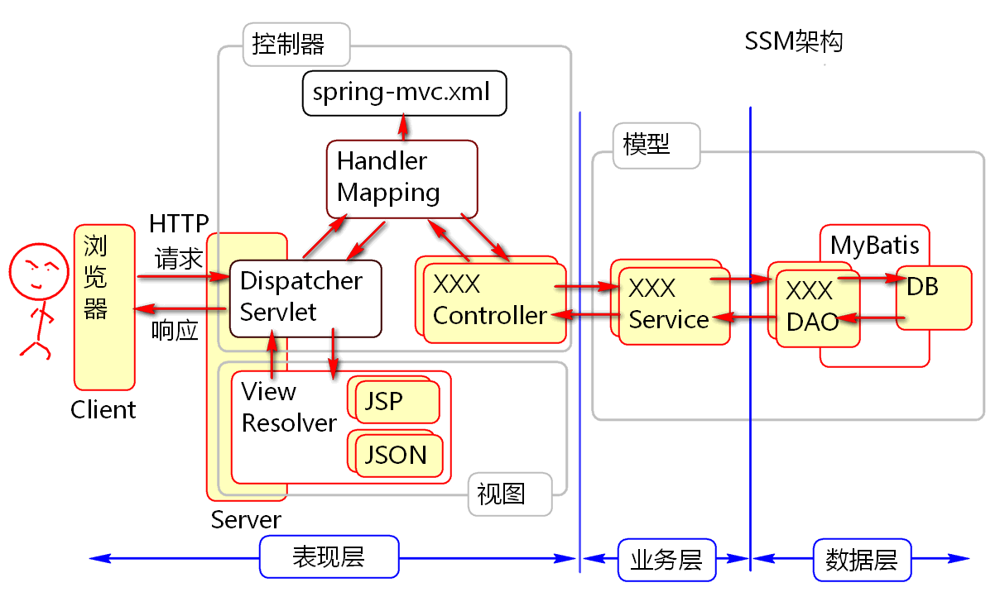
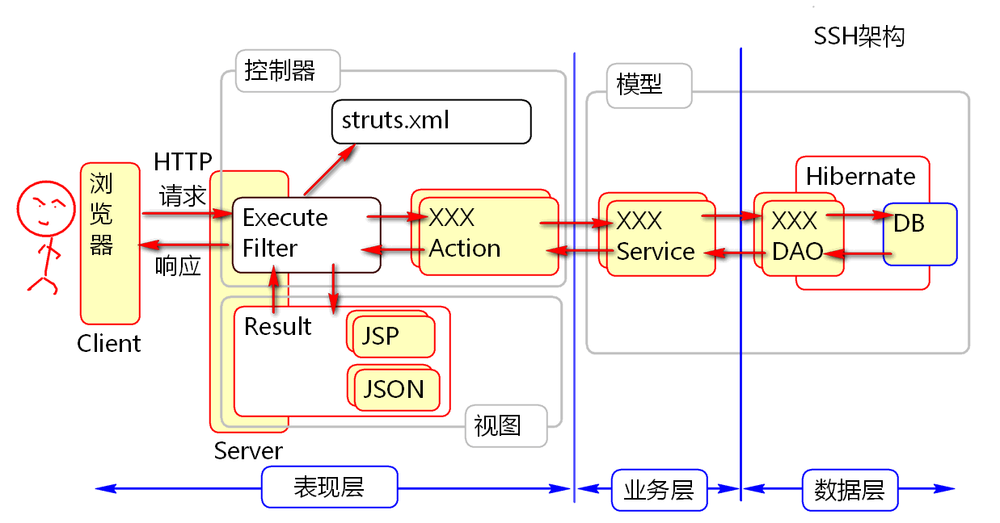
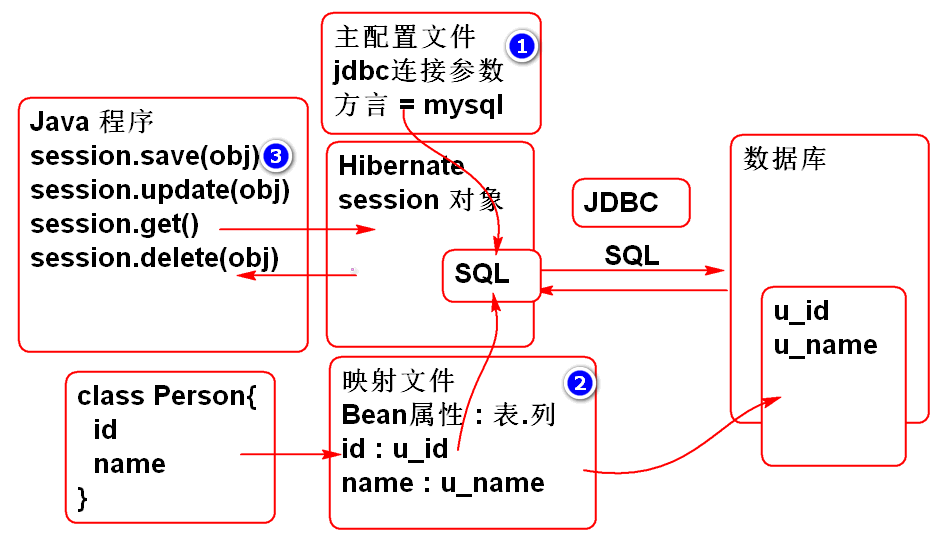

# 一. MVC 模式
## 1. 概述
1. MVC 模式是用户界面的经典设计模式! 无论是手机还是桌面以及WEB应用界面都采用了MVC模式.
2. 在 Java WEB 编程中, 有很多的框架采用了MVC模式, 可以大大简化视图层的编码工作, 提高开发效率.
3. MVC 模式与软件开发的三层结构没有直接关系, 两者在不同角度对软件结构进行解读.


## 2. SSM 整合框架

****

- **SSM 整合框架**

  - 由 Spring, Spring MVC, MyBatis 三个框架组成.
  - Spring : Web 容器, 负责 Bean 组件管理, 包括 IOC 和 AOP 两大部分.
  - Spring MVC : 视图层开发框架, 简化视图层开发
  - MyBatis : 持久层通讯框架, 负责数据库操作.

- **C-控制器**:
  SSM 整合框架以 Spring MVC 的 DispatcherServlet 为主控制器, 
  根据 HandlerMapping 以及配置文件, 调用相应的子控制器. 
  主控制器与子控制器共同组成了 MVC 模式中的控制器部分.

- **V-视图**:
  SSM 整合框架由视图解析器, 以及相关的视图技术, 组成 MVC 模式中视图部分

- **M-模型**:
  SSM 整合框架, 以 MyBatis 为数据库操作框架, 加上具体的业务层业务方法, 
  组成 MVC 模式中的模型部分.

## 3. SSH 整合框架



# 二. Struts2 基础
## 1. 概述

1. 来自Apache基金会的软件： http://struts.apache.org
2. Struts2 与 Struts1 完全没有关系
3. Struts2 的前身是 WebWorks 
4. Spring MVC\Struts2\Struts1 都是 MVC 模式的Web框架

  - MVC是非常流行的 用户界面设计模式。
  - MVC是3层架构中的表现层。


## 2. Struts2 基本配置

### 2.1. 创建项目, 导入 Struts2 依赖包

`org.apache.struts : struts2-core : 2.3.8`

### 2.2. Struts2 主控制器
#### 1) 默认配置
- Struts2 使用一个特殊的 Filter 作为主控制器, 所有的请求都要经过该 Filter 进行处理.

  > 主控制器: StrutsPrepareAndExecuteFilter

- 主控制器需要在项目的部署描述文件, 即 **web.xml** 中进行配置.

  ```xml
  <filter>
      <display-name>StrutsPrepareAndExecuteFilter</display-name>
      <filter-name>StrutsPrepareAndExecuteFilter</filter-name>
      <filter-class>
          org.apache.struts2.dispatcher.ng.filter.StrutsPrepareAndExecuteFilter
      </filter-class>
  </filter>
  <filter-mapping>
      <filter-name>StrutsPrepareAndExecuteFilter</filter-name>
      <url-pattern>/*</url-pattern>
  </filter-mapping>
  ```

#### 2) 自定义配置
- StrutsPrepareAndExecuteFilter 启动时会加载主配置文件, 默认文件名为 **src/struts.xml**.

- 若使用其他文件名, 需要在 < filter> 元素下的 < init-param> 进行配置.

  ```xml
  <filter>
  　　<init-param> 
  　　　　<param-name>filterConfig</param-name> 
  　　　　<param-value>classpath: 主配置文件路径</param-value> 
  　　</init-param> 
  </filter>
  ```

### 2.3. Struts2 主配置文件
#### 1) DTD 校验信息
- Struts2 主配置文件的 DTD 信息可以从 struts2-core-2.3.8.jar 包的 struts-2.3.dtd 文件中获取. 
- DTD 信息用来规定当前 xml 文件中可以使用哪些元素或标签, 并规定了标签之间的嵌套关系, 其中根标签为 < struts > 
- DTD 信息还规定了文件中各标签的顺序, 如果顺序颠倒, 编译器也会提示文件错误.

  > 	< ?xml version="1.0" encoding="UTF-8"?>
  > 	< !DOCTYPE struts PUBLIC
  > 	　　"-//Apache Software Foundation//DTD Struts Configuration 2.3//EN"
  > 	　　"http://struts.apache.org/dtds/struts-2.3.dtd"

#### 2) package 元素
- package 元素用来指定第一层路径名, 以及使用的 struts 基础库

  > ```
  > < struts>
  > 　　< package name="模块名,无特殊含义" namespace="/模块路径" extends="基础配置包">
  > 	　　　　< action name="请求名" class="包名" method="控制器方法">
  > 	　　　　　　< result name="action的返回值" type="result类型">...< /result>
  > 	　　　　< /action>
  > 　　< /package>
  > < /struts>
  > ```

  - **name**: 作为标识符, 无特殊含义, 可任意命名, 但不能重复
  - **namespace**: 用作第一层路径名, 可视作模块名, 不指定则为根目录
  - **extends**: 继承 struts 基础配置文件, 包含了struts 框架的基础库, 通常继承 struts-default, 或 json-default

#### 3) action 元素
- 用来指定二级路径名, 并指定响应请求的 action 类

  - **name**: 用作二级路径名, 与 package 元素的 namespace 共同组成请求的完整路径 
  - **class**: 指定响应请求的 action 类, 执行类中的控制器方法.
  - **method**: 指定响应请求的控制器方法, 未指定则执行 execute 方法.一个控制器类中可以写多个控制器方法, 在配置文件用用 method 属性区分即可.

#### 4) result 元素
- 用来指定 execute 方法返回值所对应的视图页面, 同一个 action, 可以返回多个不同的 result

  - **name**: 当控制器方法的返回值是 name 属性的值, 则使用相应的 result 类型处理
  - **type**: 指定返回值所对应的 result 类型, 默认使用 dispatch, 进行页面转发

### 2.4. Struts 配置文件的结构
配置文件也有继承关系, 可以先将全局的拦截器栈, 异常拦截器, result等等通用的部分, 用一个 basepkg 都配置好,
其他 package 可以继承于这个 basepkg, 只需要配 action 即可


### 2.5.  Struts2 工作原理


1. 浏览器发送请求, 主控制器(filter)根据配置文件, 找到 Action 类
2. 主控制器调用 Action 类的处理器方法 execute(), 方法返回结果字符串 success, 
3. 调用指定的视图页面 JSP, 生成结果页面 HTML
4. 结果页面 HTML 发回给主控制器
5. 主控制器将结果页面发送给浏览器

### 2.6. 案例: Hello World
1. 编写控制器类:

  - Struts2 控制器中的默认处理方法名为 execute, 若使用其他方法名, 需要在 struts.xml 中指定
  - return 返回视图的名称

    ```java
    public class DemoAction {
        public String execute(){
            System.out.println("Hello World!");
            return "success";
        }
    }
    ```

2. 编写jsp: 

  - 该视图页面处理业务方法后的数据, 不能让用户直接访问, 存放在/WEB-INF/jsp/ok.jsp

	```html
    <body>
        <h1>Struts2</h1>
        <p>Hello World!</p>
    </body>
    ```

3. 编写配置文件

  - 指定使用的控制器类与控制器方法

	```xml
    <struts>
        <package name="demo" namespace="/demo" extends="struts-default" >
            <action name="hello" class="cn.tedu.controller.DemoAction">
                <result name="success"> /WEB-INF/jsp/ok.jsp </result>
            </action>
        </package>
    </struts>
    ```


## 3. 接收用户提交的数据

Struts2 框架, 利用 Action 控制器类的 "Bean属性" 接收用户提交的数据.
注: Bean属性: 指类中声明的 getXXX 和 setXXX 方法

### 3.1. 直接接收参数

#### 1) 工作原理


1. 请求发送到服务器时, struts2 的主控制器接收请求, 并根据配置文件, 找到相应的子控制器.
2. 请求中发送的数据, 会利用 Bean 属性, 即子控制器中的 set 方法, 给子控制器的对象属性赋值.
3. 参数传递结束后, 主控制器再调用子控制器的 execute 方法, 处理业务逻辑并返回执行结果.
4. 主控制器根据返回结果, 处理 result, 通常是将请求转发到响应页面.

#### 2) 案例: 直接接收参数

1. 声明控制器 
    控制器中添加了 name, age 两个属性, 并将接收到的用户数据输出到控制台.

    ```java
    public class ParamAction {
        private String name;
        private int age;
        public String execute(){
            System.out.println("name:"+name);
            System.out.println("age:"+age);
            return "success";
        }
        // get, set, toString, hashCode 等方法略
    }
    ```

2. 编写JSP: param.jsp
    显示欢迎信息
    
    ```html
    <body>
        <h1>Struts2</h1>
        <p>接收参数</p>
    </body>
    ```

3. 配置控制器:

   ```xml
   <!-- 请求路径: /demo/param.action?name=Tom&age=5 -->
   <action name="param" class="cn.tedu.controller.ParamAction">
       <result name="success"> /WEB-INF/jsp/param.jsp </result>
   </action>
   ```

### 3.2. 利用领域模型(值对象)封装用户提交的大量参数
#### 1) 工作原理
- 当用户提交的表单数据很多, 并且表单项目会重用时候, 可以利用领域模型(值对象)封装用户提交的表单
- 表单提交数据时, 表单项的 name 属性, 要按以下格式定义, 其名与值对象的类名无关.

  > 表单项的name = Action类的值对象属性.值对象的Bean属性

  	name="userValue.name"


1. 主控制器读取数据, 先调用 Action1 控制器的 get 方法, 获取值对象
2. 若值对象不存在(或没有 get 方法导致获取失败), 主控制器会 new 一个值对象, 通过 set 方法注入
3. 主控制器调用值对象的 set 方法, 将数据注入到值对象的相应属性中.
4. 处理后续数据的时候, 主控制器会再次调用 Action 控制器中的 get 方法, 获取值对象.
5. 若能成功获取值对象, 则调用值对象的 set 方法, 将数据注入到值对象的相应属性中.

#### 2) 正常情况下
- 第一次获取值对象时获取失败, 主控制器 new 一个值对象后注入数据.
  后续每次都能顺利获取到这个值对象, 能将数据成功注入到值对象中.


#### 3) 缺少get方法
- 处理每个数据时, 调用 GET 方法获取值对象都失败, 主控制器每次都 new 一个新的值对象
  后面的值对象会覆盖前面的值对象, 导致数据的丢失.


#### 4) 案例: 利用值对象接收参数

1. 声明领域模型(值对象)
    值对象用于数据打包, 不一定是业务实体.

	```java

  	public class UserValue implements Serializable {
  		private static final long serialVersionUID = 232L;
  		private String name;
  		private String password;
  		private Integer age;
  		private String address;
  		// 构造器, get, set, toString 方法略
  	}
  	```

2. 定义控制器, 添加属性, 用以接收领域模型参数:

	```java
   public class UserAction {
   		private UserValue userValue;
   		public String execute(){
   			System.out.println(userValue);
   			return "success";
   		}
   		// get, set, toString, hashCode 等方法略
   	}
   ```

3. 开发JSP页面, 用于提交表单参数:

	```html
   <body>
   		<h1>提交用户信息</h1>
   		<form action="demo/user.action" method="post"> <br/>
   				用户名: <input type="text" name="userValue.name"> <br/>
   				密码: <input type="password" name="userValue.password"> <br/>
   				年龄: <input type="text" name="userValue.age"> <br/>
   				地址: <input type="text" name="userValue.address"> <br/>
   				<input type="submit" value="保存"> <br/>
   		</form>
   	</body>
   ```

4. 配置控制器 struts.xml

	```xml
   <action name="user"class="cn.tedu.controller.UserAction">
   		<result name="success"> /WEB-INF/jsp/ok.jsp </result>
   	</action>
   ```

## 4. 发送数据到浏览器

### 4.1. 工作原理
- 控制器中的 Bean属性, 会通过 get 方法会自动传递到 JSP 中, 其底层是利用 request 传递的.


1. 用户通过浏览器提交数据, 封装到值对象 userValue 中.
2. 控制器处理完 userValue 后, 还添加了 message 属性信息.
3. 将请求转发到 jsp 页面时, userValue 和 message 属性也会一并传递到 jsp 中.
4. 在 jsp 页面中, 可以使用 EL+JSTL 获取控制器 bean 属性的值.

### 4.2. 案例: 通过 Bean 属性发送数据
1. 重构 UserAction, 添加 bean 属性 message:
    转发的目标 JSP 收到两个 Bean对象: message 和 userValue
    对应着 Action 对象的 get 方法, 在 JSP 中可以使用 EL 表达式访问这些属性

	```java

  	private String message;
  	public String execute(){
  		System.out.println(userValue);
  		message = "成功!";
  		return "success";
  	}
  	// get, set, toString, hashCode 等方法略
  	```

2. 编写数据展示页面 success.jsp
    在JSP中可以利用EL表达式和 JSTL 配合显示控制器传递来的属性.
    参数传递依赖于 request, 即可通过 requestScope 指定搜索范围.

	```html

  	<body>
  		<h1>表单结果</h1>
  		<p>收到了两个bean对象: message, userValue</p>
  		<p>消息: ${message}</p> 
  		<p>用户名: ${userValue.name}</p>
  		<p>密码: ${userValue.password}</p>
  		<p>年龄: ${userValue.age}</p>
  		<p>地址: ${requestScope.userValue.address}</p>
  	</body>
  	```

3. 重构配置文件, UserAction 控制器处理结束后转发到 success.jsp

	```xml
   <action name="user"
   		class="cn.tedu.controller.UserAction">
   		<result name="success">  /WEB-INF/jsp/success.jsp  </result>
   	</action>
   ```

## 5. 访问 session 对象
- 在 struts2 中, session 是一种 Map 类型, org.apache.struts2.dispatcher.SessionMap.
- map 类型的 session, 可以做到与容器无关化, 方便单独测试.
- 如果把数据保存到这个 session(map) 中, struts 2 会自动的将数据存储到 HttpSession 对象中,可以使用EL读取session

在 Struts 2 控制器用两种访问 Session 的方式:

### 5.1. 利用 ActionContext 获取Session
#### 1) 工作原理

- ActionContext 代表当前控制器的工作环境: 被哪个主控制器调用, 当前的request, 当前的resopnse, 当前session 等信息, 都可以从 ActionContext 获得.

  > ActionContent.getSession()
  
      	ActionContext ctx = ActionContent.getContext();
      	Map<String, Object> session = ctx.getSession();
      	session.put("loginUser", "Tom");

#### 2) 案例: 利用 ActionContext 获取 Session

1. 重构UserAction, 转发到 JSP 之前在 session 中添加属性:

	```java
        public String execute(){
        		System.out.println(userValue);
        		message = "成功!";
        		ActionContext context = ActionContext.getContext();
        		Map<String, Object> session = context.getSession();
        		session.put("loginUser", "Tom");
        		return "success";
        }
	```

2. 重构 success.jsp 利用EL 显示session中的属性:

        <p>Session: ${sessionScope.loginUser} </p>	

### 5.2. 利用 SessionAware 接口注入 Session 对象

#### 1) 工作原理
Struts2 的子控制器, 只要实现了 SessionAware 接口, 实现其 Bean 属性注入方法 setSession, 
Struts2 主控制器就会在执行控制器方法之前调用 setSession 方法, 将 Session 对象注入到控制器中.
之后控制器方法就可以直接调用 session.

 

#### 2) 案例: 实现 SessionAware 接口注入 session

1. 声明控制器, 实现 SessionAware 接口:

        public class SessionAction implements SessionAware{
        	private Map<String, Object> session;
        	public void setSession(Map<String, Object> session) {
        		this.session=session;
        	}
        	public String demo(){
        		session.put("name", "Tom");
        		return "success";
        	}
        }

2. 编写 success.jsp 测试, 获取 session 中存储的数据:

        <body>
        	<h1>Session</h1>
        	<p>session数据: ${name}</p>
        </body>

3. 编辑配置文件, struts.xml

        <action name="session" class="cn.tedu.controller.SessionAction" method="demo">
        	<result name="success"> /WEB-INF/jsp/session.jsp </result>
        </action>

## 6. 提取 AbstractAction, 简化控制器 
### 6.1. 工作原理

- 为了重用 SessionAware 注入代码, 简化控制器编写, 在实际工作中经常抽取 AbstractAction, 封装控制器的公共代码, 简化控制器的开发. 
- 除了 SessionAware, Struts2 还提供了 RequestAware 和 ApplicationAware, 用于注入 request 和 application, 为了方便控制器的编程, 可以将这些接口在 AbstractAction 上一并实现:
- Struts 2 还提供了一个 ActionSupport 类, 封装了 Action 常用功能, 建议作为 Action 的父类, 简化Action的开发.

 

### 6.2. 编码实现
1. 编写 AbstractAction, 继承 ActionSupport, 实现 SessionAware, RequestAware, ApplicationAware
        
        public abstract class AbstractAction extends ActionSupport
        	implements SessionAware, RequestAware, ApplicationAware{
        
        	protected Map<String, Object> request;
        	protected Map<String, Object> session;
        	protected Map<String, Object> application;
        	
        	public void setSession(Map<String, Object> session) {
        		this.session=session;
        	}
        	public void setRequest(Map<String, Object> request) {
        		this.request=request;
        	}
        	public void setApplication(Map<String, Object> application) {
        		this.application=application;
        	}
        }

2. 控制器可以简化为:

        public class DemoAction extends AbstractAction{
        	public String execute(){
        		request.put("myName", "Wang");
        		session.put("name", "Andy");
        		application.put("test", "熊大");
        		return SUCCESS;
        	}
        }	

3. 配置控制器:

        <action name="demo" class="cn.tedu.controller.DemoAction">
        	<result name="success"> /WEB-INF/jsp/session.jsp </result>
        </action>

4. session.jsp

        <body>
        	<h1>Session</h1>
        	<p>session数据: ${sessionScope.name}</p>
        	<p>request数据: ${requestScope.name}</p>
        	<p>application数据: ${applicationScope.test}</p>
        </body>


# 三. Spring 与 Struts2 整合应用
## 1. 控制器的线程安全(重要) 

Struts2 使用控制器的 Bean 属性接收参数, 如果多个请求共享同一个控制器对象, 则会存在线程安全问题, 用户的数据会被覆盖.
为了解决线程安全问题,  Struts2 的为每个用户请求创建一个新的子控制器对象, 但主控制器永远只有一个.

 

Spring MVC 的控制器是单例的, 它采用方法处理用户请求, 通过方法参数接收数据.
每个请求调用一次方法, 会在栈中创建独立的栈帧, 不存在线程安全问题, .

## 2. Spring 和 Struts 2 整合

### 2.1. 为什么要将 Spring 和 Struts2 整合

1. Spring 框架核心功能: IOC/DI  AOP

  - IOC/DI 管理对象, 管理对象和对象的关系, 可以解除耦合
  - AOP 面向切面编程, 拦截式编程, 事务管理, 日志记录等

2. Struts2 可以简化WEB编程.
3. 整合以后, Spring 将接管 Struts 2 控制器对象的管理, 帮助创建 Struts 2 控制器Bean对象.

  1. 简化了Web开发
  2. 简化业务层和持久层组件的开发.

### 2.2. 整合步骤:

1. 导入包 Struts 2 提供的整合包
    导入以后, 无需额外配置, 两者能自动协调工作!

  	org.apache.struts : struts2-spring-plugin : 2.3.8

2. 导入Spring包, 和配置Spring容器.
    Spring 包已经自动依赖, 无需再次导入
    配置 ContextLoaderListener, 要求配置参数 contextConfigLocation, 指定 spring 配置文件路径

      	<listener>
      		<listener-class>org.springframework.web.context.ContextLoaderListener</listener-class>
      	</listener>
      	<context-param>
      		<param-name>contextConfigLocation</param-name>
      		<param-value>classpath:spring-*.xml</param-value>
      	</context-param> 	

3. 添加 Spring 配置文件 spring-web.xml
    自动导入的 Spring 版本是 3.0 版本, 配置文件中的 Schema 文件版本也要改成 3.0 版本的! 否则无法使用.

      	< ?xml version="1.0" encoding="UTF-8"?>
      	< beans xmlns="http://www.springframework.org/schema/beans" 
      		xmlns:xsi="http://www.w3.org/2001/XMLSchema-instance"
      		xmlns:context="http://www.springframework.org/schema/context" 
      		xmlns:jdbc="http://www.springframework.org/schema/jdbc"  
      		xmlns:jee="http://www.springframework.org/schema/jee" 
      		xmlns:tx="http://www.springframework.org/schema/tx"
      		xmlns:aop="http://www.springframework.org/schema/aop" 
      		xmlns:mvc="http://www.springframework.org/schema/mvc"
      		xmlns:util="http://www.springframework.org/schema/util"
      		xmlns:jpa="http://www.springframework.org/schema/data/jpa"
      		xsi:schemaLocation="
      			http://www.springframework.org/schema/beans 
      				http://www.springframework.org/schema/beans/spring-beans-3.0.xsd
      			http://www.springframework.org/schema/context 
      				http://www.springframework.org/schema/context/spring-context-3.0.xsd
      			http://www.springframework.org/schema/jdbc
      				http://www.springframework.org/schema/jdbc/spring-jdbc-3.0.xsd
      			http://www.springframework.org/schema/jee
      				http://www.springframework.org/schema/jee/spring-jee-3.0.xsd
      			http://www.springframework.org/schema/tx 
      				http://www.springframework.org/schema/tx/spring-tx-3.0.xsd
      			http://www.springframework.org/schema/data/jpa 
      				http://www.springframework.org/schema/data/jpa/spring-jpa-1.3.xsd
      			http://www.springframework.org/schema/aop 
      				http://www.springframework.org/schema/aop/spring-aop-3.0.xsd
      			http://www.springframework.org/schema/mvc 
      				http://www.springframework.org/schema/mvc/spring-mvc-3.0.xsd
      			http://www.springframework.org/schema/util 
      				http://www.springframework.org/schema/util/spring-util-3.0.xsd">
      	
      	</beans>

4. 利用 Spring 管理 控制器Bean组件, 注意这些 bean 不能是单例的, 否则有线程安全问题!!
    Spring 默认采取单例模式管理对象, 而 Struts2 为了解决线程安全问题需要多个控制器对象, 需要声明为 **prototype** 模式

      > @Controller
      > @Scope("prototype")
    
      	@Controller
      	@Scope("prototype")
      	public class HelloAction extends AbstractAction {
      		public String execute(){
      			System.out.println("Hello World!");
      			return SUCCESS;
      		}
      	}

5. 在 spring 配置文件中配置组件扫描功能 spring-web.xml

   <context:component-scan  base-package="cn.tedu.controller"/>

6. 在 Struts2 配置文件中, class 属性替换为 Spring BeanID 即可使用Spring 创建的Bean组件了.

  > < action name="请求名" class="**BeanId**" >...< /action>

      	<action name="hello" class="helloAction">
      		<result type="dispatcher" name="success"> /WEB-INF/jsp/ok.jsp </result>
      	</action>	

# 四. Struts2 高级应用
## 1. 案例: Struts 简单应用
### 1.1. 需求分析
实现一个简单的列表功能


### 1.2. 编码实现
1. 创建项目并配置环境, spring + struts2,略

2. 创建业务层:

        @Service
        public class ProductService {
        	List<Product> products;
        	
        	@PostConstruct
        	private void init(){
        		products = new ArrayList<Product>();
        		products.add(new Product(1,"大黄蜂",24.5,"变形金刚经典系列"));
        		products.add(new Product(2,"擎天柱",88.5,"变形金刚经典系列"));
        		products.add(new Product(3,"光头强",12.5,"大笨熊你粗来!"));
        		products.add(new Product(4,"李老师",22.5,"胡说派诗人!"));
        		products.add(new Product(5,"范传奇",23.5,"变形金刚消费者!"));
        	}
        	// get, set, toString, hashCode 等方法略
        }

3. 创建控制器

        @Controller
        @Scope("prototype")
        public class ProductAction {
        	
        	@Resource
        	private ProductService productService;
        	private List<Product> products;
        	private String name;
        
        	public String list(){
        		name = "list";
        		products = productService.getProducts();
        		ActionContext context = ActionContext.getContext();
        		context.getSession().put( "loginUser", "老王");
        		return "success";
        	}
        	// get, set, toString, hashCode 等方法略
        }

4. 创建 list.jsp
    使用 jstl 进行表格数据的迭代显示

  	<%@ page contentType="text/html; charset=utf-8" pageEncoding="utf-8"%>
  	<%@ taglib prefix="c"  uri="http://java.sun.com/jsp/jstl/core" %>
  	<!DOCTYPE html>
  	<html>
  	<head>
  		<meta charset="utf-8">
  		<title>产品管理</title>
  		<style type="text/css">
  			table { border-collapse: collapse; }
  			td, th{ padding: 5px 10px;  }
  			th{ border-bottom: 2px solid #ddd; }
  			td{ border-top: 1px solid #ccc; }
  		</style>
  	</head>
  	<body>
  		<h1>产品管理</h1>
  		<table>
  			<thead>
  				<tr>
  					<th>编号</th>
  					<th>名称</th>
  					<th>价格</th>
  					<th>描述</th>
  				</tr>
  			</thead>
  			<tbody>
  				<c:forEach items="${products}" var="p">
  					<tr>
  						<td>${p.id}</td>
  						<td>${p.name}</td>
  						<td>${p.price}</td>
  						<td>${p.description}</td>
  					</tr>
  				</c:forEach>
  			</tbody>
  		</table>
  	</body>
  	</html>

5. 配置struts.xml

   <package name="product" namespace="/product" extends="struts-default">
   		<action name="list" class="productAction" method="list">
   			<result> /WEB-INF/jsp/list.jsp </result>
   		</action>	
   	</package>

## 2. ValueStack

- 是 Struts 中共享数据的一个机制, 利用 ValueStack 可以在 Struts 组件之间共享数据, 包括:

  - 构造器 Action
  - 结果 自定义的 Result
  - 视图 JSP
  - 配置文件 struts.xml

- 但在不同的组件中获取数据的方式有所不同. 

### 2.1. 工作原理


- ValueStack 是服务器中的一个对象, 其中有一个属性指向了当前的控制器
- 也可以认为当前控制器就是 ValueStack 对象的一部分.
- 而在程序运行的过程中, ValueStack 对象会传递到 Struts.xml, result, jsp 等组件中, 
- 故这些组件都可以从中获取控制器的数据.

#### 1) 在 jsp 中获取 ValueStack 的数据
- JSP 中使用 s:debug 标签可以显示 ValueStack 对象, 其中显示了当前请求涉及到的所有数据.
- 想要获取数据, 可以用 OGNL+struts 标签, 也可以使用 EL+JSTL标签

  > < s: struts 标签 value = OGNL 表达式/>
  > < c: jstl 标签 value = EL 表达式 />

#### 2) 在配置文件 struts.xml 中获取数据
- 配置文件中也可以使用 ValueStack 获取数据, 可以根据 action 的计算结果指定配置参数, 更加灵活方便
- 在配置文件中, 使用 $ 表达式获取 ValueStack 中的数据, 通常使用 String 类型.

  > ${bean属性}

#### 3) 在 Result 中获取数据
在自定义的 Result 类型中, 也可以获取 ValueStack 中的数据

### 2.3. ValueStack 和 OGNL
#### 1) OGNL 表达式
- OGNL 是一个第三方组件, 是 Struts2 采用的默认表达式, Mavan 会自动导入相关的依赖包.
- 可以配合 struts 标签在 JSP 中读取 ValueStack 中的数据.

#### 2) ValueStack 和 OGNL
- Struts2 中利用 ValueStack 在所有组件之间共享数据, 其中控制器也被放到 ValueStack 中
- 在任何组件中都可以使用 ONGL 表达式读取 ValueStack 中的数据, 包含读取控制器 Action 中的数据
- 使用 OGNL 读取 ValueStack 数据时候是按照从上到下顺序查找, 即 **< s:debug/>** 元素显示的顺序
- Struts2 底层接管了 EL 和 JSTL, 将 EL 数据读取转到了 ValueStack 上, EL 的读取结果与 OGNL 一样
- 如果需要读取 ValueStack 的 Context 区域,就必须使用 OGNL, 且使用 #key 格式

  > < s:property value="#属性的key" />

### 2.4. 案例: 获取数据组成列表

1. 编写控制器, 重用上一案例的 ProductAction
2. 创建vs.jsp

        <%@ page contentType="text/html; charset=utf-8" pageEncoding="utf-8"%>
        <%@ taglib prefix="s" uri="/struts-tags"%>
        <!DOCTYPE html>
        <html>
        <head>
        	<meta charset="utf-8">
        	<title>产品管理</title>
        	<style type=" border-collapse: collapse; }
        		td, th{ padding: 5px 10px;  }
        		th{ border-bottom: 2px solid #ddd; }
        		td{ border-top: 1px solid #ccc; }
        	</style>
        </head>
        <body>
        	<h2>ValueStack</h2>
        	<s:debug></s:debug>
        
        	<h2>利用 OGNL 表的式读取 ValueStack 中的数据</h2>
        	<p>读取 ValueStack 中的 Action 对象的数据</p>
        	<s:property value="products[0].name"/> 
        
        	<h3>利用 ValueStack 和 OGNL 显示商品列表</h3>
        	<table>
        		<thead>
        			<tr>
        				<th>ID</th> <th>名称</th> <th>价格</th> <th>描述</th>
        			</tr>
        		</thead>
        		<tbody>
        			<s:iterator value="products" var="p">
        				<tr>
        					<td><s:property value="id"/></td>
        					<td><s:property value="name"/></td>
        					<td><s:property value="price"/></td>
        					<td><s:property value="description"/></td>
        				</tr>
        			</s:iterator>
        		</tbody>
        	</table>
        </body>
        </html>

3. 配置struts.xml

   <action name="vs" class="productAction" method="list">
   		<result> /WEB-INF/jsp/vs.jsp </result>
   	</action>	

### 2.5. ValueStack 的结构


ValueStack 分为 Content 内容区和 Context 环境信息区
#### 1) Content 内容区
- 内容区主要是控制器对象, 包含了控制器中的所有 bean属性
- 使用 OGNL 表达式的时候, 直接写属性名就能获取其数据, 
- 但由于读取数据时是自上而下查找, 如果有多个对象的属性同名, 则后者会被遮挡而无法读取.

#### 2) Context 上下文区
- 上下文区中主要存放了当前会话中的环境信息, 包括 Request, session, application 等
- 采取 **#key** 来取数据, 如果对象还有下级属性, 可以使用 **#key.属性** 来直接获取属性值

  > < s:property value=**#key** />

### 2.6. 案例: 获取 request, session application 数据 
1. 编写控制器

   @Controller
   	@Scope("prototype")
   	public class DataAction extends AbstractAction{
   		
   		//在内容区域共享数据, 利用控制器的Bean属性
   		private String name;
   		private int age;
   		private String target; //目标网页名, 还可以通过 @Value("#{cfg.data}") 指定
   		
   		public String execute(){
   			
   			//上下文区域(环境) Context 区域, 共享数据
   			request.put("message", "Struts 测试");
   			session.put("loginState", "已经登录");
   			application.put("count", 55);
   			
   			name="老王";
   			age = 123;
   			target = "show.jsp";//目标视图页面
   			
   			return SUCCESS;
   		}
   		// get, set, toString, hashCode 等方法略
   	}

2. 编写 show.jsp 
   ​	
   <%@ page contentType="text/html; charset=utf-8" pageEncoding="utf-8"%>
   	<%@ taglib prefix="c" uri="http://java.sun.com/jsp/jstl/core" %>
   	<%@ taglib prefix="s" uri="/struts-tags"%>
   	<!DOCTYPE html>
   	<html>
   	<head>
   	<meta charset="utf-8">
   	<title>ValueStack</title>
   	</head>
   	<body>
   		<h1>ValueStack</h1>
   		<h2>读取内容区域的值</h2>
   		<s:property value="name"/>
   		<s:property value="age"/>
   		<s:property value="target"/>
   		
   		<h2>读取上下文区域的值</h2>
   		<p>读取上下文区域使用 # 为开头的表达式</p>
   		<s:property value="#request.message"/>
   		<s:property value="#session.loginState"/>
   		<s:property value="#application.count"/>
   	</body>
   	</html>

3. 配置 struts.xml
    其中表达式 ${target} 就是利用 ValueStack 从控制器读取了属性值. 

  	<action name="data" class="dataAction">
  		<result>
  			/WEB-INF/jsp/${target}
  		</result>
  	</action>	

4. 测试
   ​	
   http://localhost:8080/ssh3/product/data.action

## 3. Result
### 3.1. 工作原理

 

- 服务器收到请求后, 主控制器根据配置文件找到子控制器, 执行控制器方法, 返回字符串返回值.
- 方法的返回值对应一个 Result 类型, 每个 Result 类型都对应一个类, Result 类型的具体功能是由这个类提供算法支持. 
  如: dispatcher 类型, 由 ServletDispatcherResult 类来处理, 执行时调用其中的 doExcute 方法.

- Struts2 的 struts-default 包中提供了丰富的 Result 类型, 只要继承 struts-default 即可以继承并使用这些 Result 类型. 
- 如果对 Struts2 提供的 Result 类型不满意, 可以自行添加 Result 类进行扩展, 扩展出自己的 Result 类型.

      <package name="struts-default" abstract="true">
         <result-types>
            <result-type name="dispatcher" default="true"
      			class="org.apache.struts2.dispatcher.ServletDispatcherResult"/>
            <result-type name="redirect" 
      			class="org.apache.struts2.dispatcher.ServletRedirectResult"/>
            <result-type name="redirectAction" 
      			class="org.apache.struts2.dispatcher.ServletActionRedirectResult"/>
            <result-type name="stream" 
      			class="org.apache.struts2.dispatcher.StreamResult"/>
           	...
         </result-types>
      </package>

### 3.2. 添加自定义 Result 类型
#### 1) 定义自己的 Result 类
- 自定义的 result 类型, 要求继承于 StrutsResultSupport 类, 并实现 doExecute 方法

#### 2) 添加 result-type 配置文件
- 在自定义的 package 中, 通过 result-type 声明自定义的 result 类型.

  > < package name="struts包名">
  > 　　< result-types>
  > 　　　　< result-type name="**类型id**" class="**包名.类名/BeanId**"/>
  > 　　< /result-types>
  > < /package>

### 3.3. 常用的 Result 类型

#### 1) dispatcher

- dispatcher 类型是默认的结果类型, 其处理规则是将控制器转发到目标JSP.
- 配置文件的格式, 可以从手册中获取 org.apache.struts2.dispatcher.ServletDispatcherResult

  - 可以使用 **location** 参数指定目标 URL:

    > < result name="success" type="dispatcher">
    > 　　< param name="**location**"> **目标URL** < /param>
    > < /result>

  - 也可以通过 result 元素的内容指定目标 URL:

    > < result name="success" type="redirect"> **目标URL** < /result>

 

- 演示案例:

   <action name="demo" 
   		class="cn.tedu.controller.DemoAction">
   		<result name="success">
   			/WEB-INF/jsp/session.jsp
   		</result>
   	</action>

#### 2) redirect

- 就是重定向, 控制器处理以后, 重定向到其他目标 URL:
- 配置文件的格式, 可以从手册中获取 org.apache.struts2.dispatcher.ServletRedirectResult

  - **location** 参数用来指定目标地址
  - **parse** 参数指定是否允许在实际视图名字中使用 OGNL 表达式, 默认为 true, 通常不作修改
  - **anchor** 参数指示目标视图页面中的锚点, 通常不作指定.

  > < result name="视图名" type="redirect">
  > 　　< param name="location"> 目标路径 < /param>
  > 　　< param name="parse"> false < /param>
  > 　　< param name="anchor"> 锚点位置 < /param>
  > < /result>

 

- 案例:

1. 编写控制器
    ​	
    @Controller
    		@Scope("prototype")
    		public class RedirectDemoAction extends AbstractAction{
    			public String execute() {
    				System.out.println("重定向请求");
    				return SUCCESS;
    			}
    		}

2. 配置 struts.xml

    <action name="doc" class="redirectDemoAction">
    			<result type="redirect" name="success">
    				<param name="location"> http://doc.tedu.cn </param>
    			</result>
    		</action>

#### 3) redirectAction

- 与 redirect 类似, 只是重定向的目标不是 url 而是 action
- 配置文件的格式, 可以从手册中获取 org.apache.struts2.dispatcher.ServletActionRedirectResult

  - **actionName** : 指定目标 Action 名
  - **namespace** : 指定目标 Action 所属的命名空间, 即所属模块名

  > < action name="视图名" class="redirectActionDemoAction" >
  > 　　< result name="success" type="redirectAction" >
  > 　　　　< param name="actionName"> **目标action** < /param>
  > 　　　　< param name="namespace"> **/目标模块名** < /param>
  > 　　< /result>
  > < /action>

- 案例:

1. 编写控制器类

    @Controller
    		@Scope("prototype")
    		public class RedirectActionDemoAction extends AbstractAction{
    			public String execute(){
    				System.out.println("重定向到其他控制器");
    				return SUCCESS;
    			}
    		}

2. 配置 struts.xml: 重定向到其他的控制器

    <action name="redirect" class="redirectActionDemoAction">
    			<result type="redirectAction" name="success">
    				<param name="actionName">hello</param>			
    				<param name="namespace">/demo</param>
    			</result>
    		</action>

#### 4) stream
##### 工作原理

- stream 可以用于 HTTP 显示或下载文件, 
- 配置格式参考 org.apache.struts2.dispatcher.StreamResult

  - **contentType** 用于指定传输的文件类型
  - **inputName** 用于指定要传输的数据, 是控制器的bean属性, 其类型必须是 inputStream
  - **contentDisposition** 用于指定文件下载, 不指定则是浏览器打开

  > < action name="action名" class="控制器类" >
  > 　　< result name="success" type="**stream**">
  > 　　　　< param name="contentType"> 数据类型 < /param>
  > 　　　　< param name="inputName"> 数据Bean属性 < /param>
  > 　　　　< param name="contentDisposition"> **attachment;filename="文件名"** < /param>
  > 　　< /result>
  > < /action>


##### 案例1: 展示图片
要在浏览器显示图片, 要指定 contentType 为 image/png, contentDisposition 省略

> < param name="contentType"> **image/png** < /param>

1. 编写控制器:

   @Controller
   	@Scope("prototype")
   	public class ImgAction extends AbstractAction {
   		private InputStream img;
   		private byte[] createPng() throws IOException{
   			BufferedImage img = new BufferedImage(200, 60, BufferedImage.TYPE_3BYTE_BGR);
   			Random r = new Random();
   			for(int i=0; i<100; i++){
   				int x = r.nextInt(img.getWidth());
   				int y = r.nextInt(img.getHeight());
   				int rgb=r.nextInt(0xffffff);
   				img.setRGB(x, y, rgb);
   			}
   			ByteArrayOutputStream out = new ByteArrayOutputStream();
   			ImageIO.write(img, "png", out);
   			out.close();
   			return out.toByteArray();
   		}
   		
   		public String execute() throws IOException{
   			byte[] png=createPng();
   			img = new ByteArrayInputStream(png);
   			return SUCCESS;
   		}
   		// get, set, toString, hashCode 等方法略
   	}

2. 配置 struts.xml: 将图片发送到浏览器

   <action name="img"
   		class="imgAction">
   		<result name="success" type="stream">
   			<param name="inputName">img</param>
   			<param name="contentType">image/png</param>
   		</result>	
   	</action>

##### 案例2: 下载图片
下载文件, 要根据Http协议(RFC2616), 设置contentType 和 contentDisposition

> < param name="contentType"> **application/octet-stream** < /param>
> < param name="contentDisposition"> **attachment;filename="文件名"** < /param>


1. 控制器, 重用 ImgAction

2. 配置struts.xml

   <action name="download" class="imgAction">
   		<result name="success" type="stream">
   			<param name="inputName">img</param>
   			<param name="contentType"> application/octet-stream </param>
   			<param name="contentDisposition"> attachment; filename="demo.png" </param>
   		</result>	
   	</action>

##### 案例3: 下载Excel文件

0. 导入POI API

      org.apache.poi : poi : 3.13

1. 编写控制器

   @Controller
   	@Scope("prototype")
   	public class ExcelAction extends AbstractAction {
   		private InputStream excel;
   		private byte[] createExcel() throws IOException{
   			HSSFWorkbook workbook=new HSSFWorkbook();  		//创建工作簿
   			HSSFSheet sheet= workbook.createSheet("Demo"); 	//创建工作表
   			HSSFRow row = sheet.createRow(0); 				//创建数据行
   			HSSFCell cell = row.createCell(0);				//创建单元格
   			cell.setCellValue("Hello World!"); 				//设置内容
   			ByteArrayOutputStream out = new ByteArrayOutputStream();
   			workbook.write(out);
   			out.close();
   			return out.toByteArray();
   		}
   		public String execute() throws IOException{
   			byte[] buf = createExcel();
   			excel = new ByteArrayInputStream(buf);
   			return SUCCESS;
   		}
   		// get, set, toString, hashCode 等方法略
   	}

2. 配置 struts.xml: 下载Excel文件

   <action name="excel"
   		class="excelAction">
   		<result name="success" type="stream">
   			<param name="inputName">excel</param>
   			<param name="contentType"> application/octet-stream </param>
   			<param name="contentDisposition"> attachment; filename="demo.xls" </param>
   		</result>	
   	</action>

#### 5) json
##### 工作原理
1. 导入 json 支持包
    json Result 不是Struts2 内嵌结果类型, 需要导入 struts2-json-plugin:

  	org.apache.struts : struts2-json-plugin : 2.3.8

2. 继承 json-default 包
    在 struts2-json-plugin-2.3.8.jar 包中的 struts-plugin.xml 文件中声明了 json类型的result
    由于 json-default 继承于 struts-default, 又定义了自己的 json Result,
    让包继承于 json-default, 既可以使用 json result, 也可以使用 struts-default 中定义的 result.

      <result-types>
          <result-type name="json" class="org.apache.struts2.json.JSONResult"/>
      </result-types>

3. Json Result 原理:
    将 Action 类的整体作为 JavaBean, 转换为 json 字符串, 再发送到浏览器 .
    jsonDemoAction 中的所有 Bean 属性都会转换为 json 字符串中的属性


##### 直接使用Json Result
直接使用Json Result, 存在问题是会将控制类中的所有 bean 属性都转换成 json 属性,
不能精确选择控制器中需要的 Bean属性, 不建议直接使用.

1. 编写控制器
   ​	
   @Controller
   	@Scope("prototype")
   	//转换为json: {name:"Tom", age:10}
   	public class JsonDemoAction {
   		private String name;
   		private int age;
   	
   		public String execute(){
   			name = "Tom";
   			age = 10;
   			return "success";
   		}
   		
   		// get, set, toString, hashCode 等方法略
   	}

2. 配置:

   <package name="json" namespace="/json"
   		extends="json-default">
   		<action name="jsonDemo" 
   			class="jsonDemoAction">
   			<result name="success" type="json">
   			</result>
   		</action>
   	</package>

3. 测试

   http://localhost:8080/ssh2/json/jsonDemo.action
   	浏览器得到 json 字符串: {"age":15,"name":"tom"}

##### 使用 root 属性指定一个 bean 属性
使用 root 属性可以指定只转换 json 根节点内容, 不能在 root 属性中设置多个值.
返回的结果直接就是 bean 属性的值, 而不是键值对的形式.

> < result name="success" type="json">
> 　　< param name="root">　bean属性 < /param>
> < /result>

1. 编写控制器:

   @Controller
   	@Scope("prototype")
   	public class RootDemoAction extends AbstractAction{
   		private Object jsonResult;
   		
   		public String execute(){
   			String[] ary={"tom","sdf","dddd","lucy"};
   			jsonResult = ary;
   			return SUCCESS;
   		}
   		// get, set, toString, hashCode 等方法略
   	}

2. 配置:

   <action name="rootDemo" class="rootDemoAction">
   		<result name="success" type="json">
   			<param name="root">jsonResult</param>
   		</result>	
   	</action>

3. 测试:

   http://localhost:8088/JSD1702_13_SSH/json/rootDemo.action
   	["tom","sdf","dddd","lucy"]

##### 使用 includeProperties 属性指定多个 bean 属性
使用　includeProperties　属性可以指定多个要转换的 bean 属性, 
属性列表按正则表达式规则匹配, 多个属性之间用逗号分隔.
对于集合/数组, 直接使用属性名不能获得数组内的内容, 需要使用 **数组.＊** 的格式．
返回的结果是键值对的形式.

> < result name="success" type="json">
> 　　< param name="includeProperties"> 属性1,属性2,数组.* < /param>
> < /result>

1. 配置:

   <action name="rootDemo" class="rootDemoAction">
   		<result name="success" type="json">
   			<param name="includeProperties">jsonResult</param>
   		</result>	
   	</action>

2. 测试:

   http://localhost:8088/JSD1702_13_SSH/json/rootDemo.action
   	{"jsonResult":["tom","sdf","dddd","lucy"]}

### 3.4. 返回多种 result
一个控制器可以返回多种结果, 可以根据不同结果转向不同的 Result, 执行不同的处理

案例:

1. 编写控制器

   @Controller
   	@Scope("prototype")
   	public class ForkAction extends AbstractAction{
   		private static final long serialVersionUID = -2695121980142813965L;
   		private String target;
   	
   		public String execute(){
   			System.out.println("多重处理结果");
   			if("doc".equals(target)){
   				return "doc";
   			}
   			if("success".equals(target)){
   				return SUCCESS;
   			}
   			System.out.println("请求错误");
   			return ERROR;
   		}
   		// get, set, toString, hashCode 等方法略
   	}

2. 配置文件

   <action name="fork" class="forkAction" >
   		<result name="success"> /WEB-INF/jsp/ok.jsp </result>
   		<result name="error" type="redirectAction" >
   			<param name="actionName">hello</param>
   	      	<param name="namespace">/day02</param>
   		</result>
   		<result name="doc" type="redirect" >
   			<param name="location"> http://doc.tedu.cn </param>
   		</result>
   	</action>
3. 测试

   localhost:8088/JSD1702_13_SSH/day02/fork.action?target=doc
   	localhost:8088/JSD1702_13_SSH/day02/fork.action?target=success
   	localhost:8088/JSD1702_13_SSH/day02/fork.action?target=error

### 3.5. 指定默认 result 类型
在 package 中可以定义 global-results, 则本 package 中的 action 默认使用这个 result 类型.
包中的 action 如要采用这个类型的 result, 可直接使用, 不需重复定义.

> < package name="包名" namespace="/模块名" extends="json-default">
> 　　< **global-results**>
> 　　　　< result name="默认返回值" type="Result类型">
> 　　　　　　< param name="参数名"> 参数值 </param>
> 　　　　< /result>
> 　　< /**global-results**>
> < /package>

具体案例见 SSH 整合项目

## 4. Struts 拦截器

Struts 提供了默认的异常拦截功能, 但是不适合将异常转换为JSON, 可以利用拦截器处理 Struts2 异常, 转换为JSON 消息.

### 4.1. Struts2 拦截器工作原理:


- 浏览器发送请求后, 主控制器 (filter) 处理完了以后, 调用子控制器, 子控制器 -> 业务层 -> 持久层 -> 数据库
- 数据库再一层层返回, 直到主控制器.
- 而在业务层中, 可能会出现异常. 默认情况下 struts 都返回 500 错误.
- 如果要按 json 返回提示信息, 就需要使用拦截器, 在出现异常时调用 handleException 方法, 将错误信息封装到 jsonResult. 

### 4.2. 编写简单的拦截器


### 4.3. 案例
1. 编写拦截器类:

   @Component
   	public class MyInterceptor 
   		implements Interceptor {
   	
   		public void destroy() {}
   	
   		public void init() {}
   	
   		public String intercept( ActionInvocation invocation) throws Exception {
   			System.out.println("控制器之前");
   			String val = invocation.invoke();
   			System.out.println("控制器之后"); 
   			return val;
   		}
   	}

2. 设置组件扫描 spring-struts.xml

   <context:component-scan base-package="cn.tedu.note.web"/>

3. 配置拦截器:

   <interceptors>
   		<interceptor name="demo" class="myInterceptor"/>
   	</interceptors>
   	
   	<action name="login" class="userAction" method="login">
   		<interceptor-ref name="demo"></interceptor-ref>
   	</action>

4. 测试
    尝试通过网页登录, 结果如下:

  - "控制器之前"字样出现, 说明拦截器已正常工作, 但"控制器之后"字样并未出现.
  - 原因是控制器方法在执行过程中抛出了异常, 且异常类型为"密码空", 程序中止.

  

5. 原因分析
- struts 默认提供了参数拦截器, 会分析控制器, 利用反射机制提供了参数注入等功能.
- 如果用户自定义了拦截器, 则struts 自带拦截器将不再工作, 即密码参数不能正确注入到控制器中.
- 如果需要保留系统拦截器组(拦截器栈), 则要在配置文件中修改
- 必须将用户拦截器demo和系统拦截器栈defaultStack组合为一个新的拦截器栈 demoStack, 这样才能保留系统提供的功能!!

  

6. 重构拦截器配置:

   <interceptors>
   		<interceptor name="demo" class="myInterceptor"/>

   		<interceptor-stack name="demoStack">
   			<interceptor-ref name="defaultStack"/>
   			<interceptor-ref name="demo"></interceptor-ref>
   		</interceptor-stack>
   	</interceptors>
   	
   	<action name="login" class="userAction" method="login">
   		<interceptor-ref name="demoStack"></interceptor-ref>
   	</action>

7. 测试
    尝试通过网页登录, 拦截器正常工作了.


## 5. Java EE 与 web
### 5.1. JavaEE 与框架


- Java EE, Java企业版, 为实现服务器端编程设计的整体解决方案, 包括以下主要组件:

  - Servlet: 服务端控制器程序
  - JSP : 服务端页面
  - 实体Bean: 访问数据库

- 但 Sun 提出的 Java EE 框架依然很麻烦, 开源社区在其规范的基础上, 开发出各种框架

- 如MVC 模式开发框架: Spring MVC, Struts1, Struts2
- 以及其他框架, 如 Spring, Spring JDBC, MyBatis

- JavaEE 是基础, Spring 是在 JavaEE 基础之上构建的简化框架.
- Spring 可以独立使用, 如 Junit 单元测试时. 但通常不在生产上使用.

### 5.2. WEB 三要素


web 三要素: 浏览器, web服务器, HTTP 协议(RFC2616)

常见的web服务器程序: 
MS IIS(.NET, ASP), Apache, Nginx, Java Web 服务器(Tomcat, Webspare, Jetty, Weblogic, jBoss)

# 五. Hibernate 

## 1. 概述

**Hibernate 冬眠**

- **核心想法**: 

  - 把对象冬眠一样持久的保存到数据库中, 表中的每一条记录, 就是一个对象.
  - java程序员按照面向对象的方式操作数据库, 不再需要使用SQL.
  - 解决了 ORM 问题: 对象关系映射问题

- **存在的的问题**

  - 不用写SQL, 但是要重新学习 HQL
  - 会生成不理想的SQL, 影响数据库性能
  - 特殊操作, 无法实现!

## 2. 结构与原理


### 2.1. 主配置文件
负责提供数据库连接参数, 设置数据库方言
DTD 信息可以在 hibernate-core-3.6.9.Final.jar/org/hibernate/hibernate-configuration-3.0.dtd 中获取

- **hibernate-configuration 元素**: hibernate 主配置文件的根元素
- **session-factory 元素**: hibernate 连接参数
- **mapping 元素**: session-factory的下级元素, 用来指定实体类-表的映射文件.
- **property 元素**: session-factory的下级元素, 用来指定各项具体参数.

  - **dialect**: 设置数据库方言, 用于指导生成的适合于特定数据库的 SQL 语句
  - **show_sql**: 用于调试阶段, 在控制台显示 hibernate 生成并执行的 SQL 语句
  - **format_sql**: 用于调试阶段, 格式化在控制台输出的 SQL 语句.
  - **connection**: 数据库连接参数, 包括 username, password, url, dirver_class

  > < hibernate-configuration>
  > 　　< session-factory>
  > 　　　　< property name="dialect"> 数据库方言 < /property>
  > 　　　　< property name="`show_sql`"> true < /property>
  > 　　　　< property name="`format_sql`"> true < /property>
  > 　　　　
  > 　　　　< property name="connection.username"> 数据库用户名 < /property>
  > 　　　　< property name="connection.password"> 数据库密码 < /property>
  > 　　　　< property name="connection.url"> 数据库连接URL < /property>
  > 　　　　< property name="connection.driver_class"> 数据库连接驱动 < /property>

  > 　　　　< mapping resource="实体类-表映射文件"/>
  > 　　< /session-factory>
  > < /hibernate-configuration>

### 2.2. 映射文件
负责映射实体类和表的对应关系, 映射实体属性和列的对应关系. 
DTD 信息可以在 hibernate-core-3.6.9.Final.jar/org/hibernate/hibernate-mapping-3.0.dtd 中获取

- **class 元素** : 映射实体类与表的对应关系, name: 实体类名, table: 数据表
- **id 元素** : 映射数据库主键, name: 实体类 Bean 属性,  column: 表中字段
- **generator 元素** : 用在 id 元素下, 处理自增类型主键
- **property 元素** : 映射普通字段, name: 实体类 Bean 属性,  column: 表中字段

  > < hibernate-mapping>
  > 　　< class name="实体类" table="数据表">
  > 　　　　< id name="实体类 Bean 属性" column="表的主键">
  > 　　　　　　< generator class="identity"/>
  > 　　　　< /id>
  > 　　　　< property name="实体类 Bean 属性" column="表的普通字段"/>
  > 　　< /class>
  > < /hibernate-mapping>

## 3. 基本 CRUD
hibernate 通过 session 与数据库建立连接会话, 进行 crud 操作.

### 3.1. 获取 session 对象
1. 读取配置文件

  > Configuration cfg=new Configuration();
  > cfg.configure("hibernate.cfg.xml");

2. 创建Session工厂

  > SessionFactory factory = cfg.buildSessionFactory();

3. 利用Session工厂创建Session 

  > Session session=factory.openSession();

### 3.2. 使用 session 对象
- 通过 session 对象可以实现对数据的简单 CRUD 操作
  其中 save/update/delete 方法需要对数据库进行修改, 应该启动事务管理.

  > 查询对象: session.get(实体类.class, 主键id)
  > 新增对象: session.save(实体类对象)
  > 更新对象: session.update(实体类对象)
  > 删除对象: session.delete(实体类对象)

### 3.3. 关闭 session 对象与 factory 工厂
- session 对象实际上是程序与数据库之间的一次连接会话
  使用完毕后务必关闭会话, 即关闭 session 及 factory

  > session.close()
  > factory.close()

## 4. 案例: Hibernate 增删改查
1. 导入包:

   org.hibernate : hibernate-core : 3.6.9.Final
   	mysql : mysql-connector-java : 5.1.6

2. 配置Hibernate主配置文件 hibernate.cfg.xml:

   ```xml
   <?xml version='1.0' encoding='UTF-8'?>
   <!DOCTYPE hibernate-configuration PUBLIC
    "-//Hibernate/Hibernate Configuration DTD 3.0//EN"
    "http://www.hibernate.org/dtd/hibernate-configuration-3.0.dtd">
   
   <hibernate-configuration>
       <session-factory>
           <property name="dialect">org.hibernate.dialect.MySQLDialect</property>
           <property name="connection.username">root</property>
           <property name="connection.password">root</property>
           <property name="connection.url"> jdbc:mysql://localhost:3306/cloud_note </property>
           <property name="connection.driver_class"> com.mysql.jdbc.Driver </property>
           <property name="show_sql">true</property>
           <property name="format_sql">true</property>
           <mapping resource="Person.hbm.xml"/>
       </session-factory>
   </hibernate-configuration>
   ```


3. 创建表:

   create table p_person(
   	    id int not null AUTO_INCREMENT,
   	    name varchar(100),
   	    primary key(id)
   	);
   	

   	insert into p_person (name) values ('李老师');
   	insert into p_person (id, name) values (null,'李老师');

4. 创建实体类 Person

   public class Person implements Serializable{
   		private Integer id;
   		private String name;
   		public Person() { }
   		public Person(Integer id, String name) {
   			super();
   			this.id = id;
   			this.name = name;
   		}
   		// get, set, toString, hashCode 等方法略
   	}

   5. 编写映射文件	
       ​	
       <?xml version="1.0" encoding="utf-8"?>
     <!DOCTYPE hibernate-mapping PUBLIC 
     	"-//Hibernate/Hibernate Mapping DTD 3.0//EN"
      	"http://www.hibernate.org/dtd/hibernate-mapping-3.0.dtd">

     <hibernate-mapping>
     	<class name="cn.tedu.entity.Person" table="p_person">
     		<id name="id" column="id">
     			<generator class="identity"/>
     		</id>
     		<property name="name" column="name"/>
     	</class>
     </hibernate-mapping>

5. 编写测试案例: 

  6. 准备测试类

     public class HibernateTest {
     ​		
     		SessionFactory factory;
     		Session session;
     		@Before
     		public void init(){
     			Configuration cfg=new Configuration();
     			cfg.configure("hibernate.cfg.xml");
     			factory = cfg.buildSessionFactory();
     			session = factory.openSession();
     		}
     		
     		@After
     		public void destory(){
     			session.close();
     			factory.close();
     		}

  7. 查询记录

     @Test
     	public void testGet(){
     		Person p = (Person)session.get( Person.class, 7);
     		System.out.println(p);
     	}

  8. 新增记录

     @Test
     	public void testAdd(){
     		//将新对象保存到数据库中, 需要开启事务
     		Transaction tx=session.beginTransaction();
     		Person one = new Person(null, "熊大");
     		session.save(one);
     		tx.commit();//提交事务
     		System.out.println(one);
     	}

  9. 修改记录

     @Test
     	public void testUpdate(){
     		//更新数据 
     		Transaction tx = session.beginTransaction();
     		Person p = (Person)session.get( Person.class, 7);
     		p.setName("范传奇"); 
     		session.update(p);
     		tx.commit();
     	}

  10. 删除记录

     @Test
     	public void testDelete(){
     		//更新数据 
     		Transaction tx = session.beginTransaction();
     		Person p = (Person)session.get(Person.class, 7);
     		session.delete(p);
     		tx.commit();
     	}

## 5. Hibernate 持久化对象生存周期状态管理


### 5.1. Hibernate 的对象状态

#### 1) 临时状态:
- 程序中新建对象的时候, 数据库中没有对应的记录, 此时的对象仅存在于内存中, 处于临时状态.
- 执行 session.delete(obj) 方法时, 将删除数据库中的记录, 但内存中的对象依然存在, 处于临时状态.
- 若对临时状态对象的引用置 null, 对象将被 GC 回收.

#### 2) 持久状态
- 调用 session.save() 方法时, 会将对象从临时状态转化为持久状态, 且该对象被放入session 中, 与数据库中的记录保持联系.
- 通过 session.get(id), session.load(id), query.find() 等方法从数据库中获取的对象, 都是持久状态的对象.
- 对持久状态对象的更改操作, 在提交事务时会自动执行 update 语句更新数据库.
  若对持久状态对象的引用置 null, 对象不会被 GC 回收, 因为 session 对象中仍保持着对象的引用.

#### 3) 游离状态
- 使用 session.evict(), session.clear() 方法, 将对象从 session 中移除后, 对象就与数据库断开了连接, 对象进入了游离状态.
- 对游离状态对象的更改操作, 不会更新到数据库.
- 若对游离状态对象的引用置 null, 对象将被 GC 回收.

在struts 等老式框架中, 有时候将 javaBean 称为 POJO
POJO == Java Bean
### 5.2. Hibernate 的状态管理方法


HibernatTemplate 是 Spring 提供的数据库操作 API, 底层封装了 hibernate 的session, 使用更方便

Session 除了提供了CRUD 功能, 还提供以下状态管理相关方法:

> Session.load() 与 get 方法类似, 根据ID从数据库中获取对象, 如果找不到抛异常
> Session.clear() 清空Session一级缓存, 即将所有对象移出 session, 转变为游离状态
> Session.evict(对象) 将一个对象从 Session 缓存中移除, 转变为游离状态

### 5.3. 案例: hibenate 对象状态的转化

1. 准备测试类:

   public class HibernateTest extends BaseTest {
   		SessionFactory factory;
   		Session session;
   		@Before 
   		public void initSession(){
   			factory = ctx.getBean("sessionFactory", SessionFactory.class);
   			session = factory.openSession();
   		}
   		@After
   		public void destory(){
   			session.close();
   			factory.close();
   		}
   		@Test
   		public void testSessionFactory(){
   			//Spring 简化了 Session Factory 的关联
   			SessionFactory factory = ctx.getBean("sessionFactory", SessionFactory.class);
   	
   			//利用SessionFactory创建Session
   			Session session = factory.openSession();
   			System.out.println(session);
   			
   			session.close();
   			System.out.println(factory);
   		}

2. 测试 Save 方法后, 持久态对象的修改

   @Test
   	public void testSave(){
   		Transaction tx=session.beginTransaction();
   		//持久状态下,更改属性影响到数据库
   		//user 对象 是临时状态的
   		User user = new User("1234567", "熊大", "1234", "", "");
   		//user成为持久状态
   		session.save(user);
   		user.setName("范传奇");
   		user.setPassword("abcde");
   		tx.commit();
   	}

3. 测试 get 方法后获取的对象将处于持久态

   @Test
   	public void testGet(){
   		Transaction tx=session.beginTransaction();
   		//get返回对象是持久状态的
   		User user = (User)session.get(User.class, "1234567");
   		System.out.println(user);
   		//更改持久创建对象的属性影响数据库, 能动态监测是否修改
   		user.setName("李洪鹤"); 
   		tx.commit();
   	}

4. 测试 Evict 方法后, 对象将变成游离状态
   ​	
   @Test
   	public void testEvict(){
   		Transaction tx = session.beginTransaction();
   		//get返回的对象是持久状态
   		User user = (User)session.get(User.class, "1234567");
   		System.out.println(user);
   	
   		//evict将对象清除 sessin缓存, 变成游离状态
   		session.evict(user);
   	
   		//session.clear();
   		user.setName("光头强");
   		tx.commit();
   	}

5. 测试 update 方法后, 对象将变成持久状态

   @Test
   	public void testUpdate(){
   		Transaction tx = session.beginTransaction();
   		//get返回的对象是持久状态
   		User user = (User)session.get(User.class, "1234567");
   		System.out.println(user);
   	
   		//evict将对象清除 sessin缓存, 变成游离状态
   		session.evict(user);
   	
   		//session.clear();
   		user.setName("光头强");
   	
   		//update 方法 将对象从游离状态改为持久状态
   		session.update(user); 
   		
   		tx.commit();
   	}

6. delete 方法删除对象后, 对象变成临时状态

   @Test
   	public void testDelete(){
   		Transaction tx = session.beginTransaction();
   		//get返回的对象是持久状态
   		User user = (User)session.get(User.class, "1234567");
   		System.out.println(user);
   		//delete方法将数据从数据库删除, 对象user在内存中还有数据, 此时对象是临时状态的!
   		session.delete(user); 
   		System.out.println(user);
   		
   		tx.commit();
   	}

7. load 方法获取对象, 若没有找到则会抛出异常

   @Test 
   	public void testLoad(){
   		//get方法在没有数据时候, 返回null
   		User user = (User)session.get(User.class, "1234567");
   		System.out.println(user); //null
   	
   		//load方法在没有数据时候, 抛出异常
   		User u = (User) session.load(User.class, "1234567");
   		System.out.println(u); 
   	}
## 3. HQL 的使用
**HQL: Hibernate Query Language**

- 类似于 SQL, 区别不大
- 在 Hibernate 的设计理念中, 数据库表中的每条记录, 都是一个对象.
- 由于每个表都映射成实体, 且表中字段也映射成了实体的属性, 就可以向操作对象一样操作表中的数据.
- 体现在 HQL 上, 则是用类名表示表, 用属性名表示字段.
- 另若是要查询表中的所有字段, 则 Select * 字句可以省略
- 参数部分, 可以按 SQL写成问号, 也可以写成参数表达式 格式为":参数名"

   SQL: select * from cn_user where cn_user_name= #{name}
   	HQL: from User where name=:name	或 from User where name = ?
   ​			
   具体案例详见 SSH 整合应用: 云笔记

## 使用 Query 执行查询
8. 测试 HQL 查询, 使用 List 获取多个对象

   @Test
   	public void testQuery(){
   		//执行HQL查询
   		Transaction tx=session.beginTransaction();
   		//sql: select * from cn_user
   		String hql = "from User"; 
   		Query query=session.createQuery(hql);
   		//list 执行返回一组数据的查询
   		List<User> list = query.list();
   		for (User user : list) {
   			System.out.println(user);
   		}
   		tx.commit();
   	}

9. 测试 HQL 查询, 使用 ? 执行带参数查询

   @Test
   	public void testQuery2(){
   		//执行带参数的SQL
   		//sql: select * from cn_user 
   		//     where cn_user_name like ? 
   		String hql = "from User "
   				+ "where name like ?"; 
   		Transaction tx = session.beginTransaction();
   		Query query=session.createQuery(hql);
   		//按序号绑定查询参数
   		query.setString(0, "%o%");
   		//执行查询
   		List<User> list=query.list();
   		for (User user : list) {
   			System.out.println(user);
   		}
   		tx.commit();
   	}
10. 使用 HQL 查询, 使用【**:参数名**】执行带参数查询

  @Test
  	public void testQuery3(){
  		//按照名字绑定参数
  		String hql = "from User "
  				+ "where name like :name"; 
  		Transaction tx = session.beginTransaction();
  		Query query=session.createQuery(hql);
  		//按参数名绑定查询参数, 只有 Query 支持, session 和 hibernateTemplate 不行
  		query.setString("name", "%o%");
  		//执行查询
  		List<User> list=query.list();
  		for (User user : list) {
  			System.out.println(user);
  		}
  		tx.commit();
  	}

11. 唯一结果查询

   @Test
   	public void testQuery4(){
   		//query 支持唯一结果查询
   		Transaction tx = session.beginTransaction();
   		String hql = "from User where name=?";
   		Query query = session.createQuery(hql);
   		query.setString(0, "demo");
   		//uniqueResult 用于查找返回唯一的结果
   		User user = (User)query.uniqueResult();
   		System.out.println(user);
   		user.setToken("123456"); 
   		tx.commit();
   	}

12. 执行
      ​	
      @Test

   	public void testFindPerson(){
   		String hql = "from Person";
   		Query query = session.createQuery(hql);
   		List<Person> list = query.list();
   		for (Person person : list) {
   			System.out.println(person); 
   		}
   	}

13. 执行什么查询

   @Test
   	public void testAddPerson(){
   		Person person = new Person(null, "Wang");
   		System.out.println(person);
   		Transaction tx = session.beginTransaction();
   		session.save(person);
   		System.out.println(person);
   		tx.commit();
   	}

14. 执行 many-to-one 查询

   @Test
   	public void testFindComment(){
   		String hql = "from Comment";
   		Query query = session.createQuery(hql);
   		List<Comment> list = query.list();
   		for (Comment comment : list) {
   			System.out.println(comment); 
   		}
   	}

15. 执行 one-to-many 查询

   @Test
   	public void testFindPost(){
   		String hql = "from Post";
   		Query query = session.createQuery(hql);
   		List<Post> list = query.list();
   		for (Post p : list) {
   			System.out.println(p); 
   		}
   	}
   }

映射文件:

> Person.hbm.xml

	<?xml version="1.0" encoding="utf-8"?>
	<!DOCTYPE hibernate-mapping PUBLIC 
	 "-//Hibernate/Hibernate Mapping DTD 3.0//EN"
	 "http://www.hibernate.org/dtd/hibernate-mapping-3.0.dtd">
	<hibernate-mapping>
		<class name="cn.tedu.note.entity.Person"
				table="p_person">
			<id name="id" column="id">
				<!-- 使用自增类型的主键生成器 -->
				<generator class="identity"/>
			</id>
			<property name="name" column="name"/>
		</class>
	</hibernate-mapping>

> Comment.hbm.xml

	<?xml version="1.0" encoding="utf-8"?>
	<!DOCTYPE hibernate-mapping PUBLIC 
	 "-//Hibernate/Hibernate Mapping DTD 3.0//EN"
	 "http://www.hibernate.org/dtd/hibernate-mapping-3.0.dtd">
	<hibernate-mapping>
		<class name="cn.tedu.note.entity.Comment" table="p_comment">
			<id name="id" column="id">
				<!-- 使用自增类型的主键生成器 -->
				<generator class="identity"/>
			</id>
			<property name="title" column="title"/>
		</class>
	</hibernate-mapping>

> Post.hbm.xml

	<?xml version="1.0" encoding="utf-8"?>
	<!DOCTYPE hibernate-mapping PUBLIC 
	 "-//Hibernate/Hibernate Mapping DTD 3.0//EN"
	 "http://www.hibernate.org/dtd/hibernate-mapping-3.0.dtd">
	<hibernate-mapping>
		<class name="cn.tedu.note.entity.Post"
				table="p_post">
			<id name="id" column="id">
				<generator class="identity"/>
			</id>
			<property name="title" column="title"/>
			<!-- 多个post对应一个person -->
			<!-- 其中: 属性是person, 属性的类型是Person 属性对应的表格列是 person_id -->
			<many-to-one name="person" class="cn.tedu.note.entity.Person" column="person_id" >
			</many-to-one>
			
			<set name="comments" >
				<!-- p_comment 表中的 外键列 post_id-->
				<key column="post_id"></key>
				<!-- 当前一个(one)帖子对应多个(many)回复 -->
				<one-to-many class="cn.tedu.note.entity.Comment"/>
			</set>
			
		</class>
	</hibernate-mapping>


# 六. Spring + Hibernate 的整合

Spring 提供了整合Hibernate功能, 使Hibernate的使用更加简洁方便:

1. 提供了 LocalSessionFactoryBean 简化 Configuration 和 SessionFactory 
2. 提供了 HibernateTempalte 简化 session 的使用.

配置使用:

1. 导入包:

   org.springframework : spring-orm : 3.0.5.RELEASE
   	commons-dbcp : commons-dbcp : 1.4

2. 添加Spring配置文件 spring-orm.xml

  > 配置数据源, 用于连接数据库:

  	<!-- 1. 配置数据库连接池 -->
  	<bean id="dataSource" 
  		class="org.apache.commons.dbcp.BasicDataSource">
  		<property name="driverClassName" value="com.mysql.jdbc.Driver"/>
  		<property name="url" value="jdbc:mysql://localhost:3306/cloud_note"/>
  		<property name="username" value="root"/>
  		<property name="password" value="mysql"/>
  	</bean>

 > 配置SessionFactory

		<!-- 2. 配置Session工厂-->
		<!-- Spring orm提供了一个工厂Bean, 用于管理 Hibernate 的 Session 工厂 -->
		<bean id="sessionFactory" class="org.springframework.orm.hibernate3.LocalSessionFactoryBean">
			<property name="dataSource" ref="dataSource"/>
			<property name="hibernateProperties">
				<props>
					<prop key="hibernate.dialect"> org.hibernate.dialect.MySQLDialect </prop>
					<prop key="hibernate.show_sql">true</prop>
					<prop key="hibernate.format_sql">true</prop>
				</props>
			</property>
			<property name="mappingLocations">
				<list>
					<value>classpath:Person.hbm.xml</value>
				</list>
			</property>
		</bean>
	
	> HibernateTemplate
	
		<!-- 3. 配置HibernateTemplate -->
		<bean id="hibernateTemplate" class="org.springframework.orm.hibernate3.HibernateTemplate">
			<property name="sessionFactory" ref="sessionFactory"/>
		</bean>

4. 测试:

   public class SpringHibernateTest {
   ​		
   		ClassPathXmlApplicationContext ctx;
   		HibernateTemplate temp;
   		@Before
   		public void init(){
   			ctx = new ClassPathXmlApplicationContext( "spring-orm.xml");
   			temp = ctx.getBean( "hibernateTemplate", HibernateTemplate.class);
   		}
   		@After
   		public void destroy(){
   			ctx.close();
   		}
   		
   		@Test
   		public void testGet(){
   			//HibernateTemplate 可以替代 session
   			//并且使用更加简便(可以不用管理事务,等)
   			Person p = temp.get(Person.class, 1);
   			System.out.println(p); 
   		}
   	}

# 七. SSH 整合: 云笔记

重构云笔记项目, 从 SSM 框架迁移到 SSH 框架.
将Spring MVC 替换为 Struts2, 将MyBatis替换为Hibernate.

## 1. 创建项目: 搭建 SSH 环境

1. 创建项目, 设置运行环境, 导入相关依赖包:

   org.apache.struts : struts2-core : 2.3.8
   	org.apache.struts : struts2-spring-plugin : 2.3.8
   	jstl : jstl : 1.2
   	org.hibernate : hibernate-core : 3.6.9.Final
   	mysql : mysql-connector-java5.1.6
   	junit : junit : 4.12
   	org.springframework : spring-orm : 3.0.5.RELEASE
   	commons-dbcp : commons-dbcp : 1.4</version>
   	org.apache.struts : struts2-json-plugin : 2.3.8
   	aspectj : aspectjweaver : 1.5.3
   	commons-codec : commons-codec : 1.10	

2. 配置 Struts2 和 Spring 的主控制器: web.xml

  > 配置 struts 的主控制器: StrutsPrepareAndExecuteFilter

  	  <filter>
  	    <display-name>StrutsPrepareAndExecuteFilter</display-name>
  	    <filter-name>StrutsPrepareAndExecuteFilter</filter-name>
  	    <filter-class>
  			org.apache.struts2.dispatcher.ng.filter.StrutsPrepareAndExecuteFilter
  		</filter-class>
  	  </filter>
  	  <filter-mapping>
  	    <filter-name>StrutsPrepareAndExecuteFilter</filter-name>
  	    <url-pattern>/*</url-pattern>
  	  </filter-mapping>

  > 配置 Spring Bean 加载器: ContextLoaderListener

  	  <listener>
  	    <listener-class>
  			org.springframework.web.context.ContextLoaderListener
  		</listener-class>
  	  </listener>
  	  <context-param>
  	  	 <param-name>contextConfigLocation</param-name>
  	  	 <param-value>classpath:conf/spring-*.xml</param-value>
  	  </context-param>

3. 添加Struts2 主配置文件: struts.xml

   <?xml version="1.0" encoding="UTF-8"?>
   	<!DOCTYPE struts PUBLIC
   		"-//Apache Software Foundation//DTD Struts Configuration 2.3//EN"
   		"http://struts.apache.org/dtds/struts-2.3.dtd">
   	<struts>
   		

   	</struts>

4. 添加 Spring 配置文件:

  > spring-aop.xml

  	<?xml version="1.0" encoding="UTF-8"?>
  	<beans xmlns=略>
  		<context:component-scan  base-package="cn.tedu.note.aop"/>
  		<aop:aspectj-autoproxy/>
  	</beans>

  > spring-service.xml

  	<?xml version="1.0" encoding="UTF-8"?>
  	<beans xmlns="略>
  		<context:component-scan  base-package="cn.tedu.note.service"/>
  	</beans>

5. 添加 Spring-Hibernate 配置文件:

  > 数据库连接参数文件: conf/jdbc.properties

  	driver=com.mysql.jdbc.Driver
  	url=jdbc:mysql://localhost:3306/cloud_note
  	user=root
  	password=mysql
  	maxActive=20
  	salt=\u4ECA\u5929\u4F60\u5403\u4E86\u5417?
  	pageSize=4

  > spring-hbm.xml

  	<?xml version="1.0" encoding="UTF-8"?>
  	<beans xmlns=略>
  		
  		<!-- 读取配置文件 -->
  		<util:properties id="jdbc" location="classpath:conf/jdbc.properties"/> 
  		
  		<!-- 配置数据库连接池 -->
  		<bean id="dataSource"
  			class="org.apache.commons.dbcp.BasicDataSource"
  			destroy-method="close"> 
  			<property name="driverClassName" value="#{jdbc.driver}"/>
  			<property name="url" value="#{jdbc.url}"/>
  			<property name="username" value="#{jdbc.user}"/>
  			<property name="password" value="#{jdbc.password}"/>
  			<property name="maxActive" value="#{jdbc.maxActive}"></property>
  		</bean>
  		
  		<bean id="sessionFactory"
  			class="org.springframework.orm.hibernate3.LocalSessionFactoryBean">
  		 	<property name="dataSource" ref="dataSource"/> 
  		 	<property name="hibernateProperties">
  		 		<props>
  		 			<prop key="hibernate.dialect">
  		 				org.hibernate.dialect.MySQLDialect
  		 			</prop>
  		 			<prop key="hibernate.show_sql">true</prop>
  		 			<prop key="hibernate.format_sql">true</prop>
  		 		</props>
  		 	</property>
  		 	<property name="mappingLocations">
  		 		<list>
  		 			<value>classpath:hbm/User.hbm.xml</value>
  				</list>
  		 	</property>
  		</bean>
  		
  		<bean id="hibernateTemplate" class="org.springframework.orm.hibernate3.HibernateTemplate">
  			<property name="sessionFactory" ref="sessionFactory"/> 
  		</bean>
  		
  		<!-- spring-mybatis.xml -->
  		<bean id="txManager" 
  		class="org.springframework.orm.hibernate3.HibernateTransactionManager">
  			<property name="sessionFactory" ref="sessionFactory"/>
  		</bean>
  		<!-- 设置 注解驱动的事务管理  -->
  		<tx:annotation-driven  transaction-manager="txManager"/>
  	</beans>

## 2. 移植 SSM 版云笔记界面组件


## 3. 移植云笔业务层, 持久层和测试组件


> 测试组件的作用: 如果能够通过测试组件的回归测试, 则说明持久层和业务层重构成功!

重构 NoteDao, NotebookDao, 删除MyBatis注解 @Param

	public interface NoteDao {
		List<Map<String,Object>>  findNotesByNotebookId( String notebookId);
		Note findNoteById(String noteId);
		int updateNote(Note note);
		int addNote(Note note);
		List<Map<String, Object>>  findDeleteNotesByUserId(String userId);
		int deleteNoteById(String noteId);
		int deleteNotes( String... ids);
		List<Map<String, Object>> findNotes(
			String userId, 
			String notebookId, 
			String statusId);
	}
	
	public interface NotebookDao {
	
		List<Map<String, Object>>
			findNotebooksByUserId(
			String userId);
		int countNotebookById(String notebookId);
		List<Map<String, Object>>
			findNotebooksByPage(
			String userId,
			int start,
			int pageSize,
			String table);
	}

## 4. 实现User的映射

1. 添加映射文件 hbm/User.hbm.xml:

  > 将实体User映射到表 cn_user

      	<?xml version="1.0" encoding="utf-8"?>
      	<!DOCTYPE hibernate-mapping PUBLIC 
      	 "-//Hibernate/Hibernate Mapping DTD 3.0//EN"
      	 "http://www.hibernate.org/dtd/hibernate-mapping-3.0.dtd">
      	<hibernate-mapping>
      		<class name="cn.tedu.note.entity.User" table="cn_user">
      			<id name="id" column="cn_user_id"></id>
      			<property name="name" column="cn_user_name" type="string"/>
      			<property name="password" column="cn_user_password" />
      			<property name="token" column="cn_user_token" />
      			<property name="nick" column="cn_user_nick" />
      		</class>
      	</hibernate-mapping>

2. 实现 UserDao 

        @Repository("userDao")
        		public class UserDaoImpl implements UserDao {
        			@Resource
        			private HibernateTemplate hibernateTemplate;
        			public User findUserByName(String name) {
        				String hql = "from User where name = ?";
        				List<User> list= hibernateTemplate.find(hql, name);
        				return list.isEmpty()?null:list.get(0); 
        			}
        			public int addUser(User user) {
        				Serializable id= hibernateTemplate.save(user);
        				return id==null ? 0 : 1;
        			}
        			public User findUserById(String userId) {
        				return hibernateTemplate.get(User.class, userId);	
        			}
        		}

3. 重构 spring-hbm.xml

  > 配置hbm/User.hbm.xml

       	<property name="mappingLocations">
       		<list>
       			<value>classpath:hbm/User.hbm.xml</value>
       		</list>
       	</property>


	> 添加组件扫描
	
		<context:component-scan base-package="cn.tedu.note.dao"/>

4. 重构 测试案例 基类 BaseTest
   
       @Before
       	public void initCtx() {
       		ctx = new ClassPathXmlApplicationContext(
       				"conf/spring-hbm.xml",
       				"conf/spring-service.xml");
       	}

5. 执行测试案例 UserDaoTest, 进行回归性测试:

   ...

## 5. 测试 Login 功能

由于Spring容器初始化期间会扫描创建全部的Bean, 并且注入全部属性, 如果不将dao接口全部实现就会造成Spring容器初始化异常, 故将dao接口全部空实现, 在具体方法的功能实现在日后逐一添加.

1. 实现NoteDao

   @Repository("noteDao")
   	public class NoteDaoImpl implements NoteDao {

   		public List<Map<String, Object>> findNotesByNotebookId(String notebookId) {
   			return null;
   		}
   	
   		public Note findNoteById(String noteId) {
   			return null;
   		}
   	
   		public int updateNote(Note note) {
   			return 0;
   		}
   	
   		public int addNote(Note note) {
   			return 0;
   		}
   	
   		public List<Map<String, Object>> findDeleteNotesByUserId(String userId) {
   			return null;
   		}
   	
   		public int deleteNoteById(String noteId) {
   			return 0;
   		}
   	
   		public int deleteNotes(String... ids) {
   			return 0;
   		}
   	
   		public List<Map<String, Object>> findNotes(String userId, String notebookId, String statusId) {
   			return null;
   		}
   	
   	}

2. 实现NotebookDao

   @Repository("notebookDao")
   	public class NotebookDaoImpl implements NotebookDao {

   		public List<Map<String, Object>> findNotebooksByUserId(String userId) {
   			return null;
   		}
   	
   		public int countNotebookById(String notebookId) {
   			return 0;
   		}
   	
   		public List<Map<String, Object>> findNotebooksByPage(String userId, int start, int pageSize, String table) {
   			return null;
   		}
   	
   	}

3. 实现StarsDao

   @Repository("starsDao")
   	public class StarsDaoImpl implements StarsDao  {

   		public Stars findStarsByUserId(String userId) {
   			return null;
   		}
   	
   		public int insertStars(Stars stars) {
   			return 0;
   		}
   	
   		public int updateStars(Stars stars) {
   			return 0;
   		}
   		
   	}

4. 测试 UserService 的 Login 方法

   ...

## 6. 实现Login功能的控制器

1. 创建控制器的抽象父类, 封装控制器的公共属性和方法:

   public abstract class AbstractAction 
   		extends ActionSupport
   		implements SessionAware,
   		RequestAware, 
   		ApplicationAware{
   	
   		protected static final String JSON="json";
   		
   		protected Map<String, Object> request;
   		protected Map<String, Object> session;
   		protected Map<String, Object> application;
   		//Json返回值
   		protected JsonResult jsonResult;
   		public JsonResult getJsonResult() {
   			return jsonResult;
   		}
   		public void setJsonResult(JsonResult jsonResult) {
   			this.jsonResult = jsonResult;
   		}
   		
   		public void setSession(
   				Map<String, Object> session) {
   			this.session=session;
   		}
   		public void setRequest(
   				Map<String, Object> request) {
   			this.request=request;
   		}
   		public void setApplication(
   				Map<String, Object> application) {
   			this.application=application;
   		}
   		
   	}

   > 声明常量 JSON 用于配合JSON返回结果

2. 创建UserAction
> 其中 name, password 来时用户界面提交的参数, jsonResult 是JSON返回值.

		@Controller
		@Scope("prototype")
		public class UserAction extends AbstractAction{
		
			@Resource
			private UserService userService; 
			
			private String name;
			private String password;
			
			public String login(){
				User user = userService.login(name, password);
				session.put("loginUser", user);
				jsonResult=new JsonResult(user);
				return JSON;
			}
			// get, set, toString, hashCode 等方法略
		}

​	

3. 添加配置文件 spring-struts.xml 初始化 Struts 控制器Bean

   <?xml version="1.0" encoding="UTF-8"?>
   	<beans xmlns=略>

   		<context:component-scan base-package="cn.tedu.note.action"/>
		
   	</beans>

4. 在 struts.xml 中配置控制器

   <!-- 修改请求扩展名 action改为do -->
   	<constant name="struts.action.extension"  value="do"></constant>
   	<package name="user" namespace="/user" extends="json-default">
   		
   		<global-results>
   			<result name="json" type="json">
   				<param name="root">jsonResult</param>
   			</result>
   		</global-results>
   		
   		<action name="login" class="userAction" method="login"/>
   	
   	</package>

5. 测试:

   http://localhost:8080/ssh4/user/login.do?name=demo&password=123456

6. 在用户界面中整合测试登录功能.

## 7. 实现注册功能

1. 重构控制器 UserAction, 添加控制器方法:
> 其中扩展了两个表单参数 nick 和 conform

		private String nick;
		private String confirm;
		
		public String regist(){
			User user = userService.regist(
				name, nick, password, confirm);
			
			jsonResult = new JsonResult(user);
			return JSON;
		}

2. 配置 struts.xml:

   <action name="regist" class="userAction" method="regist"/>

## 8. 利用拦截器处理 异常

### 8.1. 工作原理
异常原因分析:


原理:


### 8.2. 添加异常处理拦截器
1. 重构 AbstractAction 添加异常处理方法
    由于不同的控制器具有不同的异常类型, 若全部异常都在拦截器中直接处理, 会令拦截器非常冗长且不易维护.
    通常采取的办法是在控制器的公共父类中定义异常处理办法, 然后在各个子类中, 定义具体的异常处理方法.

  	//AbstractAction 中约定控制器处理异的方法
  	public String handleException(Exception e) {
  		e.printStackTrace();
  		jsonResult = new JsonResult(e);
  		return JSON;
  	}

2. 添加拦截器拦截异常:
    拦截器中的 invocation 代表了后面的控制器, 通过它也可以获取到控制器 Action 类本身.

  > invocation.getAction()

  	@Component
  	public class ExceptionInterceptor implements Interceptor {
  	
  		public void destroy() { }
  		public void init() { }
  	
  		public String intercept( ActionInvocation invocation)  throws Exception {
  			//得到目标控制器 
  			AbstractAction action  =  (AbstractAction)invocation.getAction();
  			//调用目标控制器的方法
  			String val = null;
  			try {
  				val = invocation.invoke();
  			} catch (Exception e) {
  				val = action.handleException(e);
  			}
  			if(val == null){
  				throw new NullPointerException();
  			}
  			return val;
  		}
  	}

3. 配置异常拦截器 struts.xml

   <interceptors>
   		<interceptor name="execInte" class="exceptionInterceptor"/>

   		<interceptor-stack name="noteStack">
   			<interceptor-ref name="defaultStack"/>
   			<interceptor-ref name="execInte"></interceptor-ref>
   		</interceptor-stack>
   	</interceptors>

4. 在 package 中配置 default-interceptor-ref 元素以后, 包中的所有控制器就都被异常处理拦截器拦截了.

   <default-interceptor-ref name="noteStack"/>

### 8.3. 自定义异常处理

在子类中重写异常处理方法, 即可实现自定义异常处理:

1. 重写异常处理方法 UserAction

   @Override
   	public String handleException(Exception e) {
   		if(e instanceof UserNotFoundException){
   			jsonResult = new JsonResult(2, e);
   		}else if(e instanceof PasswordException){
   			jsonResult = new JsonResult(3, e);
   		}else if(e instanceof UserNameException){
   			jsonResult = new JsonResult(4, e);
   		}else {
   			jsonResult = new JsonResult(e);
   		}
   		return JSON;
   	}

## 9. 笔记本列表功能
### 9.1. 利用 hibernate 实现分页查询

1. 映射笔记本实体到数据库表 Notebook.hbm.xml

   <?xml version="1.0" encoding="utf-8"?>
   	<!DOCTYPE hibernate-mapping PUBLIC 
   	 "-//Hibernate/Hibernate Mapping DTD 3.0//EN"
   	 "http://www.hibernate.org/dtd/hibernate-mapping-3.0.dtd">
   	<hibernate-mapping>
   	  <class name="cn.tedu.note.entity.Notebook" table="cn_notebook">
   		 <id name="id" column="cn_notebook_id" />
   		 <property name="name" column="cn_notebook_name" />
   		 <property name="typeId" column="cn_notebook_type_id" />
   		 <property name="userId" column="cn_user_id" />
   		 <property name="desc" column="cn_notebook_desc" />
   		 <property name="createtime" column="cn_notebook_createtime" type="java.sql.Timestamp"/>
   	  </class> 
   	</hibernate-mapping>

2. 更新配置文件 spring-hbm.xml:

   <property name="mappingLocations">
    		<list>
    			<value>classpath:hbm/User.hbm.xml</value>
   			<value>classpath:hbm/Notebook.hbm.xml</value>
    		</list>
    	</property>

3. 实现 NotebookDaoImpl

   @Repository("notebookDao")
   	public class NotebookDaoImpl implements NotebookDao {

   		@Resource
   		private HibernateTemplate hibernateTemplate;
   		
   		public List<Map<String, Object>> 
   			findNotebooksByUserId(String userId) {
   			final String hql=
   					"select new map(id as id, name as name) from Notebook "+
   					"where userId=? order by createtime desc";
   			List<Map<String, Object>> list= hibernateTemplate.find(hql, userId);
   			return list;
   		}
   	
   		public int countNotebookById( String notebookId) {
   			//sql: select count(*) from cn_notebook  where cn_notebook_id=?
   			//hql: select count(*) from Notebook where id=?
   			String hql = "select count(*) from Notebook where id=?";
   			List<Number> list=hibernateTemplate.find(hql, notebookId);
   			return list.isEmpty()? 0: list.get(0).intValue();
   		}
   	
   		public List<Map<String, Object>> findNotebooksByPage(
   					final String userId, 
   					final int start, 
   					final int pageSize, 
   					final String table) {
   			//sql: select cn_notebook_id, cn_notebook_name 
   			//  from cn_notebook where cn_user_id=? order by cn_notebook_createtime desc
   			//HQL:
   			//  select new map(id as id, name as name)
   			//  from Notebook where userId=? order by createtime desc
   			final String hql="select new map(id as id, name as name) "+
   					"from Notebook where userId=? order by createtime desc";
   			List<Map<String, Object>> list=hibernateTemplate.execute(new HibernateCallback<List<Map<String, Object>>>() { 
   				public List<Map<String, Object>> doInHibernate(Session session) throws HibernateException, SQLException {
   					//利用session创建查询对象
   					Query query=session.createQuery(hql);
   	
   					//绑定 查询参数
   					query.setString(0, userId);
   	
   					//绑定分页参数:
   					query.setFirstResult(start);
   					query.setMaxResults(pageSize);
   	
   					//query.list() 执行查询
   					//返回查询结果
   					return query.list();
   				}
   			});
   			return list;
   		}
   	}

4. 单元测试: 对持久层和业务层进行回归性测试

   ...

5. 创建控制器 NotebookAction

   @Controller
   	@Scope("prototype")
   	public class NotebookAction 
   		extends AbstractAction {
   		

   ```java
   	@Resource
   	private NotebookService notebookService;
   
   	private String userId;
   	private Integer page;
   
   	public String page(){
   		List<Map<String, Object>> list=
   		notebookService.listNotebooks(userId, page);
   		jsonResult = new JsonResult(list);
   		return JSON;
   	}
   	 
   	public String list(){
   		List<Map<String, Object>> list=
   		notebookService.listNotebooks(userId);
   		jsonResult = new JsonResult(list);
   		return JSON;
   	}
   	// get, set, toString, hashCode 等方法略
   }
   ```

6. 配置控制器:
    配置文件内容重构: struts.xml
    使用配置文件的继承, 将拦截器栈, 默认result 等使用 basepackage 封装 

```xml
<?xml version="1.0" encoding="UTF-8"?>
<!DOCTYPE struts PUBLIC
	"-//Apache Software Foundation//DTD Struts Configuration 2.3//EN"
	"http://struts.apache.org/dtds/struts-2.3.dtd">
<struts>
	<!-- 修改请求扩展名 action改为do -->
	<constant name="struts.action.extension" value="do"></constant>
	
	<package name="basepkg" extends="json-default">
		<interceptors>
			<interceptor name="demo" class="myInterceptor"/>
			<interceptor name="execInte" class="exceptionInterceptor"/>
			
			<interceptor-stack name="noteStack">
				<interceptor-ref name="defaultStack"/>
				<interceptor-ref name="execInte"></interceptor-ref>
			</interceptor-stack>
			
			<interceptor-stack name="demoStack">
				<interceptor-ref name="defaultStack"/>
				<interceptor-ref name="demo"></interceptor-ref>
			</interceptor-stack>
		</interceptors>
		
		<default-interceptor-ref name="noteStack"/>
		
		<global-results>
			<result name="json" type="json">
				<param name="root">jsonResult</param>
			</result>
		</global-results>
	</package>
		
	<package name="user" namespace="/user" extends="basepkg">
		<action name="login" class="userAction" method="login"/>
		<action name="regist" class="userAction" method="regist"/>
	</package>
	
	<package name="notebook" extends="basepkg" namespace="/notebook">
		<action name="page" class="notebookAction" method="page"/>
		<action name="list" class="notebookAction" method="list"/>
	</package>
</struts>
```

7. 对控制器进行测试, 对页面功能进行测试