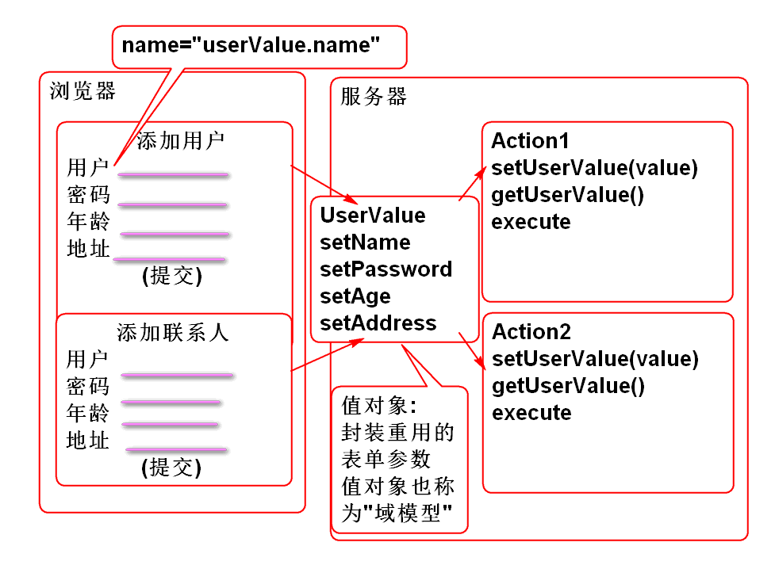
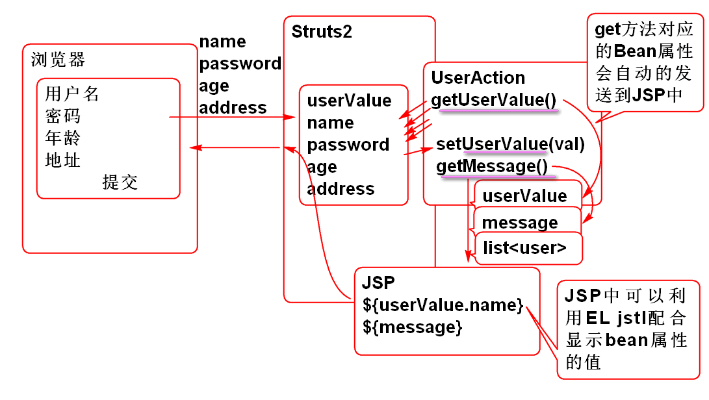

# SSH

## MyBatis 关联映射

MyBatis可以处理赋值关系映射:

业务描述:

数据库SQL:

	create table p_person(
	    id int not null AUTO_INCREMENT,
	    name varchar(100),
	    primary key(id)
	);
	
	insert into p_person (name) values ('李老师');
	insert into p_person (id, name) values (null,'李老师');
	
	
	create table p_comment(
	    id int not null AUTO_INCREMENT,
	    title varchar(100),
	    post_id int,
	    primary key(id)
	);
	
	create table p_post(
	    id int not null AUTO_INCREMENT, 
	    title varchar(100),
	    person_id int,
	    primary key(id)
	);
	
	insert into p_post (id, title, person_id)
	    values (null, '今天天气不错', 1);
	    
	insert into p_post (id, title, person_id)
	    values (null, '高考又来了', 1);
	    
	insert into p_comment(id, title, post_id)
	    values ( null, '少穿了哪一件呀?', 1);
	    
	insert into p_comment(id, title, post_id)
	    values (null, '冻成狗', 1);
	insert into p_comment(id, title, post_id)
	    values (null, '喜欢下雪', 1);

### 关联映射步骤

1. 声明实体类:

		public class Person implements Serializable {
			private static final long serialVersionUID = -2365398342302306276L;
		
			private Integer id;
			
			private String name;
			
			public Person() {
			}
		
			public Person(Integer id, String name) {
				super();
				this.id = id;
				this.name = name;
			}
		
			public Integer getId() {
				return id;
			}
		
			public void setId(Integer id) {
				this.id = id;
			}
		
			public String getName() {
				return name;
			}
		
			public void setName(String name) {
				this.name = name;
			}
		
			@Override
			public String toString() {
				return "Person [id=" + id + ", name=" + name + "]";
			}
		
			@Override
			public int hashCode() {
				final int prime = 31;
				int result = 1;
				result = prime * result + ((id == null) ? 0 : id.hashCode());
				return result;
			}
		
			@Override
			public boolean equals(Object obj) {
				if (this == obj)
					return true;
				if (obj == null)
					return false;
				if (getClass() != obj.getClass())
					return false;
				Person other = (Person) obj;
				if (id == null) {
					if (other.id != null)
						return false;
				} else if (!id.equals(other.id))
					return false;
				return true;
			}
			
		}
		
		public class Comment implements Serializable {
			private static final long serialVersionUID = -5881249634665160256L;
			
			private Integer id;
			private String title;
			
			public Comment() {
			}
		
			public Comment(String title) {
				super();
				this.title = title;
			}
		 
		
			public Integer getId() {
				return id;
			}
		
			public void setId(Integer id) {
				this.id = id;
			}
		
			public String getTitle() {
				return title;
			}
		
			public void setTitle(String title) {
				this.title = title;
			}
		
			@Override
			public int hashCode() {
				final int prime = 31;
				int result = 1;
				result = prime * result + ((id == null) ? 0 : id.hashCode());
				return result;
			}
		
			@Override
			public boolean equals(Object obj) {
				if (this == obj)
					return true;
				if (obj == null)
					return false;
				if (getClass() != obj.getClass())
					return false;
				Comment other = (Comment) obj;
				if (id == null) {
					if (other.id != null)
						return false;
				} else if (!id.equals(other.id))
					return false;
				return true;
			}
		
			@Override
			public String toString() {
				return "Comment [id=" + id + ", title=" + title + "]";
			}
		 
		}
		
		public class Post implements Serializable{
			private static final long serialVersionUID = -4722438109030592372L;
			
			private Integer id;
			private String title;
			
			/** 发帖人 */
			private Person person;
			
			/** 当前帖子收到的回复 */
			private List<Comment> comments = 
					new ArrayList<Comment>();
			
			public Post() {
			}
		
			public Integer getId() {
				return id;
			}
		
			public void setId(Integer id) {
				this.id = id;
			}
		
			public String getTitle() {
				return title;
			}
		
			public void setTitle(String title) {
				this.title = title;
			}
		
			public Person getPerson() {
				return person;
			}
		
			public void setPerson(Person person) {
				this.person = person;
			}
		
			public List<Comment> getComments() {
				return comments;
			}
		
			public void setComments(List<Comment> comments) {
				this.comments = comments;
			}
		
			@Override
			public String toString() {
				return "Post [id=" + id + ", title=" + title + ", person=" + person + ", comments=" + comments + "]";
			}
		
			@Override
			public int hashCode() {
				final int prime = 31;
				int result = 1;
				result = prime * result + ((id == null) ? 0 : id.hashCode());
				return result;
			}
		
			@Override
			public boolean equals(Object obj) {
				if (this == obj)
					return true;
				if (obj == null)
					return false;
				if (getClass() != obj.getClass())
					return false;
				Post other = (Post) obj;
				if (id == null) {
					if (other.id != null)
						return false;
				} else if (!id.equals(other.id))
					return false;
				return true;
			}
			
			
		}

2. 添加映射接口:

		public interface PostDao {
			Post findPostById(Integer id);
		}

3. 添加映射基本属性映射: NoteMapper.xml

		<mapper namespace="cn.tedu.note.dao.PostDao">
			<!-- 复杂映射必须使用resultMap 进行处理 -->
			<resultMap type="cn.tedu.note.entity.Post"
				id="postMap">
				<!-- 逐一映射每个属性 -->
				<!-- 数据库主键, 使用id映射 -->
				<id column="id" property="id"/>
				<!-- 非主键, 使用 result 映射-->
				<result column="title" property="title"/>
				 
			</resultMap>
			 
			<select id="findPostById"
				parameterType="int"
				resultMap="postMap">
				select 
					id, 
					title,
					person_id
				from 
					p_post 
				where 
					id=#{id}
			</select>	
		
		</mapper>
	
	>提示: MyBatis不自动支持复杂的映射关联, 复杂的关联关系必须使用resultMap进行手动映射.

4. 测试:

		public class PostDaoTest extends BaseTest {
			PostDao dao;
			@Before
			public void initDao(){
				dao = ctx.getBean(
					"postDao", PostDao.class);
			}
			@Test
			public void testFindPostById(){
				Post post = dao.findPostById(1);
				System.out.println(post);
			}
		}

	> 测试结果说明, 可以映射基本属性 id和name, 但是无法映射person属性和commons属性.

5. 映射 person 属性, 使用关联映射: 重构PersonMapper.xml

		<mapper namespace="cn.tedu.note.dao.PostDao">
			<!-- 复杂映射必须使用resultMap 进行处理 -->
			<resultMap type="cn.tedu.note.entity.Post"
				id="postMap">
				<!-- 逐一映射每个属性 -->
				<!-- 数据库主键, 使用id映射 -->
				<id column="id" property="id"/>
				<!-- 非主键, 使用 result 映射-->
				<result column="title" property="title"/>
				<!-- 映射 person 属性使用association(关联)映射 -->
				<association property="person" 
					javaType="cn.tedu.note.entity.Person">
					<id column="person_id" property="id"/>
					<result column="name" property="name"/>
				</association>
			</resultMap>
			
			<select id="findPostById"
				parameterType="int"
				resultMap="postMap">
				select 
					p_post.id, 
					title,
					person_id,
					p.name
				from 
					p_post
				left outer join
					p_person p on p.id=person_id 
				where 
					p_post.id=#{id}
			</select>	
		
		</mapper>

	> 首先使用关联SQL查询, 查询出person对象的属性值, 再利用association标签将查询结果映射到Person对象的属性.

6. 测试:

	> 经过测试可用发现已经成功映射了person属性.

6. 映射 comments 属性, 使用collection标签: 重构PostMapper.xml

		<mapper namespace="cn.tedu.note.dao.PostDao">
			<!-- 复杂映射必须使用resultMap 进行处理 -->
			<resultMap type="cn.tedu.note.entity.Post"
				id="postMap">
				<!-- 逐一映射每个属性 -->
				<!-- 数据库主键, 使用id映射 -->
				<id column="id" property="id"/>
				<!-- 非主键, 使用 result 映射-->
				<result column="title" property="title"/>
				<!-- 映射 person 属性使用association(关联)映射 -->
				<association property="person" 
					javaType="cn.tedu.note.entity.Person">
					<id column="person_id" property="id"/>
					<result column="name" property="name"/>
				</association>
				<!-- 属性是一个集合, 使用collection 进行
				映射处理, 其中 column="id" 是查询参数-->
				<collection property="comments" 
					select="findCommentsByPostId"
					column="id">
				</collection>
			</resultMap>
			
			<select id="findCommentsByPostId"
				parameterType="int"
				resultType="cn.tedu.note.entity.Comment">
				select 
					id,
					title
				from 
					p_comment
				where
					post_id=#{id}
			</select>
			
			<select id="findPostById"
				parameterType="int"
				resultMap="postMap">
				select 
					p_post.id, 
					title,
					person_id,
					p.name
				from 
					p_post
				left outer join
					p_person p on p.id=person_id 
				where 
					p_post.id=#{id}
			</select>	
		
		</mapper>
	
	> 首先利用collection表示将comments属性委托到SQL查询 findCommentsByPostId , 再定义SQL查询findCommentsByPostId, 将comment属性的数据查询并且映射到Comment对象. 

8. 测试

	> 测试结果中将出现comments属性的值.

# Struts2

## MVC

1. MVC模式是用户界面的经典设计模式! 无论是手机还是桌面以及WEB应用界面都采用了MVC模式.
2. 在Java WEB编程中, 有很多的框架采用了MVC模式.

## Spring MVC

## Struts2 简介

1. 来自Apache基金会的软件： http://struts.apache.org
2. Struts2 与 Struts1 完全没有关系
3. Struts2 的前身是 WebWorks 
4. Spring MVC\Struts2\Struts1 都是 MVC 模式的Web框架
	- MVC是非常流行的 用户界面设计模式。
	- MVC是3层架构中的表现层。

## 配置Struts2

配置步骤：

1. 创建项目, 导入Struts2:
	
		<dependency>
		  <groupId>org.apache.struts</groupId>
		  <artifactId>struts2-core</artifactId>
		  <version>2.3.8</version>
		</dependency>

2. 配置Struts2 主控制器 web.xml

		  <filter>
		    <display-name>StrutsPrepareAndExecuteFilter</display-name>
		    <filter-name>StrutsPrepareAndExecuteFilter</filter-name>
		    <filter-class>org.apache.struts2.dispatcher.ng.filter.StrutsPrepareAndExecuteFilter</filter-class>
		  </filter>
		  <filter-mapping>
		    <filter-name>StrutsPrepareAndExecuteFilter</filter-name>
		    <url-pattern>/*</url-pattern>
		  </filter-mapping>

3. 添加Struts2的配置文件 struts.xml:

		<?xml version="1.0" encoding="UTF-8"?>
		<!DOCTYPE struts PUBLIC
			"-//Apache Software Foundation//DTD Struts Configuration 2.3//EN"
			"http://struts.apache.org/dtds/struts-2.3.dtd">
		<struts>
		 
		</struts>
		
	> 提示: DTD 信息可以从  struts2-core-2.3.8.jar 包的struts-2.3.dtd 文件中找到.

4. 部署到tomcat 进行测试.

### Hello World

工作原理为:

1. 编写控制器类:

		public class DemoAction {
			
			/**
			 * Struts2 控制器中的默认处理方法名为execute
			 * @return 返回视图的名称
			 */
			public String execute(){
				System.out.println("Hello World!");
				return "success";
			}
		}

	> 默认的控制器方法为execute!

2. 编写jsp: /WEB-INF/jsp/ok.jsp

		<%@ page language="java" 
			contentType="text/html; charset=UTF-8"
			pageEncoding="UTF-8"%>
		<!DOCTYPE html>
		<html>
		<head>
		<meta charset="UTF-8">
		<title></title>
		</head>
		<body>
			<h1>Struts2</h1>
			
Hello World!

		</body>
		</html>

3. 编写配置文件
		
		<struts>
			<!-- 定义WEB请求的第一层路径 namespace="/demo" -->
			<package name="demo" namespace="/demo"
				extends="struts-default" >
				<action name="hello" 
					class="cn.tedu.controller.DemoAction">
					<result name="success">
						/WEB-INF/jsp/ok.jsp
					</result>
				</action>
				<!-- 请求 /demo/hello.action 时候, 执行
				DemoAction的execute方法, 当方法返回值是
				success时候, 转发到ok.jsp -->
			</package>
		 
		</struts>
	
	> package 的 name 属性任意定义, 不重复即可

4. 部署测试:
		
		http://localhost:8080/ssh1/demo/hello.action

### 接收用户提交的数据

利用 控制器 的 "Bean属性" 接收用户提交的数据

> Bean属性: 是指类上声明的getXXX和setXXX方法

原理为: 

案例:

1. 声明控制器 

		/**
		 * 利用Bean属性接收用户提交的参数 
		 */
		public class ParamAction {
			
			private String name;
			private int age;
			
			public void setName(String name) {
				this.name = name;
			}
			
			public void setAge(int age) {
				this.age = age;
			}
			
			public String execute(){
				System.out.println("name:"+name);
				System.out.println("age:"+age);
				return "success";
			}
		}

2. 编写JSP: param.jsp

		<%@ page language="java" 
			contentType="text/html; charset=UTF-8"
			pageEncoding="UTF-8"%>
		<!DOCTYPE html>
		<html>
		<head>
		<meta charset="UTF-8">
		<title>控制器接收参数</title>
		</head>
		<body>
			<h1>Struts2</h1>
			
接收参数

		</body>
		</html>

3. 配置控制器:

		<!-- 请求路径: /demo/param.action?name=Tom&age=5 -->
		<action name="param"
			class="cn.tedu.controller.ParamAction">
			<result name="success">
				/WEB-INF/jsp/param.jsp
			</result>
		</action>
		
4. 测试:

		http://localhost:8080/ssh1/demo/param.action?name=Tom&age=5

	> 参数: Tom 和 5 将出现在 服务器的控制台上

### 利用领域模型(值对象)封装用户提交的参数

当用户提交的表单数据很多, 并且表单项目会重用时候, 可以利用领域模型(值对象)封装用户提交的表单:

案例:

1. 声明领域模型(值对象)

		public class UserValue implements Serializable {
			private static final long serialVersionUID = 232L;
			
			private String name;
			private String password;
			private Integer age;
			private String address;
			
			public UserValue() {
			}
		
			public String getName() {
				return name;
			}
		
			public void setName(String name) {
				this.name = name;
			}
			
			public String getPassword() {
				return password;
			}
		
			public void setPassword(String password) {
				this.password = password;
			}
		
			public Integer getAge() {
				return age;
			}
		
			public void setAge(Integer age) {
				this.age = age;
			}
		
			public String getAddress() {
				return address;
			}
		
			public void setAddress(String address) {
				this.address = address;
			}
		
			@Override
			public String toString() {
				return "UserValue [name=" + name + ", password=" + password + ", age=" + age + ", address=" + address + "]";
			}
			
		}

2. 定义控制器, 接收领域模型参数:

		public class UserAction {
			
			private UserValue userValue;
			
			public void setUserValue(UserValue userValue) {
				this.userValue = userValue;
			}
			
			public UserValue getUserValue() {
				return userValue;
			}
			
			public String execute(){
				System.out.println(userValue);
				return "success";
			}
		}

3. 开发JSP页面, 用于提交表单参数:

		<%@ page language="java" 
			contentType="text/html; charset=UTF-8"
			pageEncoding="UTF-8"%>
		<!DOCTYPE html>
		<html>
		<head>
		<meta charset="UTF-8">
		<title></title>
		</head>
		<body>
			<h1>提交用户信息</h1>
			<form action="demo/user.action" 
				method="post">
				

					用户名:<input type="text" 
						name="userValue.name">
				
		
				

					密码:<input type="password"
						name="userValue.password">
				

				

					年龄:<input type="text"
						name="userValue.age"> 
				

				

					地址: <input type="text"
						name="userValue.address">
				

				

					<input type="submit" value="保存">
		 		

			</form>
		</body>
		</html>
	
	> 表单中的input元素name属性必须写为 name="userValue.address" 这样才能传递参数.

4. 配置控制器 struts.xml

		<!-- 利用值对象打包传递参数 -->
		<action name="user"
			class="cn.tedu.controller.UserAction">
			<result name="success">
				/WEB-INF/jsp/ok.jsp
			</result>
		</action>

5. 测试

	> 利用表单提交参数, 服务端手动打包的van是

### 将服务端的数据显示到页面上

控制器中的bean属性getXXX方法会自动传递到JSP中, 其底层是利用request传递的.

原理:

案例:

1. 重构 UserAction, 添加 bean 属性 message:

		private String message;
	
		public String getMessage() {
			return message;
		}
		
		public String execute(){
			System.out.println(userValue);
			message = "成功!";
			
			//转发目标JSP收到两个Bean对象: 
			// message 和 userValue
			//对应着 Action 对象的 getXXX方法
			//在JSP中可以使用 EL 表达式访问这些属性
			
			return "success";
		}

	> 在控制器方法中为message属性赋值

2. 编写数据展示页面 success.jsp

		<%@ page language="java" 
			contentType="text/html; charset=UTF-8"
			pageEncoding="UTF-8"%>
		<!DOCTYPE html>
		<html>
		<head>
		<meta charset="UTF-8">
		<title></title>
		</head>
		<body>
			<h1>表单结果</h1>
			
收到了两个bean对象: message, userValue

			
消息: ${message}
 
			
用户名: ${userValue.name}

			
密码: ${userValue.password}

			
年龄: ${userValue.age}

			
地址: ${userValue.address}

		</body>
		</html>

	> 在JSP中可以利用EL表达式和 JSTL 配合显示控制器传递来的属性.

3. 重构配置文件, UserAction 控制器处理结束后转发到 success.jsp
	
		<!-- 利用值对象打包传递参数 -->
		<action name="user"
			class="cn.tedu.controller.UserAction">
			<result name="success">
				/WEB-INF/jsp/success.jsp
			</result>
		</action>

4. 测试

	> 控制器的数据可以成功的显示到JSP页面上.

## Struts 2 控制器中访问 Session对象

在 Struts 2 控制器用两种访问Session的方式:

1. 利用ActionContext 获取Session.
	- 代表当前控制器的工作环境: 被那个主控制器调用, 当前的request, 当前的resopnse, 当前session等信息, 都可以从 ActionContext 获得.
	
		ActionContext ctx = ActionContent.getContext();
		Map<String, Object> session=ctx.getSession();
		//session 是 map类型的, 如果把数据保存到map中, struts 2 会
		// 自动的将数据存储到 HttpSession对象中 
		session.put("loginUser", "Tom");
		//转发到 JSP 后可以使用EL读取session ${loginUser} 
	

案例:

1. 重构UserAction, 在转发JSP之前在session 中添加属性:

		public String execute(){
			System.out.println(userValue);
			message = "成功!";
			
			//转发目标JSP收到两个Bean对象: 
			// message 和 userValue
			//对应着 Action 对象的 getXXX方法
			//在JSP中可以使用 EL 表达式访问这些属性
			
			//将数据保存到 session
			ActionContext context = 
					ActionContext.getContext();
			Map<String, Object> session = 
					context.getSession();
			session.put("loginUser", "Tom");
			
			//struts 2 会自动的将 map 中的数据同步到
			// HttpSession 中
			
			//转发到JSP 后可以使用EL获取 session 中的数据
			// ${loginUser}
			return "success";
		}

2. 重构 success.jsp 利用EL 显示session中的属性:

		
Session: ${loginUser} 
	

3. 测试

	> 可以再success.jsp显示session中的数据

----------------

## 作业

1. 完成MyBatis的复杂关联查询
2. 搭建Struts2项目, 完成Struts2 案例.

