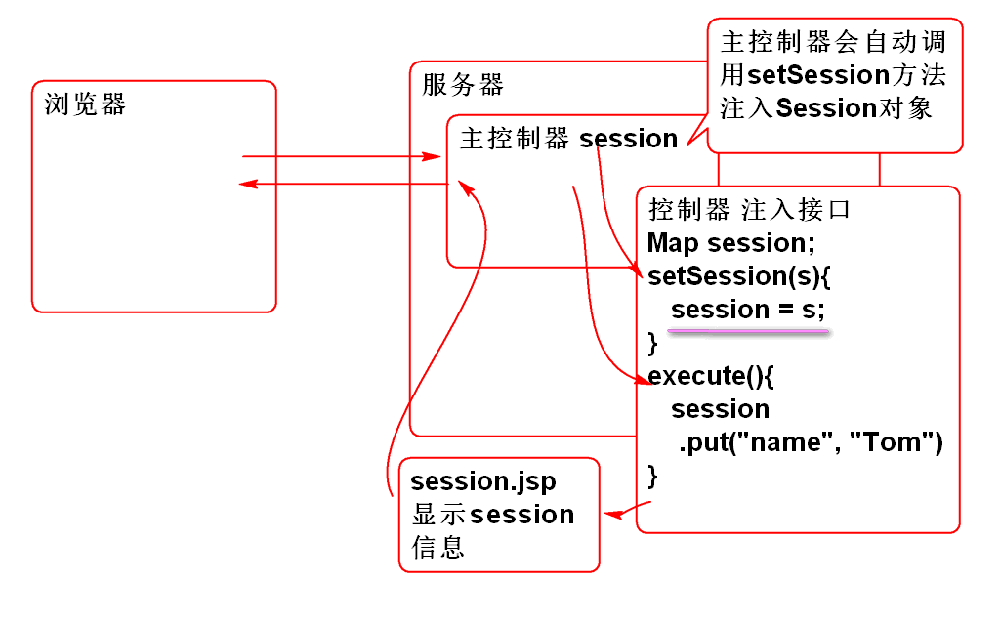
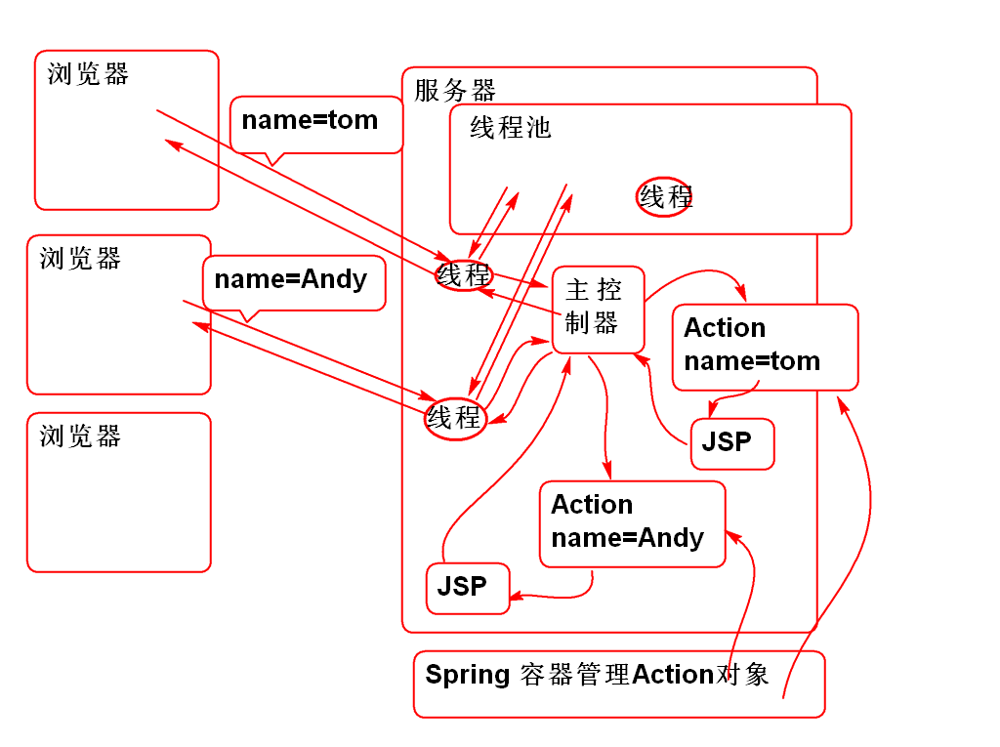
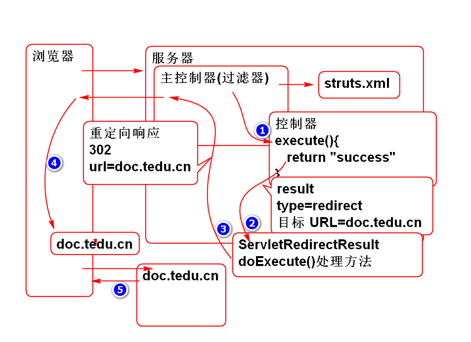
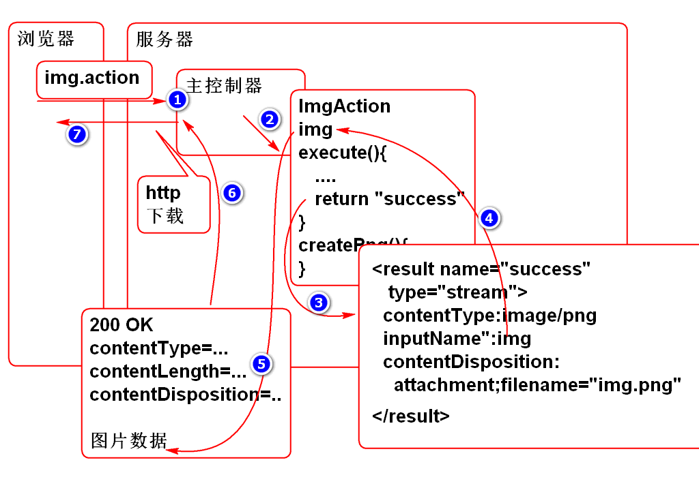

# SSH

## Struts2 中访问 session

### 利用SessionAware接口注入Session对象

Struts 2 的控制器只要实现 SessionAware接口, 实现其Bean属性注入方法 setSession, Struts 2 主控制器就会在执行控制器方法之前将Session对象注入到控制器中.

原理:

 

案例:

1. 声明控制器, 实现SessionAware接口:

		/**
		 * 自动注入Session对象. 
		 * Struts主控制器在发现控制器类,  SessionController
		 * 实现了SessionAware时候, 会自动的将Session对象
		 * 注入到 控制器对象中. 注入时候调用的方法是setSession 
		 */
		public class SessionAction
			implements SessionAware{
			
			private Map<String, Object> session;
			
			public void setSession(
					Map<String, Object> session) {
				this.session=session;
			}
			
			public String demo(){
				session.put("name", "Tom");
				return "success";
			}
			
		}

2. 编写success.jsp测试, session中存储的数据:

		<%@ page language="java" 
			contentType="text/html; charset=UTF-8"
			pageEncoding="UTF-8"%>
		<!DOCTYPE html>
		<html>
		<head>
		<meta charset="UTF-8">
		<title>Session Demo</title>
		</head>
		<body>
			<h1>Session</h1>
			
session数据: ${name}

		</body>
		</html>

3. 编辑配置文件, struts.xml

		<action name="session"
			class="cn.tedu.controller.SessionAction"
			method="demo">
			<result name="success">
				/WEB-INF/jsp/session.jsp
			</result>
		</action>

4. 测试

		http://localhost:8080/ssh2/demo/session.action

### 抽取AbstractAction类, 简化控制器 

为了重用SessionAware注入代码, 简化控制器编写, 在实际工作中经常抽取AbstractAction, 封装控制器的公共代码, 简化控制器的开发. 

Struts 2 也提供了一个 ActionSupport 类, 建议作为Action的父类, 其作用也是封装了 Action常用功能, 简化Action的开发.

 

案例:

	public abstract class AbstractAction 
		extends ActionSupport
		implements SessionAware {
		
		protected Map<String, Object> session;
		
		public void setSession(
				Map<String, Object> session) {
			this.session=session;
		}
	}

Struts2 还提供了 RequestAware 和 ApplicationAware, 用于注入 request和application, 为了方便控制器的编程, 可以将这些接口在AbstractAction上实现:

	public abstract class AbstractAction 
		extends ActionSupport
		implements SessionAware,
		RequestAware, 
		ApplicationAware{
		
		protected Map<String, Object> request;
		protected Map<String, Object> session;
		protected Map<String, Object> application;
		
		public void setSession(
				Map<String, Object> session) {
			this.session=session;
		}
		public void setRequest(
				Map<String, Object> request) {
			this.request=request;
		}
		public void setApplication(
				Map<String, Object> application) {
			this.application=application;
		}
		
	}

这样控制器可以简化为:

	public class DemoAction extends AbstractAction{
	
		public String execute(){
			request.put("myName", "Wang");
			session.put("name", "Andy");
			application.put("test", "熊大");
			return SUCCESS;
		}
	}	

配置控制器:

		<action name="demo" 
			class="cn.tedu.controller.DemoAction">
			<result name="success">
				/WEB-INF/jsp/session.jsp
			</result>
		</action>

session.jsp
	
	<%@ page language="java" 
		contentType="text/html; charset=UTF-8"
		pageEncoding="UTF-8"%>
	<!DOCTYPE html>
	<html>
	<head>
	<meta charset="UTF-8">
	<title>Session Demo</title>
	</head>
	<body>
		<h1>Session</h1>
		
request数据: ${myName}

		
session数据: ${name}

		
application数据: ${test}

	</body>
	</html>
	
> 可以体会到在控制器中访问 session request 和 application的便捷性.
	

### 控制器的线程安全(重要)

Struts 2 为了保护控制器的线程安全, 每个用户请求创建一个新的 控制器(Action)对象.

原理:

 

## Spring 和 Struts 2 整合

Spring 将接管 Struts 2 控制器对象的管理, 帮助创建 Struts 2 控制器Bean对象.

整合步骤:

1. 导入包 Struts 2 提供的整合包

		<dependency>
		  <groupId>org.apache.struts</groupId>
		  <artifactId>struts2-spring-plugin</artifactId>
		  <version>2.3.8</version>
		</dependency>

	> 导入以后, 无需配置, 自动工作!

2. 导入Spring包, 和配置Spring容器.
	
	> Spring 包已经自动依赖, 无需再次导入

		  <listener>
		    <listener-class>org.springframework.web.context.ContextLoaderListener</listener-class>
		  </listener>
		  <context-param>
		  	 <param-name>contextConfigLocation</param-name>
		  	 <param-value>classpath:spring-*.xml</param-value>
		  </context-param> 	

	> 其中 ContextLoaderListener 类要求配置参数 contextConfigLocation
	
	> 添加Spring配置文件 spring-web.xml
		
		<?xml version="1.0" encoding="UTF-8"?>
		<beans xmlns="http://www.springframework.org/schema/beans" 
			xmlns:xsi="http://www.w3.org/2001/XMLSchema-instance"
			xmlns:context="http://www.springframework.org/schema/context" 
			xmlns:jdbc="http://www.springframework.org/schema/jdbc"  
			xmlns:jee="http://www.springframework.org/schema/jee" 
			xmlns:tx="http://www.springframework.org/schema/tx"
			xmlns:aop="http://www.springframework.org/schema/aop" 
			xmlns:mvc="http://www.springframework.org/schema/mvc"
			xmlns:util="http://www.springframework.org/schema/util"
			xmlns:jpa="http://www.springframework.org/schema/data/jpa"
			xsi:schemaLocation="
				http://www.springframework.org/schema/beans http://www.springframework.org/schema/beans/spring-beans-3.0.xsd
				http://www.springframework.org/schema/context http://www.springframework.org/schema/context/spring-context-3.0.xsd
				http://www.springframework.org/schema/jdbc http://www.springframework.org/schema/jdbc/spring-jdbc-3.0.xsd
				http://www.springframework.org/schema/jee http://www.springframework.org/schema/jee/spring-jee-3.0.xsd
				http://www.springframework.org/schema/tx http://www.springframework.org/schema/tx/spring-tx-3.0.xsd
				http://www.springframework.org/schema/data/jpa http://www.springframework.org/schema/data/jpa/spring-jpa-1.3.xsd
				http://www.springframework.org/schema/aop http://www.springframework.org/schema/aop/spring-aop-3.0.xsd
				http://www.springframework.org/schema/mvc http://www.springframework.org/schema/mvc/spring-mvc-3.0.xsd
				http://www.springframework.org/schema/util http://www.springframework.org/schema/util/spring-util-3.0.xsd">
		
		</beans>

	> 当前Spring版本是3.0版本, 配置文件中的Schema文件版本也要改成3.0版本的! 否则无法使用.

	> 部署到容器进行测试...
 
3. 利用Spring 管理 控制器Bean组件, 注意这些bean不能是单例的, 否则有线程安全问题!!

		@Controller
		@Scope("prototype")
		public class HelloAction extends AbstractAction {
			public String execute(){
				System.out.println("Hello World!");
				return SUCCESS;
			}
		}
			
	> 在spring 配置文件中配置组件扫描功能 spring-web.xml

			<context:component-scan  base-package="cn.tedu.controller"/>

4. 在Struts2 配置文件中, class 属性替换为 Spring Bean ID 即可使用Spring 创建的Bean组件了.

		<!-- 利用Spring作为控制器Action的容器 
			只需要使用class="Bean ID"-->
		<action name="hello"	
			class="helloAction">
			<result type="dispatcher" name="success">
				/WEB-INF/jsp/ok.jsp
			</result>
		</action>	

### 为什么要将 Spring 和 Struts2 整合

1. Spring 框架核心功能: IOC/DI  AOP
	- IOC/DI 管理对象, 管理对象和对象的关系, 可以解除耦合
	- AOP 
2. Struts2 可以简化WEB编程.
3. 整合以后: 
	1. 简化了Web开发
	2. 简化业务层和持久层组件的开发.

 

## Result

Struts 提供了丰富的Result支持, 在struts的默认配置文件struts-default.xml中声明了这些result:

    <package name="struts-default" abstract="true">
        <result-types>
            <result-type name="chain" class="com.opensymphony.xwork2.ActionChainResult"/>
            <result-type name="dispatcher" class="org.apache.struts2.dispatcher.ServletDispatcherResult" default="true"/>
            <result-type name="freemarker" class="org.apache.struts2.views.freemarker.FreemarkerResult"/>
            <result-type name="httpheader" class="org.apache.struts2.dispatcher.HttpHeaderResult"/>
            <result-type name="redirect" class="org.apache.struts2.dispatcher.ServletRedirectResult"/>
            <result-type name="redirectAction" class="org.apache.struts2.dispatcher.ServletActionRedirectResult"/>
            <result-type name="stream" class="org.apache.struts2.dispatcher.StreamResult"/>
            <result-type name="velocity" class="org.apache.struts2.dispatcher.VelocityResult"/>
            <result-type name="xslt" class="org.apache.struts2.views.xslt.XSLTResult"/>
            <result-type name="plainText" class="org.apache.struts2.dispatcher.PlainTextResult" />
        </result-types>
		...

	> 可以看到在struts-default包中定义了这些Result类型, 只要继承struts-default既可以继承这些Result类型. 

	> 每个Result类型对应一个类, Result类型的具体功能是由这个类提供算法支持. 如: dispatcher 类型的功能, 由 org.apache.struts2.dispatcher.ServletDispatcherResult 类来处理.

	> 这个配置也说明: 如果在使用Struts2时候, 对其提供的Result类型不满意, 可以自行添加类进行扩展, 扩展出自己的Result类型.

常用的类型有:

1. dispatcher
2. redirect
3. redirectAction
4. stream
5. json

### dispatcher

dispatcher 类型是默认的结果类型, 其处理规则是将控制器转发到目标JSP.

 

案例:

	<action name="demo" 
		class="cn.tedu.controller.DemoAction">
		<result name="success">
			/WEB-INF/jsp/session.jsp
		</result>
	</action>

### redirect

就是重定向, 控制器处理以后, 重定向到其他URL目标:

 

案例:

1. 编写控制器
		
		@Controller
		@Scope("prototype")
		public class RedirectDemoAction 
			extends AbstractAction{
			
			public String execute() {
				System.out.println("重定向请求");
				return SUCCESS;
			}
		}

2. 配置 struts.xml

		<!-- 重定向演示 -->
		<action name="doc"
			class="redirectDemoAction">
			<result type="redirect" name="success">
				<param name="location">
					http://doc.tedu.cn
				</param>
			</result>
		</action>

3. 测试:

		http://localhost:8080/ssh2/demo/doc.action
	
### redirectAction

与 redirect 类型, 只是重定向的目标不是url而是 action

案例:

1. 编写控制器类

		@Controller
		@Scope("prototype")
		public class RedirectActionDemoAction 
			extends AbstractAction{
				
			public String execute(){
				System.out.println("重定向到其他控制器");
				return SUCCESS;
			}
		}

2. 配置 struts.xml

		<!-- 重定向到其他的控制器 -->
		<action name="redirect"
			class="redirectActionDemoAction">
			<result type="redirectAction"
				name="success">
				<param name="actionName">hello</param>			
				<param name="namespace">/demo</param>
			</result>
		</action>

3. 测试:

		http://localhost:8080/ssh2/demo/redirect.action

### stream

stream 可以用于HTTP下载 文件:

将一个图片显示发送到客户端:

1. 编写控制器:

		@Controller
		@Scope("prototype")
		public class ImgAction extends AbstractAction {
			private InputStream img;
			public InputStream getImg() {
				return img;
			}
			public void setImg(InputStream img) {
				this.img = img;
			}
			
			private byte[] createPng() throws IOException{
				BufferedImage img = new BufferedImage(200, 60, BufferedImage.TYPE_3BYTE_BGR);
				Random r = new Random();
				for(int i=0; i<100; i++){
					int x = r.nextInt(img.getWidth());
					int y = r.nextInt(img.getHeight());
					int rgb=r.nextInt(0xffffff);
					img.setRGB(x, y, rgb);
				}
				ByteArrayOutputStream out = 
					new ByteArrayOutputStream();
				ImageIO.write(img, "png", out);
				out.close();
				return out.toByteArray();
			}
			
			
			public String execute() throws IOException{
				
				byte[] png=createPng();
				img = new ByteArrayInputStream(png);
				
				return SUCCESS;
			}
			
		}

2. 配置 struts.xml

		<!-- 将图片发送到浏览器 -->
		<action name="img"
			class="imgAction">
			<result name="success" type="stream">
				<param name="inputName">img</param>
				<param name="contentType">image/png</param>
			</result>	
		</action>
	
	> 注意: img 是控制器ImgAction的bean属性, 其类型必须是inputStream

3. 测试:

		http://localhost:8080/ssh2/demo/img.action

将图片下载到浏览器:

1. 控制器, 重用ImgAction

2. 配置struts.xml

		<!-- 浏览器端自动下载图片 -->
		<action name="download"
			class="imgAction">
			<result name="success" type="stream">
				<param name="inputName">img</param>
				<param name="contentType">
					application/octet-stream
				</param>
				<param name="contentDisposition">
					attachment; filename="demo.png"
				</param>
			</result>	
		</action>
		
	> 根据Http协议, 设置contentType 和 contentDisposition, HTTP协议具体内容请参考RFC2616.

3. 测试

		http://localhost:8080/ssh2/demo/download.action

下载Excel文件:

0. 导入POI API

		<dependency>
		  <groupId>org.apache.poi</groupId>
		  <artifactId>poi</artifactId>
		  <version>3.13</version>
		</dependency>

1. 编写控制器

		@Controller
		@Scope("prototype")
		public class ExcelAction extends AbstractAction {
			
			private InputStream excel;
			
			public InputStream getExcel() {
				return excel;
			}
			public void setExcel(InputStream excel) {
				this.excel = excel;
			}
			
			private byte[] createExcel() 
				throws IOException{
				//创建工作簿
				HSSFWorkbook workbook=new HSSFWorkbook();
				//创建工作表
				HSSFSheet sheet=
						workbook.createSheet("Demo");
				//在工作表中创建数据行
				HSSFRow row = sheet.createRow(0);
				//创建行中的格子
				HSSFCell cell = row.createCell(0);
				cell.setCellValue("Hello World!"); 
				//将Excel文件保存为 byte 数组
				ByteArrayOutputStream out =
						new ByteArrayOutputStream();
				workbook.write(out);
				out.close();
				return out.toByteArray();
			}
			
			public String execute() throws IOException{
				
				byte[] buf = createExcel();
				excel = new ByteArrayInputStream(buf);
				
				return SUCCESS;
			}
		
		}

3. 配置 struts.xml
	
		<!-- 浏览器端自动下载Excel -->
		<action name="excel"
			class="excelAction">
			<result name="success" type="stream">
				<param name="inputName">excel</param>
				<param name="contentType">
					application/octet-stream
				</param>
				<param name="contentDisposition">
					attachment; filename="demo.xls"
				</param>
			</result>	
		</action>

4. 测试

		http://localhost:8080/ssh2/demo/excel.action

### json

json Result 不是Struts2 内嵌结果类型, 需要导入 struts2-json-plugin:

	<dependency>
	  <groupId>org.apache.struts</groupId>
	  <artifactId>struts2-json-plugin</artifactId>
	  <version>2.3.8</version>
	</dependency>

在 struts2-json-plugin-2.3.8.jar	 包中的struts-plugin.xml文件中声明了 json类型的result:

    <package name="json-default" extends="struts-default">

        <result-types>
            <result-type name="json" class="org.apache.struts2.json.JSONResult"/>
        </result-types>
	...

使用时候需要将 package 继承于 json-default 就可以使用 json Result, 由于json-default继承于struts-default, 这样也可以使用struts-default中定义的result了.

Json Result 原理:

使用Json Result

1. 编写控制器
		
		@Controller
		@Scope("prototype")
		//转换为json: {name:"Tom", age:10}
		public class JsonDemoAction {
			private String name;
			private int age;
			public String getName() {
				return name;
			}
			public void setName(String name) {
				this.name = name;
			}
			public int getAge() {
				return age;
			}
			public void setAge(int age) {
				this.age = age;
			}
			public String execute(){
				name = "Tom";
				age = 10;
				return "success";
			}
		}
		
2. 配置:

		<package name="json" namespace="/json"
			extends="json-default">
			<action name="jsonDemo" 
				class="jsonDemoAction">
				<result name="success" type="json">
				</result>
			</action>
		</package>
		
3. 测试

		http://localhost:8080/ssh2/json/jsonDemo.action

	> 将jsonDemoAction的整体作为Java Bean 转换为json字符串发送到浏览器 jsonDemoAction中的Bean属性会转换为 json字符串中的属性

以上案例问题是不能精确控制器哪些Bean属性转换为json字符串, 所以一般将指定属性转换为JSON

1. 编写控制器:

		@Controller
		@Scope("prototype")
		public class RootDemoAction extends AbstractAction{
			
			private Object jsonResult;
			
			public void setJsonResult(Object jsonResult) {
				this.jsonResult = jsonResult;
			}
			public Object getJsonResult() {
				return jsonResult;
			}
			
			public String execute(){
				String[] ary={"Tom", "Andy"};
				jsonResult = ary;
				return SUCCESS;
			}
		}

2. 配置:

		<!-- 指定Action中的一个Bean属性, 转换为
		json字符串, 发送到客户端, jsonResult 
		是Action中的Bean属性名 -->
		<action name="rootDemo"
			class="rootDemoAction">
			<result name="success" type="json">
				<param name="root">jsonResult</param>
			</result>	
		</action>

3. 测试:

		http://localhost:8080/ssh2/json/rootDemo.action

-------------------

## 作业

1. 搭建Struts2 + Spring + JSON 整合开发环境
2. 实现控制器将List作为JSON返回值	

