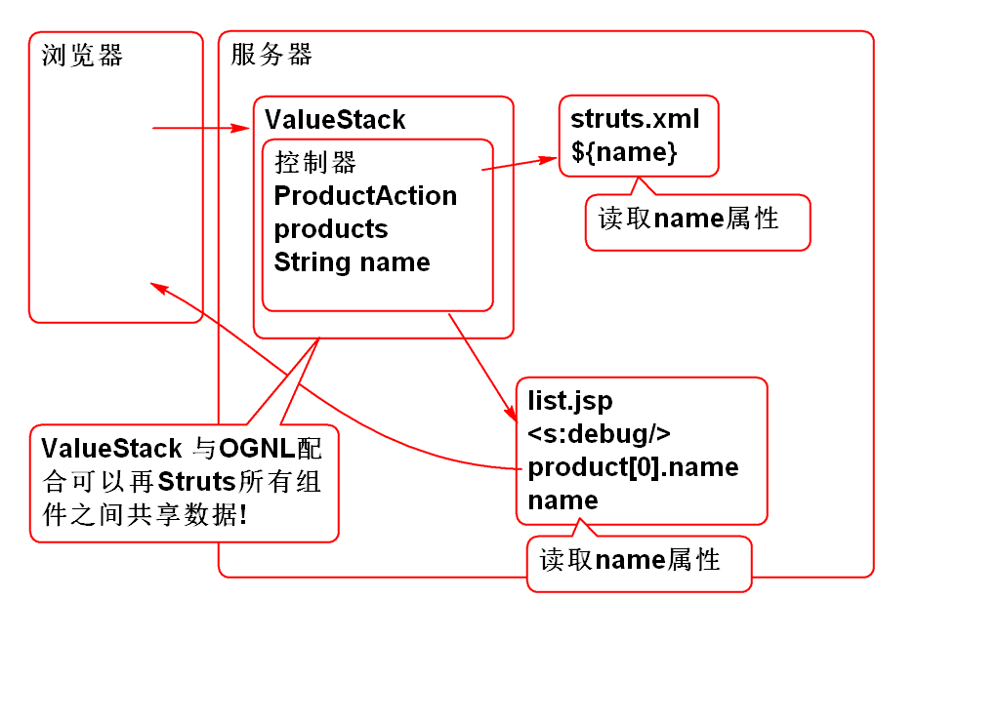
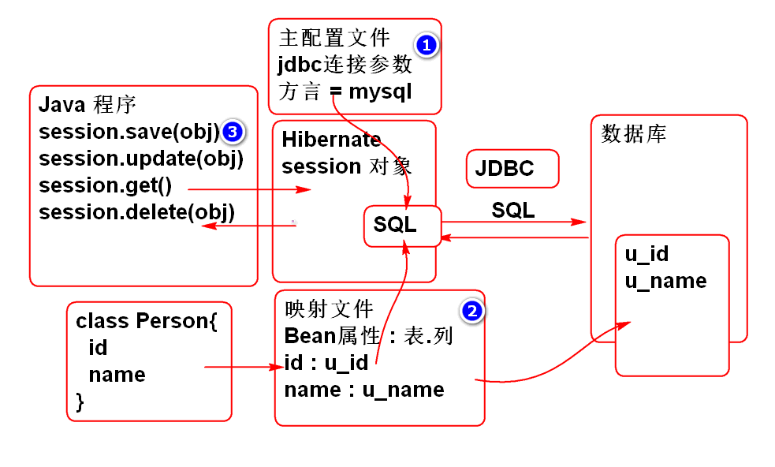

# SSH

## Struts 简单应用

实现一个简单的列表功能

1. 创建项目导入相关的包:

		<dependency>
			<groupId>org.apache.struts</groupId>
			<artifactId>struts2-core</artifactId>
			<version>2.3.8</version>
		</dependency>

		<dependency>
			<groupId>org.apache.struts</groupId>
			<artifactId>struts2-spring-plugin</artifactId>
			<version>2.3.8</version>
		</dependency>

		<dependency>
		  <groupId>jstl</groupId>
		  <artifactId>jstl</artifactId>
		  <version>1.2</version>
		</dependency>

	> 导入目标服务器运行环境 Tomcat Runtime

2. 配置Struts2 和 Spring: web.xml
	
		  <filter>
		    <display-name>StrutsPrepareAndExecuteFilter</display-name>
		    <filter-name>StrutsPrepareAndExecuteFilter</filter-name>
		    <filter-class>org.apache.struts2.dispatcher.ng.filter.StrutsPrepareAndExecuteFilter</filter-class>
		  </filter>
		  <filter-mapping>
		    <filter-name>StrutsPrepareAndExecuteFilter</filter-name>
		    <url-pattern>/*</url-pattern>
		  </filter-mapping>
		  <listener>
		    <listener-class>org.springframework.web.context.ContextLoaderListener</listener-class>
		  </listener>
		  <context-param>
		  	 <param-name>contextConfigLocation</param-name>
		  	 <param-value>classpath:spring-*.xml</param-value>
		  </context-param>  

3. 添加 Spring 和 Struts2 的配置文件

	> spring-web.xml

		<?xml version="1.0" encoding="UTF-8"?>
		<beans xmlns="http://www.springframework.org/schema/beans" 
			xmlns:xsi="http://www.w3.org/2001/XMLSchema-instance"
			xmlns:context="http://www.springframework.org/schema/context" 
			xmlns:jdbc="http://www.springframework.org/schema/jdbc"  
			xmlns:jee="http://www.springframework.org/schema/jee" 
			xmlns:tx="http://www.springframework.org/schema/tx"
			xmlns:aop="http://www.springframework.org/schema/aop" 
			xmlns:mvc="http://www.springframework.org/schema/mvc"
			xmlns:util="http://www.springframework.org/schema/util"
			xmlns:jpa="http://www.springframework.org/schema/data/jpa"
			xsi:schemaLocation="
				http://www.springframework.org/schema/beans http://www.springframework.org/schema/beans/spring-beans-3.0.xsd
				http://www.springframework.org/schema/context http://www.springframework.org/schema/context/spring-context-3.0.xsd
				http://www.springframework.org/schema/jdbc http://www.springframework.org/schema/jdbc/spring-jdbc-3.0.xsd
				http://www.springframework.org/schema/jee http://www.springframework.org/schema/jee/spring-jee-3.0.xsd
				http://www.springframework.org/schema/tx http://www.springframework.org/schema/tx/spring-tx-3.0.xsd
				http://www.springframework.org/schema/data/jpa http://www.springframework.org/schema/data/jpa/spring-jpa-1.3.xsd
				http://www.springframework.org/schema/aop http://www.springframework.org/schema/aop/spring-aop-3.0.xsd
				http://www.springframework.org/schema/mvc http://www.springframework.org/schema/mvc/spring-mvc-3.0.xsd
				http://www.springframework.org/schema/util http://www.springframework.org/schema/util/spring-util-3.0.xsd">
			
			<context:component-scan 
				base-package="cn.tedu.controller"/>
		
			<context:component-scan 
				base-package="cn.tedu.service"/>
		
		</beans>

	> struts.xml:
			
		<?xml version="1.0" encoding="UTF-8"?>
		<!DOCTYPE struts PUBLIC
			"-//Apache Software Foundation//DTD Struts Configuration 2.3//EN"
			"http://struts.apache.org/dtds/struts-2.3.dtd">
		<struts>
			
		</struts>
	
4. 创建业务层:
	
		@Service
		public class ProductService {
			
			List<Product> products;
			
			@PostConstruct
			private void init(){
				products = new ArrayList<Product>();
				products.add(new Product(
					1,"大黄蜂",24.5,"变形金刚经典系列"));
				products.add(new Product(
					2,"擎天柱",88.5,"变形金刚经典系列"));
				products.add(new Product(
					3,"光头强",12.5,"大笨熊你粗来!"));
				products.add(new Product(
					4,"李老师",22.5,"胡说派诗人!"));
				products.add(new Product(
					5,"范传奇",23.5,"变形金刚消费者!"));
			}
			
			public List<Product> getProducts(){
				return products;
			}
		}

5. 创建控制器
		
		@Controller
		@Scope("prototype")
		public class ProductAction {
			
			@Resource
			private ProductService productService;
			
			private List<Product> products;
			public List<Product> getProducts() {
				return products;
			}
			public void setProducts(List<Product> products) {
				this.products = products;
			}
			
			private String name;
			public String getName() {
				return name;
			}
			public void setName(String name) {
				this.name = name;
			}
			
			//控制器方法
			public String list(){
				name = "list";
				products = productService.getProducts();
				
				ActionContext context = 
						ActionContext.getContext();
				context.getSession().put(
					"loginUser", "老王");
				
				return "success";
			}
		}

6. 创建 list.jsp

		<%@ page contentType="text/html; charset=utf-8"
		    pageEncoding="utf-8"%>
		<%@ taglib prefix="c" 
			uri="http://java.sun.com/jsp/jstl/core" %>
		<!DOCTYPE html>
		<html>
		<head>
		<meta charset="utf-8">
		<title>产品管理</title>
		
		</head>
		<body>
			<h1>产品管理</h1>
			<table>
				<thead>
					<tr>
						<th>编号</th>
						<th>名称</th>
						<th>价格</th>
						<th>描述</th>
					</tr>
				</thead>
				<tbody>
					<c:forEach items="${products}" var="p">
						<tr>
							<td>${p.id}</td>
							<td>${p.name}</td>
							<td>${p.price}</td>
							<td>${p.description}</td>
						</tr>
					</c:forEach>
				</tbody>
			</table>
		</body>
		</html>
		
7. 配置struts.xml

		<package name="product"
			namespace="/product"
			extends="struts-default">
			
			<action name="list" class="productAction"
				method="list">
				<result>
					/WEB-INF/jsp/list.jsp
				</result>
			</action>	
		</package>

8. 测试:

		http://localhost:8080/ssh3/product/list.action

## ValueStack

Struts 中共享数据的一个机制, 利用ValueStack可以在Struts组件之间共享数据:

Struts组件包括:

- 构造器 Action
- 结果 Result
- 视图 JSP
- 配置文件 struts.xml

> JSP 中使用 s:debug 标签可以显示 ValueStack 对象

案例:

1. 创建vs.jsp

		<%@ page contentType="text/html; charset=utf-8"
		    pageEncoding="utf-8"%>
		<%@ taglib prefix="s" uri="/struts-tags"%>
		<!DOCTYPE html>
		<html>
		<head>
		<meta charset="utf-8">
		<title>产品管理</title>
		
		</head>
		<body>
			<h2>ValueStack</h2>
			<s:debug></s:debug>
			<h2>利用OGNL表的式读取ValueStack中的数据</h2>
			
读取ValueStack中的Action对象的数据

			<s:property value="products[0].name"/> 
			<h3>利用ValueStack 和 OGNL 显示商品列表</h3>
			<table>
				<thead>
					<tr>
						<th>ID</th>
						<th>名称</th>
						<th>价格</th>
						<th>描述</th>
					</tr>
				</thead>
				<tbody>
					<s:iterator value="products" var="p">
						<tr>
							<td><s:property value="id"/></td>
							<td><s:property value="name"/></td>
							<td><s:property value="price"/></td>
							<td><s:property value="description"/></td>
						</tr>
					</s:iterator>
				</tbody>
			</table>
		
		</body>
		</html>
		

2. 配置struts.xml

		<action name="vs" class="productAction"
			method="list">
			<result>
				/WEB-INF/jsp/vs.jsp
			</result>
		</action>	

	> 重用控制器 productAction 

3. 测试:

		http://localhost:8080/ssh3/product/vs.action

	> 说明使用 ValueStack 和 OGNL 也可以显示产品列表.

### 使用OGNL表达式可以读取 ValueStack 中的数据

JSP 中 可以使用 Struts 标签配合 OGNL 表达式读取 ValueStack中的数据, 由于Action对象被放到了 ValueStack中这样就可以, Action 到 JSP共享数据了. 

关于 ValueStack 和 OGNL

1. Struts2 中利用ValueStack 在所有组件之间共享数据
	- 其中 控制器也被放到 ValueStack 中
2. 在任何组件中可以使用 ONGL 表达式读取ValueStack中的数据, 包含读取控制器 Action 中的数据
3. 在使用OGNL读取ValueStack数据时候是按照从顶到下顺序查找!
	- 建议不要将数据的名字重复,避免遮挡!
4. Struts2 底层接管了 EL和JSTL, 将EL数据读取转到了ValueStack上! EL的读取结果与 ONGL 一样!
	- Struts 标签和ONGL配合 与 EL和JSTL配合的结果是一样的!
5. 如果需要读取ValueStack的Context区域,就必须使用OGNL
	- 如: `<s:property value="#session.loginUser"/>`

案例:

1. 编写控制器

		/**
		 * 利用 ValueStack 共享数据 
		 */
		@Controller
		@Scope("prototype")
		public class DataAction extends AbstractAction{
			
			//在内容区域共享数据, 利用控制器的Bean属性
			private String name;
			private int age;
			//@Value("#{cfg.data}")
			private String target; //目标网页名
			
			public String getName() {
				return name;
			}
			public void setName(String name) {
				this.name = name;
			}
			public int getAge() {
				return age;
			}
			public void setAge(int age) {
				this.age = age;
			}
			public String getTarget() {
				return target;
			}
			public void setTarget(String target) {
				this.target = target;
			}
			
			public String execute(){
				
				//上下文区域(环境) Context 区域, 共享数据
				request.put("message", "Struts 测试");
				session.put("loginState", "已经登录");
				application.put("count", 55);
				
				name="老王";
				age = 123;
				target = "show.jsp";//目标视图页面
				
				return SUCCESS;
			}
		}

2. 编写 show.jsp 
		
		<%@ page contentType="text/html; charset=utf-8"
		    pageEncoding="utf-8"%>
		<%@ taglib prefix="c" 
			uri="http://java.sun.com/jsp/jstl/core" %>
		<%@ taglib prefix="s" uri="/struts-tags"%>
		<!DOCTYPE html>
		<html>
		<head>
		<meta charset="utf-8">
		<title>ValueStack</title>
		</head>
		<body>
			<h1>ValueStack</h1>
			<h2>读取内容区域的值</h2>
			<s:property value="name"/>
			<s:property value="age"/>
			<s:property value="target"/>
			
			<h2>读取上下文区域的值</h2>
			
读取上下文区域使用#为开头的表达式

			<s:property value="#request.message"/>
			<s:property value="#session.loginState"/>
			<s:property value="#application.count"/>
			
		</body>
		</html>
		
3. 配置 struts.xml

		<!-- 利用 OGNL 读取ValueStack中的数据 -->
		<action name="data" class="dataAction">
			<result>
				/WEB-INF/jsp/${target}
			</result>
		</action>	
	
	> 表达式${target} 就是利用ValueStack从控制器读取了属性值. 
	
4. 测试
		
		http://localhost:8080/ssh3/product/data.action

# Hibernate 

Struts : 架子
Spring : 春天

Hibernate 冬眠: 把对象冬眠一样持久的保存到数据库中.

核心想法: java程序员按照面向对象的方式操作数据库, 不再需要使用SQL.

Hibernate 的问题

1. 不用写SQL, 但是要重新学习 HQL
2. 会生成不理想的SQL, 影响数据库性能
3. 特殊操作, 无法实现!

解决了 ORM 问题: 对象关系映射问题

## Hibernate 结构

## 使用Hibernate

1. 导入包:

		<dependency>
		  <groupId>org.hibernate</groupId>
		  <artifactId>hibernate-core</artifactId>
		  <version>3.6.9.Final</version>
		</dependency>
		
		<dependency>
			<groupId>mysql</groupId>
			<artifactId>mysql-connector-java</artifactId>
			<version>5.1.6</version>
		</dependency>

2. 配置Hibernate主配置文件 hibernate.cfg.xml:
	
		<?xml version='1.0' encoding='UTF-8'?>
		<!DOCTYPE hibernate-configuration PUBLIC
			"-//Hibernate/Hibernate Configuration DTD 3.0//EN"
			"http://www.hibernate.org/dtd/hibernate-configuration-3.0.dtd">
		<hibernate-configuration>
			<session-factory>
				<property name="dialect">
					org.hibernate.dialect.MySQLDialect
				</property>
				<property name="connection.username">root</property>
				<property name="connection.password">root</property>
				<property name="connection.url">
					jdbc:mysql://localhost:3306/cloud_note
				</property>
				<property name="connection.driver_class">
					com.mysql.jdbc.Driver
				</property>
				<property name="show_sql">true</property>
				<property name="format_sql">true</property>
				<mapping resource="Person.hbm.xml"/>
			</session-factory>
		</hibernate-configuration>
	
	> 主配置文件主要是提供 数据库 连接参数和MySQL方言

	> 注意: 面试时候经常有人问方言!!!
	
	> show_sql 和 format_sql 属性用于调试阶段, 在控制台显示Hibernate生成并且执行的SQL语句.

3. 创建表:
	 
		create table p_person(
		    id int not null AUTO_INCREMENT,
		    name varchar(100),
		    primary key(id)
		);
		
		insert into p_person (name) values ('李老师');
		insert into p_person (id, name) values (null,'李老师');
		
4. 创建实体类 Person

		public class Person implements Serializable{
			
			private Integer id;
			private String name;
			
			public Person() {
			}
		
			public Person(Integer id, String name) {
				super();
				this.id = id;
				this.name = name;
			}
			// get, set, toString, hashCode 等方法略
		}
			
5. 编写映射文件		
			
		<?xml version="1.0" encoding="utf-8"?>
		<!DOCTYPE hibernate-mapping PUBLIC 
		 "-//Hibernate/Hibernate Mapping DTD 3.0//EN"
		 "http://www.hibernate.org/dtd/hibernate-mapping-3.0.dtd">
		<!-- Hibernate 映射文件负责: 
		映射 实体和表的对应关系, 映射实体属性和列的对应关系
		Class Person{          p_person(
		  id                     id
		  name                   name
		}                      )
		 -->
		<hibernate-mapping>
			<class name="cn.tedu.entity.Person"
					table="p_person">
				<!-- id 属性是主键, 使用id标签映射 -->
				<id name="id" column="id">
					<!-- class=identity 用于处理自增类型 -->
					<generator class="identity"/>
				</id>
				<!-- 映射普通属性 
				  Person.name -> p_person.name -->
				<property name="name" column="name"/>
			</class>
		</hibernate-mapping>
		
	> Hibernate 映射文件负责:  映射 实体和表的对应关系, 映射实体属性和列的对应关系
		
4. 编写测试案例: 

		public class HibernateTest {
			
			@Test
			public void testSavePerson(){
				//参考: Hibernate 官方手册!
				
				//读取配置文件
				Configuration cfg=new Configuration();
				cfg.configure("hibernate.cfg.xml");
				//创建Session工厂
				SessionFactory factory = 
						cfg.buildSessionFactory();
				//利用Session工厂创建Session 
				Session session=factory.openSession();
				//session 自动提供了对象的 CRUD 操作方法
				
				//从数据库中查询id为1的person对象
				Person p = 
					(Person)session.get(Person.class,1);
				System.out.println(p);
				
				//最后务必关闭 session
				session.close();
			}
		}
			

6. 测试...

## Hibernate 可以自动的完成CRUD方法:

重构测试案例:

	public class HibernateTest {
		
		SessionFactory factory;
		Session session;
		@Before
		public void init(){
			Configuration cfg=new Configuration();
			cfg.configure("hibernate.cfg.xml");
			factory = cfg.buildSessionFactory();
			session = factory.openSession();
		}
		
		@After
		public void destory(){
			session.close();
			factory.close();
		}
		
		@Test
		public void testGet(){
			Person p = (Person)session.get(
					Person.class, 7);
			System.out.println(p);
		}
		@Test
		public void testAdd(){
			//将新对象保存到数据库中, 需要开启事务
			Transaction tx=session.beginTransaction();
			Person one = new Person(null, "熊大");
			session.save(one);
			tx.commit();//提交事务
			System.out.println(one);
		}
		
		@Test
		public void testUpdate(){
			//更新数据 
			Transaction tx = session.beginTransaction();
			Person p = (Person)session.get(
					Person.class, 7);
			p.setName("范传奇"); 
			session.update(p);
			tx.commit();
		}
		
		@Test
		public void testDelete(){
			//更新数据 
			Transaction tx = session.beginTransaction();
			Person p = (Person)session.get(
					Person.class, 7);
			session.delete(p);
			tx.commit();
		}
		
		
		@Test
		public void testSavePerson(){
			//参考: Hibernate 官方手册!
			
			//读取配置文件
			Configuration cfg=new Configuration();
			cfg.configure("hibernate.cfg.xml");
			//创建Session工厂
			SessionFactory factory = 
					cfg.buildSessionFactory();
			//利用Session工厂创建Session 
			Session session=factory.openSession();
			//session 自动提供了对象的 CRUD 操作方法
			
			//从数据库中查询id为1的person对象
			Person p = 
				(Person)session.get(Person.class,1);
			System.out.println(p);
			
			//最后务必关闭 session
			session.close();
		}
	}

测试

## 整合 Spring 和 Hibernate 

Spring 提供了整合Hibernate功能, 使Hibernate的使用更加简洁方便:

1. 提供了 LocalSessionFactoryBean 简化 Configuration 和 SessionFactory 
2. 提供了 HibernateTempalte 简化 session 的使用.

配置使用:

1. 导入包:

		<dependency>
		  <groupId>org.springframework</groupId>
		  <artifactId>spring-orm</artifactId>
		  <version>3.0.5.RELEASE</version>
		</dependency>

		<dependency>
		  <groupId>commons-dbcp</groupId>
		  <artifactId>commons-dbcp</artifactId>
		  <version>1.4</version>
		</dependency>

2. 添加Spring配置文件 spring-orm.xml

3. 配置数据源, 用于连接数据库:

		<!-- 1. 配置数据库连接池 -->
		<bean id="dataSource" 
			class="org.apache.commons.dbcp.BasicDataSource">
			<property name="driverClassName"
				value="com.mysql.jdbc.Driver"/>
			<property name="url"
				value="jdbc:mysql://localhost:3306/cloud_note"/>
			<property name="username"
				value="root"/>
			<property name="password"
				value="root"/>
		</bean>

2. 配置SessionFactory

		<!-- 2. 配置Session工厂-->
		<!-- Spring orm提供了一个工厂Bean, 用于管理Hibernate
		的 Session 工厂 -->
		<bean id="sessionFactory" 
			class="org.springframework.orm.hibernate3.LocalSessionFactoryBean">
			<property name="dataSource"
				ref="dataSource"/>
			<property name="hibernateProperties">
				<props>
					<prop key="hibernate.dialect">
						org.hibernate.dialect.MySQLDialect
					</prop>			
					<prop key="hibernate.show_sql">true</prop>
					<prop key="hibernate.format_sql">true</prop>
				</props>
			</property>
			<property name="mappingLocations">
				<list>
					<value>classpath:Person.hbm.xml</value>
				</list>
			</property>
		</bean>

3. 配置 HibernateTemplate
	
		<!-- 3. 配置HibernateTemplate -->
		<bean id="hibernateTemplate"
			class="org.springframework.orm.hibernate3.HibernateTemplate">
			<property name="sessionFactory"
				ref="sessionFactory"/>
		</bean>

4. 测试:

		public class SpringHibernateTest {
			
			ClassPathXmlApplicationContext ctx;
			HibernateTemplate temp;
			@Before
			public void init(){
				ctx = new ClassPathXmlApplicationContext(
					"spring-orm.xml");
				temp = ctx.getBean(
						"hibernateTemplate",
						HibernateTemplate.class);
			}
			@After
			public void destroy(){
				ctx.close();
			}
			
			@Test
			public void testGet(){
				//HibernateTemplate 可以替代 session
				//并且使用更加简便(可以不用管理事务,等)
				Person p = temp.get(Person.class, 1);
				System.out.println(p); 
			}
		}
	
---------------

## 作业

1. 测试 Hibernate的 CRUD 功能
2. 实现 Spring  Hibernate  整合, 测试整合后的 CRUD 功能

