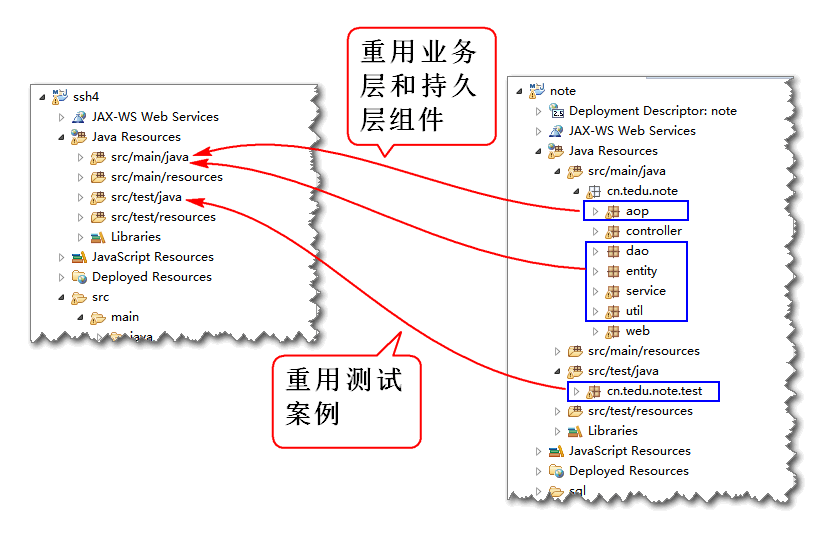
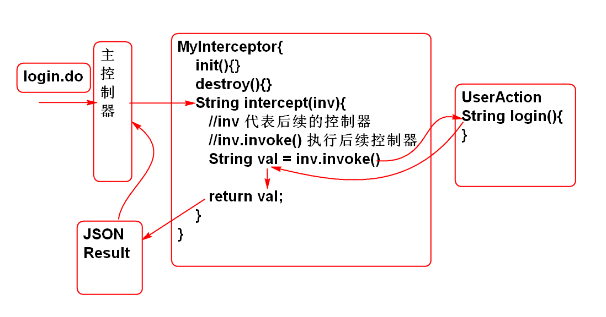
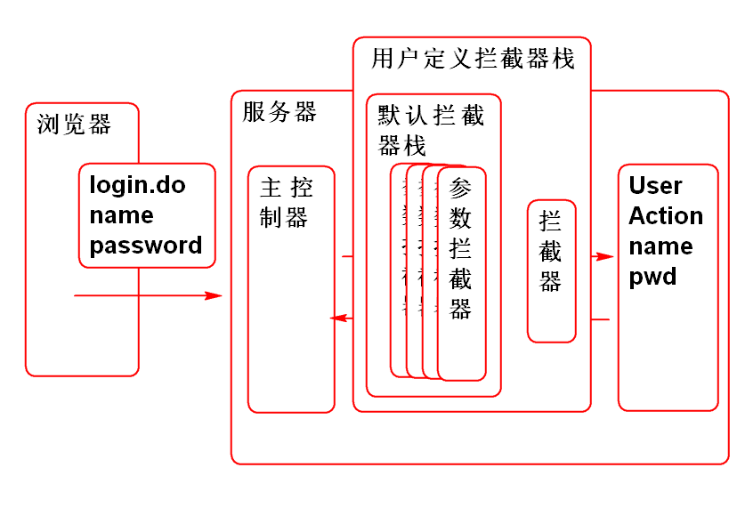
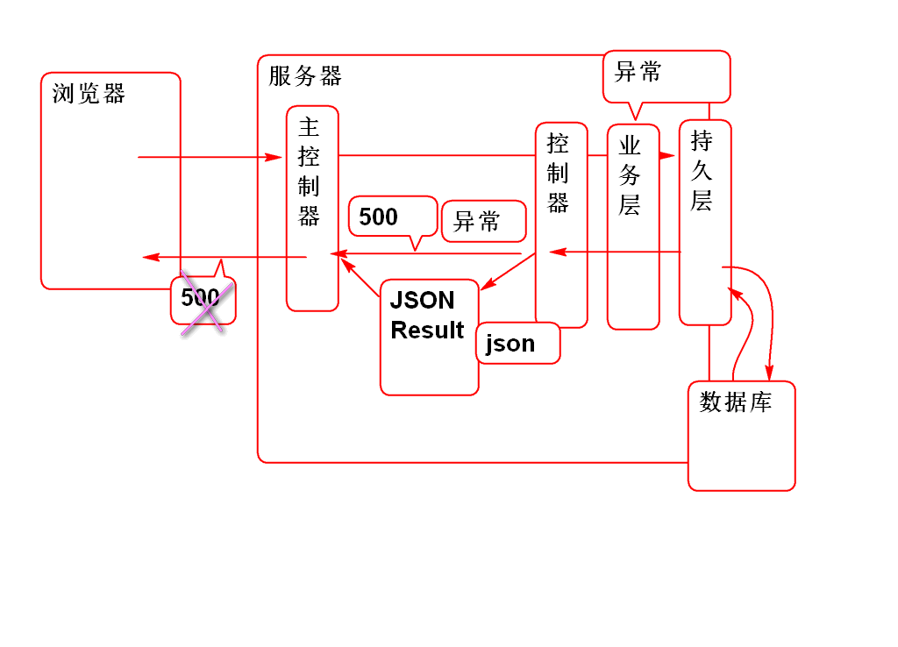
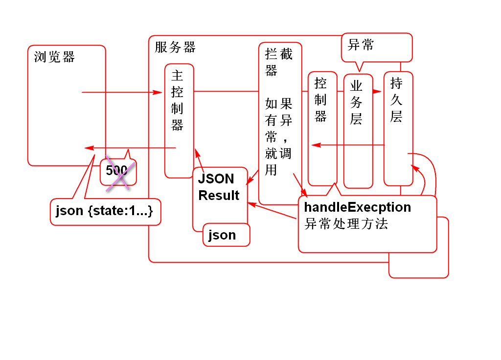

# SSH

## SSH 整合应用

重构云笔记项目, 将Spring MVC 替换为 Struts2, 将MyBatis替换为Hibernate.

### 1. 创建项目 搭建 SSH 架构

1. 创建项目, 导入SSH包:

		<dependency>
			<groupId>org.apache.struts</groupId>
			<artifactId>struts2-core</artifactId>
			<version>2.3.8</version>
		</dependency>

		<dependency>
			<groupId>org.apache.struts</groupId>
			<artifactId>struts2-spring-plugin</artifactId>
			<version>2.3.8</version>
		</dependency>

		<dependency>
		  <groupId>jstl</groupId>
		  <artifactId>jstl</artifactId>
		  <version>1.2</version>
		</dependency>
		
		<dependency>
		  <groupId>org.hibernate</groupId>
		  <artifactId>hibernate-core</artifactId>
		  <version>3.6.9.Final</version>
		</dependency>
		
		<dependency>
			<groupId>mysql</groupId>
			<artifactId>mysql-connector-java</artifactId>
			<version>5.1.6</version>
		</dependency>
		
		<dependency>
			<groupId>junit</groupId>
			<artifactId>junit</artifactId>
			<version>4.12</version>
		</dependency>
		
		<dependency>
		  <groupId>org.springframework</groupId>
		  <artifactId>spring-orm</artifactId>
		  <version>3.0.5.RELEASE</version>
		</dependency>

		<dependency>
		  <groupId>commons-dbcp</groupId>
		  <artifactId>commons-dbcp</artifactId>
		  <version>1.4</version>
		</dependency>
		<dependency>
		  <groupId>org.apache.struts</groupId>
		  <artifactId>struts2-json-plugin</artifactId>
		  <version>2.3.8</version>
		</dependency>
				
		<dependency>
		  <groupId>aspectj</groupId>
		  <artifactId>aspectjweaver</artifactId>
		  <version>1.5.3</version>
		</dependency>
		
				
		<dependency>
		  <groupId>commons-codec</groupId>
		  <artifactId>commons-codec</artifactId>
		  <version>1.10</version>
		</dependency>	

	> 还需要导入目标运行环境为: Tomcat Runtime 

2. 添加配置 Struts2 和 Spring 的配置 web.xml

		  <filter>
		    <display-name>StrutsPrepareAndExecuteFilter</display-name>
		    <filter-name>StrutsPrepareAndExecuteFilter</filter-name>
		    <filter-class>org.apache.struts2.dispatcher.ng.filter.StrutsPrepareAndExecuteFilter</filter-class>
		  </filter>
		  <filter-mapping>
		    <filter-name>StrutsPrepareAndExecuteFilter</filter-name>
		    <url-pattern>/*</url-pattern>
		  </filter-mapping>
		  <listener>
		    <listener-class>org.springframework.web.context.ContextLoaderListener</listener-class>
		  </listener>
		  <context-param>
		  	 <param-name>contextConfigLocation</param-name>
		  	 <param-value>classpath:conf/spring-*.xml</param-value>
		  </context-param>

3. 添加Struts2 配置文件 struts.xml

		<?xml version="1.0" encoding="UTF-8"?>
		<!DOCTYPE struts PUBLIC
			"-//Apache Software Foundation//DTD Struts Configuration 2.3//EN"
			"http://struts.apache.org/dtds/struts-2.3.dtd">
		<struts>
			
		</struts>

4. 添加Spring配置文件:

	> spring-aop.xml

		<?xml version="1.0" encoding="UTF-8"?>
		<beans xmlns="http://www.springframework.org/schema/beans" 
			xmlns:xsi="http://www.w3.org/2001/XMLSchema-instance"
			xmlns:context="http://www.springframework.org/schema/context" 
			xmlns:jdbc="http://www.springframework.org/schema/jdbc"  
			xmlns:jee="http://www.springframework.org/schema/jee" 
			xmlns:tx="http://www.springframework.org/schema/tx"
			xmlns:aop="http://www.springframework.org/schema/aop" 
			xmlns:mvc="http://www.springframework.org/schema/mvc"
			xmlns:util="http://www.springframework.org/schema/util"
			xmlns:jpa="http://www.springframework.org/schema/data/jpa"
			xsi:schemaLocation="
				http://www.springframework.org/schema/beans http://www.springframework.org/schema/beans/spring-beans-3.0.xsd
				http://www.springframework.org/schema/context http://www.springframework.org/schema/context/spring-context-3.0.xsd
				http://www.springframework.org/schema/jdbc http://www.springframework.org/schema/jdbc/spring-jdbc-3.0.xsd
				http://www.springframework.org/schema/jee http://www.springframework.org/schema/jee/spring-jee-3.0.xsd
				http://www.springframework.org/schema/tx http://www.springframework.org/schema/tx/spring-tx-3.0.xsd
				http://www.springframework.org/schema/data/jpa http://www.springframework.org/schema/data/jpa/spring-jpa-1.3.xsd
				http://www.springframework.org/schema/aop http://www.springframework.org/schema/aop/spring-aop-3.0.xsd
				http://www.springframework.org/schema/mvc http://www.springframework.org/schema/mvc/spring-mvc-3.0.xsd
				http://www.springframework.org/schema/util http://www.springframework.org/schema/util/spring-util-3.0.xsd">
			<!-- 配置组件扫描 -->
			<context:component-scan 
				base-package="cn.tedu.note.aop"/>
			<!-- 使 @Aspect 注解生效 -->
			<aop:aspectj-autoproxy/>
		</beans>

	> spring-service.xml

		<?xml version="1.0" encoding="UTF-8"?>
		<beans xmlns="http://www.springframework.org/schema/beans" 
			xmlns:xsi="http://www.w3.org/2001/XMLSchema-instance"
			xmlns:context="http://www.springframework.org/schema/context" 
			xmlns:jdbc="http://www.springframework.org/schema/jdbc"  
			xmlns:jee="http://www.springframework.org/schema/jee" 
			xmlns:tx="http://www.springframework.org/schema/tx"
			xmlns:aop="http://www.springframework.org/schema/aop" 
			xmlns:mvc="http://www.springframework.org/schema/mvc"
			xmlns:util="http://www.springframework.org/schema/util"
			xmlns:jpa="http://www.springframework.org/schema/data/jpa"
			xsi:schemaLocation="
				http://www.springframework.org/schema/beans http://www.springframework.org/schema/beans/spring-beans-3.0.xsd
				http://www.springframework.org/schema/context http://www.springframework.org/schema/context/spring-context-3.0.xsd
				http://www.springframework.org/schema/jdbc http://www.springframework.org/schema/jdbc/spring-jdbc-3.0.xsd
				http://www.springframework.org/schema/jee http://www.springframework.org/schema/jee/spring-jee-3.0.xsd
				http://www.springframework.org/schema/tx http://www.springframework.org/schema/tx/spring-tx-3.0.xsd
				http://www.springframework.org/schema/data/jpa http://www.springframework.org/schema/data/jpa/spring-jpa-1.3.xsd
				http://www.springframework.org/schema/aop http://www.springframework.org/schema/aop/spring-aop-3.0.xsd
				http://www.springframework.org/schema/mvc http://www.springframework.org/schema/mvc/spring-mvc-3.0.xsd
				http://www.springframework.org/schema/util http://www.springframework.org/schema/util/spring-util-3.0.xsd">
			
			<context:component-scan 
				base-package="cn.tedu.note.service"/>
			
		</beans>

5. 添加Spring Hibernate 配置文件:

	> 数据库连接参数文件: conf/jdbc.properties

		driver=com.mysql.jdbc.Driver
		url=jdbc:mysql://localhost:3306/cloud_note
		user=root
		password=root
		maxActive=20
		salt=\u4ECA\u5929\u4F60\u5403\u4E86\u5417?
		pageSize=4

	> spring-hbm.xml

		<?xml version="1.0" encoding="UTF-8"?>
		<beans xmlns="http://www.springframework.org/schema/beans" 
			xmlns:xsi="http://www.w3.org/2001/XMLSchema-instance"
			xmlns:context="http://www.springframework.org/schema/context" 
			xmlns:jdbc="http://www.springframework.org/schema/jdbc"  
			xmlns:jee="http://www.springframework.org/schema/jee" 
			xmlns:tx="http://www.springframework.org/schema/tx"
			xmlns:aop="http://www.springframework.org/schema/aop" 
			xmlns:mvc="http://www.springframework.org/schema/mvc"
			xmlns:util="http://www.springframework.org/schema/util"
			xmlns:jpa="http://www.springframework.org/schema/data/jpa"
			xsi:schemaLocation="
				http://www.springframework.org/schema/beans http://www.springframework.org/schema/beans/spring-beans-3.0.xsd
				http://www.springframework.org/schema/context http://www.springframework.org/schema/context/spring-context-3.0.xsd
				http://www.springframework.org/schema/jdbc http://www.springframework.org/schema/jdbc/spring-jdbc-3.0.xsd
				http://www.springframework.org/schema/jee http://www.springframework.org/schema/jee/spring-jee-3.0.xsd
				http://www.springframework.org/schema/tx http://www.springframework.org/schema/tx/spring-tx-3.0.xsd
				http://www.springframework.org/schema/data/jpa http://www.springframework.org/schema/data/jpa/spring-jpa-1.3.xsd
				http://www.springframework.org/schema/aop http://www.springframework.org/schema/aop/spring-aop-3.0.xsd
				http://www.springframework.org/schema/mvc http://www.springframework.org/schema/mvc/spring-mvc-3.0.xsd
				http://www.springframework.org/schema/util http://www.springframework.org/schema/util/spring-util-3.0.xsd">
			
			<!-- 配置 spring-mybatis.xml -->
			<!-- 读取配置文件 -->
			<util:properties id="jdbc"
				location="classpath:conf/jdbc.properties"/> 
			
			<!-- 配置数据库连接池 -->
			<bean id="dataSource"
				class="org.apache.commons.dbcp.BasicDataSource"
				destroy-method="close"> 
				<property name="driverClassName"
					value="#{jdbc.driver}"/>
				<property name="url"
					value="#{jdbc.url}"/>
				<property name="username"
					value="#{jdbc.user}"/>
				<property name="password"
					value="#{jdbc.password}"/>
				<property name="maxActive"
					value="#{jdbc.maxActive}"></property>
			</bean>
			
			<bean id="sessionFactory"
				class="org.springframework.orm.hibernate3.LocalSessionFactoryBean">
			 	<property name="dataSource"
			 		ref="dataSource"/> 
			 	<property name="hibernateProperties">
			 		<props>
			 			<prop key="hibernate.dialect">
			 				org.hibernate.dialect.MySQLDialect
			 			</prop>
			 			<prop key="hibernate.show_sql">true</prop>
			 			<prop key="hibernate.format_sql">true</prop>
			 		</props>
			 	</property>
			 	<property name="mappingLocations">
			 		<list>
						<!-- 
			 			<value>classpath:hbm/User.hbm.xml</value>
			 			-->
					</list>
			 	</property>
			</bean>
			
			<bean id="hibernateTemplate"
				class="org.springframework.orm.hibernate3.HibernateTemplate">
				<property name="sessionFactory"
					ref="sessionFactory"/> 
			</bean>
			
			<!-- spring-mybatis.xml -->
			<bean id="txManager" 
			class="org.springframework.orm.hibernate3.HibernateTransactionManager">
				<property name="sessionFactory"
					ref="sessionFactory"/>
			</bean>
			<!-- 设置 注解驱动的事务管理  -->
			<tx:annotation-driven 
				transaction-manager="txManager"/>

		</beans>

6. 部署测试
	
		...

### 2. 移植云笔记界面组件

### 3. 移植云笔业务层, 持久层和测试组件

> 测试组件的作用: 如果能够通过测试组件的回归测试, 则说明持久层和业务层重构成功!

重构 NoteDao, NotebookDao, 删除MyBatis注解 @Param

	public interface NoteDao {
		List<Map<String,Object>> 
			findNotesByNotebookId(
			String notebookId);
		
		Note findNoteById(String noteId);
		
		int updateNote(Note note);
		
		int addNote(Note note);
	
		List<Map<String, Object>> 
			findDeleteNotesByUserId(String userId);
		
		int deleteNoteById(String noteId);
		
		int deleteNotes(
			String... ids);
		
		List<Map<String, Object>> findNotes(
			String userId, 
			String notebookId, 
			String statusId);
	}

	public interface NotebookDao {
	
		List<Map<String, Object>>
			findNotebooksByUserId(
			String userId);
	
		int countNotebookById(String notebookId);
		
		List<Map<String, Object>>
			findNotebooksByPage(
			String userId,
			int start,
			int pageSize,
			String table);
	
	}

### 4. 实现User的映射

1. 添加映射文件 hbm/User.hbm.xml:

		<?xml version="1.0" encoding="utf-8"?>
		<!DOCTYPE hibernate-mapping PUBLIC 
		 "-//Hibernate/Hibernate Mapping DTD 3.0//EN"
		 "http://www.hibernate.org/dtd/hibernate-mapping-3.0.dtd">
		<hibernate-mapping>
			<class name="cn.tedu.note.entity.User"
					table="cn_user">
				<id name="id" column="cn_user_id"></id>
				<property name="name" column="cn_user_name"
					type="string"/>
				<property name="password" column="cn_user_password" />
				<property name="token" column="cn_user_token" />
				<property name="nick" column="cn_user_nick" />
			</class>
		</hibernate-mapping>
	
	> 将实体User映射到表 cn_user

2. 实现 UserDao 
	
		@Repository("userDao")
		public class UserDaoImpl implements UserDao {
			
			@Resource
			private HibernateTemplate hibernateTemplate;
			
			public User findUserByName(String name) {
				//HQL Hibernate Query Language
				// sql:
				//  select * from cn_note 
				//  where cn_user_name = #{name} 
				// HQL:
				//  from User 
				//  where name = ?
				String hql = 
					"from User where name = ?";
				List<User> list=
					hibernateTemplate.find(hql, name);
				return list.isEmpty()?null:list.get(0); 
			}
		
			public int addUser(User user) {
				Serializable id=
					hibernateTemplate.save(user);
				return id==null ? 0 : 1;
			}
		
			public User findUserById(String userId) {
				return hibernateTemplate.get(User.class, userId);	
			}
		
		}

3. 重构 spring-hbm.xml

	> 配置hbm/User.hbm.xml

	 	<property name="mappingLocations">
	 		<list>
	 			<value>classpath:hbm/User.hbm.xml</value>
	 		</list>
	 	</property>

	> 打开组件扫描

		<context:component-scan base-package="cn.tedu.note.dao"/>

4. 重构 测试案例 基类 BaseTest

		@Before
		public void initCtx() {
			ctx = new ClassPathXmlApplicationContext(
					"conf/spring-hbm.xml",
					"conf/spring-service.xml");
		}

5. 执行测试案例 UserDaoTest, 进行回归性测试:

		...

### 5. 测试 Login 功能

由于Spring容器初始化期间会扫描创建全部的Bean, 并且注入全部属性, 如果不将dao接口全部实现就会造成Spring容器初始化异常, 故将dao接口全部空实现, 在具体方法的功能实现在日后逐一添加.

1. 实现NoteDao

		@Repository("noteDao")
		public class NoteDaoImpl implements NoteDao {
		
			public List<Map<String, Object>> findNotesByNotebookId(String notebookId) {
				// TODO Auto-generated method stub
				return null;
			}
		
			public Note findNoteById(String noteId) {
				// TODO Auto-generated method stub
				return null;
			}
		
			public int updateNote(Note note) {
				// TODO Auto-generated method stub
				return 0;
			}
		
			public int addNote(Note note) {
				// TODO Auto-generated method stub
				return 0;
			}
		
			public List<Map<String, Object>> findDeleteNotesByUserId(String userId) {
				// TODO Auto-generated method stub
				return null;
			}
		
			public int deleteNoteById(String noteId) {
				// TODO Auto-generated method stub
				return 0;
			}
		
			public int deleteNotes(String... ids) {
				// TODO Auto-generated method stub
				return 0;
			}
		
			public List<Map<String, Object>> findNotes(String userId, String notebookId, String statusId) {
				// TODO Auto-generated method stub
				return null;
			}
		
		}

2. 实现NotebookDao

		@Repository("notebookDao")
		public class NotebookDaoImpl implements NotebookDao {
		
			public List<Map<String, Object>> findNotebooksByUserId(String userId) {
				// TODO Auto-generated method stub
				return null;
			}
		
			public int countNotebookById(String notebookId) {
				// TODO Auto-generated method stub
				return 0;
			}
		
			public List<Map<String, Object>> findNotebooksByPage(String userId, int start, int pageSize, String table) {
				// TODO Auto-generated method stub
				return null;
			}
		
		}

3. 实现StarsDao

		@Repository("starsDao")
		public class StarsDaoImpl implements StarsDao  {
		
			public Stars findStarsByUserId(String userId) {
				// TODO Auto-generated method stub
				return null;
			}
		
			public int insertStars(Stars stars) {
				// TODO Auto-generated method stub
				return 0;
			}
		
			public int updateStars(Stars stars) {
				// TODO Auto-generated method stub
				return 0;
			}
			
		}

4. 测试 UserService 的 Login 方法

		...

### 6. 实现Login功能的控制器

1. 创建控制器的抽象父类, 封装控制器的公共属性和方法:

		public abstract class AbstractAction 
			extends ActionSupport
			implements SessionAware,
			RequestAware, 
			ApplicationAware{

			protected static final String JSON="json";
			
			protected Map<String, Object> request;
			protected Map<String, Object> session;
			protected Map<String, Object> application;
			//Json返回值
			protected JsonResult jsonResult;
			public JsonResult getJsonResult() {
				return jsonResult;
			}
			public void setJsonResult(JsonResult jsonResult) {
				this.jsonResult = jsonResult;
			}
			
			public void setSession(
					Map<String, Object> session) {
				this.session=session;
			}
			public void setRequest(
					Map<String, Object> request) {
				this.request=request;
			}
			public void setApplication(
					Map<String, Object> application) {
				this.application=application;
			}
			
		}

	> 声明常量 JSON 用于配合JSON返回结果

2. 创建UserAction

		@Controller
		@Scope("prototype")
		public class UserAction extends AbstractAction{
		
			@Resource
			private UserService userService; 
			
			private String name;
			private String password;
			
			public String getName() {
				return name;
			}
		
			public void setName(String name) {
				this.name = name;
			}
		
			public String getPassword() {
				return password;
			}
		
			public void setPassword(String password) {
				this.password = password;
			}
		
			public String login(){
				User user = userService.login(name, password);
				session.put("loginUser", user);
				jsonResult=new JsonResult(user);
				return JSON;
			}
		}

	> 其中 name, password 来时用户界面提交的参数, jsonResult 是JSON返回值.

3. 添加配置文件 spring-struts.xml 初始化 Struts 控制器Bean

		<?xml version="1.0" encoding="UTF-8"?>
		<beans xmlns="http://www.springframework.org/schema/beans" 
			xmlns:xsi="http://www.w3.org/2001/XMLSchema-instance"
			xmlns:context="http://www.springframework.org/schema/context" 
			xmlns:jdbc="http://www.springframework.org/schema/jdbc"  
			xmlns:jee="http://www.springframework.org/schema/jee" 
			xmlns:tx="http://www.springframework.org/schema/tx"
			xmlns:aop="http://www.springframework.org/schema/aop" 
			xmlns:mvc="http://www.springframework.org/schema/mvc"
			xmlns:util="http://www.springframework.org/schema/util"
			xmlns:jpa="http://www.springframework.org/schema/data/jpa"
			xsi:schemaLocation="
				http://www.springframework.org/schema/beans http://www.springframework.org/schema/beans/spring-beans-3.0.xsd
				http://www.springframework.org/schema/context http://www.springframework.org/schema/context/spring-context-3.0.xsd
				http://www.springframework.org/schema/jdbc http://www.springframework.org/schema/jdbc/spring-jdbc-3.0.xsd
				http://www.springframework.org/schema/jee http://www.springframework.org/schema/jee/spring-jee-3.0.xsd
				http://www.springframework.org/schema/tx http://www.springframework.org/schema/tx/spring-tx-3.0.xsd
				http://www.springframework.org/schema/data/jpa http://www.springframework.org/schema/data/jpa/spring-jpa-1.3.xsd
				http://www.springframework.org/schema/aop http://www.springframework.org/schema/aop/spring-aop-3.0.xsd
				http://www.springframework.org/schema/mvc http://www.springframework.org/schema/mvc/spring-mvc-3.0.xsd
				http://www.springframework.org/schema/util http://www.springframework.org/schema/util/spring-util-3.0.xsd">
			
			<context:component-scan 
				base-package="cn.tedu.note.action"/>
			
		</beans>

4. 在 struts.xml 中配置控制器

		<!-- 修改请求扩展名 action改为do -->
		<constant name="struts.action.extension" 
			value="do"></constant>
		<package name="user" namespace="/user"
			extends="json-default">
			
			<global-results>
				<result name="json" type="json">
					<param name="root">jsonResult</param>
				</result>
			</global-results>
			
			<action name="login" class="userAction"
				method="login"/>
		
		</package>

5. 测试:

		http://localhost:8080/ssh4/user/login.do?name=demo&password=123456

6. 在用户界面中整合测试登录功能.

### 7. 实现注册功能

1. 重构控制器 UserAction, 添加控制器方法:

		private String nick;
		private String confirm;
		
		public String getNick() {
			return nick;
		}
	
		public void setNick(String nick) {
			this.nick = nick;
		}
	
		public String getConfirm() {
			return confirm;
		}
	
		public void setConfirm(String confirm) {
			this.confirm = confirm;
		}
	
		public String regist(){
			User user = userService.regist(
				name, nick, password, confirm);
			
			jsonResult = new JsonResult(user);
			return JSON;
		}

	> 其中扩展了两个表单参数 nick 和 conform

2. 配置 struts.xml:

		<action name="regist" class="userAction"
			method="regist"/>

3. 测试

		...

## Struts 拦截器

Struts 提供了默认的异常拦截功能, 但是不适合将异常转换为JSON, 可以利用拦截器处理Struts2 异常, 转换为JSON消息.

Struts2 拦截器工作原理:

### 编写简单的拦截器

1. 编写拦截器类:

		@Component
		public class MyInterceptor 
			implements Interceptor {
		
			public void destroy() {}
		
			public void init() {}
		
			public String intercept(
					ActionInvocation invocation) 
					throws Exception {
				System.out.println("控制器之前");
				String val = invocation.invoke();
				System.out.println("控制器之后"); 
				return val;
			}
		
		}

2. 设置组件扫描 spring-struts.xml
	
		<context:component-scan 
			base-package="cn.tedu.note.web"/>

3. 配置拦截器:

		<interceptors>
			<interceptor name="demo" 
				class="myInterceptor"/>

			<interceptor-stack name="demoStack">
				<interceptor-ref name="defaultStack"/>
				<interceptor-ref name="demo"></interceptor-ref>
			</interceptor-stack>
		</interceptors>
	
		<action name="login" class="userAction"
			method="login">
			<interceptor-ref name="demoStack"></interceptor-ref>
		</action>
		
	> 必须将用户拦截器demo和系统拦截器栈defaultStack组合为一个新的拦截器栈 demoStack, 这样才能保留系统提供的功能!!

	

4. 测试: 在登录时候输出拦截器的内容

### 利用拦截器处理 异常

异常原因分析:

原理:

1. 重构 AbstractAction 添加异常处理方法

		//AbstractAction 中约定控制器处理异的方法
		public String handleException(Exception e) {
			e.printStackTrace();
			jsonResult = new JsonResult(e);
			return JSON;
		}

	> 这样全部的控制器都有异常处理方法了.

2. 添加拦截器拦截异常:

		@Component
		public class ExceptionInterceptor implements Interceptor {
		
			public void destroy() {
			}
		
			public void init() {
			}
		
			public String intercept(
					ActionInvocation invocation) 
							throws Exception {
				//得到目标控制器 
				AbstractAction action  = 
						(AbstractAction)invocation.getAction();
				//调用目标控制器的方法
				String val = null;
				try {
					val = invocation.invoke();
				} catch (Exception e) {
					val = action.handleException(e);
				}
				if(val == null){
					throw new NullPointerException();
				}
				return val;
			}
		
		}

3. 配置异常拦截器 struts.xml

		<interceptors>
			
			<interceptor name="execInte" 
				class="exceptionInterceptor"/>
			
			<interceptor-stack name="noteStack">
				<interceptor-ref name="defaultStack"/>
				<interceptor-ref name="execInte"></interceptor-ref>
			</interceptor-stack>
			
		</interceptors>
		
		<default-interceptor-ref name="noteStack"/>
	
	> 配置 default-interceptor-ref 元素以后, 所有控制器就都被异常处理拦截器拦截了!

4. 测试...

----------------------------------

## 作业

1. 构建SSH项目
	- 重构登录功能
	- 重构注册功能
2. 实现拦截器异常处理

	 