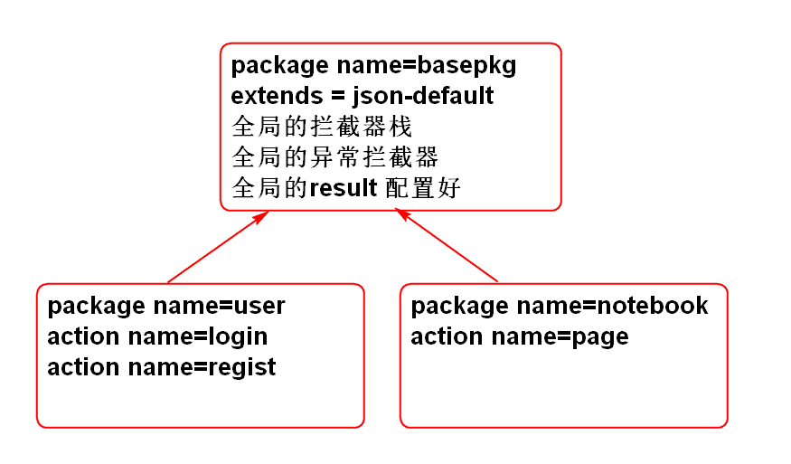
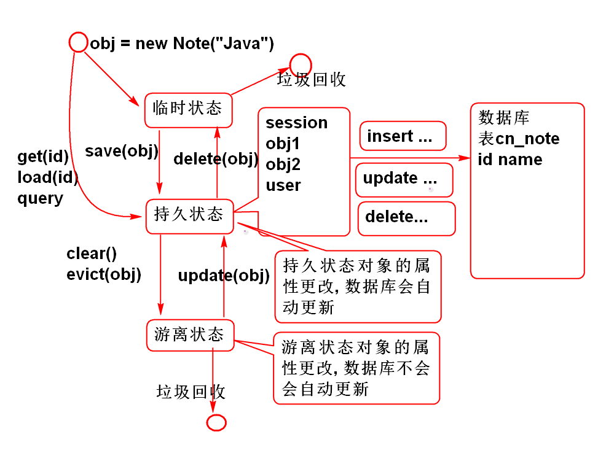

# SSH

## 整合开发

### 自定义异常处理

重新异常处理方法即可实现自定义异常处理:

1. 重写异常处理方法 UserAction
	
		@Override
		public String handleException(Exception e) {
			if(e instanceof UserNotFoundException){
				jsonResult = new JsonResult(2, e);
			}else if(e instanceof PasswordException){
				jsonResult = new JsonResult(3, e);
			}else if(e instanceof UserNameException){
				jsonResult = new JsonResult(4, e);
			}else {
				jsonResult = new JsonResult(e);
			}
			return JSON;
		}

## 笔记本列表功能

1. 映射笔记本实体到数据库表 Notebook.hbm.xml

		<?xml version="1.0" encoding="utf-8"?>
		<!DOCTYPE hibernate-mapping PUBLIC 
		 "-//Hibernate/Hibernate Mapping DTD 3.0//EN"
		 "http://www.hibernate.org/dtd/hibernate-mapping-3.0.dtd">
		<hibernate-mapping>
			<class name="cn.tedu.note.entity.Notebook"
					table="cn_notebook">
				<id name="id" column="cn_notebook_id"></id>
				<property name="name" column="cn_notebook_name"></property>
				<property name="typeId" column="cn_notebook_type_id"></property>
				<property name="userId" column="cn_user_id"></property>
				<property name="desc" column="cn_notebook_desc"></property>
				<property name="createtime" 
					column="cn_notebook_createtime"
					type="java.sql.Timestamp"></property> 
			</class> 
		</hibernate-mapping>
		
2. 更新配置文件 spring-hbm.xml:

		<property name="mappingLocations">
	 		<list>
	 			<value>classpath:hbm/User.hbm.xml</value>
				<value>classpath:hbm/Notebook.hbm.xml</value>
	 		</list>
	 	</property>

3. 实现 NotebookDaoImpl

		@Repository("notebookDao")
		public class NotebookDaoImpl implements NotebookDao {
		
			@Resource
			private HibernateTemplate hibernateTemplate;
			
			public List<Map<String, Object>> 
				findNotebooksByUserId(String userId) {
				final String hql=
						"select new map(id as id, name as name) "+
						"from Notebook "+
						"where userId=? "+
						"order by createtime desc";
				List<Map<String, Object>> list= 
					hibernateTemplate.find(
					hql, userId);
				return list;
			}
		
			public int countNotebookById( String notebookId) {
				//sql:
				// select count(*) 
				// from cn_notebook
				// where cn_notebook_id=?
				//hql:
				// select count(*) 
				// from Notebook
				// where id=?
				String hql = "select count(*) "
						+ "from Notebook where id=?";
				List<Number> list=hibernateTemplate.find(hql, notebookId);
				return list.isEmpty()? 0: list.get(0).intValue();
			}
		
			public List<Map<String, Object>> findNotebooksByPage(
						final String userId, 
						final int start, 
						final int pageSize, 
						final String table) {
				//sql: select cn_notebook_id, cn_notebook_name 
				//  from cn_notebook 
				//  where cn_user_id=?
				//  order by cn_notebook_createtime desc
				//HQL:
				//  select new map(id as id, name as name)
				//  from Notebook
				//  where userId=?
				//  order by createtime desc
				final String hql="select new map(id as id, name as name) "+
						"from Notebook "+
						"where userId=? "+
						"order by createtime desc";
				List<Map<String, Object>> list=hibernateTemplate.execute(new HibernateCallback<List<Map<String, Object>>>() { 
					public List<Map<String, Object>> doInHibernate(Session session) throws HibernateException, SQLException {
						//利用session创建查询对象
						Query query=session.createQuery(hql);
						//绑定 查询参数
						query.setString(0, userId);
						//绑定分页参数:
						query.setFirstResult(start);
						query.setMaxResults(pageSize);
						//query.list() 执行查询
						//返回查询结果
						return query.list();
					}
				});
				
				return list;
			}
		
		}

4. 单元测试: 对持久层和业务层进行回归性测试

		...

5. 创建控制器 NotebookAction

		@Controller
		@Scope("prototype")
		public class NotebookAction 
			extends AbstractAction {
			
			@Resource
			private NotebookService notebookService;
		
			private String userId;
			private Integer page;
			public String getUserId() {
				return userId;
			}
			public void setUserId(String userId) {
				this.userId = userId;
			}
			public Integer getPage() {
				return page;
			}
			public void setPage(Integer page) {
				this.page = page;
			}
		
			public String page(){
				List<Map<String, Object>> list=
				notebookService.listNotebooks(userId, page);
				jsonResult = new JsonResult(list);
				return JSON;
			}
			 
			public String list(){
				List<Map<String, Object>> list=
				notebookService.listNotebooks(userId);
				jsonResult = new JsonResult(list);
				return JSON;
			}
			
		}

6. 配置控制器:

	> 配置文件结构:

	

	> 配置文件内容重构: struts.xml

		<?xml version="1.0" encoding="UTF-8"?>
		<!DOCTYPE struts PUBLIC
			"-//Apache Software Foundation//DTD Struts Configuration 2.3//EN"
			"http://struts.apache.org/dtds/struts-2.3.dtd">
		<struts>
			<!-- 修改请求扩展名 action改为do -->
			<constant name="struts.action.extension" value="do"></constant>
			
			<package name="basepkg" extends="json-default">
				<interceptors>
					<interceptor name="demo" class="myInterceptor"/>
					
					<interceptor name="execInte" class="exceptionInterceptor"/>
					
					<interceptor-stack name="noteStack">
						<interceptor-ref name="defaultStack"/>
						<interceptor-ref name="execInte"></interceptor-ref>
					</interceptor-stack>
					
					<interceptor-stack name="demoStack">
						<interceptor-ref name="defaultStack"/>
						<interceptor-ref name="demo"></interceptor-ref>
					</interceptor-stack>
					
				</interceptors>
				
				<default-interceptor-ref name="noteStack"/>
				
				<global-results>
					<result name="json" type="json">
						<param name="root">jsonResult</param>
					</result>
				</global-results>
			
			</package>
				
			<package name="user" namespace="/user" extends="basepkg">
				<action name="login" class="userAction" method="login"/>
				<action name="regist" class="userAction" method="regist"/>
			</package>
			
			<package name="notebook" extends="basepkg"
				namespace="/notebook">
				<action name="page" 
					class="notebookAction"
					method="page"/>
				
				<action name="list" 
					class="notebookAction"
					method="list"/>
				
			</package>
	
		</struts>

7. 对控制器进行测试, 对页面功能进行测试

## Hibernate 

Hibernate的结构:

Session 提供了CRUD 功能

- Sesison.get(id)
	- 根据ID从数据库中获取对象, 如果找不到返回null
- Session.load(id)
	- 根据ID从数据库中获取对象, 如果找不到抛异常
- Session.save()
	- 将新对象添加到数据库
- Session.update()
	- 将对象信息保存到数据库
- Session.delete()
	- 将对象的信息从数据库中删除
- Session.clear() 
	- 清空Session一级缓存
- Session.evict(对象)
	- 将一个对象从Session缓存中清除

Hibernate 持久化对象生存周期状态管理

Java Bean == POJO

案例:
	
	public class HibernateTest extends BaseTest {
		SessionFactory factory;
		Session session;
		@Before 
		public void initSession(){
			factory = ctx.getBean("sessionFactory",
					SessionFactory.class);
			session = factory.openSession();
		}
		@After
		public void destory(){
			session.close();
			factory.close();
		}
		@Test
		public void testSessionFactory(){
			//Spring 简化了 Session Factory 的关联
			SessionFactory factory =
					ctx.getBean("sessionFactory",
					SessionFactory.class);
			//利用SessionFactory创建Session
			Session session = factory.openSession();
			System.out.println(session);
			
			session.close();
			System.out.println(factory);
		}
		
		@Test
		public void testSave(){
			Transaction tx=session.beginTransaction();
			//持久状态下,更改属性影响到数据库
			//user 对象 是临时状态的
			User user = new User(
				"1234567", "熊大", "1234", "", "");
			//user成为持久状态
			session.save(user);
			user.setName("范传奇");
			user.setPassword("abcde");
			tx.commit();
		}
		
		
		@Test
		public void testGet(){
			Transaction tx=session.beginTransaction();
			//get返回对象是持久状态的
			User user = (User)session.get(
				User.class, "1234567");
			System.out.println(user);
			//更改持久创建对象的属性影响数据库
			user.setName("李洪鹤"); 
			tx.commit();
		}
		
		@Test
		public void testEvict(){
			Transaction tx = session.beginTransaction();
			//get返回的对象是持久状态
			User user = (User)session.get(
					User.class, "1234567");
			System.out.println(user);
			//evict将对象清除 sessin缓存, 变成游离状态
			session.evict(user);
			//session.clear();
			user.setName("光头强");
			tx.commit();
		}
		
		@Test
		public void testUpdate(){
			Transaction tx = session.beginTransaction();
			//get返回的对象是持久状态
			User user = (User)session.get(
					User.class, "1234567");
			System.out.println(user);
			//evict将对象清除 sessin缓存, 变成游离状态
			session.evict(user);
			//session.clear();
			user.setName("光头强");
			//update 方法 将对象从游离状态改为持久状态
			session.update(user); 
			
			tx.commit();
		}
	
		@Test
		public void testDelete(){
			Transaction tx = session.beginTransaction();
			//get返回的对象是持久状态
			User user = (User)session.get(
					User.class, "1234567");
			System.out.println(user);
			//delete方法将数据从数据库删除, 
			// 对象user在内存中还有数据
			// 此时对象是临时状态的!
			session.delete(user); 
			System.out.println(user);
			
			tx.commit();
		}
	
		@Test 
		public void testLoad(){
			//get方法在没有数据时候, 返回null
			User user = (User)session.get(
				User.class, "1234567");
			System.out.println(user); //null
			//load方法在没有数据时候, 抛出异常
			User u = (User) session.load(
				User.class, "1234567");
			System.out.println(u); 
		}
		
		@Test
		public void testQuery(){
			//执行HQL查询
			Transaction tx=session.beginTransaction();
			//sql: select * from cn_user
			String hql = "from User"; 
			Query query=session.createQuery(hql);
			//list 执行返回一组数据的查询
			List<User> list = query.list();
			for (User user : list) {
				System.out.println(user);
			}
			tx.commit();
		}
		
		@Test
		public void testQuery2(){
			//执行带参数的SQL
			//sql: select * from cn_user 
			//     where cn_user_name like ? 
			String hql = "from User "
					+ "where name like ?"; 
			Transaction tx = session.beginTransaction();
			Query query=session.createQuery(hql);
			//绑定查询参数
			query.setString(0, "%o%");
			//执行查询
			List<User> list=query.list();
			for (User user : list) {
				System.out.println(user);
			}
			tx.commit();
		}
		
		@Test
		public void testQuery3(){
			//按照名字绑定参数
			String hql = "from User "
					+ "where name like :name"; 
			Transaction tx = session.beginTransaction();
			Query query=session.createQuery(hql);
			//绑定查询参数
			query.setString("name", "%o%");
			//执行查询
			List<User> list=query.list();
			for (User user : list) {
				System.out.println(user);
			}
			tx.commit();
		}
		
		@Test
		public void testQuery4(){
			//query 支持唯一结果查询
			Transaction tx = session.beginTransaction();
			String hql = "from User where name=?";
			Query query = session.createQuery(hql);
			query.setString(0, "demo");
			//uniqueResult 用于查找返回唯一的结果
			User user = (User)query.uniqueResult();
			System.out.println(user);
			user.setToken("123456"); 
			tx.commit();
		}
		
		@Test
		public void testFindPerson(){
			String hql = "from Person";
			Query query = session.createQuery(hql);
			List<Person> list = query.list();
			for (Person person : list) {
				System.out.println(person); 
			}
		}
		@Test
		public void testAddPerson(){
			Person person = new Person(null, "Wang");
			System.out.println(person);
			Transaction tx = session.beginTransaction();
			session.save(person);
			System.out.println(person);
			tx.commit();
		}
		
		@Test
		public void testFindComment(){
			String hql = "from Comment";
			Query query = session.createQuery(hql);
			List<Comment> list = query.list();
			for (Comment comment : list) {
				System.out.println(comment); 
			}
		}
		
		@Test
		public void testFindPost(){
			String hql = "from Post";
			Query query = session.createQuery(hql);
			List<Post> list = query.list();
			for (Post p : list) {
				System.out.println(p); 
			}
		}
		
	}

映射文件:

> Person.hbm.xml

	<?xml version="1.0" encoding="utf-8"?>
	<!DOCTYPE hibernate-mapping PUBLIC 
	 "-//Hibernate/Hibernate Mapping DTD 3.0//EN"
	 "http://www.hibernate.org/dtd/hibernate-mapping-3.0.dtd">
	<hibernate-mapping>
		<class name="cn.tedu.note.entity.Person"
				table="p_person">
			<id name="id" column="id">
				<!-- 使用自增类型的主键生成器 -->
				<generator class="identity"/>
			</id>
			<property name="name" column="name"/>
		</class>
	</hibernate-mapping>

> Comment.hbm.xml

	<?xml version="1.0" encoding="utf-8"?>
	<!DOCTYPE hibernate-mapping PUBLIC 
	 "-//Hibernate/Hibernate Mapping DTD 3.0//EN"
	 "http://www.hibernate.org/dtd/hibernate-mapping-3.0.dtd">
	<hibernate-mapping>
		<class name="cn.tedu.note.entity.Comment"
				table="p_comment">
			<id name="id" column="id">
				<!-- 使用自增类型的主键生成器 -->
				<generator class="identity"/>
			</id>
			<property name="title" column="title"/>
		</class>
	</hibernate-mapping>

> Post.hbm.xml

	<?xml version="1.0" encoding="utf-8"?>
	<!DOCTYPE hibernate-mapping PUBLIC 
	 "-//Hibernate/Hibernate Mapping DTD 3.0//EN"
	 "http://www.hibernate.org/dtd/hibernate-mapping-3.0.dtd">
	<hibernate-mapping>
		<class name="cn.tedu.note.entity.Post"
				table="p_post">
			<id name="id" column="id">
				<!-- 使用自增类型的主键生成器 -->
				<generator class="identity"/>
			</id>
			<property name="title" column="title"/>
			<!-- 多个post对应一个person -->
			<!-- 其中: 属性是person, 属性的类型是Person
			属性对应的表格列是 person_id -->
			<many-to-one name="person" 
				class="cn.tedu.note.entity.Person"
				column="person_id" >
			</many-to-one>
			
			<set name="comments" >
				<!-- p_comment 表中的 外键列 post_id-->
				<key column="post_id"></key>
				<!-- 当前一个(one)帖子对应多个(many)回复 -->
				<one-to-many 
					class="cn.tedu.note.entity.Comment"/>
			</set>
			
		</class>
	</hibernate-mapping>

## 单例模式

模式: 解决问题的固定套路

单例: 在软件中永远唯一的对象个体.

单例模式: 解决 在软件中永远唯一的对象个体 固定套路

> 注意: Spring 中的Bean默认情况下是 "单例"的, 但是不能称为单例模式!!

### 饿汉式:

	//"饿汉式" 立即加载模式
	class Girl{
		private static Girl instance = new Girl();
		private Girl(){
		}
		public static Girl getInstance() {
			return instance;
		} 
	}

### 懒汉式 

	//"懒汉式" 按需加载
	class Boy{
		private static Boy instance;
		private Boy(){
		}
		public synchronized static Boy getInstance() {
			if(instance == null){
				instance = new Boy();
			}
			return instance;
		}
	}

